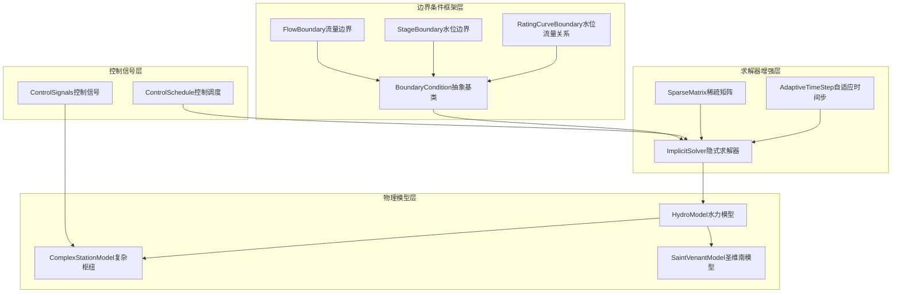
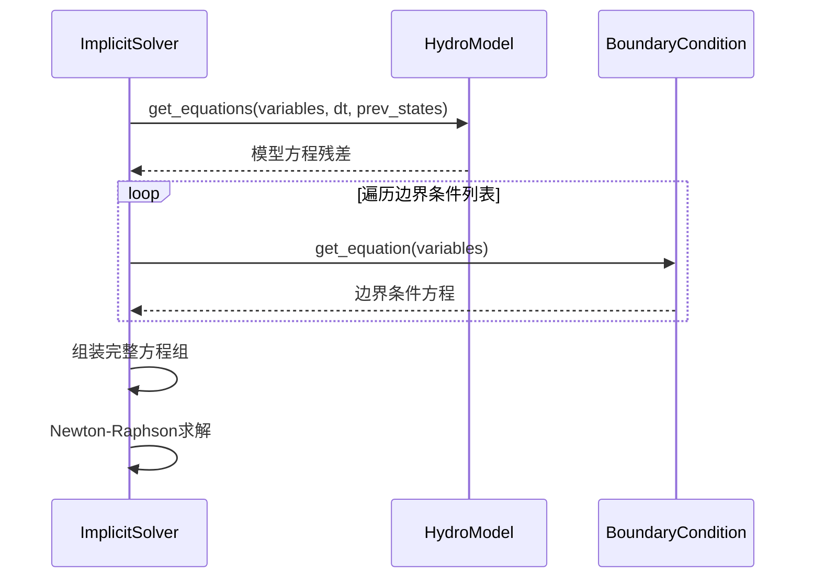
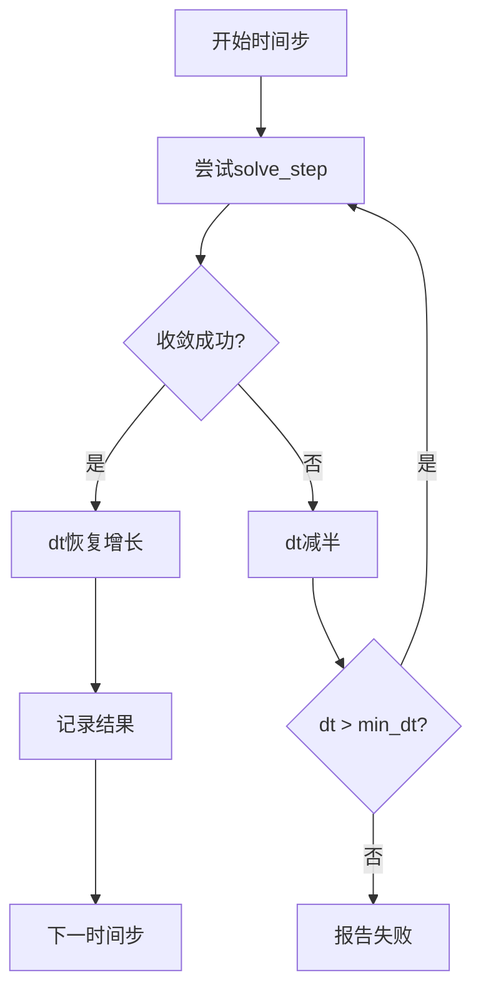
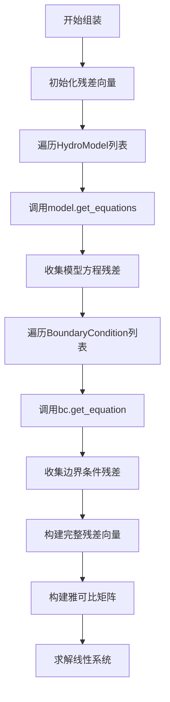
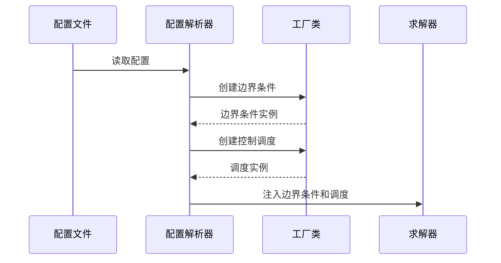

# 边界条件框架设计文档

## 1. 概述

本设计文档描述了WaterNet系统中灵活可配置边界条件框架的系统架构。该框架旨在替代求解器中硬编码的边界条件实现，通过抽象化设计实现边界条件的灵活配置和动态管理，并支持外部控制信号集成和求解器性能优化。

### 1.1 设计目标

- **灵活性**: 提供可扩展的边界条件抽象基类，支持多种边界条件类型
- **动态性**: 支持时变控制信号，实现外部Agent或调度表的动态控制
- **高效性**: 引入稀疏矩阵优化和自适应时间步，提升大规模网络求解性能
- **鲁棒性**: 增强求解器稳定性，支持复杂边界条件变化场景

### 1.2 应用场景

- 复杂水力网络的多类型边界条件管理
- 水力控制系统的时变操作信号集成
- 大规模水网络的高效数值求解
- 实时仿真系统的鲁棒性保障

## 2. 技术架构

### 2.1 系统架构图



### 2.2 核心组件关系

| 组件类别 | 核心组件 | 职责描述 |
|---------|---------|---------|
| 边界条件抽象层 | BoundaryCondition | 定义边界条件统一接口 |
| 具体边界条件 | FlowBoundary, StageBoundary, RatingCurveBoundary | 实现具体的边界条件逻辑 |
| 控制信号管理 | ControlSignals, ControlSchedule | 管理时变控制信号和调度 |
| 求解器增强 | SparseMatrix, AdaptiveTimeStep | 提升求解性能和稳定性 |
| 模型集成 | ImplicitSolver | 统一边界条件和模型方程求解 |

## 3. 边界条件框架设计

### 3.1 抽象基类设计

#### BoundaryCondition抽象基类

边界条件框架的核心抽象，定义统一的边界条件接口：

**核心方法**:
- `get_equation(variables) -> tuple[str, float]`: 返回边界条件方程
- `validate_variables(variables) -> bool`: 验证变量完整性
- `get_required_variables() -> List[str]`: 获取所需变量列表

**设计原则**:
- 统一接口: 所有边界条件使用相同的方法签名
- 方程表示: 通过(变量名, 残差值)元组描述边界约束
- 类型安全: 明确的变量类型和返回值规范

### 3.2 具体边界条件实现

#### FlowBoundary流量边界条件

**功能描述**: 指定节点的流量值约束

**实现策略**:
- 构造器参数: `node_name`, `flow_value`
- 方程形式: `Q_node - flow_value = 0`
- 适用场景: 上游流量边界、泵站出流指定

**使用示例**:
```
upstream_flow = FlowBoundary("上游节点", 50.0)  # 50 m³/s固定流量
```

#### StageBoundary水位边界条件

**功能描述**: 指定节点的水位值约束

**实现策略**:
- 构造器参数: `node_name`, `stage_value`  
- 方程形式: `H_node - stage_value = 0`
- 适用场景: 下游水位边界、水库水位控制

**使用示例**:
```
downstream_stage = StageBoundary("下游节点", 99.5)  # 99.5 m固定水位
```

#### RatingCurveBoundary水位流量关系边界

**功能描述**: 基于水位流量关系曲线的边界约束

**实现策略**:
- 构造器参数: `Q_node`, `H_node`, `curve_coeffs`
- 方程形式: `Q_node - f(H_node) = 0`
- 曲线函数: 支持多项式、指数等形式
- 适用场景: 堰流关系、闸门特性曲线

**数学表示**:
```
f(H) = Σ(ai * H^i) (多项式形式)
f(H) = C * (H - H0)^n (堰流公式形式)
```

### 3.3 边界条件集成策略

#### 求解器集成模式

**系统方程组装**:
1. 收集所有模型方程: `{方程名: 残差值}`
2. 收集所有边界条件方程: `{边界条件名: 残差值}`
3. 合并形成完整方程组
4. 统一求解线性化系统

**集成流程**:



## 4. 外部控制信号集成

### 4.1 控制信号架构

#### ComplexStationModel控制信号扩展

**方法签名修改**:
```
get_equations(self, variables, dt, prev_states, control_signals) -> Dict[str, float]
```

**控制信号格式**:
```python
control_signals = {
    'G1': 0.5,    # 闸门G1开度 (0-1)
    'P1': 1.0,    # 泵站P1运行状态 (0-1)
    'V1': 0.8     # 阀门V1开度 (0-1)
}
```

#### ImplicitSolver控制信号传递

**扩展策略**:
- `solve_step`方法增加`control_signals`参数
- 在调用模型`get_equations`时传递控制信号
- 支持缺失控制信号的默认值处理

### 4.2 时变控制调度

#### ControlSchedule调度表设计

**数据结构**:
- 使用DataFrame格式，索引为时间，列为设备名
- 支持线性插值获取任意时刻的控制值
- 支持分段常数和连续变化模式

**调度表示例**:

| 时间(s) | 主闸门 | 辅助泵 | 调节阀 |
|---------|-------|-------|-------|
| 0       | 0.5   | 0.0   | 1.0   |
| 3600    | 0.8   | 0.5   | 0.8   |
| 7200    | 1.0   | 1.0   | 0.6   |

#### run_simulation控制集成

**实现策略**:
1. 接收`control_schedule`参数
2. 在时间循环中提取当前时刻控制信号
3. 传递给`solve_step`进行单步求解
4. 支持控制信号变化的平滑过渡

**时间插值算法**:
```
current_signals = interpolate_control_schedule(control_schedule, current_time)
```

## 5. 求解器鲁棒性与性能提升

### 5.1 稀疏矩阵优化

#### 稀疏雅可比矩阵实现

**技术选择**:
- 使用`scipy.sparse.lil_matrix`进行构建
- 转换为`csc_matrix`进行求解
- 在初始化阶段确定矩阵结构（符号计算）

**优化策略**:


**性能收益**:
- 大规模系统内存占用减少: O(n²) → O(nnz)
- 求解速度提升: 特别是稀疏度较高的网络
- 数值稳定性改善: 避免零元素的浮点运算

#### 解析雅可比接口

**HydroModel接口扩展**:
```
get_jacobian_entries(self, variables, dt, prev_states) -> Dict[Tuple[str, str], float]
```

**返回格式**:
```python
jacobian_entries = {
    ('equation_1', 'variable_1'): 0.5,
    ('equation_1', 'variable_2'): -1.0,
    # ... 其他非零雅可比元素
}
```

**回退机制**:
- 优先使用解析雅可比（精确且快速）
- 若模型未实现，回退到数值差分
- 混合模式：部分解析，部分数值

### 5.2 自适应时间步长

#### 自适应算法设计

**收敛失败处理策略**:



**时间步调节策略**:
- 收敛失败: `dt = dt / 2`
- 收敛成功: `dt = min(dt * 1.1, dt_max)`
- 边界约束: `dt_min ≤ dt ≤ dt_max`

#### 鲁棒性保障机制

**多层次错误处理**:
1. **数值层**: 条件数检查、奇异性检测
2. **物理层**: 质量守恒验证、水位合理性检查  
3. **系统层**: 最大迭代次数限制、时间步下界保护

**失败恢复策略**:
- 时间步回退与重试
- 数值参数自动调整
- 简化模型降级求解

## 6. 方程组装与求解流程

### 6.1 统一方程组装

#### 系统方程收集

**组装流程**:



**残差向量构建**:
```python
residual_vector = []
equation_names = []

# 模型方程
for model in models:
    model_equations = model.get_equations(variables, dt, prev_states, control_signals)
    for eq_name, residual in model_equations.items():
        residual_vector.append(residual)
        equation_names.append(eq_name)

# 边界条件方程  
for boundary_condition in boundary_conditions:
    var_name, residual = boundary_condition.get_equation(variables)
    residual_vector.append(residual)
    equation_names.append(f"boundary_{var_name}")
```

#### 变量序号映射

**映射建立**:
```python
variable_to_index = {}
index_to_variable = {}

current_index = 0
# 收集所有模型变量
for model in models:
    for var_name in model.get_variable_names():
        if var_name not in variable_to_index:
            variable_to_index[var_name] = current_index
            index_to_variable[current_index] = var_name
            current_index += 1
```

### 6.2 雅可比矩阵计算

#### 稀疏结构预分析

**符号计算阶段**:
- 分析所有模型的变量依赖关系
- 确定雅可比矩阵的非零元素位置
- 预分配稀疏矩阵存储空间

**模式矩阵构建**:
```python
def build_sparsity_pattern():
    pattern = set()
    for eq_idx, model in enumerate(models):
        model_vars = model.get_variable_names()
        for var_name in model_vars:
            var_idx = variable_to_index[var_name]
            pattern.add((eq_idx, var_idx))
    return pattern
```

#### 数值雅可比计算

**混合计算策略**:
```python
def compute_jacobian(variables, dt, prev_states):
    jacobian = scipy.sparse.lil_matrix((n_equations, n_variables))
    
    for model in models:
        # 尝试解析雅可比
        if hasattr(model, 'get_jacobian_entries'):
            analytical_entries = model.get_jacobian_entries(variables, dt, prev_states)
            for (eq_name, var_name), value in analytical_entries.items():
                eq_idx = equation_to_index[eq_name]
                var_idx = variable_to_index[var_name]
                jacobian[eq_idx, var_idx] = value
        else:
            # 数值差分雅可比
            numerical_jacobian = compute_numerical_jacobian(model, variables, dt, prev_states)
            # 填充到全局雅可比矩阵
            
    return jacobian.tocsc()  # 转换为CSC格式用于求解
```

## 7. 测试与验证策略

### 7.1 边界条件框架测试

#### 基础功能测试

**FlowBoundary测试**:
- 验证流量方程生成的正确性
- 测试不同流量值的边界条件设置
- 检查变量名称格式的一致性

**StageBoundary测试**:
- 验证水位方程生成的正确性
- 测试边界水位变化的响应
- 检查水位约束的有效性

**RatingCurveBoundary测试**:
- 验证水位流量关系的数学正确性
- 测试多种曲线系数配置
- 检查数值稳定性和边界情况

#### 集成测试场景

**级联水库网络测试**:


**测试用例设计**:
- 上游流量边界 + 下游水位边界
- 中间节点的流量连续性验证
- 边界条件与硬编码结果的一致性检查

### 7.2 控制信号集成测试

#### 时变控制测试

**阶跃信号响应**:
- 设计闸门开度的阶跃变化
- 验证流量响应的物理合理性
- 检查控制信号传递的准确性

**调度表执行测试**:
- 创建多设备协调控制调度
- 验证时间插值的精度
- 测试控制信号缺失的处理

#### 物理一致性验证

**质量守恒检查**:
- 验证控制变化前后的质量平衡
- 检查流量调节的连续性
- 确保无不合理的流量跳跃

### 7.3 求解器性能测试

#### 稀疏矩阵性能对比

**测试设置**:
- 构建20段SaintVenantModel链
- 对比稀疏矩阵与密集矩阵求解时间
- 测量内存占用差异

**性能指标**:
- 雅可比矩阵构建时间
- 线性方程组求解时间
- 内存占用峰值
- 收敛迭代次数

#### 自适应时间步鲁棒性测试

**极端工况设计**:
- 瞬时闸门关闭（边界条件剧变）
- 大流量冲击（对流占优条件）
- 复杂地形几何（数值刚性）

**鲁棒性评估**:
- 固定时间步失败率
- 自适应时间步成功率
- 计算时间开销分析
- 数值精度保持程度

## 8. 系统集成与扩展

### 8.1 模块间接口设计

#### 标准化接口协议

**边界条件注册机制**:
```python
class BoundaryConditionRegistry:
    def register_boundary_type(self, type_name: str, bc_class: Type[BoundaryCondition]):
        """注册新的边界条件类型"""
        
    def create_boundary_condition(self, config: Dict[str, Any]) -> BoundaryCondition:
        """根据配置创建边界条件实例"""
```

**控制信号接口标准**:
```python
class ControlSignalInterface:
    def get_signals_at_time(self, time: float) -> Dict[str, float]:
        """获取指定时刻的控制信号"""
        
    def validate_signal_format(self, signals: Dict[str, float]) -> bool:
        """验证控制信号格式"""
```

### 8.2 配置驱动的边界条件

#### YAML配置格式

**边界条件配置示例**:
```yaml
boundary_conditions:
  - type: flow_boundary
    node_name: "上游节点"
    flow_value: 50.0
    
  - type: stage_boundary
    node_name: "下游节点"
    stage_value: 99.5
    
  - type: rating_curve_boundary
    q_node: "出口流量"
    h_node: "出口水位"
    curve_type: "weir"
    coefficients: [2.5, 1.5]
```

**控制调度配置示例**:
```yaml
control_schedule:
  time_series: [0, 3600, 7200]
  devices:
    主闸门: [0.5, 0.8, 1.0]
    辅助泵: [0.0, 0.5, 1.0]
    调节阀: [1.0, 0.8, 0.6]
```

#### 动态配置加载

**配置解析流程**:


### 8.3 扩展性设计

#### 自定义边界条件扩展

**扩展接口**:
```python
class CustomBoundaryCondition(BoundaryCondition):
    def __init__(self, **kwargs):
        # 自定义初始化逻辑
        
    def get_equation(self, variables: Dict[str, float]) -> Tuple[str, float]:
        # 自定义边界条件逻辑
        return variable_name, residual_value
        
    def get_required_variables(self) -> List[str]:
        # 返回所需变量列表
```

**插件化加载**:
- 支持运行时动态加载边界条件类
- 提供边界条件验证和测试框架
- 支持第三方边界条件包的集成

#### 求解器算法扩展

**求解器接口标准化**:
- 定义统一的求解器接口
- 支持不同数值方法的插拔替换
- 提供求解器性能基准测试框架

**算法优化路径**:
- 并行化雅可比计算
- GPU加速的稀疏线性求解
- 自适应预条件子选择
- 多尺度时间步长算法