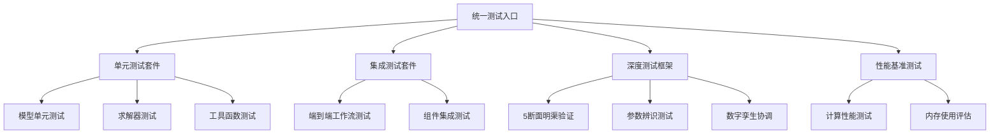
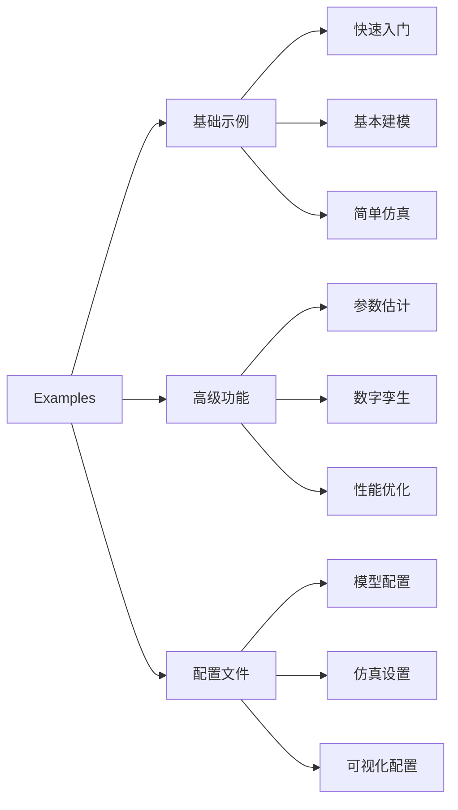
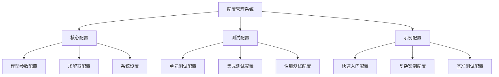
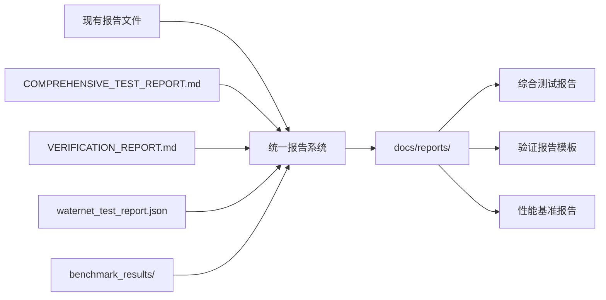
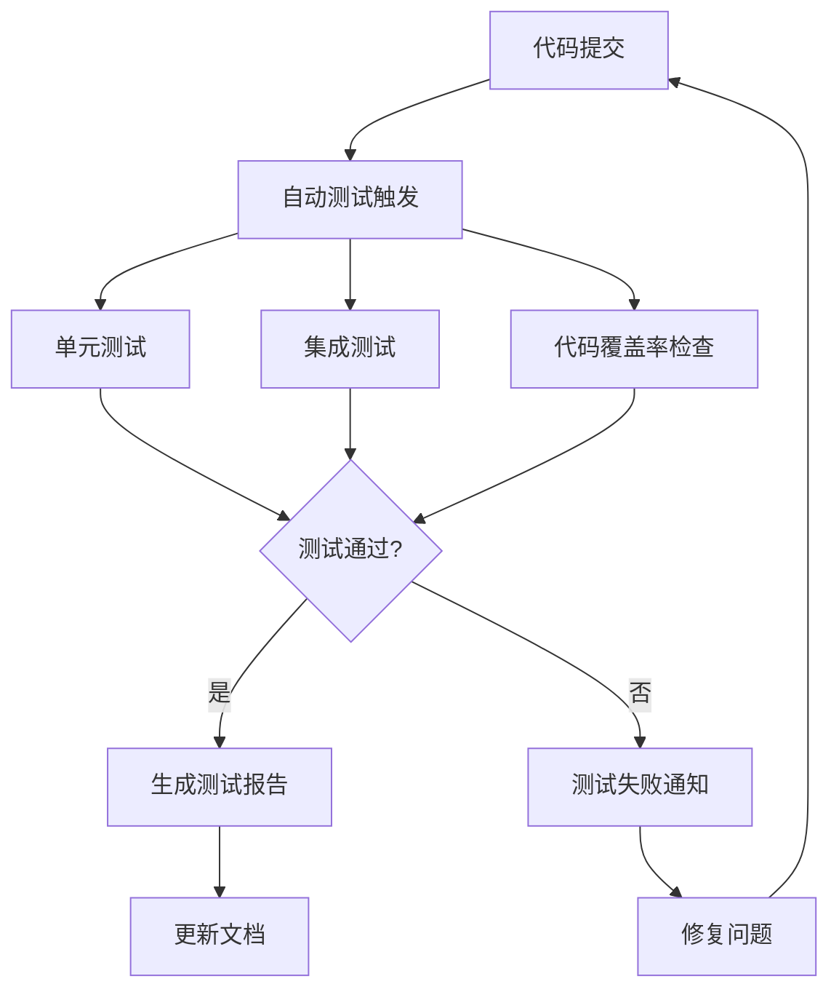
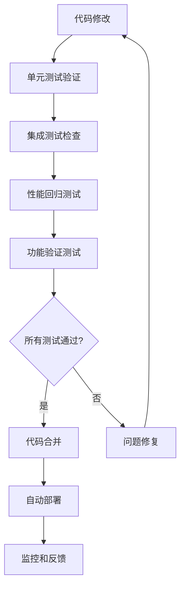

# WaterNet 代码清理和组织设计文档

## 概述

本设计文档旨在解决WaterNet项目中代码散乱、测试文件分布不合理、示例代码位置不当以及遗留代码清理等问题。通过系统性的代码重组和清理，建立清晰的项目结构，提高代码可维护性和项目整体质量。

### 目标
- 统一测试文件组织结构，建立标准化的测试框架
- 整理和规范化示例代码，确保可运行性和文档完整性
- 清理项目根目录的遗留脚本文件，建立清晰的目录结构
- 规范配置文件管理，避免重复和冲突
- 建立代码质量标准和维护规范

## 技术栈分析

基于项目结构分析，WaterNet是一个专业的**水力学建模框架**，属于科学计算类Python库：

- **核心框架**: 基于NumPy/SciPy的科学计算库
- **模型实现**: 圣维南方程求解器、降阶水力模型
- **测试框架**: PyTest + 自定义深度测试框架
- **配置管理**: YAML配置文件系统
- **数据处理**: Pandas数据分析
- **可视化**: Matplotlib图形展示

## 项目结构现状分析

### 当前问题识别

| 问题类别 | 具体问题 | 影响程度 |
|---------|---------|---------|
| 测试文件混乱 | tests/和waternet/tests/双重测试目录 | 高 |
| 根目录污染 | 多个独立测试脚本散布在根目录 | 高 |
| 示例代码分散 | examples/目录不完整，缺少运行说明 | 中 |
| 配置文件重复 | configs/目录为空，配置散布各处 | 中 |
| 文档不一致 | 多个报告文件格式和内容重复 | 中 |

### 文件分类清单

#### 需要保留的核心文件
- `waternet/` - 核心代码库
- `examples/` - 示例程序（需要整理）
- `scripts/` - 工具脚本
- `requirements.txt`, `pyproject.toml` - 项目配置

#### 需要重新组织的文件
- `tests/` - 外层测试目录
- `waternet/tests/` - 内层测试目录
- 根目录下的独立测试脚本

#### 需要清理的遗留文件
- `comprehensive_core_test.py`
- `test_deep_channel_implementation.py`
- `test_fixes.py`
- `analyze_steady_profiles.py`
- `ascii_profile_viewer.py`
- `demo_deep_channel_features.py`
- `unsteady_step_response.py`
- `visualize_steady_state_profile.py`

## 代码重构架构设计

### 目标目录结构

```
WaterNet/
├── waternet/                     # 核心代码库
│   ├── models/                   # 水力模型
│   ├── config/                   # 配置管理
│   ├── parameter_estimation/     # 参数估计
│   ├── coordination/             # 数字孪生协调
│   ├── interfaces/               # 模型接口
│   └── utils/                    # 工具函数
├── tests/                        # 统一测试目录
│   ├── unit/                     # 单元测试
│   ├── integration/              # 集成测试
│   ├── deep_channel/             # 深度测试案例
│   ├── fixtures/                 # 测试数据
│   └── conftest.py               # pytest配置
├── examples/                     # 示例和演示
│   ├── basic/                    # 基础使用示例
│   ├── advanced/                 # 高级功能演示
│   ├── configs/                  # 示例配置文件
│   └── README.md                 # 示例文档
├── scripts/                      # 工具脚本
│   ├── test_runner.py           # 统一测试入口
│   ├── benchmark.py             # 性能基准测试
│   └── validation.py            # 安装验证
├── docs/                         # 文档目录
│   ├── reports/                  # 测试报告
│   └── guides/                   # 使用指南
└── configs/                      # 项目配置文件
    ├── test_configs/             # 测试配置
    └── example_configs/          # 示例配置
```

### 测试系统重构设计

#### 统一测试框架架构



#### 测试文件重新组织策略

| 源文件位置 | 目标位置 | 重构动作 |
|-----------|---------|---------|
| `waternet/tests/deep_channel_testing/` | `tests/deep_channel/` | 迁移整个目录 |
| `tests/unit/test_models.py` | `tests/unit/` | 保留并增强 |
| `tests/integration/` | `tests/integration/` | 保留并整合 |
| `comprehensive_core_test.py` | `tests/integration/test_comprehensive.py` | 重构为标准测试 |
| `test_deep_channel_implementation.py` | 删除 | 功能已整合到深度测试框架 |

### 示例代码重构设计

#### 示例分类和组织



#### 示例代码标准化

- **文档标准**: 每个示例包含完整的docstring和使用说明
- **依赖管理**: 明确标注所需依赖和环境要求  
- **输入输出**: 标准化输入参数和输出格式
- **错误处理**: 完善的异常处理和用户友好的错误信息

### 配置管理重构

#### 配置文件层次化设计



## 代码清理策略

### 根目录文件处理方案

| 文件名 | 处理策略 | 目标位置 | 理由 |
|-------|---------|---------|------|
| `comprehensive_core_test.py` | 重构整合 | `tests/integration/test_comprehensive.py` | 转换为标准化集成测试 |
| `test_deep_channel_implementation.py` | 删除 | - | 功能重复，已有深度测试框架 |
| `test_fixes.py` | 删除 | - | 临时修复脚本，不再需要 |
| `analyze_steady_profiles.py` | 迁移 | `examples/advanced/profile_analysis.py` | 转换为高级示例 |
| `ascii_profile_viewer.py` | 迁移 | `examples/advanced/visualization_tools.py` | 合并到可视化示例 |
| `demo_deep_channel_features.py` | 迁移 | `examples/advanced/deep_channel_demo.py` | 转换为高级功能演示 |
| `unsteady_step_response.py` | 迁移 | `examples/advanced/unsteady_analysis.py` | 转换为高级分析示例 |
| `visualize_steady_state_profile.py` | 迁移 | `examples/basic/profile_visualization.py` | 转换为基础可视化示例 |

### 重复文件合并策略

#### 测试报告文件整合



#### 配置文件去重

- 合并 `examples/configs/` 和空的 `configs/` 目录
- 建立配置文件命名规范和版本管理
- 创建配置验证和加载统一接口

## 代码质量改进

### 代码标准化要求

#### 文件头标准化

```
文件头模板:
"""
模块功能描述

详细说明模块的用途、主要功能和使用场景。

Author: WaterNet Development Team
Date: 创建日期
License: MIT
"""
```

#### 导入语句规范化

- 标准库导入
- 第三方库导入  
- 本地模块导入
- 相对导入优化

#### 错误处理标准化

- 统一异常类型定义
- 详细错误信息和建议
- 日志记录标准化
- 用户友好的错误反馈

### 测试覆盖率提升

#### 测试覆盖率目标

| 模块类型 | 目标覆盖率 | 当前状态 | 提升措施 |
|---------|-----------|---------|---------|
| 核心模型 | >90% | 85% | 增加边界条件测试 |
| 求解器 | >85% | 80% | 补充数值稳定性测试 |
| 工具函数 | >95% | 70% | 添加完整单元测试 |
| 配置管理 | >90% | 60% | 增加配置验证测试 |

#### 测试自动化流程



## 重构实施计划

### 阶段一：文件结构重组

#### 目录创建和迁移

1. **创建新目录结构**
   - 创建 `tests/` 统一测试目录
   - 建立 `examples/basic/` 和 `examples/advanced/` 
   - 设立 `docs/reports/` 文档目录

2. **测试文件迁移**
   - 将 `waternet/tests/deep_channel_testing/` 迁移到 `tests/deep_channel/`
   - 合并 `tests/` 和 `waternet/tests/` 的其他测试文件
   - 更新所有测试文件的导入路径

3. **示例文件重组**
   - 根目录脚本文件迁移到 `examples/` 相应目录
   - 创建示例文档和使用说明
   - 验证所有示例的可运行性

### 阶段二：代码标准化

#### 代码格式统一

1. **应用代码格式化工具**
   - 使用 Black 进行代码格式化
   - 应用 isort 整理导入语句
   - 运行 flake8 检查代码规范

2. **文档字符串标准化**
   - 统一采用 NumPy 风格文档字符串
   - 补充缺失的函数和类文档
   - 添加使用示例和参数说明

3. **类型注解完善**
   - 为所有公共接口添加类型注解
   - 使用 mypy 进行类型检查
   - 建立类型定义模块

### 阶段三：测试系统优化

#### 测试框架升级

1. **pytest 配置优化**
   - 统一 pytest 配置文件
   - 设置测试标记和分类
   - 配置覆盖率报告生成

2. **测试数据管理**
   - 建立标准化测试数据集
   - 创建测试fixture复用机制
   - 实现测试数据版本控制

3. **持续集成设置**
   - 配置自动化测试流程
   - 设置代码质量检查
   - 建立测试报告自动生成

### 阶段四：文档和配置完善

#### 文档系统建设

1. **API文档生成**
   - 使用 Sphinx 生成 API 文档
   - 创建用户指南和开发者文档
   - 建立文档自动更新机制

2. **配置管理优化**
   - 建立配置文件验证机制
   - 创建配置模板和示例
   - 实现配置文件版本管理

## 质量保证措施

### 代码审查标准

#### 审查检查清单

- [ ] 代码符合PEP 8规范
- [ ] 函数和类有完整文档字符串
- [ ] 包含适当的类型注解
- [ ] 错误处理完善
- [ ] 测试覆盖率达标
- [ ] 无安全漏洞
- [ ] 性能无明显退化

### 测试验证流程

#### 回归测试策略



### 维护规范制定

#### 代码维护指南

1. **新功能开发规范**
   - 功能设计文档先行
   - 测试驱动开发(TDD)
   - 代码审查必须通过
   - 文档同步更新

2. **Bug修复流程**
   - 问题复现和测试用例
   - 根因分析和解决方案
   - 回归测试验证
   - 修复文档记录

3. **性能优化准则**
   - 性能基准测试建立
   - 优化前后对比分析
   - 内存使用监控
   - 算法复杂度评估