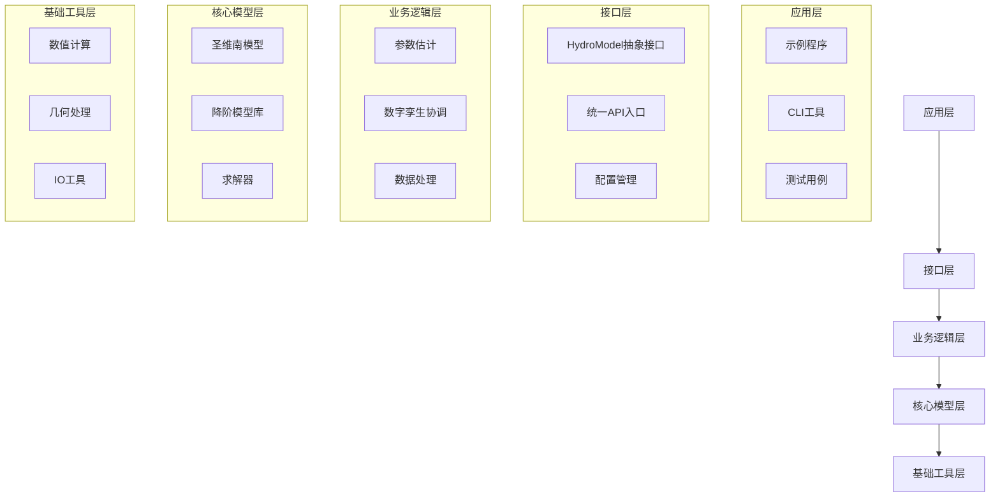
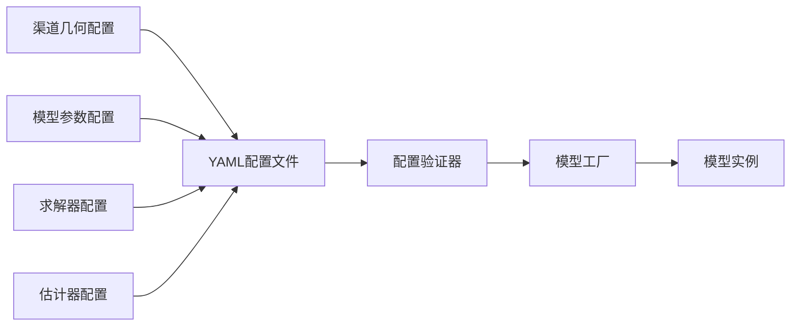
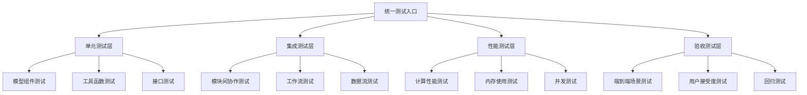
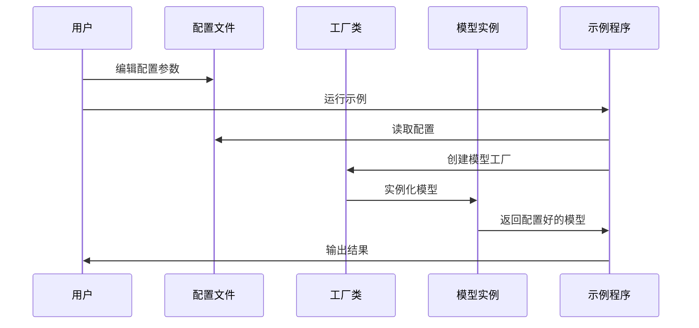
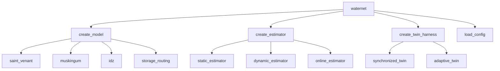
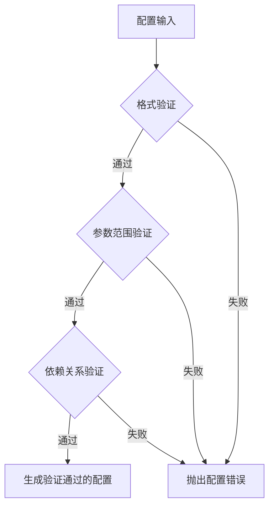
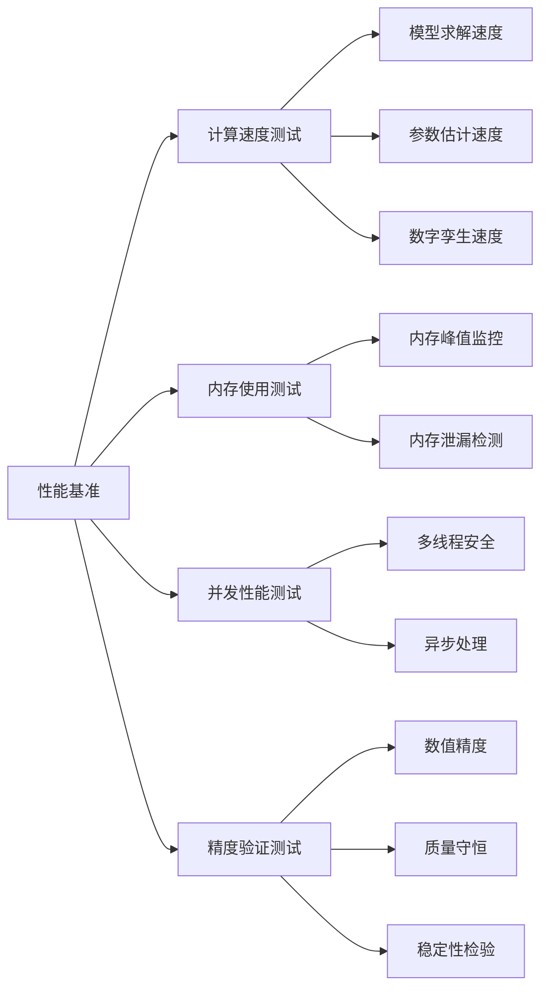
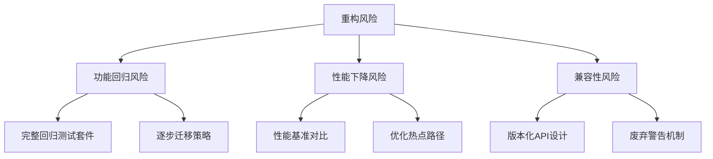

# WaterNet 代码结构优化重构设计

## 概述

WaterNet是一个基于圣维南方程组的明渠水力模型数字孪生建模框架。当前代码库在第一版开发过程中出现了结构混乱、测试分散、示例复杂化等问题。本设计旨在通过全面重构提升代码的组织性、通用性和可维护性。

### 重构目标

- **统一代码架构**: 消除重复版本，合并原始版本和增强版本
- **集中测试管理**: 建立统一测试入口和分层测试体系
- **简化示例程序**: 移除硬编码，提升通用性和易用性
- **优化目录结构**: 清晰分离核心库、测试、示例和文档
- **增强可维护性**: 建立清晰的模块依赖关系和接口规范

## 架构设计

### 目标架构层次



### 重构后目录结构

```
WaterNet/
├── waternet/                          # 核心代码库
│   ├── __init__.py                    # 统一API导出
│   ├── interfaces/                    # 接口定义层
│   │   ├── __init__.py
│   │   ├── base_model.py             # 基础模型接口
│   │   └── configuration.py         # 配置接口
│   ├── models/                       # 核心模型层（合并版本）
│   │   ├── __init__.py
│   │   ├── saint_venant.py          # 统一圣维南模型
│   │   ├── lumped_models.py         # 统一降阶模型
│   │   └── solvers.py               # 统一求解器
│   ├── coordination/                 # 数字孪生协调层
│   │   ├── __init__.py
│   │   └── twin_harness.py         # 简化协调器
│   ├── estimation/                   # 参数估计层
│   │   ├── __init__.py
│   │   ├── parameter_estimator.py  # 统一参数估计
│   │   └── calibration.py          # 校准功能
│   ├── utils/                       # 工具层
│   │   ├── __init__.py
│   │   ├── geometry.py             # 几何计算
│   │   ├── numerics.py             # 数值工具
│   │   └── io_helpers.py           # IO辅助
│   └── config/                      # 配置管理
│       ├── __init__.py
│       ├── defaults.py             # 默认配置
│       └── validation.py           # 配置验证
├── tests/                           # 独立测试目录
│   ├── __init__.py
│   ├── conftest.py                 # pytest配置
│   ├── unit/                       # 单元测试
│   │   ├── test_models.py
│   │   ├── test_coordination.py
│   │   └── test_estimation.py
│   ├── integration/                # 集成测试
│   │   ├── test_workflows.py
│   │   └── test_performance.py
│   └── fixtures/                   # 测试数据
│       ├── channel_configs.py
│       └── test_data.py
├── examples/                       # 简化示例
│   ├── __init__.py
│   ├── basic_usage.py             # 基础使用示例
│   ├── parameter_estimation.py    # 参数估计示例
│   ├── digital_twin.py           # 数字孪生示例
│   └── configs/                   # 示例配置文件
│       ├── simple_channel.yaml
│       ├── complex_channel.yaml
│       └── estimation_config.yaml
├── scripts/                       # 工具脚本
│   ├── run_tests.py              # 统一测试入口
│   ├── benchmark.py              # 性能基准
│   └── validate_install.py       # 安装验证
├── docs/                         # 文档
├── README.md
├── pyproject.toml
└── requirements.txt
```

## 核心模块重构设计

### 统一模型接口

移除多版本模型类，建立统一的模型接口：

| 组件 | 重构前 | 重构后 | 变更说明 |
|------|--------|--------|----------|
| 圣维南模型 | SaintVenantModel + EnhancedSaintVenantSolver | SaintVenantModel | 合并增强功能到主类 |
| 马斯京干模型 | MuskingumModel + EnhancedMuskingumModel | MuskingumModel | 整合增强特性 |
| IDZ模型 | IDZModel + 分散实现 | IDZModel | 统一实现 |
| 蓄量演算 | StorageRoutingModel + 多个版本 | StorageRoutingModel | 单一版本 |

### 配置驱动设计

引入配置文件支持，减少硬编码：



#### 配置文件结构

| 配置类型 | 文件名 | 内容 |
|----------|--------|------|
| 渠道几何 | channel_geometry.yaml | 断面定义、糙率、坡度等 |
| 模型参数 | model_parameters.yaml | 各类模型的默认参数 |
| 求解器设置 | solver_config.yaml | 数值格式、收敛条件等 |
| 估计配置 | estimation_config.yaml | 参数范围、优化算法等 |

### 测试体系重构

建立分层测试架构：



#### 测试管理策略

| 测试类型 | 运行频率 | 目标 | 工具 |
|----------|----------|------|------|
| 单元测试 | 每次提交 | 代码正确性 | pytest |
| 集成测试 | 每日构建 | 模块协作 | pytest + fixtures |
| 性能测试 | 每周 | 性能回归检测 | pytest-benchmark |
| 验收测试 | 发布前 | 功能完整性 | 自定义框架 |

## 示例程序简化设计

### 简化原则

- **配置外部化**: 所有参数通过配置文件提供
- **模块化组织**: 每个示例专注单一功能
- **通用性设计**: 避免特定场景的硬编码
- **渐进式学习**: 从简单到复杂的示例顺序

### 示例重构对比

| 原始示例 | 问题 | 重构后示例 | 改进 |
|----------|------|------------|------|
| basic_usage.py (388行) | 硬编码过多，功能混杂 | basic_usage.py (50行) | 配置驱动，功能单一 |
| deep_channel_testing/ | 测试和示例混合 | 移至tests/ | 职责分离 |
| 分散的配置 | 重复定义 | configs/目录 | 统一管理 |

### 配置化示例设计



## 数据流与接口设计

### 统一API设计

建立简洁一致的API接口：



### 模型工厂模式

| 工厂方法 | 输入 | 输出 | 说明 |
|----------|------|------|------|
| create_saint_venant | 配置字典/文件 | SaintVenantModel | 圣维南模型实例 |
| create_lumped_model | 模型类型+配置 | BaseLumpedModel | 降阶模型实例 |
| create_estimator | 目标模型+方法 | ParameterEstimator | 参数估计器 |
| create_twin_harness | 主模型+辅模型 | TwinHarness | 孪生协调器 |

### 配置验证机制



## 性能与质量保障

### 代码质量指标

| 指标 | 目标值 | 检测工具 |
|------|--------|----------|
| 测试覆盖率 | >90% | pytest-cov |
| 循环复杂度 | <10 | radon |
| 代码重复率 | <5% | CPD |
| 文档覆盖率 | >85% | interrogate |

### 性能基准测试



## 重构实施计划

### 实施阶段

| 阶段 | 任务 | 预计工期 | 关键交付物 |
|------|------|----------|------------|
| 第一阶段 | 核心模型合并 | 1周 | 统一的模型类 |
| 第二阶段 | 测试体系重构 | 1周 | 新测试架构 |
| 第三阶段 | 示例程序简化 | 3天 | 配置化示例 |
| 第四阶段 | 文档更新 | 2天 | 更新的README和API文档 |
| 第五阶段 | 验证测试 | 2天 | 完整的回归测试 |

### 风险控制



### 质量检查点

| 检查点 | 检查内容 | 通过标准 |
|--------|----------|----------|
| 代码合并 | 功能一致性、测试通过 | 100%测试通过 |
| 测试重构 | 覆盖率、执行速度 | >90%覆盖率 |
| 示例更新 | 可用性、文档完整性 | 用户验收通过 |
| 性能验证 | 执行效率、资源使用 | 性能不下降 |

## 后续优化方向

### 架构演进路径

1. **微服务化改造**: 将各模块独立为服务
2. **云原生支持**: 容器化部署和弹性伸缩
3. **可视化界面**: Web界面和交互式配置
4. **机器学习集成**: 智能参数调优和模型选择

### 可扩展性设计

- **插件架构**: 支持第三方模型和算法扩展
- **API网关**: 统一外部接口管理
- **数据流水线**: 支持大规模数据处理
- **分布式计算**: 支持集群化高性能计算