# 复杂水力枢纽模型系统设计

## 概述

本设计文档描述了WaterNet项目中复杂水力枢纽模型系统的高层次架构设计，包括水库模型、复杂枢纽站模型、连接点模型和网络拓扑构建器等核心组件。该系统旨在为梯级水库网络提供完整的水力建模解决方案，支持复杂水力结构的精确仿真和联合求解。

系统基于WaterNet框架的HydroModel抽象接口，确保所有组件都能无缝集成到现有的物理模型和降阶模型体系中。通过标准化的变量命名规范和方程残差计算机制，实现了不同类型水力构筑物的统一建模框架。

## 系统架构

### 总体架构图

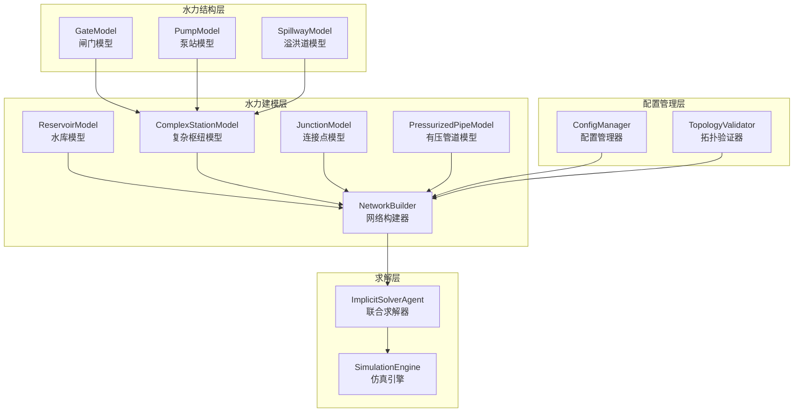

### 核心组件交互关系

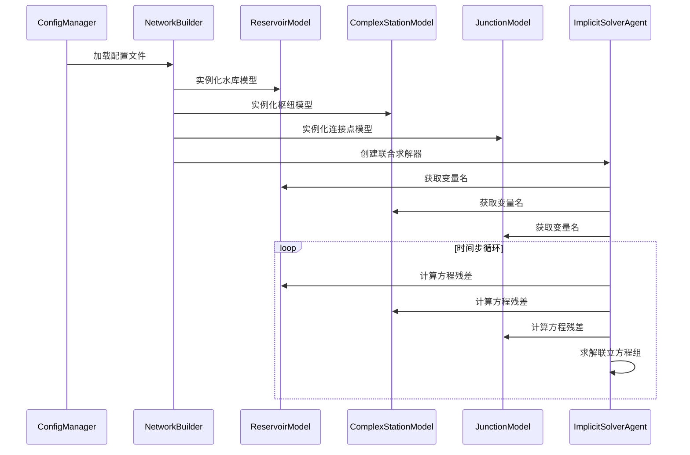

## 核心模型设计

### 水库模型 (ReservoirModel)

ReservoirModel实现了水库的基本水量平衡原理，通过蓄水量-水位关系和水量守恒定律描述水库的动态行为。

#### 设计原理

水库模型基于以下物理关系：
- **水量平衡方程**：蓄水量变化 = 流入量 - 流出量
- **库容曲线**：蓄水量与水位之间的非线性关系
- **边界耦合**：通过连接节点与其他水力模型交互

#### 变量定义

| 变量名 | 含义 | 单位 | 类型 |
|--------|------|------|------|
| `H_{水库名}` | 水库水位 | m | 未知变量 |
| `V_current` | 当前蓄水量 | m³ | 中间变量 |
| `Q_in_total` | 总流入量 | m³/s | 边界条件 |
| `Q_out_total` | 总流出量 | m³/s | 边界条件 |

#### 方程组构建

水库模型构建两个核心方程：

1. **离散化水量平衡方程**
   ```
   V_current - prev_states['V_self'] - (sum(Q_in) - sum(Q_out)) * dt = 0
   ```
   
2. **库容曲线约束方程**
   ```
   variables[f'H_{self.name}'] - self.V_to_H_func(V_current) = 0
   ```

#### 接口规范

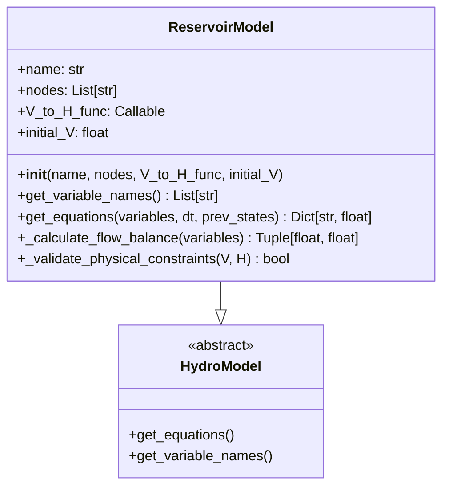

### 复杂枢纽站模型 (ComplexStationModel)

ComplexStationModel用于建模包含多种水力机械设备的复杂枢纽，如包含闸门、泵站、船闸等设备的综合枢纽。

#### 设计策略

枢纽站采用层次化建模策略：
- **设备层**：建模各种水力机械的流量特性
- **控制层**：处理设备的运行状态和控制逻辑
- **系统层**：实现整体水量平衡和边界条件

#### 变量系统

| 变量类型 | 变量名格式 | 说明 |
|----------|------------|------|
| 设备流量 | `Q_{设备名}` | 各水力设备的流量 |
| 上游水位 | `H_{上游节点}` | 上游水位边界条件 |
| 下游水位 | `H_{下游节点}` | 下游水位边界条件 |
| 控制参数 | `Setting_{设备名}` | 设备操作参数 |

#### 方程体系

ComplexStationModel构建的方程包括：

1. **设备特性方程**（每个设备）
   ```
   variables[f'Q_{structure.name}'] - structure.get_flow(H_up, H_down, setting) = 0
   ```

2. **总体水量平衡方程**
   ```
   sum(Q_in_external) + sum(Q_structures_in) - sum(Q_out_external) - sum(Q_structures_out) = 0
   ```

#### 水力设备接口

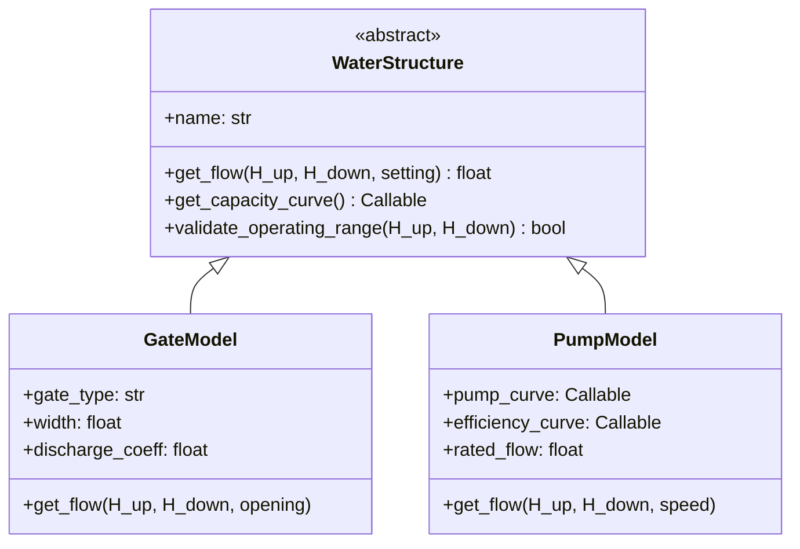

### 连接点模型 (JunctionModel)

JunctionModel实现了多个水力对象汇流或分流的连接点建模，确保系统的水量守恒。

#### 建模原理

连接点基于质量守恒定律：
- 流入连接点的总流量 = 流出连接点的总流量
- 连接点本身不存储水量
- 所有连接对象在该点具有相同的水位

#### 流量识别机制

```mermaid
graph TD
    A[获取连接对象列表] --> B[遍历每个对象]
    B --> C{判断流向}
    C -->|流入| D[加入Q_in列表]
    C -->|流出| E[加入Q_out列表]
    D --> F[构建平衡方程]
    E --> F
    F --> G[sum(Q_in) - sum(Q_out) = 0]
```

#### 变量命名约定

连接点模型使用标准化的变量命名：
- 节点水位：`H_{连接点名}`
- 对象流量：`Q_{对象名}_{连接位置}`
  - 示例：`Q_Pipe1_end`、`Q_Channel2_start`

### 网络拓扑构建器 (NetworkBuilder)

NetworkBuilder负责从配置文件构建完整的水力网络模型，实现配置驱动的模型实例化。

#### 构建流程

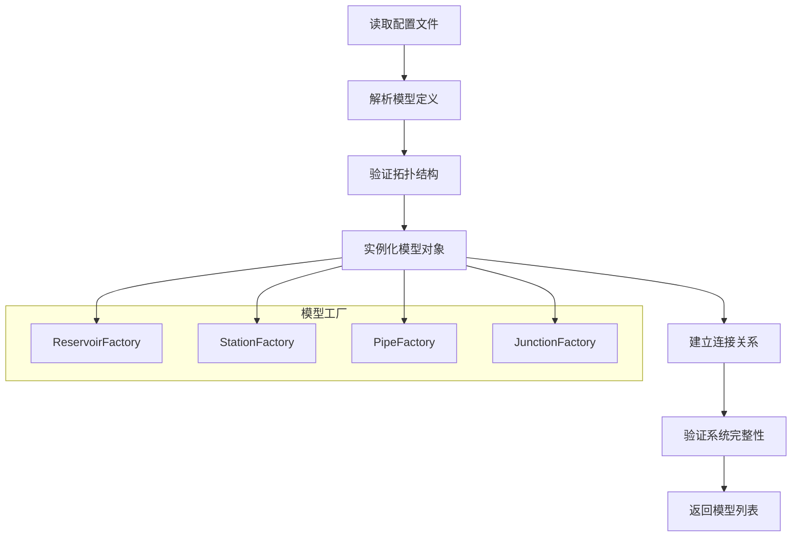

#### 配置文件结构

网络配置采用分层的YAML结构：

```yaml
network:
  name: "梯级水库系统"
  
  reservoirs:
    - name: "Reservoir1"
      type: "reservoir"
      initial_volume: 50000000
      capacity_curve: "reservoir1_curve.json"
      connections: ["Pipe1"]
      
  stations:
    - name: "Station1"
      type: "complex_station"
      upstream_node: "Pipe1_end"
      downstream_node: "Channel1_start"
      structures:
        gates:
          - name: "Gate1"
            type: "radial_gate"
            width: 10.0
        pumps:
          - name: "Pump1"
            type: "centrifugal_pump"
            rated_flow: 50.0
            
  pipes:
    - name: "Pipe1"
      type: "pressurized_pipe"
      upstream_node: "Reservoir1"
      downstream_node: "Station1"
      length: 1000.0
      diameter: 2.0
      
  junctions:
    - name: "Junction1"
      type: "junction"
      connected_objects: ["Pipe1", "Channel1", "Channel2"]
```

#### 工厂模式实现

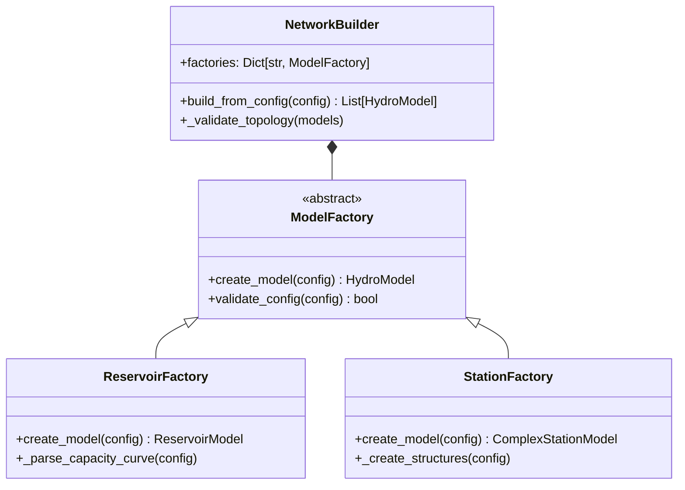

## 系统集成策略

### 求解器集成

复杂枢纽模型系统通过ImplicitSolverAgent实现联合求解：

#### 变量收集机制

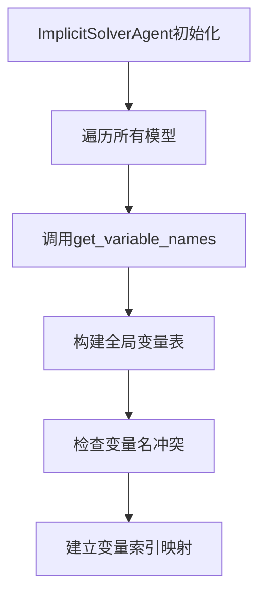

#### 方程组装流程

1. **收集阶段**：从每个模型收集方程残差
2. **组装阶段**：构建完整的残差向量
3. **求解阶段**：使用Newton-Raphson方法求解
4. **更新阶段**：更新所有模型的状态变量

### 状态管理策略

#### 状态变量分类

| 状态类型 | 存储位置 | 更新频率 | 示例 |
|----------|----------|----------|------|
| 瞬时变量 | variables字典 | 每次迭代 | 水位、流量 |
| 历史状态 | prev_states字典 | 每个时间步 | 上一时步蓄水量 |
| 控制参数 | 模型内部 | 手动设置 | 闸门开度、泵转速 |

#### 时间步进策略

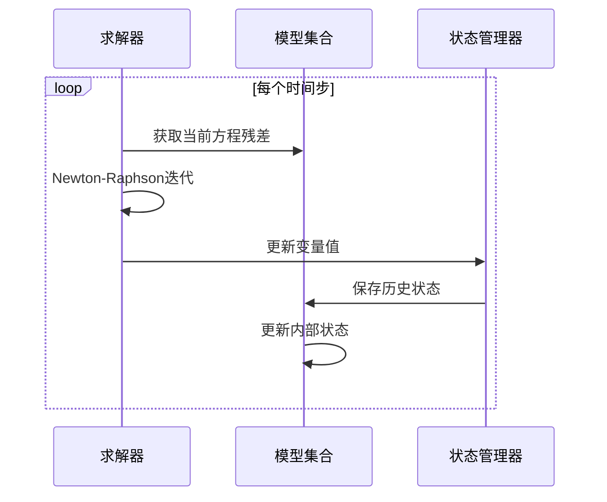

## 验证与测试框架

### 单元测试策略

#### 模型独立测试

每个模型需要通过以下测试：

1. **接口一致性测试**
   - 验证get_variable_names()返回正确格式
   - 验证get_equations()返回正确数量的方程
   - 验证方程残差的数值稳定性

2. **物理合理性测试**
   - 验证守恒定律（质量、能量）
   - 验证边界条件处理
   - 验证极限情况下的模型行为

3. **数值稳定性测试**
   - 验证不同时间步长下的收敛性
   - 验证初值敏感性
   - 验证参数扰动影响

#### 测试数据设计

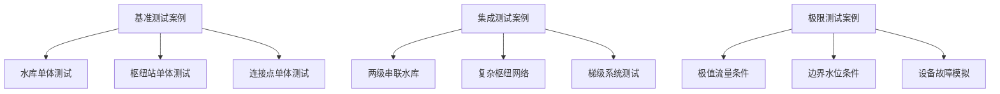

### 集成测试设计

#### 梯级水库网络测试

测试场景设计为完整的梯级水库系统：
- **上游水库**：具有复杂库容曲线的储水系统
- **连接管道**：考虑水头损失的有压输水系统
- **中间枢纽**：包含多种控制结构的复杂枢纽
- **下游水库**：作为系统末端的调节水库

#### 系统验证指标

| 验证项目 | 验证方法 | 接受标准 |
|----------|----------|----------|
| 水量守恒 | 质量平衡检查 | 相对误差 < 1% |
| 数值收敛 | 残差范数分析 | 残差 < 1e-6 |
| 物理合理性 | 水位流量关系 | 符合物理规律 |
| 计算效率 | 时间性能测试 | 实时比 > 100 |

#### 测试自动化框架

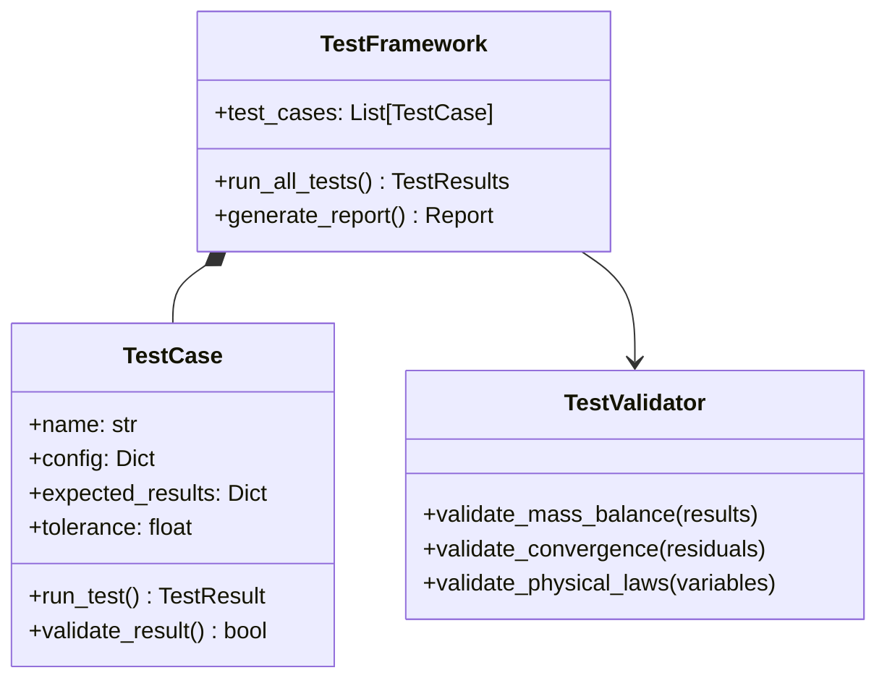

## 性能优化考虑

### 计算效率优化

#### 稀疏矩阵利用

复杂网络的雅可比矩阵通常具有稀疏特性，可以通过以下策略优化：
- 使用稀疏矩阵存储格式
- 实现智能的变量排序
- 采用块对角化预处理

#### 并行计算策略

对于大规模网络，可以考虑以下并行化方案：
- 模型方程计算的并行化
- 子系统独立求解
- GPU加速的矩阵运算

### 内存管理优化

#### 状态存储策略

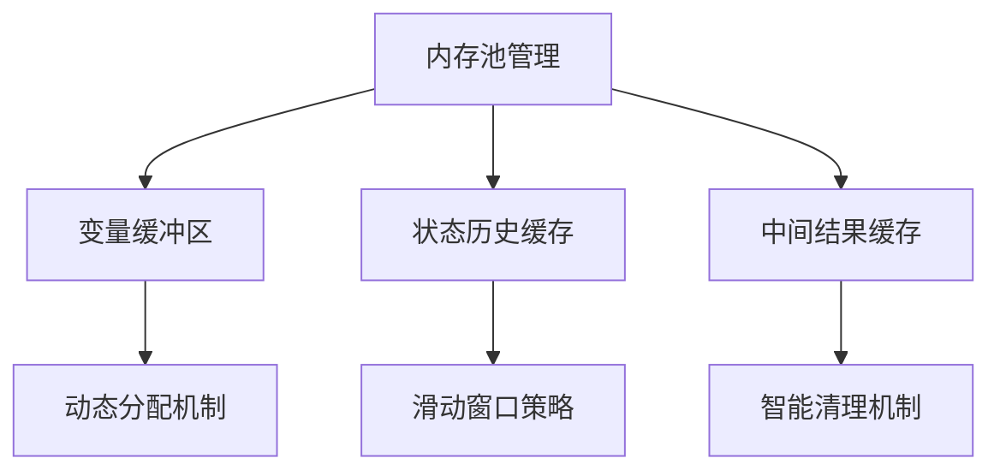

#### 数据结构设计

优化的数据结构应考虑：
- 缓存友好的内存布局
- 最小化数据复制
- 高效的查找和更新操作

这个复杂枢纽模型系统为WaterNet框架提供了完整的大型水力网络建模能力，通过标准化的接口设计和模块化的架构，确保了系统的可扩展性和可维护性。系统支持从简单的点对点连接到复杂的多级枢纽网络的全方位建模需求，为水利工程的数字化仿真提供了强有力的技术支撑。