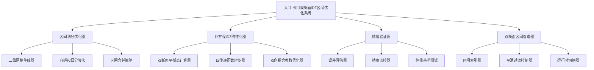
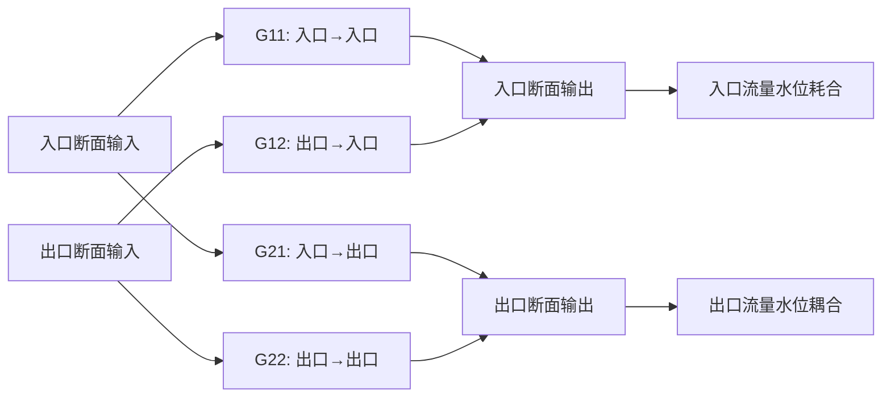
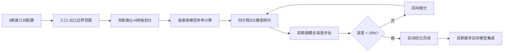

# 基于入口-出口双断面分段线性化的流量水位区间优化系统设计

## 概述

本设计基于WaterNet项目现有的5断面明渠模型，开发一个针对入口和出口两个断面的分段线性化流量水位区间优化系统。系统通过优化流量和水位的离散步长，在每个区间内使用四方程IDZ模型进行双断面耦合线性化辨识，考虑上游到上游(G11)、下游到上游(G12)、上游到下游(G21)、下游到下游(G22)四种传递函数关系，确保每个区间的线性化模型与原精细化圣维南模型的误差控制在20%以内。

### 核心目标
- 基于5断面明渠的入口和出口断面，建立双节点四方程IDZ耦合模型
- 实现流量水位二维空间的智能分段，为每个区间确定最优的双断面平衡点
- 辨识四个传递函数参数，完整描述入口-出口间的双向耦合关系
- 建立误差控制机制，确保各区间线性化模型误差小于20%
- 构建区间切换和平滑过渡机制，保证系统稳定性

## 技术架构

### 系统组件层次结构



### 双断面IDZ模型架构



### 数据流架构



## 核心算法设计

### 区间划分优化算法

#### 自适应二维网格划分策略

**基本原理**：基于入口和出口断面的流量水位特性，采用分层网格细化方法

**算法流程**：
1. **初始网格生成**：根据入口和出口断面的运行范围确定双节点Q-H空间边界
2. **双断面均匀初始划分**：生成N×M×N×M的四维初始网格(Q1-H1-Q2-H2)
3. **误差驱动细分**：对超过精度要求的四维区间进行递归细分
4. **邻域一致性优化**：确保相邻四维区间的平滑过渡

**划分决策矩阵**：

| 入口流量范围 | 出口流量范围 | 水位变化特征 | 推荐分段策略 | 细分优先级 |
|-------------|-------------|-------------|-------------|-----------|
| 0-30 m³/s | 0-25 m³/s | 低水位，线性度高 | 粗分段(4×4×4×4) | 低 |
| 30-60 m³/s | 25-50 m³/s | 过渡区，非线性增强 | 中分段(6×6×6×6) | 中 |
| 60-100 m³/s | 50-80 m³/s | 高水位，强非线性 | 细分段(8×8×8×8) | 高 |
| 100+ m³/s | 80+ m³/s | 洪水工况，复杂流态 | 超细分段(10×10×10×10) | 最高 |

#### 区间质量评估指标

**误差度量定义**：
- **入口流量误差**：E_Q1 = |Q1_IDZ - Q1_SaintVenant| / Q1_SaintVenant
- **出口流量误差**：E_Q2 = |Q2_IDZ - Q2_SaintVenant| / Q2_SaintVenant
- **入口水位误差**：E_H1 = |H1_IDZ - H1_SaintVenant| / H1_SaintVenant  
- **出口水位误差**：E_H2 = |H2_IDZ - H2_SaintVenant| / H2_SaintVenant
- **综合误差**：E_total = α·max(E_Q1,E_Q2) + β·max(E_H1,E_H2) (α+β=1)

**区间接受准则**：
- 主要条件：E_total < 0.20 (20%误差阈值)
- 补充条件：max(E_Q1, E_Q2, E_H1, E_H2) < 0.30
- 稳定性条件：区间内误差方差 < 0.05

### 四方程IDZ双断面平衡点优化

#### 双断面区间中心平衡点计算

**平衡点确定策略**：
1. **几何中心法**：取区间双断面流量水位的几何中心
2. **物理加权中心法**：基于水力重要性的加权平均
3. **误差最小化优化法**：最小化区间内最大误差的最优点

**双断面平衡点计算公式**：

对于区间 [Q1_min, Q1_max] × [H1_min, H1_max] × [Q2_min, Q2_max] × [H2_min, H2_max]：

- **几何中心**：
  - Q1_0 = (Q1_min + Q1_max) / 2
  - H1_0 = (H1_min + H1_max) / 2
  - Q2_0 = (Q2_min + Q2_max) / 2
  - H2_0 = (H2_min + H2_max) / 2

- **物理加权中心**：
  - Q1_0 = Σ(w_i · Q1_i) / Σ(w_i)
  - H1_0 = Σ(w_i · H1_i) / Σ(w_i)
  - Q2_0 = Σ(w_i · Q2_i) / Σ(w_i)
  - H2_0 = Σ(w_i · H2_i) / Σ(w_i)
  - 权重w_i基于流态重要性确定

- **误差最小化优化**：
  - 通过最小化区间内所有测试点的最大相对误差获得

#### 四方程IDZ参数辨识

**传递函数矩阵结构**：
基于WaterNet现有的四方程IDZ实现，建立入口-出口双节点耦合关系：

```
[Q1_out]   [G11(s) G12(s)] [ΔQ1_in]   [Q1_0]
[Q2_out] = [G21(s) G22(s)] [ΔQ2_in] + [Q2_0]
```

其中：
- **G11(s)**：入口输入 → 入口输出（本地响应）
- **G12(s)**：出口输入 → 入口输出（回水效应）
- **G21(s)**：入口输入 → 出口输出（正向传播）
- **G22(s)**：出口输入 → 出口输出（本地响应）

**参数辨识流程**：
1. **稳态条件设定**：基于区间中心平衡点(Q1_0, H1_0, Q2_0, H2_0)
2. **扰动信号设计**：在四维区间内生成多样化测试信号
3. **参数搜索空间**：根据物理约束确定12个参数的搜索边界
4. **优化目标函数**：最小化区间内所有测试点的平均误差

**参数约束条件**：

| 参数 | 物理意义 | 推荐范围 | 约束条件 |
|------|----------|----------|----------|
| τ11, τ22 | 本地零点时间常数 | [50, 500] s | τ < α |
| τ12, τ21 | 传播零点时间常数 | [100, 800] s | τ < α |
| T11, T22 | 本地延迟时间 | [0, 50] s | T ≥ 0 |
| T12, T21 | 传播延迟时间 | [100, 1200] s | T21 > T12 |
| α11, α22 | 本地极点时间常数 | [200, 600] s | α > 0 |
| α12, α21 | 传播极点时间常数 | [300, 1000] s | α > 0 |

### 精度验证与误差控制

#### 多工况验证测试设计

**测试场景配置**：

1. **恒定流验证**：
   - 测试点：区间内均匀分布的9个点
   - 验证指标：稳态流量、水位、蓄量
   - 合格标准：所有点误差 < 20%

2. **阶跃响应验证**：
   - 输入信号：从区间边界到中心的阶跃
   - 验证指标：峰值误差、稳态误差、响应时间
   - 合格标准：动态过程误差 < 25%

3. **正弦扰动验证**：
   - 输入信号：不同频率的正弦波扰动
   - 验证指标：幅值衰减、相位延迟
   - 合格标准：频域特性误差 < 30%

#### 自适应误差控制策略

**误差监控机制**：
- **实时误差跟踪**：运行时监控当前区间的模型误差
- **动态阈值调整**：根据应用需求调整误差容忍度
- **预警触发机制**：误差接近阈值时自动重新辨识

**误差超限处理流程**：
1. 检测到误差超过20%阈值
2. 分析误差来源（参数漂移/工况变化）
3. 启动区间细分或参数重新辨识
4. 验证修正后的模型精度
5. 更新区间模型库

## 系统实现架构

### 核心类结构设计

#### FlowStageIntervalOptimizer（主控制器）

**职责**：统筹整个双断面区间优化过程

**核心方法**：
- initialize_dual_section_intervals(Q1_range, H1_range, Q2_range, H2_range, initial_grid_size)
- optimize_intervals(error_threshold=0.20)
- validate_interval_quality(interval_id)
- generate_optimization_report()

#### IntervalPartitioner（区间划分器）

**职责**：管理双断面Q1-H1-Q2-H2四维空间的分段策略

**核心方法**：
- create_four_dimensional_grid(n_Q1, n_H1, n_Q2, n_H2)
- adaptive_refinement(interval, error_map)
- merge_similar_intervals(interval_list)
- compute_dual_section_boundaries()

#### FourEquationIDZLinearizer（四方程IDZ线性化器）

**职责**：为每个四维区间执行四方程IDZ模型辨识

**核心方法**：
- compute_dual_section_equilibrium_point(interval)
- identify_four_transfer_functions(equilibrium_point, test_data)
- validate_coupling_relationships(interval, idz_model)
- optimize_twelve_parameters(initial_params, constraints)

#### AccuracyValidator（精度验证器）

**职责**：评估和控制各四维区间的模型精度

**核心方法**：
- evaluate_dual_section_accuracy(interval, idz_model, reference_model)
- generate_four_dimensional_test_scenarios(interval)
- compute_coupling_error_metrics(idz_results, reference_results)
- assess_interval_quality(error_metrics)

#### DualSectionIntervalManager（双断面区间管理器）

**职责**：运行时的四维区间选择和切换

**核心方法**：
- select_active_interval(current_Q1, current_H1, current_Q2, current_H2)
- smooth_transition_between_intervals(from_interval, to_interval)
- interpolate_boundary_responses(Q1, H1, Q2, H2, adjacent_intervals)
- update_dual_section_interval_database(interval_models)

### 数据结构设计

#### FlowStageInterval（流量水位区间）

```
类属性：
- interval_id: 区间唯一标识符
- Q1_bounds: [Q1_min, Q1_max] 入口流量边界
- H1_bounds: [H1_min, H1_max] 入口水位边界
- Q2_bounds: [Q2_min, Q2_max] 出口流量边界
- H2_bounds: [H2_min, H2_max] 出口水位边界
- equilibrium_point: (Q1_0, H1_0, Q2_0, H2_0) 双断面平衡点
- idz_model: 四方程IDZ模型实例
- transfer_functions: 四个传递函数参数{G11, G12, G21, G22}
- error_metrics: 双断面误差评估结果
- quality_score: 区间质量评分
- neighboring_intervals: 相邻四维区间列表
```

#### OptimizationResults（优化结果）

```
类属性：
- total_intervals: 总区间数量
- four_dimensional_grid_structure: 四维网格结构描述
- dual_section_optimization_time: 双断面优化总耗时
- coupling_accuracy_statistics: 耦合精度统计信息
- transfer_function_distribution: 四传递函数参数分布分析
- performance_benchmarks: 性能基准测试
```

### 集成接口设计

#### 与现有WaterNet组件的接口

**与5断面几何配置集成**：
- 复用FiveSectionChannelConfig类获取河道几何
- 继承现有的水力要素计算函数
- 利用既有的边界条件配置
- 提取入口和出口断面的水力参数

**与圣维南模型集成**：
- 使用SaintVenantModel作为精细化参考模型
- 调用EnhancedSaintVenantSolver进行高精度计算
- 获取恒定流和非恒定流的参考解
- 提取入口和出口断面的响应数据

**与四方程IDZ模型集成**：
- 扩展IntegralDelayZeroModel支持双断面四方程配置
- 利用现有的参数辨识框架
- 集成ParameterEstimator进行自动优化
- 实现四个传递函数的双向耦合计算

## 测试验证策略

### 功能测试用例

#### 测试用例1：基础双断面区间划分验证

**测试目标**：验证四维区间划分算法的正确性
**测试条件**：
- 入口流量范围：[20, 100] m³/s
- 入口水位范围：[100.0, 102.0] m
- 出口流量范围：[15, 80] m³/s
- 出口水位范围：[99.0, 101.0] m
- 初始网格：4×4×4×4
- 误差阈值：20%

**验证标准**：
- 所有四维区间满足误差要求
- 区间边界连续性
- 邻域过渡平滑性

#### 测试用例2：四方程IDZ参数辨识精度

**测试目标**：验证四方程IDZ参数辨识的有效性
**测试条件**：
- 选择3个代表性四维区间（低、中、高流量）
- 每个区间生扙20个测试工况
- 对比四方程IDZ模型与圣维南模型响应

**验证标准**：
- 稳态误差 < 15%
- 动态响应误差 < 25%
- 四传递函数参数物理合理性

#### 测试用例3：区间切换连续性

**测试目标**：验证运行时四维区间切换的稳定性
**测试条件**：
- 设计跨四维区间的流量水位轨迹
- 模拟实时运行切换场景
- 监控切换瞬间的响应连续性

**验证标准**：
- 切换无振荡
- 响应平滑过渡
- 计算效率保持

### 性能基准测试

#### 计算效率对比

| 模型类型 | 计算速度 | 内存占用 | 误差水平 | 适用场景 |
|----------|----------|----------|----------|----------|
| 圣维南完整模型 | 基准 | 高 | < 5% | 离线精确计算 |
| 单一IDZ模型 | 20x | 低 | 15-40% | 简单工况 |
| 双断面分段IDZ系统 | 15x | 中 | < 20% | 实时多工况 |
| 传统马斯京干 | 30x | 低 | 20-50% | 快速估算 |

#### 内存使用分析

**区间模型存储需求**：
- 单个四维区间IDZ模型：~5KB参数存储（12个传递函数参数）
- 100个区间系统：~500KB总存储
- 辅助数据结构：~100KB（区间索引、邻域关系等）
- 总内存占用：< 1MB（相比圣维南模型大幅降低）

## 应用扩展与未来发展

### 扩展应用场景

1. **多断面河网系统**：
   - 扩展至更复杂的河网拓扑
   - 支持支流汇入和分流
   - 处理回水效应和非线性耦合
   - 扩展为多节点网络系统

2. **实时洪水预报**：
   - 集成气象预报数据
   - 动态调整区间划分
   - 提供不确定性分析
   - 自适应模型切换策略

3. **水库调度优化**：
   - 结合水库特性曲线
   - 优化调度决策算法
   - 支持多目标约束
   - 实时优化控制

4. **水质输运模拟**：
   - 在流量水位基础上增加水质维度
   - 建立六维(Q1-H1-Q2-H2-C1-C2)区间划分
   - 支持污染物扩散预测
   - 环境影响评估

### 技术发展方向

1. **机器学习增强**：
   - 基于历史数据的区间自动优化
   - 神经网络辅助的参数辨识
   - 强化学习的自适应控制

2. **多尺度耦合建模**：
   - 不同时空尺度的模型集成
   - 实现无缝的多精度计算切换
   - 支持分布式并行计算

3. **不确定性量化**：
   - 参数不确定性的传播分析
   - 置信区间的动态估计
   - 鲁棒性优化设计

## 实施计划

### 开发阶段规划

**第一阶段：核心算法实现**（4周）
- 四维区间划分优化算法
- 四方程IDZ参数辨识增强
- 双断面耦合验证测试

**第二阶段：系统集成开发**（3周）
- 与现有WaterNet组件集成
- 四维区间管理器实现
- 双断面精度控制机制

**第三阶段：测试验证完善**（2周）
- 完整测试用例执行
- 性能基准测试
- 文档和使用指南

**第四阶段：应用示例开发**（1周）
- 典型应用场景演示
- 用户接口优化
- 系统发布准备

### 关键成功因素

1. **精度保证**：严格控制各四维区间模型误差在20%以内
2. **计算效率**：确保相比传统方法有显著的计算性能提升
3. **稳定性**：保证四维区间切换和长时间运行的稳定性
4. **扩展性**：设计灵活的架构支持未来功能扩展
5. **易用性**：提供简洁的用户接口和完善的文档

该设计充分利用了WaterNet项目现有的技术基础，通过创新的双断面四方程分段线性化方法，在保证精度的前提下显著提升了计算效率，为水利工程的实时仿真和控制提供了有力的技术支撑。通过考虑上游到上游、下游到上游、上游到下游、下游到下游等四种传递函数关系，系统能够完整描述入口和出口断面之间的双向耦合关系，实现了高精度的水力系统建模。


