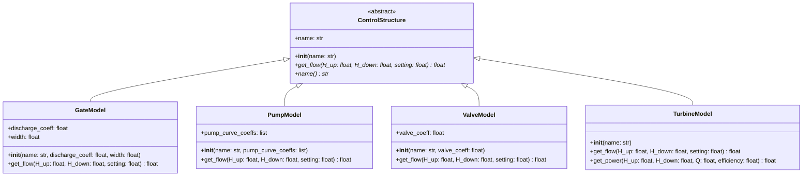
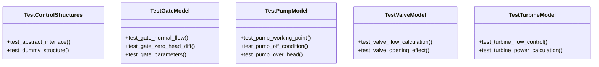

# 水力控制结构定义设计文档

## 概述

本设计文档定义了WaterNet项目中可复用的水力机械物理核心，构建统一的水力控制结构抽象基类和具体实现。通过抽象接口设计，实现对闸门、水泵、阀门、水轮机等不同类型水力控制设备的规范化建模，为复杂水力系统提供标准化的物理对象抽象。

## 技术架构

### 设计理念

采用面向对象的抽象设计模式，通过定义统一的控制结构接口，实现不同水力设备的多态性。每个具体的水力控制设备都继承自抽象基类`ControlStructure`，遵循统一的接口规范，确保系统的可扩展性和维护性。

### 架构层次



## 抽象基类设计

### ControlStructure 接口定义

抽象基类`ControlStructure`作为所有水力控制设备的统一接口，定义了核心的水力计算方法和设备属性访问器。

**核心接口规范**

| 接口方法 | 参数 | 返回值 | 说明 |
|---------|------|--------|------|
| `__init__` | `name: str` | 无 | 构造函数，设置设备名称 |
| `get_flow` | `H_up: float`（上游水头）<br>`H_down: float`（下游水头）<br>`setting: float`（控制设置） | `float` | 计算流量，抽象方法 |
| `name` | 无 | `str` | 设备名称属性访问器 |

**设计约束**

- 所有子类必须实现`get_flow`抽象方法
- `setting`参数语义根据具体设备类型而定
- 流量计算必须考虑水头差的物理约束
- 返回的流量值必须符合物理实际（非负值）

## 具体模型实现

### 闸门模型（GateModel）

实现基于淹没孔口出流理论的闸门水力计算模型。

**物理原理**
- 采用标准孔口出流公式：`Q = C_d × A × √(2g × ΔH)`
- 过水面积：`A = width × opening`
- 流量系数`C_d`考虑收缩系数和流速系数的综合影响

**参数配置**

| 参数 | 类型 | 单位 | 说明 |
|------|------|------|------|
| `discharge_coeff` | `float` | 无量纲 | 流量系数 C_d |
| `width` | `float` | m | 闸门宽度 |

**控制逻辑**
- `setting`表示闸门开度（米）
- 当水头差≤0时，流量为0
- 流量与开度成正比，与水头差的平方根成正比

### 水泵模型（PumpModel）

基于水泵特性曲线的工作点求解模型。

**物理原理**
- 水泵特性曲线：`H = c₀ + c₁Q + c₂Q² + ...`
- 管路特性：`H_sys = H_down - H_up`
- 工作点：水泵曲线与管路特性交点

**数值求解**

```mermaid
flowchart TD
    A[输入: H_up, H_down, setting] --> B{setting == 0?}
    B -->|是| C[返回流量 = 0]
    B -->|否| D[计算管路水头 H_sys = H_down - H_up]
    D --> E{H_sys > 零流量扬程?}
    E -->|是| F[返回流量 = 0]
    E -->|否| G[求解方程: pump_curve(Q) - H_sys = 0]
    G --> H{求解成功?}
    H -->|是| I[返回计算流量 Q]
    H -->|否| J[返回流量 = 0]
```

**参数配置**

| 参数 | 类型 | 说明 |
|------|------|------|
| `pump_curve_coeffs` | `list` | 多项式系数 [c₀, c₁, c₂, ...] |

### 阀门模型（ValveModel）

基于阀门流量特性的简化模型。

**物理原理**
- 流量公式：`Q = C_v × √(ΔH)`
- 流量系数与开度关系：`C_v = K_v × √(setting)`
- 适用于调节阀、球阀等常见阀门类型

**参数配置**

| 参数 | 类型 | 单位 | 说明 |
|------|------|------|------|
| `valve_coeff` | `float` | m²·⁵/s | 阀门全开流量系数 K_v |

### 水轮机模型（TurbineModel）

简化的水轮机流量控制模型，支持功率计算。

**设计特点**
- 流量直接控制模式：`setting`直接表示目标流量
- 功率计算：`P = ρgQHη`（其中ρ=1000 kg/m³，g=9.81 m/s²）
- 适用于水轮机调速器控制场景

**功能接口**

| 方法 | 参数 | 返回值 | 说明 |
|------|------|--------|------|
| `get_flow` | 标准接口参数 | `float` | 返回`setting`值（目标流量） |
| `get_power` | `H_up, H_down, Q, efficiency` | `float` | 计算发电功率（kW） |

## 测试策略

### 单元测试框架

采用pytest框架进行单元测试，确保每个控制结构模型的功能正确性和数值稳定性。



### 测试用例设计原则

**边界条件测试**
- 零水头差情况
- 极限开度设置
- 无效参数输入

**数值精度验证**
- 手工计算对比验证
- 物理约束检查（如能量守恒）
- 数值稳定性测试

**异常处理测试**
- 无效初始化参数
- 求解失败情况
- 物理不合理输入

### 验证案例

**闸门模型验证**
- 验证案例：宽度5m，开度1.5m，流量系数0.8，水头差2m
- 期望流量：Q = 0.8 × (5.0 × 1.5) × √(2 × 9.81 × 2.0) ≈ 37.6 m³/s

**水泵模型验证**
- 特性曲线：H = 100 - 0.1Q²
- 验证案例：H_up=20m，H_down=110m
- 工作点求解：100 - 0.1Q² = 90，解得Q = 10 m³/s

**阀门模型验证**
- 验证案例：K_v=25.0，开度0.25，水头差4m
- 期望流量：Q = (25.0 × √0.25) × √4.0 = 25.0 m³/s

**水轮机模型验证**
- 验证案例：水头100m，流量85 m³/s，效率90%
- 期望功率：P = 9.81 × 85.0 × 100 × 0.9 = 75046.5 kW

## 实现要点

### 数值计算考虑

**求解器选择**
- 水泵模型采用scipy.optimize.newton或brentq进行方程求解
- 设置合理的求解容差和迭代次数限制
- 提供求解失败时的回退机制

**物理约束检查**
- 流量非负性约束
- 水头差合理性检查
- 参数有效性验证

### 代码组织结构

```
waternet/physical_objects/
├── __init__.py
└── control_structure.py
    ├── ControlStructure (抽象基类)
    ├── GateModel
    ├── PumpModel
    ├── ValveModel
    └── TurbineModel

tests/unit/
└── test_control_structures.py
    ├── TestControlStructures
    ├── TestGateModel
    ├── TestPumpModel
    ├── TestValveModel
    └── TestTurbineModel
```

### 依赖管理

**核心依赖**
- `abc`模块：抽象基类实现
- `math`模块：数学函数（平方根）
- `scipy.optimize`：数值求解器
- `typing`：类型提示支持

**测试依赖**
- `unittest`：测试框架基础
- `pytest`：高级测试功能
- 遵循项目现有的测试配置和标记体系

## 扩展性设计

### 接口兼容性

设计的抽象接口具有良好的扩展性，便于添加新的水力控制设备类型：

**扩展步骤**
1. 继承ControlStructure抽象基类
2. 实现get_flow方法的具体物理模型
3. 定义设备特有的参数和方法
4. 编写相应的单元测试

**潜在扩展类型**
- 溢洪道模型（SpillwayModel）
- 虹吸管模型（SiphonModel）
- 节流孔板模型（OrificePlateModel）
- 可变几何控制结构

### 参数化配置

支持通过配置文件或参数字典进行设备参数的批量设置，便于系统级的水力网络建模和参数敏感性分析。