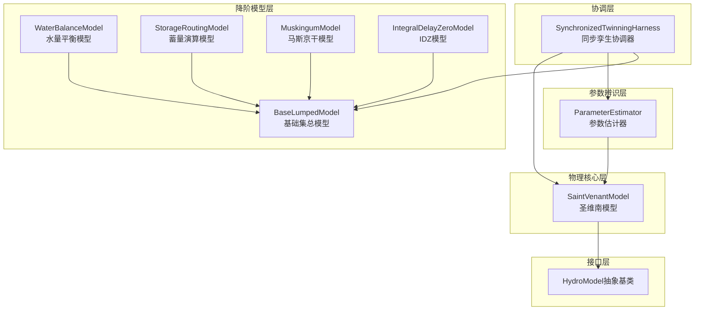
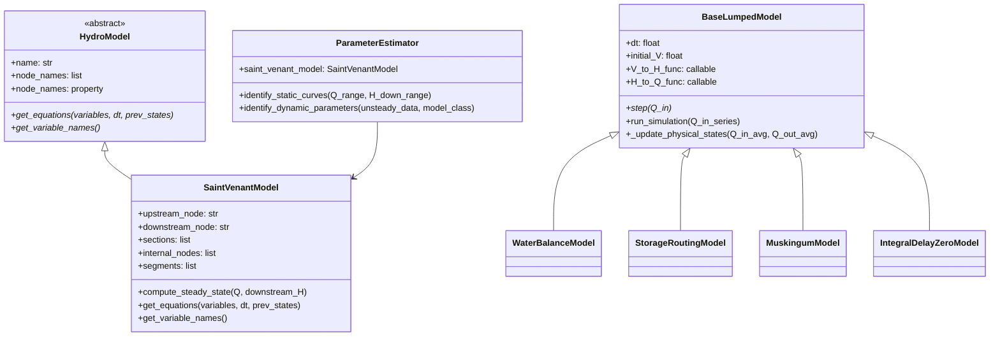
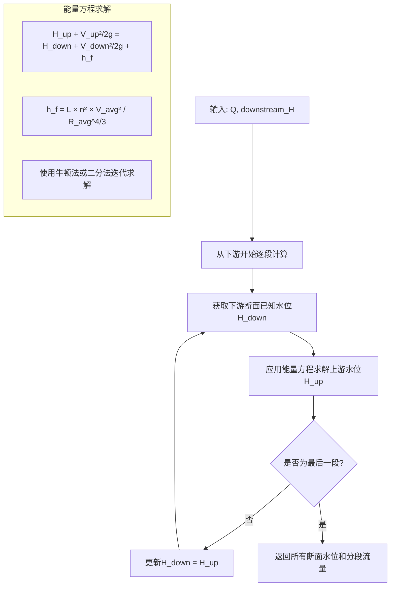
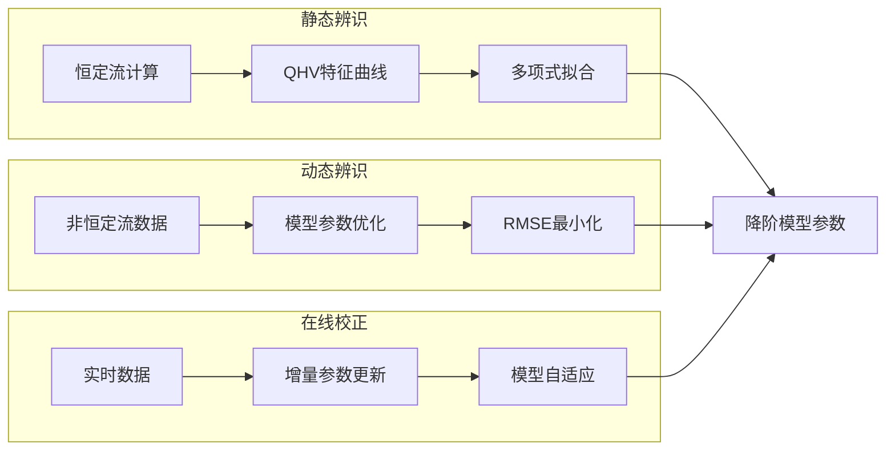
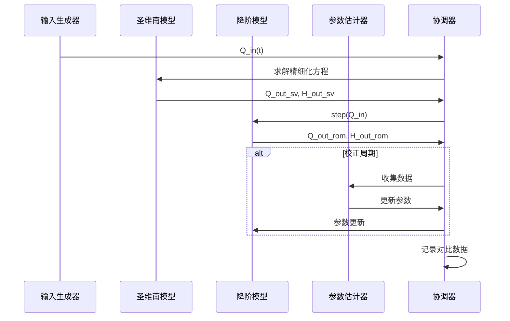

# 明渠模型接口定义设计文档

## 概述

本设计文档定义了WaterNet输水系统中明渠组件的核心接口架构。该架构旨在构建一个功能完备的明渠同步孪生系统，通过高精度的水力模型作为"物理实体"，结合在线参数辨识技术，持续校正多个降阶模型，实现精细化建模与高效数字孪生的有机结合。

### 系统目标

- 建立统一的水力模型接口规范，支持多种模型类型的无缝集成
- 实现基于圣维南方程组的高精度明渠物理模型
- 构建多元化的降阶模型库，满足不同精度和效率需求
- 提供在线参数辨识能力，实现模型的自适应校正
- 建立同步孪生协调机制，实现物理模型与数字孪生的实时同步

### 开发策略

采用"分层构建，最终集成"的模块化开发策略：

1. **接口层**：定义统一的模型接口规范
2. **物理核心层**：实现高精度圣维南模型
3. **降阶模型层**：构建多种经典降阶算法
4. **参数辨识层**：实现多模式参数估计器
5. **协调层**：集成同步孪生系统

## 技术栈与依赖

### 核心依赖库
- **numpy**: 数值计算基础
- **pandas**: 数据处理与结果记录
- **scipy**: 科学计算与优化求解
- **matplotlib**: 结果可视化

### 数学计算依赖
- **scipy.optimize**: 非线性方程组求解、参数优化
- **numpy.polyfit**: 多项式拟合
- **scipy.signal**: 信号处理与系统仿真

## 系统架构

### 整体架构图



### 核心组件关系



## 接口定义

### HydroModel抽象基类

HydroModel作为所有紧耦合水力模型的基础接口，定义了统一的模型交互规范。

#### 接口规范

| 方法/属性 | 类型 | 描述 |
|----------|------|------|
| `__init__(name, node_names)` | 构造函数 | 初始化模型标识符和拓扑连接 |
| `get_equations(variables, dt, prev_states)` | 抽象方法 | 返回模型方程残差字典 |
| `get_variable_names()` | 抽象方法 | 返回模型引入的变量名列表 |
| `node_names` | 属性 | 返回模型连接的节点名称列表 |

#### 数据结构定义

**variables字典结构**:
```
{
    'H_Node1': 100.5,     # 节点水位
    'Q_Pipe1': 1.0,       # 管段流量
    'H_Reach1_internal_0': 98.2  # 内部节点水位
}
```

**prev_states字典结构**:
```
{
    'V_Reservoir1': 50000,  # 蓄水量
    'H_Node1': 99.8,        # 上一时步水位
    'Q_Pipe1': 0.95         # 上一时步流量
}
```

**方程残差字典结构**:
```
{
    'continuity_seg_0': 0.01,    # 连续性方程残差
    'momentum_seg_0': -0.05,     # 动量方程残差
    'balance_internal_0': 0.002  # 内部节点平衡残差
}
```

### SaintVenantModel设计规范

#### 几何与拓扑管理

SaintVenantModel基于断面列表自动生成内部计算节点和分段结构。

**断面数据结构**:
| 字段 | 类型 | 描述 |
|------|------|------|
| `mileage` | float | 里程桩号 |
| `elevation` | float | 底高程 |
| `roughness` | float | 糙率系数 |
| `area_func` | callable | 面积函数A(H) |
| `top_width_func` | callable | 水面宽函数T(H) |

**分段属性计算**:
| 属性 | 计算方法 | 说明 |
|------|----------|------|
| `length` | `abs(sections[i+1]['mileage'] - sections[i]['mileage'])` | 分段长度 |
| `slope` | `(sections[i]['elevation'] - sections[i+1]['elevation']) / length` | 平均坡度 |
| `roughness` | `(sections[i]['roughness'] + sections[i+1]['roughness']) / 2` | 平均糙率 |

#### 内部节点命名规则

```
内部节点名称 = f'{model_name}_internal_{index}'
分段流量变量 = f'Q_{model_name}_seg_{index}'
内部节点水位变量 = f'H_{model_name}_internal_{index}'
```

#### 恒定流求解算法

使用标准步进法求解恒定流水面线：



#### 非恒定流方程构建

采用Preissmann四点隐式差分格式：

**连续性方程残差**:
```
∂A/∂t + ∂Q/∂x = 0
```

**动量方程残差**:
```
∂Q/∂t + ∂(Q²/A)/∂x + gA∂H/∂x + gA(S_f - S_0) = 0
```

**内部节点水量平衡**:
```
Q_in - Q_out = 0
```

## 降阶模型库架构

### BaseLumpedModel统一框架

所有降阶模型继承自BaseLumpedModel，提供统一的仿真接口和状态管理。

#### 核心方法设计

| 方法 | 输入 | 输出 | 职责 |
|------|------|------|------|
| `step(Q_in)` | 入流量 | `{'Q_out': float, 'H_out': float, 'V': float}` | 单步演进 |
| `run_simulation(Q_in_series)` | 入流序列 | DataFrame | 批量仿真 |
| `_update_physical_states(Q_in_avg, Q_out_avg)` | 平均流量 | None | 状态更新 |

### 模型类型与算法

#### 水量平衡模型 (WaterBalanceModel)
- **基本假设**: 入流等于出流，无滞后效应
- **核心方程**: `Q_out = Q_in`
- **适用场景**: 基准对比、快速估算

#### 蓄量演算模型 (StorageRoutingModel)  
- **基本原理**: 基于蓄量连续性方程
- **核心方程**: `V_t = V_{t-1} + (Q_in_avg - Q_out_avg) × dt`
- **状态关系**: 通过V-H和H-Q关系曲线计算出流

#### 马斯京干模型 (MuskingumModel)
- **基本方程**: `Q_out = C0×Q_in + C1×Q_in_prev + C2×Q_out_prev`
- **参数**: K(滞时常数), x(权重系数)
- **系数计算**:
  - `C0 = (-Kx + 0.5dt) / (K - Kx + 0.5dt)`
  - `C1 = (Kx + 0.5dt) / (K - Kx + 0.5dt)`
  - `C2 = (K - Kx - 0.5dt) / (K - Kx + 0.5dt)`

#### IDZ模型 (IntegralDelayZeroModel)
- **传递函数**: `G(s) = (τs + 1)e^(-Ts) / (αs + 1)`
- **参数**: τ(时间常数), T(延迟时间), α(零点系数)
- **实现方式**: 离散化传递函数进行时域仿真

### 降阶模型对比矩阵

| 模型类型 | 参数数量 | 计算复杂度 | 物理意义 | 适用条件 |
|----------|----------|------------|----------|----------|
| 水量平衡 | 0 | 极低 | 无滞后 | 短渠道或即时响应 |
| 蓄量演算 | 2-3 | 低 | 蓄泄关系 | 具有明显蓄水特性 |
| 马斯京干 | 2 | 低 | 河道演进 | 天然河道或明渠 |
| IDZ模型 | 3 | 中 | 系统响应 | 复杂系统动态特性 |

## 参数辨识策略

### 多模式辨识框架



### 静态特征辨识

通过系统的恒定流计算，建立QHV静态关系曲线。

#### 辨识流程

1. **测试点生成**: 在预定义的流量和水位范围内生成网格点
2. **恒定流求解**: 对每个测试点调用`compute_steady_state`
3. **数据收集**: 记录上下游水位、流量和总蓄量
4. **曲线拟合**: 使用多项式拟合V-H和Q-H关系

#### 拟合关系式

**蓄量-水位关系**: `V = a₀ + a₁H + a₂H² + ... + aₙHⁿ`

**流量-水位关系**: `Q = b₀ + b₁H + b₂H² + ... + bₘHᵐ`

### 动态参数辨识

基于非恒定流仿真数据，通过优化算法辨识降阶模型参数。

#### 目标函数设计

```
minimize: RMSE = √(∑(Q_pred - Q_obs)² / N)
```

其中：
- `Q_pred`: 降阶模型预测出流
- `Q_obs`: 精细化模型计算出流  
- `N`: 数据点数量

#### 约束条件

| 模型类型 | 参数约束 |
|----------|----------|
| 马斯京干 | `0 < K < 时间跨度`, `0 ≤ x ≤ 0.5` |
| IDZ模型 | `τ > 0`, `T ≥ 0`, `α > 0` |
| 蓄量演算 | 多项式系数物理合理性 |

## 同步孪生协调机制

### 协调器架构设计

SynchronizedTwinningHarness作为顶层协调器，实现精细化模型与降阶模型的同步运行。



### 在线校正策略

#### 校正触发条件

- **周期触发**: 每N个时间步执行一次
- **误差触发**: 当预测误差超过阈值时触发
- **状态变化**: 检测到系统特性变化时触发

#### 校正算法流程

1. **数据窗口**: 收集最近M个时间步的数据
2. **误差分析**: 计算预测误差的统计特征
3. **参数调整**: 基于误差反馈调整模型参数
4. **稳定性检查**: 验证参数更新的稳定性

### 性能监控指标

| 指标类型 | 计算公式 | 物理意义 |
|----------|----------|----------|
| 流量RMSE | `√(∑(Q_rom - Q_sv)² / N)` | 流量预测精度 |
| 水位RMSE | `√(∑(H_rom - H_sv)² / N)` | 水位预测精度 |
| 相关系数 | `corr(Q_rom, Q_sv)` | 响应相似性 |
| 延迟误差 | `argmax(cross_corr) × dt` | 时间延迟偏差 |

## 测试策略

### 单元测试层级

#### 接口测试
- **HydroModel抽象基类**: 验证接口定义完整性
- **DummyModel实现**: 测试抽象方法调用机制

#### 模型测试
- **SaintVenantModel**: 几何构建、恒定流求解、非恒定流方程
- **降阶模型库**: 各模型算法正确性和数值稳定性
- **参数估计器**: 静态辨识和动态辨识精度

### 集成测试场景

#### 仿真测试平台
- **单一渠道仿真**: ChannelSimulationHarness验证动态响应
- **多模型对比**: 横向比较不同模型的预测性能
- **参数敏感性**: 分析参数变化对模型行为的影响

#### 同步孪生测试
- **实时同步**: 验证精细化模型与降阶模型的同步运行
- **在线校正**: 测试参数自适应更新机制
- **鲁棒性**: 在扰动条件下验证系统稳定性

### 验证基准

#### 理论验证
- **解析解对比**: 对于简单几何的恒定流，与解析解对比
- **标准算例**: 使用文献中的经典算例验证
- **数值收敛性**: 验证时间步长和空间步长的收敛性

#### 物理合理性
- **质量守恒**: 验证长期仿真的质量平衡
- **能量损失**: 确认摩擦损失的物理合理性
- **边界条件**: 测试各种边界条件的处理正确性

## 数据流与存储

### 仿真数据结构

#### 时间序列数据格式
| 列名 | 数据类型 | 描述 |
|------|----------|------|
| `time` | float | 仿真时间 |
| `Q_in` | float | 上游入流 |
| `Q_out_sv` | float | 圣维南模型出流 |
| `Q_out_rom` | float | 降阶模型出流 |
| `H_upstream` | float | 上游水位 |
| `H_downstream` | float | 下游水位 |

#### 参数记录格式
```
{
    'model_type': 'MuskingumModel',
    'parameters': {'K': 3600, 'x': 0.2},
    'rmse': 0.05,
    'timestamp': '2024-01-01T10:00:00'
}
```

### 文件输出规范

#### 仿真结果文件
- **文件名**: `channel_step_response.csv`
- **格式**: CSV with header
- **编码**: UTF-8

#### 孪生对比文件  
- **文件名**: `twinning_results.csv`
- **内容**: 精细化模型与降阶模型对比数据
- **可视化**: 自动生成对比图表

## 扩展性设计

### 模型接口扩展

HydroModel接口支持新模型类型的无缝集成：

- **新物理模型**: 可实现其他偏微分方程模型
- **混合模型**: 支持多物理过程耦合模型  
- **随机模型**: 可集成随机过程和不确定性

### 降阶模型扩展

BaseLumpedModel框架支持新算法开发：

- **机器学习模型**: 神经网络、支持向量机等
- **数据驱动模型**: 基于历史数据的统计模型
- **混合算法**: 物理约束与数据驱动结合

### 参数辨识扩展

ParameterEstimator支持新的辨识方法：

- **贝叶斯辨识**: 考虑参数不确定性
- **多目标优化**: 同时优化多个性能指标
- **实时学习**: 在线机器学习算法
