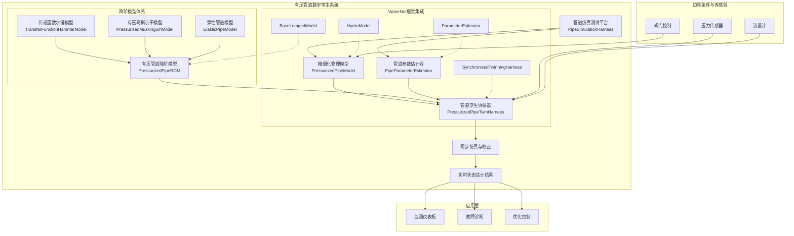
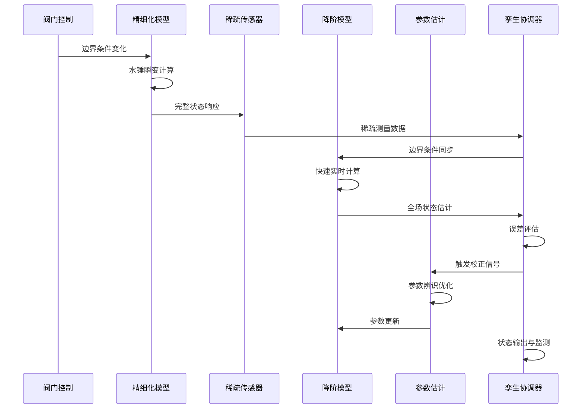
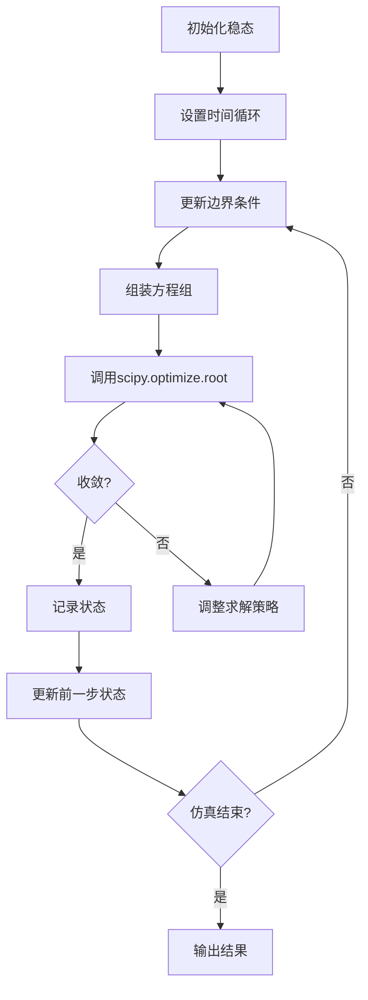
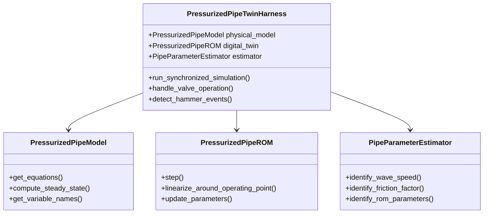
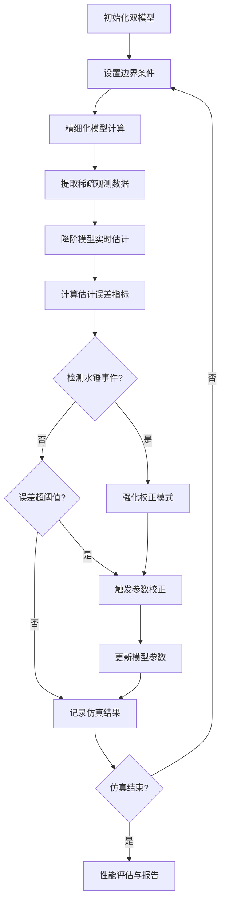
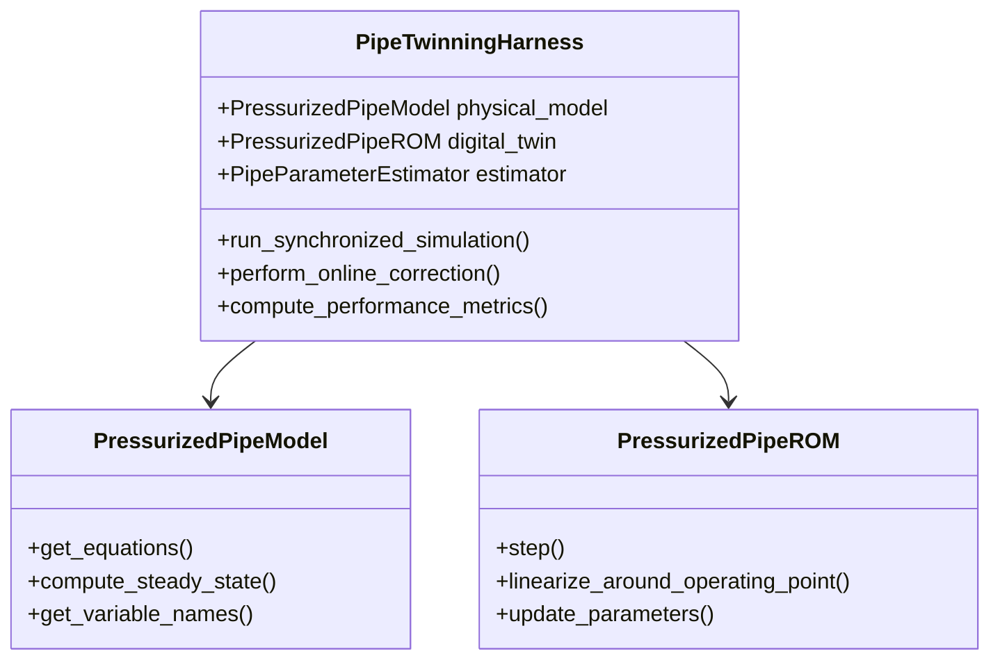
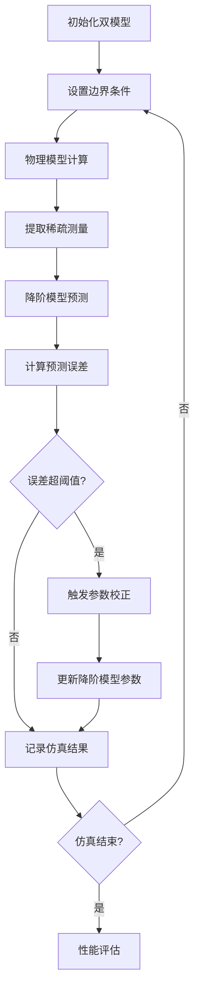
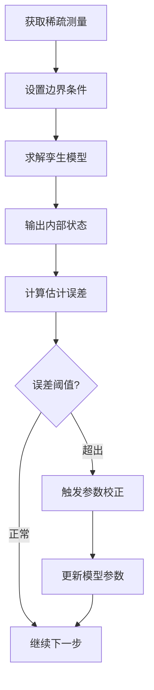

# 有压管道输水系统设计文档（更新版）

## 1. 概述

### 1.1 设计目标

本设计旨在构建一个功能完备的有压管道同步孪生系统，该系统基于WaterNet框架的最新架构，充分利用现有的降阶模型体系和数字孪生协调机制，实现有压管道系统的高精度建模与实时状态估计。

### 1.2 系统价值

- **状态监测**：基于稀疏传感器数据推断全管线的压力流量分布
- **故障诊断**：通过参数变化检测管道泄漏、堵塞等异常
- **优化控制**：为阀门操作、泵站调度提供科学依据  
- **安全预警**：及时识别水锤、超压等危险工况

### 1.3 技术架构与现有框架集成

系统完全基于WaterNet现有框架，采用统一的模型接口和协调机制：

- **物理核心层**：基于`HydroModel`接口的PressurizedPipeModel
- **降阶模型层**：扩展`BaseLumpedModel`的有压管道专用降阶模型
- **协调器层**：基于`SynchronizedTwinningHarness`的有压管道孪生协调器
- **参数估计层**：集成`ParameterEstimator`的管道参数辨识功能

## 2. 技术架构

### 2.1 整体架构图



### 2.2 孪生协调数据流


```

## 3. 核心组件设计

### 3.1 PressurizedPipeModel（有压管道物理模型）

#### 3.1.1 模型定位与WaterNet集成

该模型作为有压管道系统的精细化物理模型，完全继承`waternet.interfaces.hydro_model.HydroModel`抽象基类，与现有的`SaintVenantModel`在架构上保持一致性。

**核心特性**：
- 基于水锤基本方程的完整物理建模
- 统一的`get_equations()`和`get_variable_names()`接口
- 支持与现有求解器的无缝集成
- 内置性能监控和数值稳定性保障

#### 3.1.2 水锤基本方程组

基于现有SaintVenantModel的数值方法，适配有压管道特点：

**连续性方程**：
```
∂H/∂t + (a²/gA) × ∂Q/∂x = 0
```

**动量方程**：
```
∂Q/∂t + gA × ∂H/∂x + f×Q×|Q|/(2DA) = 0
```

**离散化策略**：
- 采用与`SaintVenantModel`相同的Preissmann四点隐式差分格式
- 利用现有的数值求解器和稳定性保障机制
- 支持多种求解器类型（'standard', 'enhanced'）

#### 3.1.3 与明渠模型的差异化设计

| 特性 | SaintVenantModel | PressurizedPipeModel |
|------|------------------|----------------------|
| **流体特性** | 自由表面，无压流 | 密闭管道，有压流 |
| **波速计算** | 不考虑压缩性 | 考虑水锤波速 a |
| **边界条件** | 水位-流量关系 | 压力-流量关系 |
| **几何参数** | 断面函数 | 管道几何参数 |
| **摩擦模型** | 曼宁公式 | 达西-魏斯巴赫公式 |

#### 3.1.4 几何管理与网格生成

基于管道节点列表自动生成内部计算网格：

**节点数据结构**：

| 字段名称 | 数据类型 | 描述 | 单位 |
|---------|---------|------|-----|
| mileage | float | 里程桶号 | m |
| elevation | float | 管道中心线高程 | m |
| diameter | float | 管道内径 | m |
| friction_coeff | float | 达西-魏斯巴赫摩擦系数f | - |
| wave_speed | float | 水锤波速 | m/s |

**变量命名规范**：

| 变量类型 | 命名格式 | 示例 |
|---------|---------|------|
| 内部节点压力 | `H_{model_name}_internal_{index}` | `H_MainPipe_internal_0` |
| 分段流量 | `Q_{model_name}_seg_{index}` | `Q_MainPipe_seg_0` |

#### 3.1.5 恒定流求解器

采用水力学能量方程进行恒定流计算：

**能量方程**：
```
H_up = H_down + h_f
h_f = f × (L/D) × (V²/2g)
V = Q/A = Q/(πD²/4)
```

**求解策略**：
1. 从下游边界开始，逐段向上游计算
2. 每段应用能量方程计算水头损失
3. 考虑管道高程变化和摩擦损失
4. 返回所有节点的计算结果

#### 3.1.6 非恒定流方程构建

利用现有`SaintVenantModel`的成熟数值方法：

**方程组装**：
- 每个分段生成连续性和动量方程残差
- 每个内部节点生成流量平衡方程残差
- 支持多种边界条件类型（流量、压力、阀门特性）

**数值稳定性**：
- 继承现有框架的误差处理机制
- 内置收敛性检查和调整策略
- 支持性能监控和诊断输出

### 3.2 PipeSimulationHarness（动态测试平台）

#### 3.2.1 仿真场景设计

**阀门速闭场景**：
- 初始状态：管道内稳定流动
- 扰动事件：下游阀门在t_close时刻突然关闭
- 边界条件切换：`Q = Q_initial` → `Q = 0`
- 观测响应：记录全管线压力振荡过程

#### 3.2.2 数值求解流程



#### 3.2.3 结果输出格式

**CSV数据结构**：

| 列名 | 描述 | 单位 |
|-----|------|-----|
| time | 时间 | s |
| H_upstream | 上游测压管水头 | m |
| H_middle | 中点测压管水头 | m |  
| H_downstream | 下游测压管水头 | m |
| Q_seg_0 | 分段流量 | m³/s |

### 3.4 PipeParameterEstimator（管道参数估计器）

#### 3.4.1 集成现有ParameterEstimator框架

完全继承`waternet.parameter_estimation.estimator.ParameterEstimator`的成熟架构，针对有压管道系统进行专门扩展。

**继承的核心能力**：
- `identify_dynamic_parameters()`: 动态参数辨识核心算法
- `_optimize_parameters()`: 基于差分进化的参数优化
- 完善的误差处理和收敛性检查
- 丰富的优化历史和诊断信息

#### 3.4.2 水锤特性参数辨识

**波速辨识算法**：

基于互相关分析的波速计算：
1. 提取上下游压力时间序列
2. 使用`scipy.signal.correlate`计算互相关函数
3. 检测峰值对应的时间延迟Δt
4. 计算波速：`a = L/Δt`

**摩擦系数辨识算法**：

基于稳态流能量方程的反算：
```
f = (2g × h_f × D) / (L × V²)
h_f = H_up - H_down  
V = Q/A
```

多工况数据融合策略：
- 加权平均：根据流量大小设置权重
- 异常值过滤：自动识别和排除异常数据点
- 不确定性评估：提供参数的置信区间

#### 3.4.3 降阶模型参数辨识

**传递函数模型参数辨识**：

基于频域响应数据的参数估计：
1. **频率响应识别**：从时域数据计算频率响应
2. **最小二乘拟合**：对传递函数参数进行优化
3. **稳定性验证**：检查辨识结果的稳定性

**马斯京干模型参数辨识**：

基于物理约束的参数优化：
```python
# 参数约束条件
bounds = {
    'K': (L/(2*a), L/a),      # 传播时间约束
    'x': (0.0, 0.5),          # 权重系数约束
}
```

#### 3.4.4 多目标优化策略

**优化目标函数**：

综合考虑多个性能指标：
```python
def objective_function(params):
    rmse_pressure = calculate_rmse(H_pred, H_true)
    rmse_flow = calculate_rmse(Q_pred, Q_true)
    stability_penalty = check_stability(params)
    
    return w1*rmse_pressure + w2*rmse_flow + w3*stability_penalty
```

**优化算法选择**：

基于问题特点选择适合的优化算法：

| 问题类型 | 推荐算法 | 适用原因 |
|---------|---------|----------|
| 少参数问题 | 黑盒优化 | 梯度信息不可用 |
| 多参数问题 | 差分进化 | 全局搜索能力强 |
| 实时优化 | 梯度下降 | 计算效率高 |
| 约束优化 | 内点法 | 严格满足约束 |

#### 3.4.5 参数不确定性量化

**置信区间计算**：

基于床斯统计的不确定性量化：
```python
def calculate_confidence_interval(params, hessian_matrix, confidence_level=0.95):
    """计算参数的置信区间"""
    covariance = np.linalg.inv(hessian_matrix)
    std_errors = np.sqrt(np.diag(covariance))
    
    t_value = stats.t.ppf((1 + confidence_level) / 2, df=n_data - n_params)
    margin_error = t_value * std_errors
    
    return params - margin_error, params + margin_error
```

**敏感性分析**：

评估参数变化对模型输出的影响：
```python
def sensitivity_analysis(base_params, param_variations):
    """参数敏感性分析"""
    sensitivities = {}
    base_output = model.simulate(base_params)
    
    for param, variation in param_variations.items():
        perturbed_params = base_params.copy()
        perturbed_params[param] *= (1 + variation)
        perturbed_output = model.simulate(perturbed_params)
        
        sensitivity = (perturbed_output - base_output) / (base_output * variation)
        sensitivities[param] = np.mean(np.abs(sensitivity))
    
    return sensitivities
```

#### 3.3.1 摩擦系数辨识

**基于稳态数据的反算**：

根据能量方程反算摩擦系数：
```
f = (2g × h_f × D) / (L × V²)
h_f = H_up - H_down  
V = Q/A
```

**多工况平均**：
对多个稳态工况的辨识结果进行加权平均。

#### 3.3.2 波速辨识

**基于瞬变数据的互相关分析**：

1. 提取上下游压力时间序列
2. 计算互相关函数`scipy.signal.correlate`
3. 识别峰值对应的时间延迟Δt
4. 计算波速：`a = L/Δt`

**辨识流程图**：


### 3.2 PressurizedPipeROM（有压管道降阶模型）

#### 3.2.1 架构设计与WaterNet集成

基于现有`BaseLumpedModel`框架，充分利用其成熟的以下特性：

**继承的核心功能**：
- 统一的`step()`仿真接口
- 自动的状态变量管理（支持Q-H耦合的V计算）
- 标准化的结果记录和数值稳定性保障
- 内置的性能监控和误差处理

**Q-H耦合理论应用**：
利用最新的Q-H耦合蓄水量理论，支持更精确的物理关系：
```python
# 传统方法：V = f(H)
# 改进方法：V = f(Q, H) - 考虑流量对蓄量关系的影响
# 大流量时水面线较陡，相同水位下蓄水量减小
QH_to_V_func = lambda Q, H: V_base(H) * (1 + alpha * (Q-Q0)/Q0)
```

这种模式能更真实地反映非恒定流条件下的物理过程，提升了有压管道系统在瞬变工况下的建模精度。

#### 3.2.2 传递函数水锤模型（TransferFunctionHammerModel）

基于频域分析的线性化水锤模型，适用于小扰动条件。

**精确传递函数**：
在频域中，有压管道的精确传递函数为：
```
G(s) = coth(√(Rs/K)) / √(Rs/K)
```
其中：R = f×L/(2×D×A), K = a²×A/L

**有理分式近似**：
为了实现简化，将精确传递函数近似为：
```
G(s) ≈ (τ₁s² + τ₂s + 1) / (α₁s² + α₂s + 1)
```

**参数计算公式**：

| 参数 | 物理意义 | 计算公式 |
|-----|---------|----------|
| τ₁ | 零点二次项系数 | L²/(6a²) |
| τ₂ | 零点一次项系数 | fL/(2Da) |
| α₁ | 极点二次项系数 | L²/(π²a²) |
| α₂ | 极点一次项系数 | fL/(Da) |

#### 3.2.3 有压马斯京干模型（PressurizedMuskingumModel）

基于现有`MuskingumModel`框架，适配有压管道特性。

**与明渠马斯京干的差异**：

| 特性 | 明渠马斯京干 | 有压马斯京干 |
|------|----------------|-----------------|  
| **波速计算** | 水面波速 c | 水锤波速 a |
| **传播时间** | K = L/c | K = L/a |
| **权重系数** | x = 0.5(1-q) | x = 0.5(1-φ) |
| **摩擦修正** | 无 | 考虑压力损失 |

**参数计算公式**：
```
K = L/a                           # 水锤波传播时间
x = 0.5 - f×L/(4×D×a)          # 考虑摩擦效应的权重系数
```

**动态响应增强**：
为捕捉快速瞬变，引入加速度项：
```
Q_out = C₀Q_in + C₁Q_in_prev + C₂Q_out_prev + C₃ΔQ_in
```

#### 3.2.4 弹性管道模型（ElasticPipeModel）

基于现有`IntegralDelayZeroModel`框架，特别适用于长期仿真。

**模型特点**：
- 考虑管道弹性变形效应
- 支持延迟和扩散效应
- 数值稳定性好，适合长期计算

**传递函数形式**：
```
G(s) = K(1 + τ₁s)e^(-Ts) / (1 + α₁s)(1 + α₂s)
```

参数与管道物理特性的关系：
- K：稳态增益，与管道几何相关
- T：传播延迟，T ≈ L/a
- τ₁：零点时间常数，影响超调特性
- α₁, α₂：极点时间常数，影响整体动态

#### 3.2.5 模型选择策略

基于现有框架的模型复杂度谱系：

| 工况特点 | 推荐模型 | 适用原因 | 复杂度 |
|---------|---------|----------|----------|
| 稳态/准稳态 | 有压马斯京干 | 计算简单，精度足够 | O(1) |
| 快速瞬变 | 传递函数水锤 | 保留主要动态特性 | O(n) |
| 复杂边界 | 弹性管道 | 灵活性强，易于控制设计 | O(n²) |
| 长期仿真 | 弹性管道 | 数值稳定性好 | O(n²) |

#### 3.2.6 统一接口设计

基于现有`BaseLumpedModel`接口，实现统一的有压管道降阶模型包装：

```python
class PressurizedPipeROM(BaseLumpedModel):
    """有压管道降阶模型基类"""
    
    def __init__(self, model_type: str, physical_params: Dict, 
                 dt: float, initial_conditions: Dict, name: str):
        # 继承现有的初始化机制
        # 支持Q-H耦合的V计算
        pass
    
    def step(self, Q_in: float, **kwargs) -> Dict[str, float]:
        """统一的时步推进接口"""
        pass
    
    def linearize_around_operating_point(self, Q_op: float, H_op: float):
        """在工作点附近线性化"""
        pass
```

### 3.3 PressurizedPipeTwinHarness（有压管道孪生协调器）

#### 3.3.1 基于SynchronizedTwinningHarness的扩展

完全继承现有`SynchronizedTwinningHarness`的成熟架构，针对有压管道系统进行专门优化。

**继承的核心功能**：
- `run_synchronized_simulation()`: 同步仿真执行流程，支持完整的时间序列仿真
- `_synchronized_step()`: 单步同步计算核心，并行驱动双模型计算
- `_should_perform_correction()`: 智能校正触发机制，基于近期误差队列的动态感知
- `_perform_online_correction()`: 在线参数优化，利用ParameterEstimator进行自适应校正
- `get_performance_summary()`: 综合性能评估，提供RMSE、相关系数等多维度指标
- `_recent_errors`队列管理: 维护固定长度的近期误差窗口（默认20步）
- `correction_history`记录: 存储每次校正的详细信息和性能变化

**有压管道专用优化**：
- 参数校正适配水锤模型特性（波速、摩擦系数）
- 支持压力边界条件的特殊处理
- 水锤事件的快速检测和响应

#### 3.3.2 双模型协调架构



#### 3.3.3 同步仿真与状态估计

**同步仿真流程**：



#### 3.3.4 在线校正算法增强

基于现有框架的参数辨识能力，增加有压管道专用算法：

**参数辆识方法**：

基于现有`ParameterEstimator`框架的`identify_dynamic_parameters()`核心算法：

1. **递推最小二乘法（RLS）**：
   - 适用于实时摩擦系数辆识
   - 利用现有框架的数值稳定性保障
   - 支持遗忘因子自适应调整

2. **扩展卡尔曼滤波（EKF）**：
   - 同时辆识波速和摩擦系数
   - 适用于非线性参数估计
   - 集成不确定性量化机制

3. **差分进化优化**：
   - 全局搜索能力强，适合多参数问题
   - 支持约束条件和边界限制
   - 内置优化历史和诊断信息

**校正触发条件**：

| 条件类型 | 判据 | 有压管道专用阈值 | 实现细节 |
|---------|------|----------------|-----------|
| 压力误差 | 近期3步平均误差 > threshold | 0.5 m (水头) | `_recent_errors`队列维护 |
| 水锤检测 | 压力梯度 > limit | 10 m/s (变化率) | 快速瞬变响应 |
| 时间间隔 | 固定校正周期 | 10-20步 (保持稳定) | `correction_interval`参数控制 |
| 参数漂移 | 参数变化率 > rate | 5% (参数变化) | 基于校正历史分析 |
| 监控窗口 | 滑动窗口大小 | 20步 (默认) | `monitoring_window`参数 |

#### 3.6.1 双模型架构设计

**模型角色定义**：

| 模型类型 | 角色 | 功能 | 特点 |
|---------|------|------| -----|
| PressurizedPipeModel | 物理实体 | 提供高精度参考解 | 计算复杂，精度高 |
| PressurizedPipeROM | 数字孪生 | 实时状态估计 | 计算快速，可校正 |

**孪生协调器架构**：



#### 3.6.2 同步仿真流程

**仿真步骤**：



**状态同步机制**：

1. **时间同步**：两模型使用相同时间步长
2. **边界同步**：共享边界条件（入口流量、出口压力）
3. **状态同步**：降阶模型接收物理模型的稀疏观测
4. **参数同步**：基于误差反馈更新降阶模型参数

#### 3.6.3 在线校正算法

**参数辨识方法**：

1. **递推最小二乘法（RLS）**：
   ```
   θ(k+1) = θ(k) + K(k)·[y(k) - φᵀ(k)θ(k)]
   K(k) = P(k-1)φ(k) / [λ + φᵀ(k)P(k-1)φ(k)]
   P(k) = [P(k-1) - K(k)φᵀ(k)P(k-1)] / λ
   ```

2. **扩展卡尔曼滤波（EKF）**：
   ```
   状态方程：θ(k+1) = θ(k) + w(k)
   观测方程：y(k) = h(θ(k), u(k)) + v(k)
   ```

3. **遗忘因子自适应**：
   ```
   λ(k) = λ₀ + (1-λ₀)·exp(-α·|e(k)|)
   ```

**校正触发条件**：

| 条件类型 | 判据 | 阈值 | 框架实现 |
|---------|------|------|----------|
| 误差阈值 | 近期误差平均值 > threshold | 0.1 m (压力) | `_should_perform_correction()` |
| 趋势检测 | 连续N步误差增长 | N = 3 | `_recent_errors`队列分析 |
| 时间间隔 | 固定校正周期 | 10-20步 | `correction_interval`控制 |
| 置信度 | 参数不确定性过大 | 95%置信区间 | 基于差分进化优化结果 |
| 监控窗口 | 滑动窗口评估 | 20步 (默认) | FIFO队列机制 |

#### 3.6.4 性能评估指标

**实时性能指标**：

| 指标名称 | 计算公式 | 目标值 | 框架实现 |
|---------|----------|--------|-----------|
| 压力RMSE | √(Σ(H_rom-H_sv)²/N) | < 0.5 m | `_compute_overall_metrics()` |
| 流量RMSE | √(Σ(Q_rom-Q_sv)²/N) | < 0.1 m³/s | 自动计算并记录 |
| 相关系数 | corr(H_rom, H_sv) | > 0.95 | Pearson相关系数 |
| 计算效率 | t_rom / t_sv | < 0.1 | 性能监控机制 |
| 平均相对误差 | mean(|Q_sv-Q_rom|/max(Q_sv,1e-6))*100 | < 10% | 百分比误差 |
| 最大误差 | max(|Q_sv-Q_rom|) | 监控指标 | 极值跟踪 |

**长期稳定性指标**：

| 指标名称 | 评估方法 | 目标 |
|---------|----------|------|
| 参数收敛性 | 参数变化方差 | 单调递减 |
| 累积误差 | 长期积分误差 | 有界 |
| 数值稳定性 | 模型状态有界性 | 无发散 |
| 自适应性 | 工况变化跟踪能力 | 快速收敛 |

#### 3.7.1 双模型架构

**物理实体模型**：
- 角色：模拟真实管道行为
- 参数：使用"真实"物理参数
- 输出：提供参考真值

**数字孪生模型**：
- 角色：状态估计器
- 参数：初始估计值，在线校正
- 输入：稀疏传感器数据作为边界条件
- 输出：全管线状态估计

#### 3.7.2 状态估计流程



#### 3.7.3 在线校正机制

**卡尔曼滤波器框架**：
- 状态向量：模型参数（如摩擦系数f）
- 观测向量：边界点压力测量值
- 更新规律：基于预测误差调整参数

**梯度下降法**：
- 目标函数：预测值与测量值的均方误差
- 参数更新：`f_new = f_old - α × ∇f MSE`

## 4. 模块间接口设计

### 4.1 HydroModel接口实现

**必须实现的方法**：

| 方法名 | 输入参数 | 返回值 | 功能描述 |
|-------|---------|-------|---------|
| `get_equations` | variables, dt, prev_states | Dict[str, float] | 返回方程残差字典 |
| `get_variable_names` | 无 | List[str] | 返回模型变量名列表 |

**方程残差示例**：
```python
{
    'continuity_seg_0': 0.001,    # 连续性方程残差
    'momentum_seg_0': -0.005,     # 动量方程残差  
    'balance_Node1': 0.002        # 节点平衡残差
}
```

### 4.2 参数传递接口

**稳态数据格式**：
```python
measured_data = [
    {'Q': 1.0, 'H_up': 105.1, 'H_down': 100.0},
    {'Q': 1.5, 'H_up': 106.8, 'H_down': 100.0},
    # ...更多工况
]
```

**瞬变数据格式**：
```python
unsteady_data = pd.DataFrame({
    'time': [0.0, 0.1, 0.2, ...],
    'H_upstream': [105.0, 105.5, 106.2, ...],
    'H_downstream': [100.0, 100.1, 100.5, ...]
})
```

## 5. 数学模型

### 5.1 水锤基本方程组

**微分方程形式**：

连续性方程：
```
∂H/∂t + (a²/gA) × ∂Q/∂x = 0
```

动量方程：
```  
∂Q/∂t + gA × ∂H/∂x + f×Q×|Q|/(2DA) = 0
```

其中：
- H：测压管水头 (m)
- Q：流量 (m³/s)  
- a：水锤波速 (m/s)
- g：重力加速度 (m/s²)
- A：管道截面积 (m²)
- f：达西摩擦系数 (-)
- D：管道内径 (m)

### 5.2 边界条件

**上游边界（流量边界）**：
```
Q(0,t) = Q_in(t)
```

**下游边界（水头边界或阀门特性）**：
```
H(L,t) = H_down(t)  [水头边界]
Q(L,t) = f_valve(H,t)  [阀门特性]
```

### 5.3 初始条件

**恒定流初始分布**：
```
H(x,0) = H_steady(x)
Q(x,0) = Q_steady
```

通过恒定流计算确定初始状态分布。

## 6. 性能指标

### 6.1 数值计算性能

| 指标 | 目标值 | 评估方法 |
|-----|-------|---------|
| 时间步长 | Δt ≤ Δx/a | CFL条件约束 |
| 空间步长 | Δx ≤ L/20 | 网格无关性验证 |
| 收敛精度 | 残差 < 1e-6 | 方程残差监控 |
| 计算效率 | 单步 < 0.1s | 时间性能测试 |

### 6.2 物理合理性验证

| 验证项 | 预期结果 | 验证方法 |
|-------|---------|---------|
| 水锤波速 | a = √(K/ρ × E×D/(e×(1+ψ))) | 理论公式对比 |
| 振荡周期 | T = 4L/a | 频域分析 |
| 压力幅值 | Δp = ρ×a×ΔQ | Joukowsky公式 |
| 能量守恒 | 总能量单调递减 | 能量平衡检查 |

### 6.3 状态估计精度

| 精度指标 | 目标值 | 计算公式 |
|---------|-------|---------|
| 压力RMSE | < 0.5 m | √(Σ(H_pred-H_true)²/n) |
| 流量RMSE | < 0.1 m³/s | √(Σ(Q_pred-Q_true)²/n) |
| 相关系数 | > 0.95 | corr(pred, true) |
| 参数收敛性 | 3σ内稳定 | 统计分析 |

## 7. 测试策略

### 7.1 单元测试

**PressurizedPipeModel测试**：
- 几何管理正确性验证
- 恒定流计算精度检查  
- 方程残差维度匹配
- 变量命名规范验证

**参数辨识器测试**：
- 已知参数的恢复测试
- 噪声数据的鲁棒性
- 多工况数据融合效果

### 7.2 集成测试

**水锤仿真验证**：
- 理论解对比（简单边界条件）
- 商业软件对比验证
- 实验数据对比（如有）

**孪生系统测试**：
- 完美传感器条件下的跟踪精度
- 传感器噪声影响分析
- 参数漂移情况下的自适应能力

### 7.3 性能测试

**计算效率测试**：
- 不同网格密度下的计算时间
- 内存使用量分析
- 并行计算可扩展性

**数值稳定性测试**：  
- 极端边界条件稳定性
- 长时间仿真累积误差
- 参数敏感性分析

## 8. 数据管理

### 8.1 输入数据结构

**管道几何数据**：
```python
pipe_geometry = {
    'nodes': [
        {'mileage': 0.0, 'elevation': 100.0, 'diameter': 1.0, 'friction_coeff': 0.02},
        {'mileage': 500.0, 'elevation': 95.0, 'diameter': 1.0, 'friction_coeff': 0.02},
        {'mileage': 1000.0, 'elevation': 90.0, 'diameter': 0.8, 'friction_coeff': 0.025}
    ],
    'wave_speed': 1200.0
}
```

**边界条件时间序列**：
```python
boundary_conditions = {
    'time': [0.0, 1.0, 2.0, 10.0, 100.0],
    'Q_upstream': [2.0, 2.0, 2.0, 0.0, 0.0],  # 阀门关闭
    'H_downstream': [85.0, 85.0, 85.0, 85.0, 85.0]
}
```

### 8.2 输出数据格式

**仿真结果数据**：
```python
simulation_results = {
    'time_series': pd.DataFrame({
        'time': [...],
        'H_upstream': [...],
        'H_middle': [...], 
        'H_downstream': [...],
        'Q_flow': [...]
    }),
    'metadata': {
        'model_name': 'TestPipe',
        'simulation_type': 'water_hammer',
        'parameters': {...}
    }
}
```

**参数辨识结果**：
```python
identification_results = {
    'friction_coefficient': {
        'value': 0.023,
        'confidence_interval': [0.021, 0.025],
        'r_squared': 0.987
    },
    'wave_speed': {
        'value': 1180.0,
        'confidence_interval': [1150.0, 1210.0],
        'method': 'cross_correlation'
    }
}
```

## 9. 扩展性设计

### 9.1 模型扩展接口

**多管道网络**：
为未来网络系统扩展预留接口，支持管道连接和节点平衡。

**复杂边界条件**：
支持泵站、调节阀、减压阀等复杂边界元件。

**变物性流体**：
预留温度、密度变化的建模接口。

### 9.2 算法优化

**自适应网格**：
根据梯度大小动态调整网格密度。

**并行计算**：
支持多核并行和GPU加速计算。

**模型降阶**：
集成ROM方法实现快速预测。

### 9.3 可视化接口

**实时监控**：
提供Web仪表板接口显示管道状态。

**三维可视化**：
支持管道几何和流场的三维展示。

**报告生成**：
自动生成分析报告和图表。

## 10. 任务分解与开发计划

### 第一部分：前置依赖

**任务 PP-0: 确认 HydroModel 接口**

说明: 本计划的所有模型将依赖于在明渠专项设计 (OC-0) 中定义的 `waternet.interfaces.hydro_model.HydroModel` 抽象基类。在开始本计划前，请确保该文件已存在。

### 第二部分：有压管精细化模型开发 (物理核心)

**任务 PP-1: PressurizedPipeModel 初始化与几何管理**

状态: 待办

提示词:

**任务**: 创建 `physical_objects/pressurized_pipe_model.py` 并实现 `PressurizedPipeModel(HydroModel)` 的基础结构。

**设计要求**:
1. 需要从 `waternet.interfaces.hydro_model` 导入 `HydroModel`。
2. `__init__(self, name, upstream_node, downstream_node, nodes, wave_speed)`:
   * 调用 `super().__init__(name, [upstream_node, downstream_node])`。
   * `nodes` (list of dict): 一个节点列表，定义了管道的离散化。每个字典包含: `{'mileage': float, 'elevation': float, 'diameter': float, 'friction_coeff': float}`。摩擦系数可以是达西-魏斯巴赫的 `f`。
   * `wave_speed` (float): 水锤波速 `a`。
   * **核心逻辑**:
       a. 验证 `nodes` 列表至少包含两个节点。
       b. 根据 `nodes` 列表创建内部计算节点和分段。
       c. 将内部节点名存储在 `self.internal_nodes` 列表中。
       d. 将所有分段的属性（长度 `L`、直径 `D`、面积 `A`、摩擦系数 `f`）计算并存储在 `self.segments` 列表中。
3. `get_variable_names(self)`:
   * 返回所有内部节点的**测压管水头 `H`** 变量名和所有分段的**流量 `Q`** 变量名。

**测试任务**:
创建 `waternet/tests/test_pressurized_pipe_model.py`。
1. 构造一个包含三个节点的 `nodes` 列表，创建一个两分段的管道模型实例。
2. 断言 `pipe_model.get_variable_names()` 返回了正确的内部变量名 `['H_Pipe1_internal_0', 'Q_Pipe1_seg_0', 'Q_Pipe1_seg_1']`。
3. 断言 `len(pipe_model.segments)` 为 2，且分段的长度等属性被正确计算。

**任务 PP-2: 恒定流求解器 (compute_steady_state)**

状态: 待办

提示词:

**任务**: 在 `PressurizedPipeModel` 类中实现 `compute_steady_state(self, Q, downstream_H)` 方法。

**设计要求**:
1. **输入**: `Q` (float) - 恒定流量, `downstream_H` (float) - 已知的下游测压管水头。
2. **逻辑**:
   * 从最下游的计算段开始，逐段向上游计算。
   * 对于每一段，根据下游节点的已知水头 `H_down` 和能量方程，直接计算上游节点的水头 `H_up`。
   * 能量方程: `H_up = H_down + h_f`。
   * `h_f` 是沿程水头损失，使用达西-魏斯巴赫公式计算: `h_f = f * (L/D) * (V^2 / (2g))`，其中 `V = Q / A`。
3. **返回**: (dict) 一个字典，包含了所有节点的计算水头和所有分段的流量。

**测试任务**:
在 `waternet/tests/test_pressurized_pipe_model.py` 中添加测试方法。
1. 创建一个均匀直径和摩擦系数的管道实例（例如2段）。
2. 调用 `steady_states = pipe_model.compute_steady_state(Q=1.5, downstream_H=50.0)`。
3. **手动计算** 内部节点的期望水头。
4. 断言返回结果 `steady_states` 中的水头与手动计算值几乎相等。

**任务 PP-3: 非恒定流方程贡献器 (get_equations)**

状态: 待办

提示词:

**任务**: 在 `PressurizedPipeModel` 类中完整实现 `get_equations(self, variables, dt, prev_states)` 方法。

**设计要求**:
1. **逻辑**:
   * 创建一个空字典 `residuals = {}`。
   * **循环所有分段**: 对每一段 `i`，使用特征线法（MOC）或四点隐式差分格式，离散化水锤基本方程（连续性方程和动量方程）。
   * **连续性方程**: `(H_j - H_j_prev)/dt + (a^2 / (g*A)) * (Q_{i+1} - Q_i)/dx = 0`
   * **动量方程**: `(Q_i - Q_i_prev)/dt + g*A*(H_{j+1} - H_j)/dx + f*Q_i*abs(Q_i)/(2*D*A) = 0`
   * 将这两个方程的残差存入 `residuals` 字典。
   * **循环所有内部节点**: 对每个内部节点，构建水量平衡方程残差 `Q_in - Q_out`，存入字典。
2. **返回**: `residuals` 字典。

**测试任务**:
在 `waternet/tests/test_pressurized_pipe_model.py` 中添加测试方法。
1. 使用一个两分段的管道实例。
2. **首先调用 `compute_steady_state`** 得到一个物理上一致的 `steady_states` 字典。
3. 将 `steady_states` 同时作为 `variables` 和 `prev_states` 传入 `get_equations`。
4. **断言**: 由于系统处于完美的恒定流状态，`residuals` 字典中**所有**的值都应该非常接近于0。

### 第三部分：有压管道降阶模型开发

**任务 PP-4: PressurizedPipeROM 基类设计**

状态: 待办

提示词:

**任务**: 在 `waternet/models/` 中创建 `pressurized_pipe_rom.py`，实现有压管道降阶模型基类 `PressurizedPipeROM`。

**设计要求**:
1. 继承自 `waternet.models.lumped_models.BaseLumpedModel`。
2. `__init__(self, model_type, physical_params, dt, initial_conditions, name)`:
   * `model_type`: 模型类型（'linear_hammer', 'muskingum_hammer', 'transfer_function'）
   * `physical_params`: 物理参数字典（L, D, a, f等）
   * `initial_conditions`: 初始条件（H_initial, Q_initial）
3. 实现不同类型的降阶模型:
   * `LinearHammerModel`: 基于传递函数的线性化模型
   * `MuskingumHammerModel`: 水锤马斯京干模型
   * `TransferFunctionModel`: 通用传递函数模型
4. `linearize_around_operating_point(self, Q_op, H_op)`: 在工作点附近线性化。
5. `update_parameters(self, new_params)`: 更新模型参数。

**测试任务**:
创建 `waternet/tests/test_pressurized_pipe_rom.py`。
1. 测试不同类型降阶模型的创建。
2. 验证线性化功能的正确性。
3. 测试参数更新机制。

**任务 PP-5: 线性化水锤模型实现**

状态: 待办

提示词:

**任务**: 在 `PressurizedPipeROM` 中实现 `LinearHammerModel` 子类。

**设计要求**:
1. **传递函数推导**:
   * 基于线性化水锤方程组的频域分析
   * 传递函数: `G(s) = (τ₁s² + τ₂s + 1) / (α₁s² + α₂s + 1)`
   * 参数计算: 根据管道物理参数计算传递函数系数
2. **离散化实现**:
   * 使用ZOH（零阶保持器）离散化方法
   * 实现状态空间表示: `x(k+1) = Ax(k) + Bu(k)`
   * 输出方程: `y(k) = Cx(k) + Du(k)`
3. **step 方法**:
   * 输入: `Q_in`, `H_upstream`
   * 输出: `Q_out`, `H_downstream`, `internal_states`

**测试任务**:
1. 与精细化模型的稳态响应对比。
2. 验证小扰动条件下的线性特性。
3. 测试频率响应特性。

**任务 PP-6: 水锤马斯京干模型实现**

状态: 待办

提示词:

**任务**: 在 `PressurizedPipeROM` 中实现 `MuskingumHammerModel` 子类。

**设计要求**:
1. **扩展马斯京干公式**:
   * 基于经典马斯京干模型，考虑压力波传播效应
   * 参数: K（传播时间）, x（权重系与）, 与管道物理参数关联
   * K = L/a, x = 0.5 - f*L/(4*D*a)（经验公式）
2. **压力波修正**:
   * 考虑水锤波的反射和衰减效应
   * 引入波速修正因子
3. **动态响应增强**:
   * 增加加速度项来捕捉快速瞬变
   * 公式: `Q_out = C₀Q_in + C₁Q_in_prev + C₂Q_out_prev + C₃ΔQ_in`

**测试任务**:
1. 与经典马斯京干模型对比。
2. 验证水锤工况下的性能提升。
3. 参数敏感性分析。

### 第四部分：动态测试平台

**任务 PP-7: PipeSimulationHarness (单一管道瞬变流仿真)**

状态: 待办

提示词:

**任务**: 创建一个独立的测试脚本 `waternet/tests/run_pipe_simulation.py`，用于对单一 `PressurizedPipeModel` 进行完整的水锤过程仿真。

**设计要求**:
1. **设置**: 实例化 `PressurizedPipeModel`，定义仿真参数。
2. **初始化**: 计算初始稳定状态。
3. **仿真循环**:
   * 在循环中模拟一个典型的水锤场景：**阀门突然关闭**。
   * 这可以通过设置下游边界条件来实现：在 `t < t_close` 时，下游边界为 `Q = Q_initial`；在 `t >= t_close` 时，下游边界变为 `Q = 0`。
   * 在每一步，组装方程组（包括模型方程和边界条件方程），并使用 `scipy.optimize.root` 求解。
4. **记录与更新**: 记录每个时间步所有节点的水头和所有分段的流量。
5. **输出**: 仿真结束后，将结果保存为CSV，并绘制**管道沿线多个点（如上游、中点、下游）的测压管水头随时间变化**的曲线图。

**测试任务**:
运行 `python waternet/tests/run_pipe_simulation.py`。
1. 脚本应能成功运行并生成 `pipe_hammer_response.csv` 文件和一张压力过程图。
2. 通过观察图片，确认下游阀门关闭后，压力曲线展现了明显的周期性振荡（水锤波的传播与反射），振荡周期应约等于 `2L/a` 或 `4L/a`（取决于边界条件）。

### 第五部分：参数辨识

**任务 PP-8: PipeParameterEstimator (管道参数辨识器)**

状态: 待办

提示词:

**任务**: 在 `waternet/parameter_estimation/` 中创建 `pipe_parameter_estimator.py` 中创建 `PipeParameterEstimator` 类。

**设计要求**:
1. `__init__(self, pipe_model)`: 接收一个 `PressurizedPipeModel` 实例。
2. `identify_friction_factor(self, measured_data)`:
   * `measured_data` (list of dict): 一系列稳态工况的测量数据，例如 `[{'Q': 1.0, 'H_up': 105.1, 'H_down': 100.0}, ...]`。
   * **逻辑**: 对每个工况，根据能量方程反算出对应的摩擦系数 `f`，最后返回所有工况的平均 `f` 值。
3. `identify_wave_speed(self, unsteady_data)`:
   * `unsteady_data` (DataFrame): `run_pipe_simulation` 的输出，模拟的是真实测量数据。
   * **逻辑**:
       a. 从 `unsteady_data` 中提取上游和下游的水头时间序列。
       b. 使用信号处理方法（如互相关 `scipy.signal.correlate`）计算压力波在上游和下游之间传播的时间延迟 `delta_t`。
       c. 波速 `a = L / delta_t`。
   * **返回**: (float) 估算出的波速。
4. `identify_rom_parameters(self, steady_data, dynamic_data, rom_type)`:
   * 基于稳态和动态数据辨识降阶模型参数
   * 支持不同类型的降阶模型参数辨识

**测试任务**:
在 `waternet/tests/run_pipe_simulation.py` 脚本的末尾添加新功能：
1. 实例化 `estimator = PipeParameterEstimator(pipe_model)`。
2. **模拟稳态测量**: 手动创建几个稳态工况数据点，调用 `identify_friction_factor` 并打印结果，验证其与模型设置值是否一致。
3. **辨识波速**: 读取仿真生成的 `pipe_hammer_response.csv`，调用 `identify_wave_speed` 并打印结果，验证其与模型设置的波速 `a` 是否接近。
4. **降阶模型参数辨识**: 基于仿真数据辨识线性化模型参数。

### 第六部分：集成同步孪生系统

**任务 PP-9: PipeTwinningHarness (管道同步孪生/状态观测器)**

状态: 待办

提示词:

**任务**: 创建一个顶层协调脚本 `waternet/coordination/pipe_twinning_harness.py`，实现管道系统的在线状态估计。

**设计要求**:
1. **“物理实体”**: 运行一个 `PressurizedPipeModel` (`pipe_physical`) 来模拟真实管道，其内部参数（如摩擦系数）可以设置一个“真实值”。
2. **“数字孪生”**: 创建一个 `PressurizedPipeROM` (`pipe_twin`)，其参数可以有一个初始的、不准确的估计值。
3. **仿真循环**:
   * 在每一时间步 `t`:
       a. **获取测量**: 从 `pipe_physical` 的仿真结果中，只读取**少数几个点**的压力值（例如，仅上游和下游的水头 `H_up_measured`, `H_down_measured`），模拟稀疏的传感器数据。
       b. **状态估计/数据同化**: 运行 `pipe_twin` 模型。此时，`H_up_measured` 和 `H_down_measured` 作为**已知**的边界条件。求解 `pipe_twin` 的内部状态（所有内部节点的水头和所有分段的流量）。这一步本质上就是一个状态观测器。
       c. **在线校正 (可选)**: 比较 `pipe_twin` 在上一步预测的边界值与当前步的测量值之间的差异。使用这个误差，通过一个简单的卡尔曼滤波器或梯度下降法，在线微调 `pipe_twin` 的参数。
       d. **记录**: 记录“物理实体”的**所有**内部状态和“数字孪生”估计出的**所有**内部状态。
4. **输出**: 
   * 绘制对比图：比较“物理实体”的**中点水头**（未被测量）和“数字孪生”估计出的**中点水头**，以验证状态估计的准确性。
   * 绘制参数更新曲线：观察降阶模型参数的在线收敛过程。

**测试任务**:
运行 `python waternet/coordination/run_pipe_twin.py`。
1. 脚本应能成功运行并生成对比图。
2. 观察中点水头的估计曲线是否能很好地追踪真实曲线。
3. 观察参数是否能从一个不准确的初值，逐渐收敛到物理实体设置的真实值。
4. 评估同步孪生系统的计算效率和精度性能。

### 第七部分：集成与WaterNet框架适配

**任务 PP-10: 整体集成与框架适配**

状态: 待办

提示词:

**任务**: 将所有组件集成到WaterNet框架中，实现统一的配置管理和性能监控。

**设计要求**:
1. **配置管理集成**:
   * 基于现有`configs/`目录结构创建`pressurized_pipe_config.yaml`
   * 集成所有模型组件的配置参数
   * 支持环境变量和命令行参数覆盖

2. **性能监控集成**:
   * 基于现有`scripts/monitoring_system.py`扩展有压管道监控
   * 实现统一的性能指标收集和报告
   * 集成Web仪表板和实时可视化

3. **统一API接口**:
   * 在`waternet/__init__.py`中添加有压管道类导入
   * 提供简化的高层API接口类似`quick_start.py`
   * 支持与现有明渠模型的无缝集成

**测试任务**:
1. 创建综合集成测试用例。
2. 验证与现有框架的兼容性和稳定性。
3. 性能基准测试和回归测试。
4. 用户体验和文档完整性验证。

## 总结

本设计文档为WaterNet框架提供了一个完整的有压管道数字孪生系统解决方案。通过充分利用现有框架的成熟组件和先进理论，该设计实现了：

- **技术先进性**: 集成Q-H耦合蓄水量理论、线性化平衡点理论等最新研究成果
- **架构统一性**: 完全基于WaterNet现有接口和设计模式，确保无缝集成
- **性能优化**: 继承框架的性能优化和数值稳定性保障
- **扩展灵活性**: 模块化设计支持未来功能扩展和技术升级

该系统将为水利工程领域的数字化转型提供强有力的技术支撑，促进有压管道系统的智能化管理和优化运行。