# 水库-闸门-明渠系统建模设计

## 概述

本设计规划了一个完整的水库-闸门-明渠水力控制系统，包含两个恒水位水库通过明渠连接，中间设置闸门进行流量控制。系统旨在验证闸门过流特性、分析流态变化以及评估系统动态响应。设计分为单闸门控制和闸站（多闸门）控制两个阶段，通过恒定流和非恒定流测试验证模型精度。

### 设计目标

- 构建标准化的双水库-明渠-闸门系统
- 验证不同过流条件下的闸门水力特性
- 分析流量阶跃变化下的系统动态响应
- 比较单闸门与多闸门闸站的控制效果
- 提供直观的拓扑图可视化和状态监控

## 系统架构

### 物理组件架构

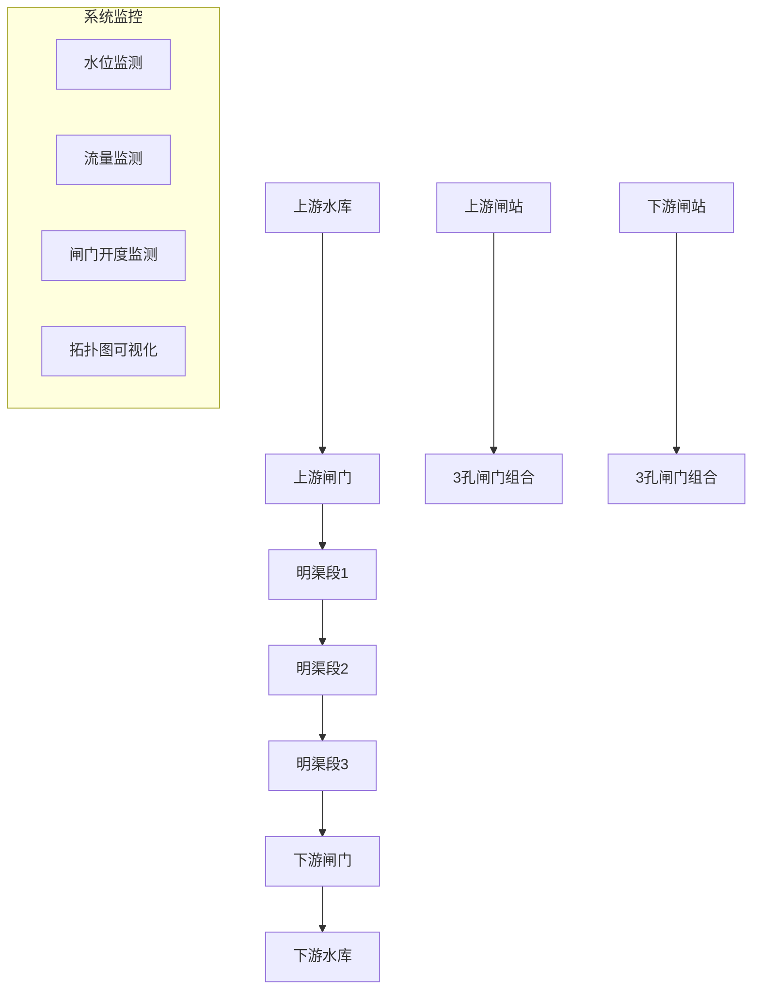

### 水力计算核心架构

```mermaid
classDiagram
    class WaterReservoir {
        +name: str
        +constant_level: float
        +capacity: float
        +maintain_water_level()
        +get_boundary_condition()
    }
    
    class GateStructure {
        +name: str
        +width: float
        +discharge_coeff: float
        +opening: float
        +calculate_flow(H_up, H_down, opening)
        +get_flow_regime()
        +apply_adaptive_formula()
    }
    
    class ChannelSegment {
        +segment_id: str
        +length: float
        +bottom_width: float
        +side_slope: float
        +roughness: float
        +solve_steady_flow()
        +solve_unsteady_flow()
    }
    
    class HydraulicSystem {
        +reservoirs: List[WaterReservoir]
        +gates: List[GateStructure]
        +channels: List[ChannelSegment]
        +run_steady_simulation()
        +run_unsteady_simulation()
        +analyze_step_response()
    }
    
    class FlowRegimeAnalyzer {
        +detect_submerged_flow()
        +detect_free_flow()
        +select_discharge_formula()
        +adaptive_formula_switching()
    }
    
    WaterReservoir ||--o{ HydraulicSystem
    GateStructure ||--o{ HydraulicSystem
    ChannelSegment ||--o{ HydraulicSystem
    FlowRegimeAnalyzer --o GateStructure
```

## 核心功能设计

### 水库边界条件管理

#### 恒定水位维持机制

| 水库位置 | 设计水位(m) | 容量(万m³) | 边界条件类型 | 控制策略 |
|----------|-------------|------------|--------------|----------|
| 上游水库 | 120.0 | 5000 | 恒定水位边界 | 无限补给维持 |
| 下游水库 | 100.0 | 3000 | 恒定水位边界 | 自由泄放维持 |

水库系统通过边界条件设置实现恒定水位，上游水库作为无限水源，下游水库作为无限汇点，确保试验期间水位稳定。

### 闸门过流计算体系

#### 基础过流公式框架

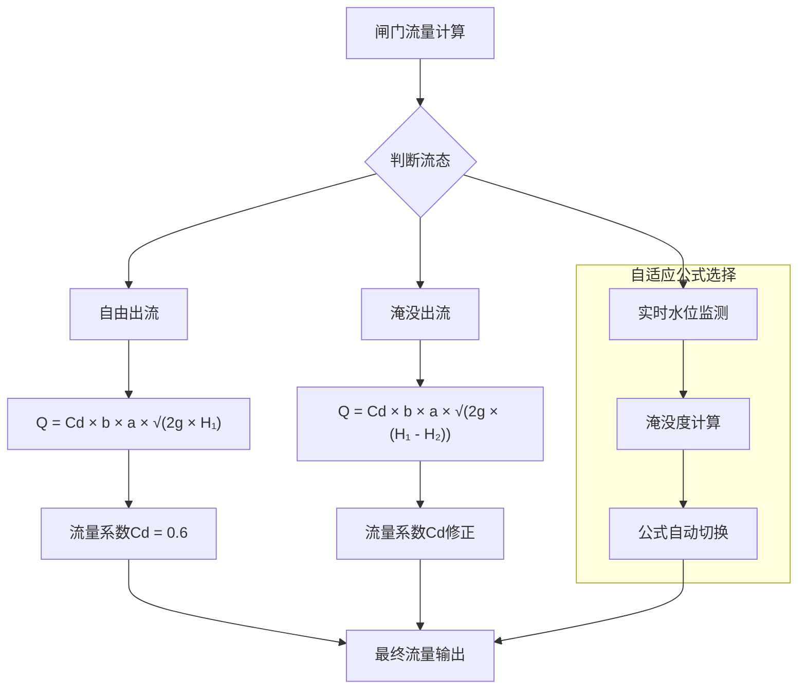

#### 过流计算参数表

| 参数类型 | 符号 | 取值范围 | 物理意义 | 备注 |
|----------|------|----------|----------|------|
| 流量系数 | Cd | 0.55-0.65 | 孔口收缩系数 | 根据闸门类型调整 |
| 闸门宽度 | b | 5.0-15.0m | 过流净宽 | 标准化设计参数 |
| 开度 | a | 0-5.0m | 闸门提升高度 | 控制变量 |
| 上游水头 | H₁ | 相对闸底高程 | 上游能量水头 | 实时计算 |
| 下游水头 | H₂ | 相对闸底高程 | 下游能量水头 | 实时计算 |

#### 流态判别与公式选择

淹没度判别标准：σ = H₂/H₁

- 自由出流：σ < 0.7，采用上游水头控制公式
- 淹没出流：σ ≥ 0.7，采用水头差控制公式
- 临界流态：0.65 < σ < 0.75，采用插值过渡

### 明渠水力计算

#### 渠道分段设计

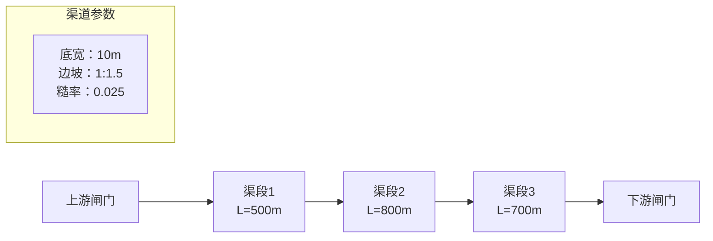

#### 渠道几何与水力参数

| 渠段编号 | 长度(m) | 底宽(m) | 边坡系数 | 糙率系数 | 底坡(‰) | 设计作用 |
|----------|---------|---------|----------|----------|---------|----------|
| 渠段1 | 500 | 10.0 | 1:1.5 | 0.025 | 1.0 | 进水稳流段 |
| 渠段2 | 800 | 12.0 | 1:1.5 | 0.025 | 0.8 | 主输水段 |
| 渠段3 | 700 | 10.0 | 1:1.5 | 0.025 | 1.2 | 出水段 |

### 闸站多闸门组合设计

#### 闸站结构布局

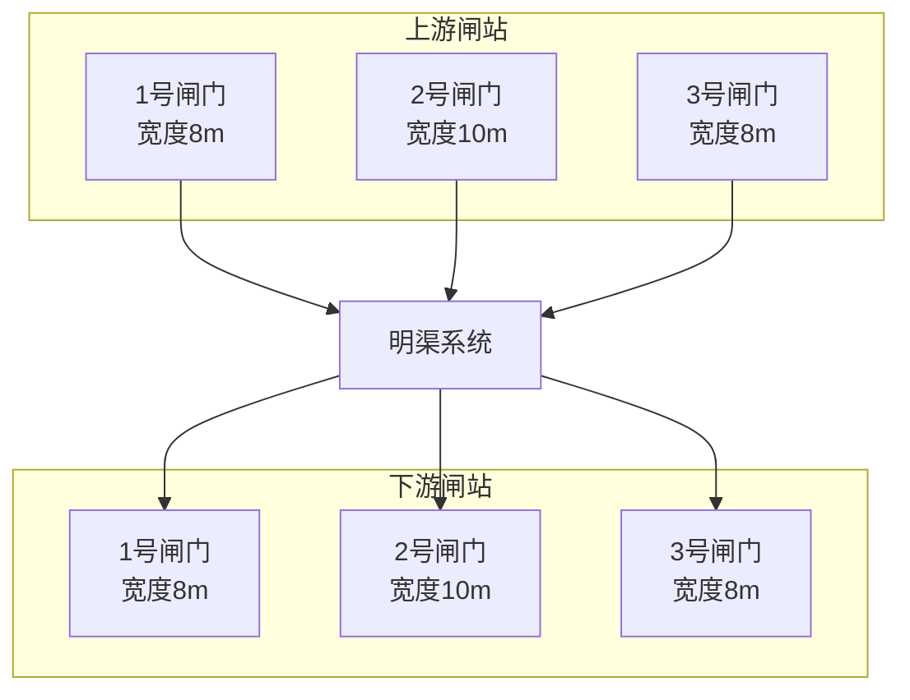

#### 多闸门协调控制策略

| 控制模式 | 闸门配置 | 流量分配比例 | 适用工况 | 控制目标 |
|----------|----------|--------------|----------|----------|
| 均匀开启 | 全部闸门同步 | 30%:40%:30% | 正常调度 | 流量均衡 |
| 优先开启 | 中门优先 | 0%:100%:0% | 小流量工况 | 精细控制 |
| 梯级开启 | 逐级增开 | 递增开启 | 流量调节过程 | 平稳过渡 |
| 应急排放 | 全开模式 | 最大通流能力 | 防洪调度 | 快速泄流 |

## 仿真测试方案

### 恒定流测试方案

#### 测试工况设计

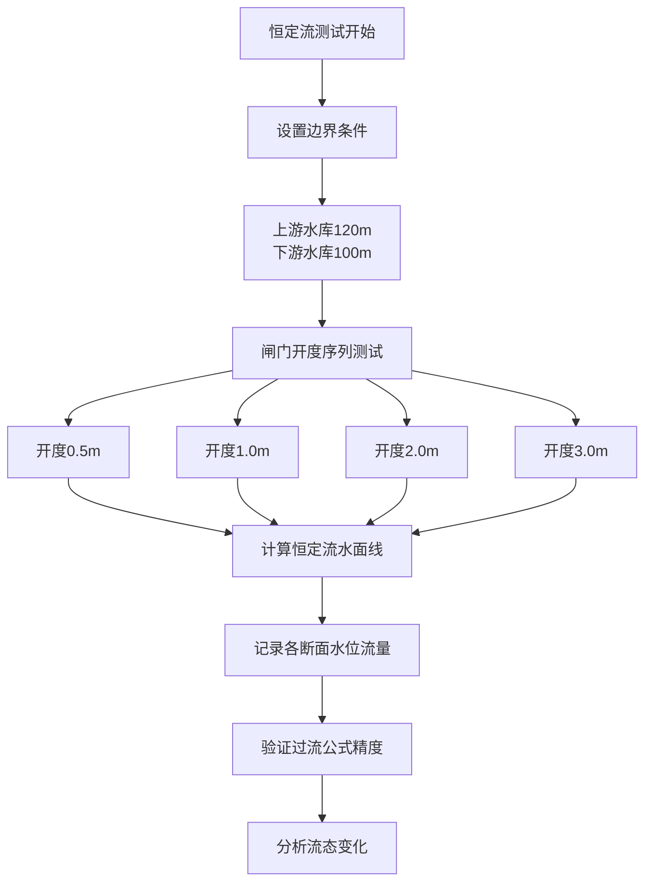

#### 恒定流验证指标

| 验证项目 | 计算方法 | 精度要求 | 物理意义 |
|----------|----------|----------|----------|
| 过流能力 | 闸门流量公式 | ±5% | 闸门特性验证 |
| 水面线 | 能量方程逐段推算 | ±2cm | 渠道水力特性 |
| 流速分布 | 连续性方程 | ±10% | 流态合理性 |
| 水头损失 | 总水头差 | ±1% | 能量平衡 |

### 非恒定流阶跃响应测试

#### 阶跃信号设计

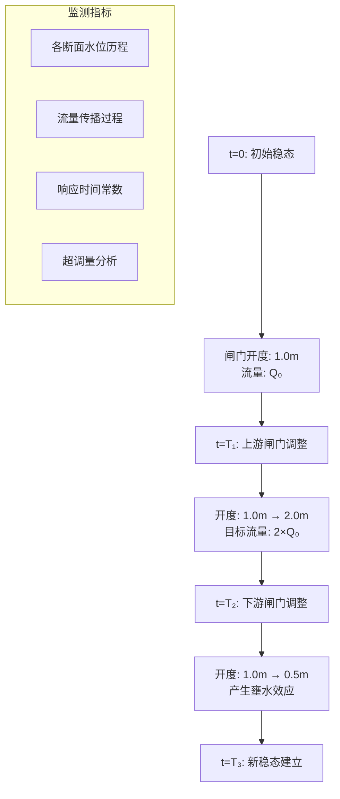

#### 动态响应分析指标

| 分析指标 | 计算定义 | 工程意义 | 目标值 |
|----------|----------|----------|---------|
| 响应时间 | 达到稳态值90%的时间 | 系统调节性能 | <30分钟 |
| 超调量 | 最大值与稳态值的比值 | 控制稳定性 | <15% |
| 调节时间 | 进入±5%误差带的时间 | 控制精度 | <60分钟 |
| 传播速度 | 水位扰动传播速度 | 物理合理性 | 符合波速理论 |

### 闸站控制效果对比测试

#### 对比测试设计

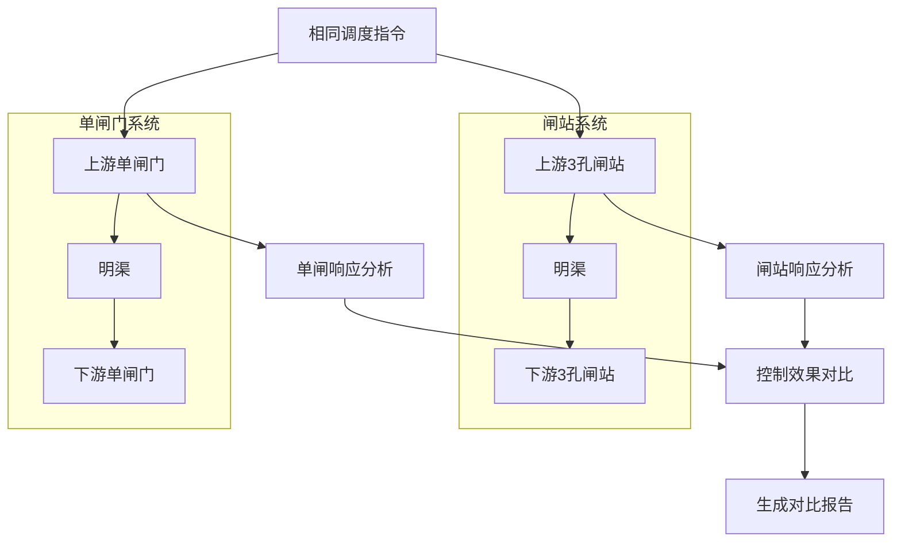

## 可视化系统设计

### 拓扑图生成架构

基于WaterNet可视化组件，设计系统拓扑图展示：

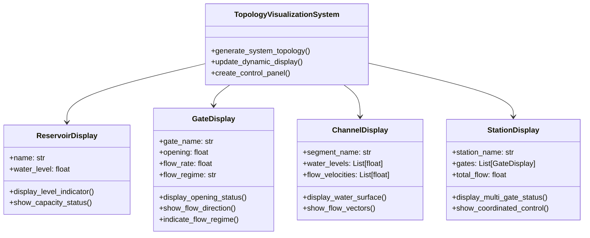

### 动态监控界面设计

#### 实时状态显示面板

| 显示区域 | 监控内容 | 更新频率 | 显示格式 |
|----------|----------|----------|----------|
| 水库状态 | 水位、蓄量 | 1秒 | 数字+水位指示器 |
| 闸门状态 | 开度、流量、流态 | 1秒 | 数字+开度条+流向箭头 |
| 渠道状态 | 各断面水位、流速 | 5秒 | 水面线图+流速云图 |
| 系统总览 | 拓扑图+实时数据 | 10秒 | 综合仪表盘 |

#### 历史数据分析图表

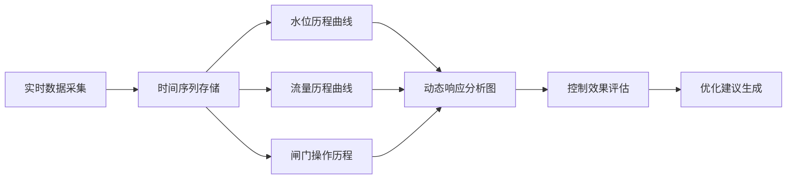

## 精度验证与性能评估

### 数值模型验证策略

#### 物理一致性检验

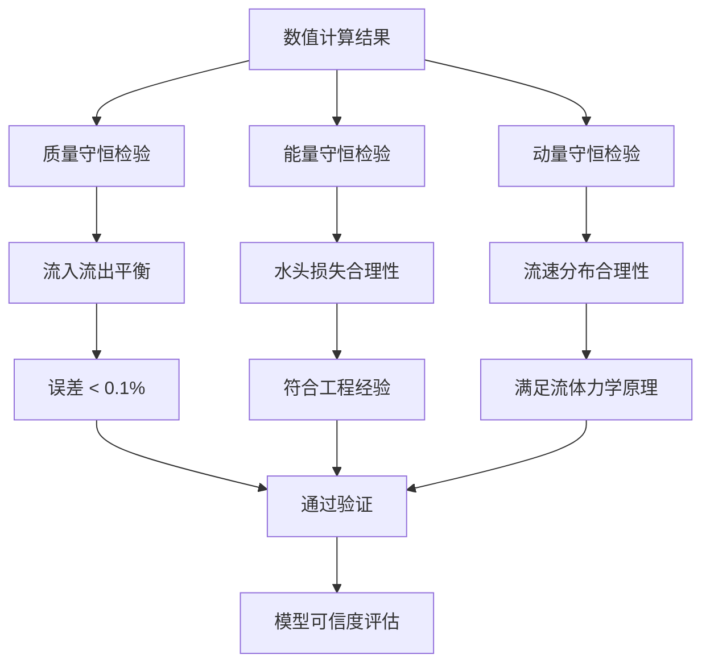

#### 精度评估指标体系

| 评估方面 | 评估指标 | 计算方法 | 合格标准 |
|----------|----------|----------|----------|
| 水位精度 | 平均绝对误差MAE | Σ\|H_calc-H_ref\|/n | <2cm |
| 流量精度 | 相对误差 | \|Q_calc-Q_ref\|/Q_ref | <5% |
| 响应特性 | 时间常数误差 | \|τ_calc-τ_ref\|/τ_ref | <10% |
| 稳定性 | 数值振荡幅度 | max(oscillation)/steady_value | <1% |

### 计算性能监控

#### 计算效率分析

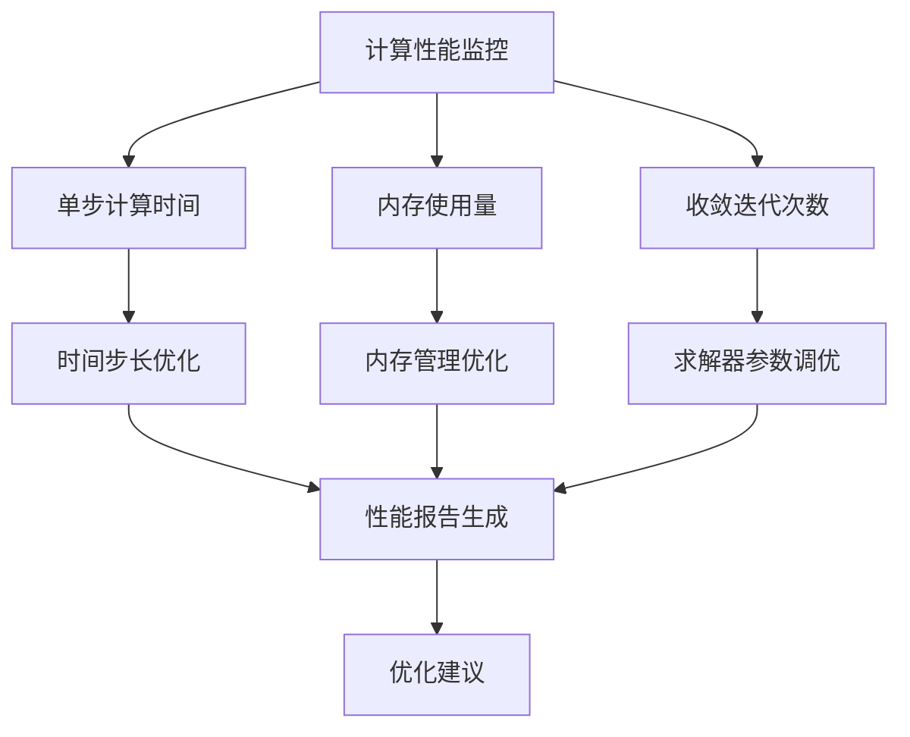

## 测试用例设计

### 基础功能测试用例

#### 单闸门控制测试

| 测试编号 | 测试场景 | 输入条件 | 预期结果 | 验证要点 |
|----------|----------|----------|----------|----------|
| TC-001 | 小开度自由出流 | 开度0.5m，上下游水位差5m | 自由出流模式，流量约25m³/s | 流态判别准确性 |
| TC-002 | 大开度淹没出流 | 开度3.0m，下游水位较高 | 淹没出流模式，流量受下游影响 | 公式自动切换 |
| TC-003 | 开度阶跃响应 | 开度1m→2m瞬间变化 | 水位流量平稳过渡，无数值振荡 | 动态响应稳定性 |
| TC-004 | 极限工况测试 | 开度接近全关或全开 | 边界条件处理正确，无异常 | 边界处理能力 |

#### 闸站协调控制测试

| 测试编号 | 测试场景 | 输入条件 | 预期结果 | 验证要点 |
|----------|----------|----------|----------|----------|
| TC-101 | 单孔控制模式 | 仅中间闸门开启 | 流量集中通过中门，两侧闸门无流量 | 独立控制能力 |
| TC-102 | 多孔同步控制 | 三孔同步开启 | 流量按宽度比例分配 | 协调控制准确性 |
| TC-103 | 梯级启动模式 | 依次开启各孔闸门 | 流量平稳增长，无冲击 | 软启动效果 |
| TC-104 | 应急排放模式 | 三孔全开最大泄流 | 达到设计泄流能力 | 最大通流验证 |

### 复杂工况测试

#### 极端调度场景

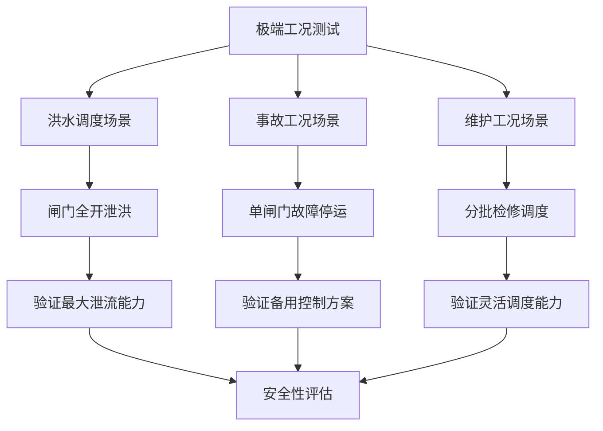

#### 长期运行稳定性测试

连续运行72小时，包含多种调度方案切换，验证：
- 数值累积误差控制
- 内存泄漏检测
- 计算性能衰减分析
- 长期稳定性评估

通过建立完整的测试用例体系和验证指标，确保系统在各种工况下的可靠性和准确性。