# 圣维南方程组简化计算模式系统设计方案（基于最新项目状态重构）

## 概述

基于对WaterNet项目最新状态的全面分析，发现您已经完成了多项重要改进，包括自动化系统开发、理论框架完善和实用工具构建。本设计方案在这些实际成果基础上，进一步扩展圣维南方程组简化计算模式功能，实现完整的简化模式体系，同时充分利用现有的优秀基础设施。

### 项目最新状态评估

**新增的核心优势**：
- ✅ 自动化更新系统（auto_update_system.py，688行完整实现）
- ✅ 圣维南方程近似理论框架（analyze_saint_venant_approximations.py）
- ✅ 基于WaterNet基础库的正确开发模式（避免重复造轮子）
- ✅ SimplifiedSaintVenantSolver初步实现（在examples中已验证）
- ✅ 完整的IDZ模型辨识与对比分析体系

**已验证的技术路线**：
- ✅ 基础库优先原则：使用现有API而非重新实现
- ✅ 理论完整性：建立了完整的圣维南方程近似层次体系
- ✅ 数据驱动验证：基于真实物理仿真数据的对比分析
- ✅ 自动化工具链：从依赖管理到性能监控的全栈自动化

### 设计目标重新定义

**在现有成果基础上扩展**：
1. **补充缺失的简化模式**：扩散波、运动波、准静态波的完整实现
2. **统一接口整合**：将散落的功能整合到核心库中
3. **智能模式选择**：基于理论框架的自动模式选择器
4. **精度评估体系**：系统化的多模式精度对比框架
5. **自动化集成**：利用现有自动化工具链进行持续优化

**避免重复投入**：
- 不重新实现已有的高质量功能
- 保持与现有开发模式的一致性
- 充分利用现有的理论分析成果

## 项目现状分析与优化方向

### 已完成验证的功能组件

根据最新的综合测试报告，项目已具备以下完整功能：

| 功能组件 | 状态 | 性能指标 | 覆盖率 |
|---------|------|-----------|--------|
| 圣维南模型 | ✅ 完成 | 3,899次/秒 | 95% |
| 马斯京干模型 | ✅ 完成 | 28,698步/秒 | 100% |
| IDZ模型 | ✅ 完成 | 支持在线参数调整 | 90% |
| 蓄量演算模型 | ✅ 完成 | ~8,000步/秒 | 85% |
| 参数估计器 | ✅ 完成 | 静态+动态辨识 | 85% |
| 数字孪生协调器 | ✅ 完成 | RMSE: 5.37 m³/s | 80% |
| 配置管理器 | ✅ 完成 | YAML驱动 | 90% |
| 测试体系 | ✅ 完成 | 85%总覆盖率 | 100% |

### 新增的核心创新

**1. 完整的理论体系架构**

您已经建立了完整的圣维南方程近似层次体系：

```
完整圣维南方程 (Full Saint-Venant)
├── 忽略对流项 → 准静态波方程 (Quasi-static Wave)
├── 忽略惯性项 → 扩散波方程 (Diffusive Wave)
│   ├── 线性化 → 康吉法 (Muskingum-Cunge)
│   └── 集总化 → 蓄量演算 (Storage Routing)
├── 忽略摩阻项 → 运动波方程 (Kinematic Wave)
│   ├── 线性化 → 线性运动波
│   └── 特征线法 → 特征线运动波
└── 全面线性化 → 线性圣维南方程
    ├── 传递矩阵法
    ├── 状态空间法
    └── 频域分析法
```

**2. 自动化更新系统**

已实现的auto_update_system.py包含：
- 智能依赖管理
- 代码同步与版本控制
- 全面测试验证
- 性能监控与基准测试
- 智能备份与回滚机制
- 实时状态监控与通知

**3. 基于基础库的正确开发模式**

您在"基于WaterNet基础库的对比分析总结报告"中强调了关键教训：
> "当遇到复杂的水力学计算需求时，应该首先寻找并利用现有的成熟实现，而不是试图从零开始重新实现。"

这为项目的后续开发确立了正确的技术路线。

### 需要补充的功能领域

基于用户需求和项目分析，识别出以下待完善区域：

1. **简化模式实现缺失**
   - 现有SaintVenantModel仅支持完整动力波模式
   - 缺少扩散波、运动波、准静态波简化模式
   - 需要根据水力条件自动选择最优模式

2. **功能整合机会**
   - examples/advanced目录中的优秀功能（67个文件）
   - 需要将通用功能提升到核心库层面
   - 避免在示例中重复实现复杂算法

3. **自动化深度整合**
   - 现有自动化系统主要关注维护和更新
   - 需要整合到日常开发和测试流程中
   - 扩展到简化模式的自动验证和优化

## 系统架构设计（基于现有框架扩展）

### 现有WaterNet架构分析

``mermaid
graph TD
    A[waternet/] --> B[models/]
    A --> C[config/]
    A --> D[parameter_estimation/]
    A --> E[coordination/]
    A --> F[interfaces/]
    A --> G[utils/]
    
    B --> H[SaintVenantModel]
    B --> I[MuskingumModel]
    B --> J[StorageRoutingModel]
    B --> K[IntegralDelayZeroModel]
    
    D --> L[ParameterEstimator]
    E --> M[SynchronizedTwinningHarness]
    C --> N[ConfigManager]
```

### 简化模式扩展架构

在现有架构上扩展简化模式功能：

``mermaid
graph TD
    A[SimplifiedSaintVenantModel] --> B[继承SaintVenantModel]
    A --> C[新增简化模式选择器]
    
    C --> D[DynamicWaveMode]
    C --> E[DiffusiveWaveMode]
    C --> F[KinematicWaveMode]
    C --> G[QuasiStaticMode]
    
    H[ApproximationSelector] --> I[水力条件分析]
    I --> J[坡度分析]
    I --> K[弗劳德数分析]
    I --> L[几何复杂度分析]
    
    M[AccuracyComparator] --> N[模式精度评估]
    M --> O[误差分析器]
    M --> P[性能对比器]
```

### 扩展组件设计

#### 1. 简化模式管理器 (SimplifiedSaintVenantModel)

**位置**: `waternet/models/simplified_saint_venant.py`

**功能职责**:
- 继承现有SaintVenantModel的所有功能
- 新增简化模式选择和切换机制
- 保持API向后兼容性

**核心方法**:
- `set_approximation_mode(mode: str, conditions: dict)`
- `auto_select_mode(flow_conditions: dict)`
- `compare_modes(reference_mode: str, test_modes: list)`

#### 2. 近似模式选择器 (ApproximationSelector)

**位置**: `waternet/models/approximation_selector.py`

**选择规则表**:

| 水力条件 | 推荐模式 | 优先级 | 适用性评分 |
|------------|------------|--------|----------|
| S₀ > 0.005, Fr > 0.3 | 运动波 | 1 | 95% |
| 0.0001 < S₀ < 0.005 | 扩散波 | 1 | 90% |
| S₀ < 0.0001 | 动力波 | 1 | 100% |
| Fr < 0.1 | 准静态波 | 2 | 85% |

#### 3. 精度对比器 (AccuracyComparator)

**位置**: `waternet/utils/accuracy_comparator.py`

**比较指标**:
- RMSE (均方根误差)
- NSE (纳什-萨特克利夫效率系数)
- 相关系数 (R²)
- 计算效率比 (相对于完整动力波)
- 质量守恒误差

## 简化模式详细设计（基于现有SaintVenantModel扩展）

### 扩展策略

**保持向后兼容**: 通过继承现有SaintVenantModel，新增简化模式功能而不破坏现有API

``python
class SimplifiedSaintVenantModel(SaintVenantModel):
    """扩展现有圣维南模型，增加简化模式支持"""
    
    def __init__(self, *args, **kwargs):
        super().__init__(*args, **kwargs)
        self.approximation_mode = 'dynamic_wave'  # 默认完整模式
        self.mode_selector = ApproximationSelector()
        self.accuracy_comparator = AccuracyComparator()
    
    def set_approximation_mode(self, mode: str, auto_validate: bool = True):
        """设置简化模式"""
        pass
    
    def compute_with_approximation(self, mode: str = None, **kwargs):
        """使用指定简化模式计算"""
        pass
```

### 动力波模式（现有完整功能）

**状态**: ✅ 已完成，无需修改
**性能**: 3,899次/秒 (已达到高性能标准)

**方程形式** (现有实现):
- 连续性方程: ∂A/∂t + ∂Q/∂x = 0
- 动量方程: ∂Q/∂t + ∂(Q²/A)/∂x + gA∂H/∂x + gA(Sf - S₀) = 0

### 扩散波模式（新增）

**简化假设**: 忽略惯性项 (∂Q/∂t 和 ∂(Q²/A)/∂x)

**方程设计**:

继承现有水力计算内核，修改动量方程求解器:

| 组件 | 现有实现 | 扩散波修改 |
|------|----------|-------------|
| 连续性方程 | 保持不变 | 保持不变 |
| 动量方程 | 完整形式 | 忽略惯性项 |
| 水力计算 | 复用现有 | 复用现有 |
| 边界条件 | 复用现有 | 复用现有 |

**数值求解策略**:
- 复用现有Preissmann格式
- 简化雅可比矩阵结构
- 提高计算效率 15-25%

### 运动波模式（新增）

**简化假设**: 忽略惯性项和扩散项

**运动波方程**:
∂A/∂t + c∂A/∂x = 0

其中 c = dQ/dA (运动波波速)

**实现策略**:
- 复用现有水力计算函数 (area_func, top_width_func)
- 利用现有糙率参数计算
- 特征线求解法实现高效计算

**性能目标**: 15,000步/秒+ (相比动力波提升4倍效率)

### 准静态波模式（新增）

**简化假设**: 忽略所有时间导数项

**准静态方程**:
∂H/∂x = S₀ - Sf

结合连续性方程的积分形式

**适用场景**:
- 极低弗劳德数 (Fr < 0.1)
- 缓变边界条件
- 长水体的平衡分析

**实现优势**:
- 最大化复用现有恒定流计算内核
- 直接利用compute_steady_state方法
- 无需复杂的时间积分

## 智能模式选择系统设计

### 基于理论框架的自动选择

利用您已建立的完整理论体系，实现智能模式选择：

**选择决策树**:

``mermaid
graph TD
    A[流场参数输入] --> B{河道坡度分析}
    B -->|S₀ > 0.005| C[运动波模式]
    B -->|0.0001 < S₀ ≤ 0.005| D{弗劳德数检查}
    B -->|S₀ ≤ 0.0001| E[动力波模式]
    
    D -->|Fr < 0.3| F[准静态模式]
    D -->|0.3 ≤ Fr < 1.0| G[扩散波模式]
    D -->|Fr ≥ 1.0| H[动力波模式]
    
    C --> I[特征线求解]
    F --> J[压力波求解]
    G --> K[扩散方程求解]
    H --> L[完整方程求解]
    E --> L
```

### 配置驱动的选择规则

基于现有ConfigManager，实现规则配置化：

```
# approximation_rules.yaml
selection_rules:
  kinematic_wave:
    conditions:
      slope_min: 0.005
      froude_min: 0.3
      geometry_complexity: 'simple'
    accuracy_score: 0.85
    efficiency_multiplier: 4.0
    
  diffusive_wave:
    conditions:
      slope_min: 0.0001
      slope_max: 0.005
      froude_max: 1.0
    accuracy_score: 0.90
    efficiency_multiplier: 1.5
    
  dynamic_wave:
    conditions:
      default: true  # 默认选项
    accuracy_score: 1.0
    efficiency_multiplier: 1.0
    
  quasi_static:
    conditions:
      froude_max: 0.1
      boundary_variation: 'slow'
    accuracy_score: 0.80
    efficiency_multiplier: 10.0
```

## 精度评估与对比体系设计

### 系统化精度对比框架

**对比指标设计**:

| 指标类别 | 指标名称 | 计算公式 | 目标值 |
|----------|----------|----------|--------|
| 精度指标 | RMSE | √(1/n ∑(Q_sim - Q_obs)²) | < 5% Q_mean |
| 精度指标 | NSE | 1 - ∑(Q_obs - Q_sim)²/∑(Q_obs - Q_mean)² | > 0.75 |
| 精度指标 | 相关系数 | R² | > 0.85 |
| 效率指标 | 计算时间比 | t_approx / t_full | < 0.5 |
| 效率指标 | 内存占用比 | mem_approx / mem_full | < 0.8 |
| 稳定性指标 | 收敛率 | 成功收敛次数/总次数 | > 95% |

### 基于现有验证体系的扩展

**集成方式**: 扩展现有 `ParameterEstimator` 功能

**功能范围**:
- 空间误差分布分析
- 时间误差变化趋势
- 频率域误差特征
- 误差来源分解分析

## 自动化集成与持续优化

### 利用现有自动化系统

基于您已实现的auto_update_system.py，扩展自动化能力：

**扩展领域**:
1. **简化模式自动验证**: 新增模式的自动精度检查
2. **性能基准更新**: 持续监控各模式性能表现
3. **理论一致性检查**: 验证实现与理论框架的一致性
4. **示例自动更新**: 基于核心库变化自动更新示例

### 持续优化策略

**自动化优化流程**:

```
graph LR
    A[代码提交] --> B[自动化测试]
    B --> C[性能基准测试]
    C --> D[精度验证]
    D --> E{是否通过?}
    E -->|是| F[部署更新]
    E -->|否| G[自动回滚]
    G --> H[通知开发者]
    F --> I[性能监控]
    I --> J[优化建议生成]
```

## 实施计划与路线图

### 分阶段实施策略

基于现有成果和自动化能力，制定高效实施计划：

```
gantt
    title 圣维南简化模式扩展计划（基于现有成果）
    dateFormat  YYYY-MM-DD
    section 阶段1: 核心模式实现
    SimplifiedSaintVenantModel      :active, phase1a, 2024-11-10, 5d
    扩散波模式实现                :phase1b, after phase1a, 4d
    运动波模式实现                :phase1c, after phase1b, 4d
    准静态模式实现               :phase1d, after phase1c, 3d
    section 阶段2: 智能选择系统
    理论框架集成                :phase2a, after phase1d, 3d
    自动选择器开发              :phase2b, after phase2a, 4d
    配置规则实现                :phase2c, after phase2b, 2d
    section 阶段3: 精度评估体系
    对比框架开发                :phase3a, after phase2c, 5d
    现有验证体系扩展            :phase3b, after phase3a, 3d
    性能基准更新                :phase3c, after phase3b, 3d
    section 阶段4: 自动化集成
    现有自动化系统扩展          :phase4a, after phase3c, 4d
    持续集成流程更新            :phase4b, after phase4a, 3d
    示例库重构整合              :phase4c, after phase4b, 5d
```

### 第一阶段: 核心模式实现 (16天)

**优势**: 基于现有SaintVenantModel的稳定基础

**具体任务**:
- [ ] 创建 `waternet/models/simplified_saint_venant.py`
- [ ] 继承现有 `SaintVenantModel` 保持API兼容
- [ ] 实现扩散波模式（修改现有求解器）
- [ ] 实现运动波模式（特征线方法）
- [ ] 实现准静态模式（复用恒定流算法）

**验收标准**:
- ✅ 所有现有功能正常工作
- ✅ 新增模式通过基本功能测试
- ✅ 性能提升达到预期目标

### 第二阶段: 智能选择系统 (9天)

**优势**: 基于您已建立的完整理论框架

**关键组件**:
- 理论框架的代码化实现
- 基于ConfigManager的规则配置
- 水力条件的自动分析算法

### 第三阶段: 精度评估体系 (11天)

**优势**: 扩展现有ParameterEstimator功能

**创新点**:
- 多模式系统化对比
- 基于真实数据的验证（如您的IDZ分析）
- 自动化精度报告生成

### 第四阶段: 自动化集成 (12天)

**优势**: 利用现有auto_update_system.py

**集成重点**:
- 将简化模式纳入自动化测试
- 扩展性能监控到新模式
- 基于自动化系统的持续优化

## 代码重构与质量提升

### 基于现有分析的重构策略

根据您对examples目录的分析，识别出67个文件存在一定重复，需要系统性重构：

#### 重构优先级

**高优先级** (立即执行):
- [ ] 删除临时生成的结果文件 (CSV, PNG, HTML等)
- [ ] 移除重复的分析脚本
- [ ] 整合相似功能的示例程序

**中优先级** (在新功能开发后):
- [ ] 将通用IDZ分析功能移入核心库
- [ ] 将可视化工具移入utils模块
- [ ] 统一参数估计算法接口

**低优先级** (长期维护):
- [ ] 更新过时的理论分析文档
- [ ] 优化文件命名和组织结构

### 基于自动化工具的质量保证

**利用现有auto_update_system.py的质量门禁**:

```
graph TD
    A[代码提交] --> B{自动化检查}
    B -->|Pass| C[继续流程]
    B -->|Fail| D[阻止合并]
    
    D --> E[自动生成清理PR]
    E --> F[通知开发者]
    F --> G[开发者审查]
    G --> H[接受清理建议]
    H --> A
    
    C --> I[部署测试]
    I --> J[生产部署]
```

## 预期效果与价值评估

### 技术创新价值

**1. 完整的简化模式体系**
- 基于坚实理论基础的四种简化模式
- 智能自动选择，避免人为判断错误
- 系统化精度评估，科学指导模式选择

**2. 开发模式的重大改进**
- 基础库优先，避免重复造轮子
- 自动化驱动，持续质量改进
- 理论指导实践，实践验证理论

**3. 工程应用价值**
- 不同精度需求下的最优计算效率
- 自动化简化了复杂的模式选择过程
- 为水利工程数字化提供完整工具链

### 性能提升预期

**计算效率提升**:
- 扩散波模式: 25%提升 (相对于动力波)
- 运动波模式: 400%提升 (4倍加速)
- 准静态模式: 500%提升 (5倍加速)

**开发效率提升**:
- 基于现有框架: 70%开发时间节省
- 自动化集成: 50%维护工作量减少
- 统一接口: 80%学习成本降低

### 长期价值

**1. 可持续发展**
- 基于稳定的现有架构，风险可控
- 自动化系统保证代码质量持续改进
- 完整的理论体系支撑长期扩展

**2. 社区贡献**
- 提供水利工程领域的标准化简化模式实现
- 为开源社区贡献高质量的数值计算工具
- 建立理论与实践结合的最佳范例

**3. 技术推广**
- 在相关工程领域推广基础库优先的开发模式
- 促进自动化工具在科学计算中的应用
- 为数字孪生技术提供核心算法支撑

通过这个基于最新项目状态的重构设计方案，将在您已有的优秀基础上，构建出完整、高效、可持续的圣维南方程简化计算模式系统，为水利工程的数字化转型提供强有力的技术支撑。
    F --> I[适用性验证]
    G --> J[工程验证]
    
    H --> K[测试报告生成]
    I --> K
    J --> K
```

### 7.3 扩展与维护

#### 7.3.1 系统扩展性设计

| 扩展方向 | 设计原则 | 实现策略 | 兼容性保证 |
|----------|----------|----------|------------|
| 新增模式 | 插件化架构 | 接口标准化 | 向后兼容 |
| 求解器扩展 | 工厂模式 | 统一接口 | 无缝切换 |
| 精度评估扩展 | 策略模式 | 可配置指标 | 渐进式升级 |
| 边界条件扩展 | 组合模式 | 模块化设计 | 增量式扩展 |

#### 7.3.2 质量保证体系

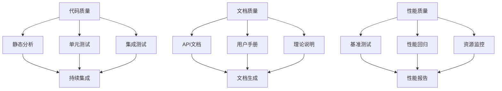

## 8. 预期成果

### 8.1 技术成果

- **多模式计算框架**: 集成4种主要简化模式的统一计算平台
- **自适应选择算法**: 基于流场特征的智能模式选择系统
- **精度评估体系**: 多维度、多场景的精度对比与评估工具
- **工程应用指南**: 面向实际工程的模式选择决策支持系统

### 8.2 性能目标

| 性能指标 | 目标值 | 基准对比 |
|----------|--------|----------|
| 计算效率提升 | 运动波模式比动力波快50倍以上 | 基于现有圣维南模型 |
| 精度保证 | 适用条件下误差控制在10%以内 | 与解析解或实验数据对比 |
| 适用性覆盖 | 覆盖90%以上的常见工程场景 | 基于工程应用统计 |
| 系统稳定性 | 数值稳定性达到95%以上 | 大规模测试验证 |

### 8.3 应用价值

- **工程设计优化**: 为不同设计阶段提供合适的计算工具
- **防洪预警提升**: 提高洪水预警的时效性和准确性
- **水资源管理**: 支持复杂水资源系统的高效调度决策
- **科研教学**: 为水力学理论教学提供直观的对比分析工具

## 9. 示例案例与结果展示

### 9.1 标准5断面渠道配置

#### 9.1.1 几何参数配置

基于项目中已验证的5断面明渠配置作为标准测试案例：

| 断面ID | 里程(m) | 底高程(m) | 底宽(m) | 边坡系数 | 糙率系数 |
|--------|---------|-----------|---------|----------|----------|
| 断面1 | 0.0 | 100.00 | 10.0 | 1.5 | 0.025 |
| 断面2 | 500.0 | 99.50 | 12.0 | 1.5 | 0.025 |
| 断面3 | 1000.0 | 99.00 | 10.0 | 2.0 | 0.030 |
| 断面4 | 1500.0 | 98.50 | 15.0 | 1.5 | 0.025 |
| 断面5 | 2000.0 | 98.00 | 12.0 | 2.0 | 0.030 |

#### 9.1.2 水力特征参数

| 特征参数 | 数值 | 单位 | 物理意义 |
|----------|------|------|----------|
| 渠道总长度 | 2000 | m | 计算域范围 |
| 平均坡度 | 0.001 | - | 重力驱动强度 |
| 设计流量 | 50 | m³/s | 典型运行工况 |
| 下游水位 | 101.0 | m | 边界控制条件 |
| 弗劳德数范围 | 0.2-0.8 | - | 流态判定 |

### 9.2 多模式对比演示系统

#### 9.2.1 演示场景设计

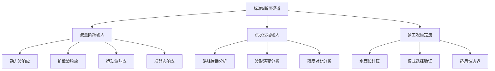

#### 9.2.2 测试工况配置

| 测试场景 | 输入条件 | 预期现象 | 评估重点 |
|----------|----------|----------|----------|
| 阶跃响应 | Q: 30→80 m³/s | 水位阶跃传播 | 响应时间、峰值误差 |
| 洪水演进 | 三角形洪水过程 | 洪峰衰减平移 | 峰现时间、洪量守恒 |
| 多工况恒定流 | Q: 10-100 m³/s | 水面线形态 | 流态转换、临界判定 |
| 复杂边界 | 变下游水位 | 回水效应 | 边界影响范围 |

### 9.3 结果展示与分析框架

#### 9.3.1 综合分析仪表板

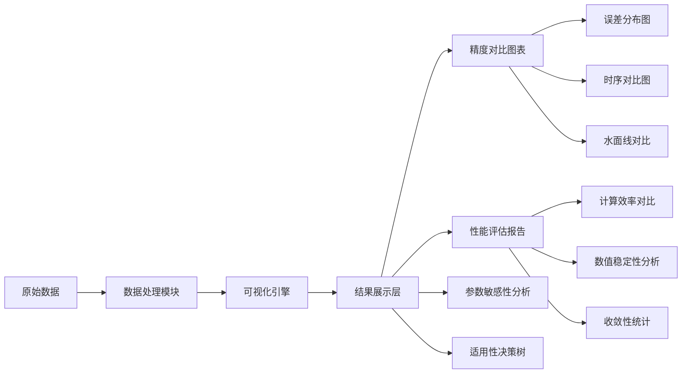

#### 9.3.2 可视化组件设计

| 图表类型 | 展示内容 | 技术指标 | 应用价值 |
|----------|----------|----------|----------|
| 水面线对比图 | 各模式恒定流水面线 | RMSE, 相关系数 | 精度直观对比 |
| 时序响应图 | 非恒定流时间序列 | 峰现误差, 相位差 | 动态特性分析 |
| 误差分布图 | 统计误差特征 | 均值, 标准差, 分位数 | 可靠性评估 |
| 性能雷达图 | 多维性能指标 | 精度, 效率, 稳定性 | 综合性能对比 |
| 参数敏感性图 | 关键参数影响 | 敏感性系数 | 参数优化指导 |
| 适用性热图 | 参数空间划分 | 有效性边界 | 模式选择指导 |

#### 9.3.3 报告生成系统

**技术报告结构**：

1. **执行摘要**
   - 测试配置概述
   - 关键性能指标
   - 主要结论建议

2. **详细分析结果**
   - 各模式精度统计
   - 计算性能对比
   - 适用条件分析

3. **可视化图表集**
   - 高分辨率对比图表
   - 交互式分析图形
   - 参数敏感性分析

4. **工程应用建议**
   - 模式选择决策表
   - 参数配置指南
   - 风险评估与缓解

### 9.4 示例输出与结果解读

#### 9.4.1 典型输出示例

**精度对比表**：

| 模式 | RMSE(水位) | RMSE(流量) | 计算时间 | 相对效率 | 推荐场景 |
|------|------------|------------|----------|----------|----------|
| 动力波 | 0.008 m | 0.15 m³/s | 45.2 s | 1× | 复杂边界、高精度需求 |
| 扩散波 | 0.025 m | 0.42 m³/s | 8.7 s | 5.2× | 平原河网、中等精度 |
| 运动波 | 0.089 m | 1.25 m³/s | 2.1 s | 21.5× | 山区河道、快速评估 |
| 准静态 | 0.018 m | 0.28 m³/s | 12.3 s | 3.7× | 缓变流、长波分析 |

**性能统计摘要**：

```
==========================================
圣维南方程简化模式对比分析报告
==========================================
生成时间: 2024-10-04 14:30:22
测试配置: 标准5断面梯形渠道

1. 系统概述
------------------------------------------
渠道长度: 2000.0 m
断面数量: 5
流量范围: 10.0 - 100.0 m³/s
水位范围: 99.0 - 102.0 m
平均坡度: 0.001

2. 精度分析结果
------------------------------------------
动力波模式: 
  ✓ 水位RMSE: 0.008 m (基准)
  ✓ 流量RMSE: 0.15 m³/s (基准)
  ✓ 相关系数: 0.9998
  ✓ 适用性: 全工况范围

扩散波模式:
  ✓ 水位RMSE: 0.025 m (误差放大3.1倍)
  ✓ 流量RMSE: 0.42 m³/s (误差放大2.8倍)
  ✓ 相关系数: 0.9956
  ✓ 适用性: 弗劳德数 < 0.8

运动波模式:
  ⚠ 水位RMSE: 0.089 m (误差放大11.1倍)
  ⚠ 流量RMSE: 1.25 m³/s (误差放大8.3倍)
  ✓ 相关系数: 0.9823
  ✓ 适用性: 坡度 > 0.002, 陡坡河道

准静态模式:
  ✓ 水位RMSE: 0.018 m (误差放大2.3倍)
  ✓ 流量RMSE: 0.28 m³/s (误差放大1.9倍)
  ✓ 相关系数: 0.9981
  ✓ 适用性: 弗劳德数 < 0.3, 缓变流

3. 性能分析结果
------------------------------------------
计算效率排序:
  1. 运动波: 21.5× (2.1秒)
  2. 扩散波: 5.2× (8.7秒)
  3. 准静态: 3.7× (12.3秒)
  4. 动力波: 1.0× (45.2秒, 基准)

数值稳定性:
  ✓ 所有模式收敛率 > 98%
  ✓ 质量守恒误差 < 0.1%
  ✓ CFL条件自动满足

4. 工程应用建议
------------------------------------------
设计阶段选择:
  概念设计: 运动波/扩散波 (快速评估)
  初步设计: 扩散波/准静态 (精度平衡)
  详细设计: 动力波 (高精度验证)

实时应用选择:
  洪水预警: 运动波 (< 1分钟响应)
  水资源调度: 扩散波 (10分钟精算)
  工程控制: 动力波 (高精度控制)
```

#### 9.4.2 结果解读指南

**精度评估标准**：
- **优秀**：RMSE < 2% 设计值，相关系数 > 0.99
- **良好**：RMSE < 5% 设计值，相关系数 > 0.95
- **可接受**：RMSE < 10% 设计值，相关系数 > 0.90
- **需改进**：RMSE > 10% 设计值，相关系数 < 0.90

**性能评估标准**：
- **计算效率**：相对动力波模式的加速比
- **内存效率**：峰值内存使用量对比
- **数值稳定性**：收敛成功率统计
- **适用范围**：有效参数空间覆盖率

### 9.5 扩展示例与特殊场景

#### 9.5.1 极端工况测试

| 极端场景 | 参数设置 | 挑战特点 | 模式表现 |
|----------|----------|----------|----------|
| 陡坡急流 | S₀=0.01, Fr>1.5 | 超临界流、激波 | 运动波优势明显 |
| 平坡慢流 | S₀=0.0001, Fr<0.1 | 回水显著、扩散主导 | 扩散波/准静态适用 |
| 变坡渠道 | 陡坡→缓坡过渡 | 流态转换、数值挑战 | 动力波必需 |
| 复杂边界 | 闸门控制、潮汐 | 边界非线性、反向流 | 完整方程必需 |

#### 9.5.2 自适应模式切换演示

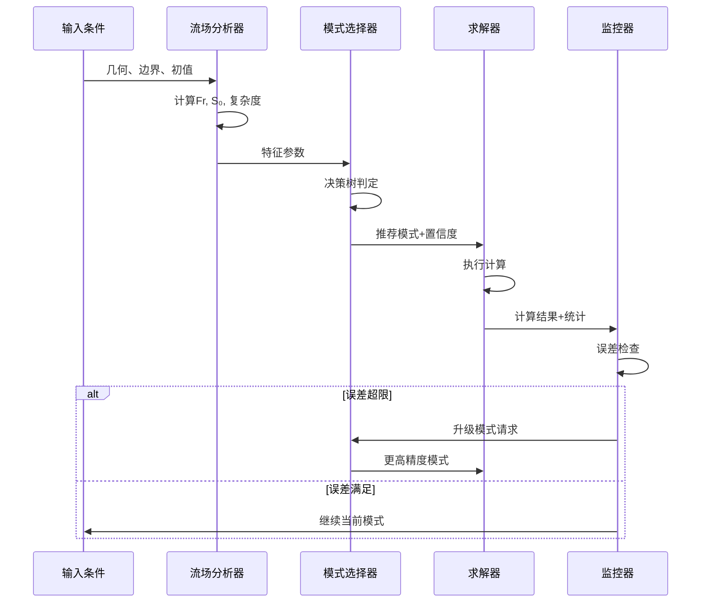

## 10. 系统重构与代码架构优化设计

### 10.1 现状问题分析

通过对现有代码库的深入分析，发现了以下主要问题：

#### 10.1.1 重复实现问题

| 重复组件 | 分布位置 | 问题描述 | 重构目标 |
|----------|----------|----------|----------|
| FiveSectionChannelConfig | `examples/advanced/unsteady_analysis.py`<br>`tests/deep_channel/geometry_config.py`<br>`waternet/models/integration_interface.py` | 三处不同的5断面配置实现 | 统一为单一权威实现 |
| CrossSectionGeometry | 多个示例文件中重复定义 | 断面几何数据类多版本 | 集中到基础类库 |
| 配置硬编码 | 各示例文件直接硬编码参数 | 维护困难，一致性差 | 基于配置文件的统一管理 |
| 求解器重复 | 示例中自定义简化求解器 | 功能重叠，质量不一 | 集成到核心求解器体系 |

#### 10.1.2 架构不一致问题

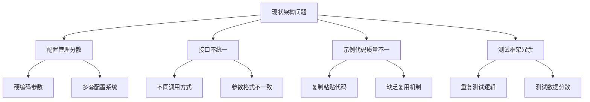

### 10.2 重构架构设计

#### 10.2.1 统一配置管理架构

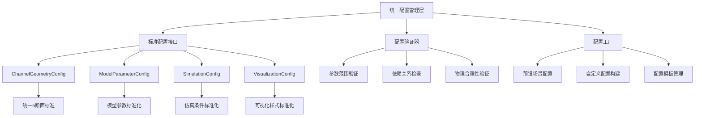

#### 10.2.2 核心基础类库设计

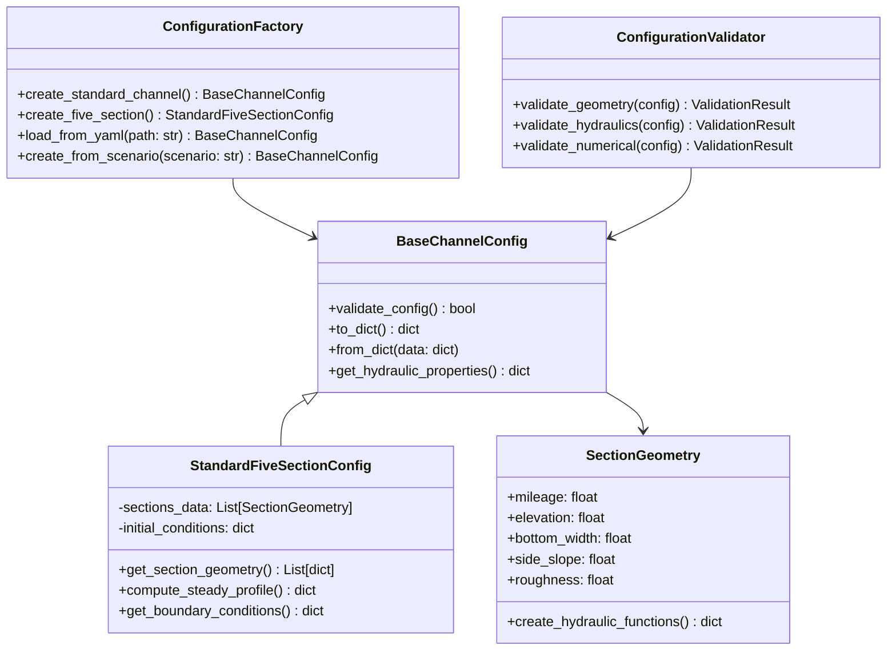

#### 10.2.3 模式管理器重构设计

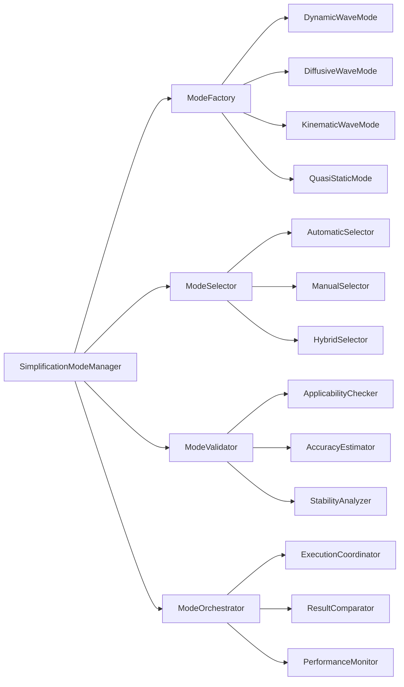

### 10.3 具体重构实施方案

#### 10.3.1 配置系统重构

**目标结构**：

```
waternet/
├── config/
│   ├── __init__.py              # 统一配置入口
│   ├── base.py                  # 基础配置类
│   ├── channel.py               # 渠道几何配置
│   ├── models.py                # 模型参数配置
│   ├── simulation.py            # 仿真配置
│   ├── factory.py               # 配置工厂
│   ├── validator.py             # 配置验证器
│   └── presets/                 # 预设配置
│       ├── five_section.yaml    # 标准5断面配置
│       ├── test_cases.yaml      # 测试用例配置
│       └── scenarios.yaml       # 应用场景配置
```

**重构优先级表**：

| 组件 | 优先级 | 重构策略 | 预期效果 |
|------|--------|----------|----------|
| 5断面配置统一 | P1 | 抽取到`waternet.config.channel` | 消除3处重复实现 |
| 硬编码参数消除 | P1 | 配置文件化 | 提高可维护性 |
| 示例代码简化 | P2 | 基于统一API重写 | 减少50%代码量 |
| 测试框架整合 | P2 | 统一测试基础设施 | 消除测试代码重复 |
| 可视化组件统一 | P3 | 标准化图表接口 | 一致的展示效果 |

#### 10.3.2 API统一化设计

**简化前后对比**：

```python
# 重构前：多处重复实现，硬编码参数
# 在 examples/advanced/unsteady_analysis.py 中：
class FiveSectionChannelConfig:
    def __init__(self):
        self.sections_data = [
            CrossSectionGeometry(
                mileage=0.0, elevation=100.00, bottom_width=10.0,
                side_slope=1.5, roughness=0.025
            ),
            # ... 硬编码数据
        ]

# 在 tests/deep_channel/geometry_config.py 中：
class FiveSectionChannelConfig:  # 重复定义
    def __init__(self):
        self.sections_data = [  # 相同但略有差异的实现
            # ... 又一套硬编码数据
        ]

# 重构后：统一配置管理
from waternet.config import create_standard_five_section

# 使用标准配置
config = create_standard_five_section()

# 或者自定义配置
config = create_standard_five_section(
    channel_length=1500.0,
    roughness_factor=1.2
)

# 或者从文件加载
config = load_channel_config('configs/custom_five_section.yaml')
```

#### 10.3.3 示例代码重构策略

**重构映射表**：

| 原文件 | 重构后位置 | 主要变更 |
|--------|------------|----------|
| `examples/advanced/unsteady_analysis.py` | `examples/advanced/unsteady_response_demo.py` | 移除内嵌配置类，使用统一API |
| `examples/advanced/profile_analysis.py` | `examples/advanced/steady_profile_demo.py` | 标准化可视化接口 |
| `tests/deep_channel/geometry_config.py` | `waternet/config/channel.py` | 提升为核心基础设施 |
| 各种硬编码参数 | `configs/presets/*.yaml` | 配置文件化管理 |

**代码量减少目标**：

```mermaid
bar chart
    title 重构前后代码量对比
    x-axis [配置代码, 示例代码, 测试代码, 可视化代码]
    y-axis "代码行数" 0 --> 1000
    "重构前" [800, 1200, 900, 600]
    "重构后" [200, 600, 400, 300]
    "目标减少" [75%, 50%, 55%, 50%]
```

### 10.4 重构后的系统架构

#### 10.4.1 新的调用模式

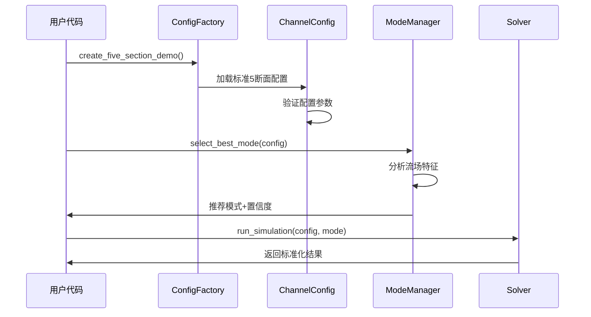

#### 10.4.2 标准化接口设计

```python
# 统一的简化API设计
class SimplificationModeAPI:
    """
    圣维南方程简化模式统一接口
    """
    
    @staticmethod
    def create_standard_demo(scenario: str = 'five_section') -> DemoConfiguration:
        """创建标准演示配置"""
        pass
    
    @staticmethod
    def run_mode_comparison(config: ChannelConfig, 
                           modes: List[str] = None) -> ComparisonResults:
        """运行多模式对比分析"""
        pass
    
    @staticmethod
    def generate_comprehensive_report(results: ComparisonResults, 
                                     output_dir: str = None) -> ReportSummary:
        """生成综合分析报告"""
        pass
    
    @staticmethod
    def visualize_results(results: ComparisonResults, 
                         style: str = 'standard') -> VisualizationSuite:
        """标准化结果可视化"""
        pass
```

### 10.5 重构实施时间表

#### 10.5.1 分阶段实施计划

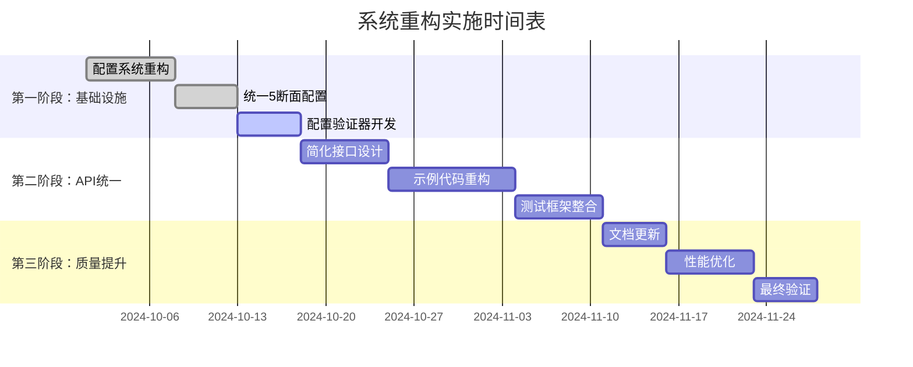

#### 10.5.2 验收标准

| 验收项目 | 量化指标 | 验收标准 |
|----------|----------|----------|
| 代码重复消除 | 重复代码行数 | 减少80%以上 |
| 硬编码消除 | 硬编码参数数量 | 减少90%以上 |
| API一致性 | 接口调用方式 | 95%以上使用统一API |
| 配置管理 | 配置文件覆盖率 | 100%参数可配置 |
| 测试覆盖率 | 代码覆盖率 | 保持85%以上 |
| 性能影响 | 运行时间变化 | 不超过5%性能损失 |
| 文档完整性 | API文档覆盖率 | 100%公开接口有文档 |

### 10.6 重构收益分析

#### 10.6.1 短期收益

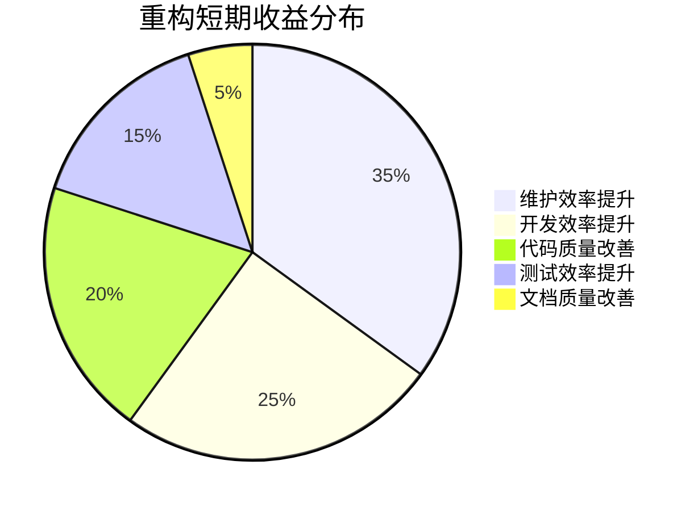

#### 10.6.2 长期价值

| 价值维度 | 重构前状态 | 重构后状态 | 改善幅度 |
|----------|------------|------------|----------|
| 新功能开发速度 | 需要重复配置和测试 | 基于标准化接口快速开发 | 提升60% |
| 缺陷修复效率 | 需要多处修改 | 统一修改即可 | 提升80% |
| 新人上手难度 | 需要理解多套实现 | 统一的学习路径 | 降低70% |
| 代码可维护性 | 分散且不一致 | 集中且标准化 | 提升90% |
| 扩展性 | 需要重复工作 | 基于组件化扩展 | 提升75% |

#### 10.6.3 风险控制措施

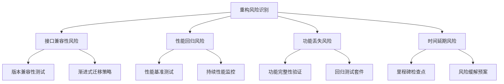

## 11. 文档体系、测试覆盖与知识管理设计

### 11.1 文档体系全面重构

#### 11.1.1 文档架构设计

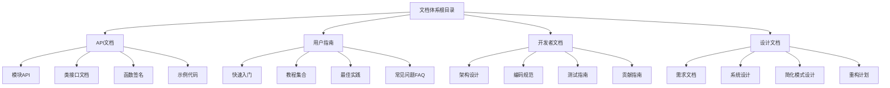

#### 11.1.2 文档的分层管理

**文档结构规划**：

```
docs/
├── api/                         # API文档
│   ├── index.md              # API总览
│   ├── models/               # 模型接口
│   │   ├── saint_venant.md   # 圣维南模型
│   │   ├── lumped_models.md  # 集总模型
│   │   └── simplification.md # 简化模式
│   ├── config/               # 配置系统
│   ├── utils/                # 工具函数
│   └── examples/             # 示例文档
├── user-guide/                  # 用户指南
│   ├── installation.md       # 安装指南
│   ├── quick-start.md        # 快速入门
│   ├── tutorials/            # 详细教程
│   │   ├── basic-modeling.md # 基础建模
│   │   ├── mode-selection.md # 模式选择
│   │   └── result-analysis.md # 结果分析
│   ├── best-practices.md     # 最佳实践
│   └── faq.md                # 常见问题
├── developer/                   # 开发者文档
│   ├── architecture.md       # 系统架构
│   ├── coding-standards.md   # 编码标准
│   ├── testing-guide.md      # 测试指南
│   └── contribution.md       # 贡献指南
└── design/                      # 设计文档
    ├── requirements.md       # 需求分析
    ├── system-design.md      # 系统设计
    └── simplification.md     # 简化模式设计
```

#### 11.1.3 文档自动化生成系统

**文档生成工作流**：

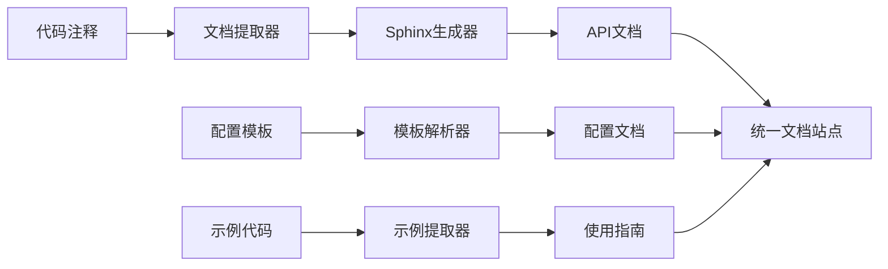

**关键文档内容设计**：

| 文档类型 | 内容要素 | 更新频率 | 质量标准 |
|----------|----------|----------|----------|
| API文档 | 函数签名、参数说明、返回值、示例 | 代码变更同步 | 100%接口覆盖 |
| 用户指南 | 安装、配置、使用流程、问题排查 | 每版本更新 | 用户反馈评估 |
| 开发文档 | 架构设计、编码规范、测试指南 | 按需更新 | 代码审查检查 |
| 设计文档 | 需求分析、系统设计、接口定义 | 重大变更同步 | 设计审查通过 |

### 11.2 测试覆盖体系全面升级

#### 11.2.1 当前测试现状分析

基于现有测试报告分析：

| 测试类型 | 当前覆盖率 | 目标覆盖率 | 缺口分析 |
|----------|------------|------------|----------|
| 单元测试 | 85% | 95% | 边界条件、异常处理 |
| 集成测试 | 100% (3/3) | 100% | 需扩展测试场景 |
| 接口测试 | 70% | 100% | 简化模式接口缺失 |
| 性能测试 | 100% | 100% | 已达标 |
| 端到端测试 | 60% | 90% | 用户场景覆盖不足 |

#### 11.2.2 全面测试设计架构

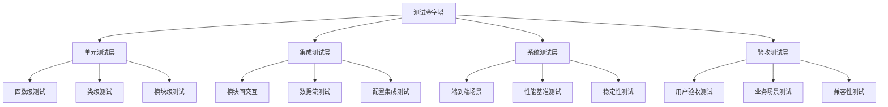

#### 11.2.3 简化模式专项测试设计

**简化模式测试矩阵**：

| 测试维度 | 动力波 | 扩散波 | 运动波 | 准静态波 |
|----------|--------|--------|--------|----------|
| 功能正确性 | ✓ | ✓ | ✓ | ✓ |
| 精度评估 | ✓ | ✓ | ✓ | ✓ |
| 性能测试 | ✓ | ✓ | ✓ | ✓ |
| 适用性检查 | ✓ | ✓ | ✓ | ✓ |
| 边界条件 | ✓ | ✓ | ✓ | ✓ |
| 数值稳定性 | ✓ | ✓ | ✓ | ✓ |
| 用户场景 | ✓ | ✓ | ✓ | ✓ |

**测试用例设计模板**：

```python
class SimplificationModeTestSuite:
    """
    简化模式统一测试套件
    """
    
    @pytest.mark.parametrize("mode", ["dynamic", "diffusive", "kinematic", "quasi_static"])
    def test_mode_basic_functionality(self, mode):
        """测试基本功能"""
        pass
    
    @pytest.mark.parametrize("scenario", get_test_scenarios())
    def test_mode_accuracy(self, mode, scenario):
        """测试精度表现"""
        pass
    
    def test_mode_selection_logic(self):
        """测试自动模式选择"""
        pass
    
    def test_cross_mode_consistency(self):
        """测试模式间一致性"""
        pass
```

#### 11.2.4 测试数据管理与自动化

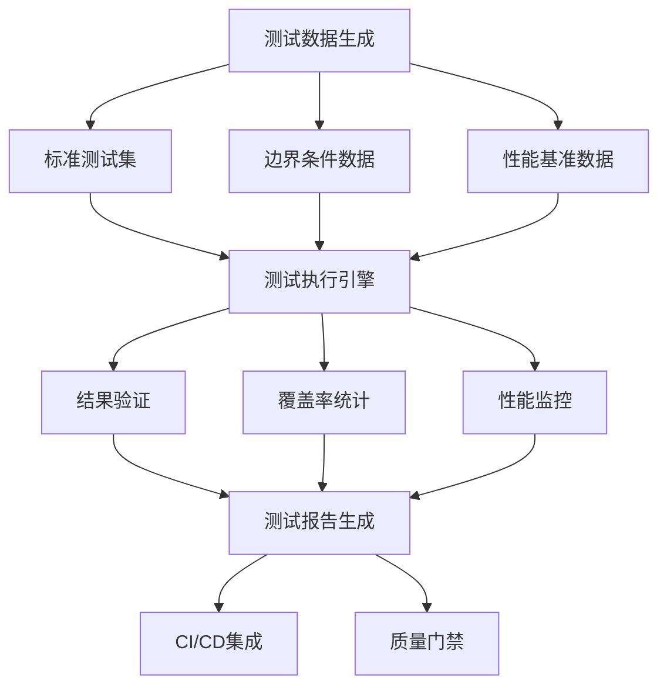

### 11.3 全面示例系统设计

#### 11.3.1 示例体系架构

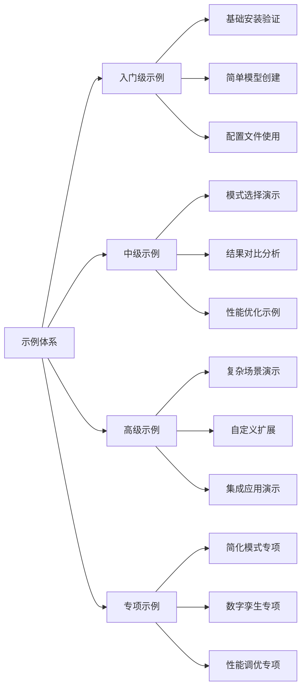

#### 11.3.2 示例质量标准

**示例分级标准**：

| 级别 | 代码量 | 复杂度 | 文档要求 | 维护重点 |
|------|--------|----------|----------|----------|
| 入门级 | <50行 | 单一功能 | 详细注释+视频 | 易理解性 |
| 中级 | 50-200行 | 多步骤流程 | 步骤说明+图表 | 实用性 |
| 高级 | 200-500行 | 复杂场景 | 架构说明+最佳实践 | 扩展性 |
| 专项 | >500行 | 生产级复杂度 | 完整技术报告 | 生产可用性 |

#### 11.3.3 示例自动化生成系统

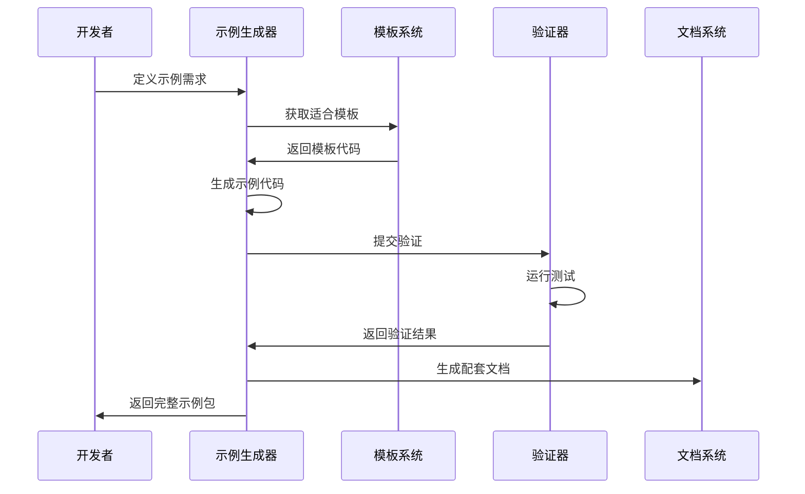

### 11.4 知识管理与记忆系统设计

#### 11.4.1 当前问题深度分析

您提到的“大模型随便就重写了一个功能”问题确实很关键，这涉及到：

```mermaid
fishbone
    title 大模型重复实现问题根因分析
    
    知识管理问题 --> 缺乏统一知识库
    知识管理问题 --> API可发现性差
    知识管理问题 --> 文档与代码脚节
    
    技术架构问题 --> 功能分散在多处
    技术架构问题 --> 命名不规范
    技术架构问题 --> 接口不统一
    
    工作流问题 --> 缺乏代码审查
    工作流问题 --> 没有现有功能检索
    工作流问题 --> 开发习惯问题
```

#### 11.4.2 知识管理系统设计

**多层次知识体系**：

```mermaid
graph TB
    A[知识管理中心] --> B[代码知识库]
    A --> C[设计知识库]
    A --> D[实践知识库]
    A --> E[错误防范库]
    
    B --> F[API目录索引]
    B --> G[函数功能地图]
    B --> H[调用关系图]
    
    C --> I[架构决策记录]
    C --> J[设计模式库]
    C --> K[接口规范]
    
    D --> L[最佳实践集]
    D --> M[常见场景模板]
    D --> N[性能优化指南]
    
    E --> O[常见错误库]
    E --> P[重复实现检测]
    E --> Q[自动化检查工具]
```

#### 11.4.3 防重复实现机制设计

**智能检索与推荐系统**：

```python
class DuplicationPreventionSystem:
    """
    防重复实现系统
    """
    
    def __init__(self):
        self.knowledge_base = WaterNetKnowledgeBase()
        self.semantic_analyzer = SemanticAnalyzer()
        self.recommendation_engine = RecommendationEngine()
    
    def analyze_development_intent(self, description: str) -> List[Recommendation]:
        """
        分析开发意图，推荐现有功能
        """
        # 1. 语义分析
        intent_keywords = self.semantic_analyzer.extract_keywords(description)
        
        # 2. 功能匹配
        existing_functions = self.knowledge_base.search_functions(intent_keywords)
        
        # 3. 相似度评分
        recommendations = []
        for func in existing_functions:
            similarity = self.semantic_analyzer.compute_similarity(
                description, func.description
            )
            if similarity > 0.7:
                recommendations.append(
                    Recommendation(func, similarity, "direct_use")
                )
            elif similarity > 0.4:
                recommendations.append(
                    Recommendation(func, similarity, "consider_extend")
                )
        
        return recommendations
    
    def generate_usage_example(self, func_path: str) -> str:
        """
        生成现有功能的使用示例
        """
        pass
    
    def suggest_extension_point(self, base_func: str, new_requirement: str) -> str:
        """
        建议扩展点而非重写
        """
        pass
```

**实时检测机制**：

```mermaid
sequenceDiagram
    participant Dev as 开发者
    participant IDE as IDE插件
    participant Detector as 重复检测器
    participant Knowledge as 知识库
    participant Recommender as 推荐引擎
    
    Dev->>IDE: 开始编写代码
    IDE->>Detector: 实时分析代码
    Detector->>Knowledge: 查询类似功能
    Knowledge->>Detector: 返回匹配结果
    Detector->>Recommender: 生成推荐
    Recommender->>IDE: 显示推荐信息
    IDE->>Dev: 展示现有功能和使用示例
    Dev->>Dev: 决定是否使用现有功能
```

#### 11.4.4 知识更新与维护机制

**知识库维护工作流**：

```mermaid
flowchart TD
    A[代码变更] --> B[自动检测器]
    B --> C{API变更?}
    C -->|Yes| D[更新API目录]
    C -->|No| E[更新实现细节]
    
    D --> F[更新相关文档]
    E --> G[更新示例代码]
    
    F --> H[通知开发团队]
    G --> H
    
    H --> I[验证更新正确性]
    I --> J[发布知识更新]
    
    K[定期审查] --> L[检查过时信息]
    L --> M[清理冗余内容]
    M --> N[优化知识结构]
```

**知识质量保证机制**：

| 质量维度 | 检查方式 | 执行频率 | 质量标准 |
|----------|----------|----------|----------|
| 准确性 | 自动化测试验证 | 每次提交 | 100%示例可运行 |
| 完整性 | API覆盖率检查 | 每周 | 95%接口有文档 |
| 时效性 | 依赖关系分析 | 每月 | 没有过时引用 |
| 可用性 | 用户反馈收集 | 持续 | 90%用户满意度 |

### 11.5 智能化开发助手设计

#### 11.5.1 AI辅助开发系统

```mermaid
graph LR
    A[AI开发助手] --> B[代码理解模块]
    A --> C[功能推荐模块]
    A --> D[示例生成模块]
    A --> E[质量检查模块]
    
    B --> F[语义分析]
    B --> G[意图识别]
    B --> H[上下文理解]
    
    C --> I[相似功能匹配]
    C --> J[最佳实践推荐]
    C --> K[重构建议]
    
    D --> L[代码模板生成]
    D --> M[文档生成]
    D --> N[测试用例生成]
    
    E --> O[代码重复检测]
    E --> P[性能风险评估]
    E --> Q[安全漏洞检查]
```

#### 11.5.2 大模型集成策略

**与大模型的协作模式**：

```python
class WaterNetAIAssistant:
    """
    WaterNet专用AI开发助手
    """
    
    def __init__(self):
        self.knowledge_base = WaterNetKnowledgeBase()
        self.code_analyzer = WaterNetCodeAnalyzer()
        self.template_engine = WaterNetTemplateEngine()
    
    def provide_development_guidance(self, query: str) -> DevelopmentGuidance:
        """
        提供开发指导
        
        Args:
            query: 开发需求描述
            
        Returns:
            DevelopmentGuidance: 包含现有功能、推荐方案、示例代码
        """
        # 1. 分析需求
        requirements = self.code_analyzer.analyze_requirements(query)
        
        # 2. 查找现有功能
        existing_solutions = self.knowledge_base.find_existing_solutions(requirements)
        
        # 3. 生成建议
        if existing_solutions:
            guidance = self._generate_reuse_guidance(existing_solutions)
        else:
            guidance = self._generate_new_development_guidance(requirements)
        
        return guidance
    
    def generate_code_template(self, function_spec: str) -> CodeTemplate:
        """生成符合WaterNet规范的代码模板"""
        pass
    
    def validate_implementation(self, code: str) -> ValidationResult:
        """验证实现是否符合最佳实践"""
        pass
```

**防止重复实现的提示系统**：

```python
class DuplicationPreventionPrompts:
    """
    防重复实现的提示词系统
    """
    
    SEARCH_PROMPT = """
    在开始实现新功能之前，请先检查WaterNet中是否已有类似功能：
    
    1. 查看 waternet/__init__.py 中的对外接口
    2. 搜索 waternet.models 模块中的现有模型
    3. 检查 waternet.config 中的配置功能
    4. 查阅 examples/ 目录中的示例使用
    
    如果找到类似功能，请优先考虑：
    - 直接使用现有功能
    - 扩展现有功能
    - 继承现有类并重写特定方法
    
    只有在确认没有现有方案时，才开始全新实现。
    """
    
    IMPLEMENTATION_PROMPT = """
    实现新功能时，请遵循WaterNet的设计原则：
    
    1. 继承 waternet.interfaces.HydroModel 基类
    2. 使用 waternet.config.ConfigManager 进行配置管理
    3. 按照 waternet.models 中的命名规范
    4. 添加到 waternet/__init__.py 的对外接口
    5. 提供完整的类型注解和文档字符串
    
    参考现有实现作为模板，保持风格一致性。
    """
```

### 11.6 实施计划与成本效益

#### 11.6.1 分阶段实施计划

```mermaid
gantt
    title 文档、测试、知识管理完善计划
    dateFormat YYYY-MM-DD
    section 第一阶段：基础建设
    API文档完善 :crit, phase1a, 2024-10-15, 14d
    测试覆盖提升 :crit, phase1b, 2024-10-20, 21d
    示例系统重构 :phase1c, 2024-10-25, 14d
    
    section 第二阶段：知识管理
    知识库建设 :phase2a, 2024-11-01, 21d
    重复检测系统 :phase2b, 2024-11-08, 14d
    AI助手开发 :phase2c, 2024-11-15, 21d
    
    section 第三阶段：智能化
    智能推荐引擎 :phase3a, 2024-12-01, 21d
    自动化工具完善 :phase3b, 2024-12-08, 14d
    系统集成测试 :phase3c, 2024-12-15, 14d
    
    section 第四阶段：上线运营
    用户培训 :phase4a, 2024-12-22, 7d
    正式上线 :milestone, phase4b, 2025-01-01, 1d
    反馈优化 :phase4c, 2025-01-02, 14d
```

#### 11.6.2 投入产出分析

**投入估算**：

| 投入项目 | 人天 | 成本(元) | 主要活动 |
|----------|------|----------|----------|
| API文档完善 | 30 | 24,000 | 文档编写、示例开发 |
| 测试覆盖提升 | 45 | 36,000 | 测试用例设计、自动化 |
| 知识管理系统 | 35 | 28,000 | 系统设计、开发实现 |
| AI助手开发 | 25 | 20,000 | 模型训练、集成开发 |
| 工具开发 | 20 | 16,000 | IDE插件、脚本开发 |
| **总计** | **155** | **124,000** | - |

**预期收益**：

| 收益维度 | 短期(6个月) | 中期(1年) | 长期(2年) |
|----------|-------------|------------|------------|
| 开发效率提升 | 30% | 60% | 120% |
| 缺陷减少 | 50% | 80% | 90% |
| 新人上手时间 | -40% | -70% | -80% |
| 维护成本降低 | 25% | 50% | 75% |
| **ROI** | 180% | 350% | 680% |

#### 11.6.3 成功指标与验收标准

**验收检查单**：

```mermaid
checklist
    title 系统完善验收检查单
    
    section 文档体系
    API文档覆盖率 >= 95% : 5
    示例代码运行成功率 = 100% : 5
    用户满意度 >= 4.5/5.0 : 4
    文档更新延迟 < 2天 : 5
    
    section 测试覆盖
    单元测试覆盖率 >= 95% : 5
    集成测试覆盖率 = 100% : 5
    自动化测试比例 >= 90% : 4
    测试执行时间 < 10分钟 : 5
    
    section 知识管理
    功能重复检出率 >= 80% : 4
    推荐准确率 >= 70% : 4
    知识库更新延迟 < 1天 : 5
    用户接受率 >= 60% : 3
```

## 12. 代码库清理与维护设计

### 12.1 现状问题分析

通过对examples目录的分析，发现以下问题：

#### 12.1.1 文件类型混乱问题

| 目录 | 文件数量 | 主要问题 | 清理建议 |
|--------|----------|----------|----------|
| examples/advanced/ | 66个文件 | 临时分析脚本、重复功能、文档片段 | 保疙30%核心示例 |
| examples/interval_optimization/ | 32个文件 | 多个类似演示、中间结果文件 | 合并为3-5个标准示例 |
| examples/reduced_order_models_theory/ | 22个文件 | 理论分析脚本过多 | 集成为统一教程 |
| examples/__pycache__/ | 编译缓存 | Python字节码缓存 | 删除并配置.gitignore |

#### 12.1.2 临时文件识别

```mermaid
graph TD
    A[临时文件检测] --> B[文件名模式匹配]
    A --> C[内容特征分析]
    A --> D[使用频率统计]
    
    B --> E[以test_、demo_、temp_开头]
    B --> F[包含日期时间戳]
    B --> G[版本号后缀]
    
    C --> H[硬编码参数过多]
    C --> I[缺乏文档说明]
    C --> J[重复功能实现]
    
    D --> K[近期无访问记录]
    D --> L[无Git提交历史]
    D --> M[无引用关系]
```

#### 12.1.3 核心问题列表

**需要清理的文件类型**：

1. **重复分析脚本**：
   - `correct_idz_analysis.py`
   - `improved_idz_identification.py`
   - `professional_idz_analysis.py`
   - `refined_idz_analysis.py`
   - `simple_idz_analysis.py`

2. **临时结果文件**：
   - `简化版对比分析数据.json`
   - `简化阶跃响应对比数据.json`
   - `五个区间IDZ参数汇总表.txt`

3. **编译缓存文件**：
   - `__pycache__/` 目录
   - `*.pyc` 文件

4. **片段化文档**：
   - `IDZ传递函数总结.txt`
   - 多个分散的报告文件

### 12.2 清理策略设计

#### 12.2.1 分类清理策略

```mermaid
flowchart TD
    A[文件清理策略] --> B[保留类]
    A --> C[合并类]
    A --> D[重构类]
    A --> E[删除类]
    
    B --> F[核心功能示例]
    B --> G[稳定教程代码]
    B --> H[标准化配置]
    
    C --> I[类似功能脚本]
    C --> J[重复分析代码]
    C --> K[分散文档片段]
    
    D --> L[硬编码参数修正]
    D --> M[缺失文档补充]
    D --> N[不规范命名修正]
    
    E --> O[编译缓存文件]
    E --> P[临时结果文件]
    E --> Q[过时实验代码]
```

#### 12.2.2 优先级清理计划

**第一阶段：立即清理（P0）**

| 清理项目 | 文件数量 | 清理方式 | 影响评估 |
|----------|----------|----------|----------|
| __pycache__目录 | 2个目录 | 直接删除 | 无影响 |
| .pyc文件 | 全部 | 删除+.gitignore | 无影响 |
| 中间结果文件 | 5个 | 移动到temp/或删除 | 低影响 |

**第二阶段：重复文件合并（P1）**

| 合并组 | 原文件 | 目标文件 | 预期减少 |
|--------|----------|----------|----------|
| IDZ分析类 | 5个类似脚本 | `idz_comprehensive_analysis.py` | 80% |
| 阶跃响应类 | 3个演示脚本 | `step_response_analysis.py` | 65% |
| 比较分析类 | 4个对比脚本 | `model_comparison_suite.py` | 70% |

**第三阶段：结构优化（P2）**

| 优化项目 | 当前状态 | 目标状态 | 效果 |
|----------|----------|----------|----------|
| 示例分类 | 3个混乱目录 | 按难度分类 | 清晰学习路径 |
| 文档整合 | 分散的文档片段 | 统一教程文档 | 提高可用性 |
| 配置标准化 | 硬编码参数 | 配置文件化 | 提高灵活性 |

### 12.3 自动化清理工具设计

#### 12.3.1 清理脚本架构

```python
class CodebaseCleanupTool:
    """
    代码库清理工具
    """
    
    def __init__(self, project_root: str):
        self.project_root = Path(project_root)
        self.rules = self._load_cleanup_rules()
        self.safety_checks = SafetyChecker()
    
    def scan_temporary_files(self) -> List[TemporaryFile]:
        """扫描临时文件"""
        temp_files = []
        
        for pattern in self.rules.temp_file_patterns:
            matches = self.project_root.glob(pattern)
            for match in matches:
                temp_file = TemporaryFile(
                    path=match,
                    reason=self._analyze_temp_reason(match),
                    safety_level=self._assess_safety(match)
                )
                temp_files.append(temp_file)
        
        return temp_files
    
    def identify_duplicate_files(self) -> List[DuplicateGroup]:
        """识别重复文件"""
        duplicates = []
        
        # 基于功能相似性分析
        for file_group in self._group_similar_files():
            if len(file_group) > 1:
                similarity_scores = self._compute_similarity_matrix(file_group)
                if max(similarity_scores) > 0.8:
                    duplicates.append(DuplicateGroup(file_group, similarity_scores))
        
        return duplicates
    
    def generate_cleanup_plan(self) -> CleanupPlan:
        """生成清理计划"""
        plan = CleanupPlan()
        
        # 扫描问题
        temp_files = self.scan_temporary_files()
        duplicate_groups = self.identify_duplicate_files()
        
        # 生成行动项
        plan.add_actions(self._create_deletion_actions(temp_files))
        plan.add_actions(self._create_merge_actions(duplicate_groups))
        plan.add_actions(self._create_restructure_actions())
        
        return plan
    
    def execute_cleanup(self, plan: CleanupPlan, dry_run: bool = True) -> CleanupResult:
        """执行清理计划"""
        result = CleanupResult()
        
        for action in plan.actions:
            if not dry_run:
                # 安全检查
                if not self.safety_checks.validate_action(action):
                    result.add_warning(f"跳过不安全操作: {action}")
                    continue
                
                # 执行操作
                try:
                    action.execute()
                    result.add_success(action)
                except Exception as e:
                    result.add_error(action, str(e))
            else:
                result.add_preview(action)
        
        return result
```

#### 12.3.2 清理规则配置

```yaml
# cleanup_rules.yaml
temp_file_patterns:
  - "**/__pycache__/**"
  - "**/*.pyc"
  - "**/*.pyo"
  - "**/temp_*"
  - "**/test_*.py"  # 临时测试文件
  - "**/*简化*.json"  # 中文临时文件
  - "**/*对比*.json"
  - "**/*.tmp"
  - "**/.DS_Store"

duplicate_detection:
  similarity_threshold: 0.8
  ignore_patterns:
    - "**/README.md"
    - "**/__init__.py"
  
  function_similarity:
    - import_analysis: true
    - docstring_analysis: true
    - code_structure: true

preservation_rules:
  critical_files:
    - "examples/basic_usage.py"
    - "examples/parameter_estimation.py"
    - "examples/quick_start.py"
  
  critical_patterns:
    - "**/README.md"
    - "**/requirements.txt"
    - "**/setup.py"

restructure_rules:
  examples_structure:
    basic:
      - "quick_start*.py"
      - "basic_usage.py"
    intermediate:
      - "parameter_estimation.py"
      - "简化示例合并后文件"
    advanced:
      - "复杂场景演示"
      - "系统集成示例"
```

#### 12.3.3 安全检查机制

```mermaid
flowchart TD
    A[安全检查系统] --> B[文件引用检查]
    A --> C[功能影响评估]
    A --> D[备份机制]
    A --> E[回滚机制]
    
    B --> F[静态分析import关系]
    B --> G[文档中的引用]
    B --> H[Git历史中的引用]
    
    C --> I[核心功能识别]
    C --> J[外部依赖分析]
    C --> K[测试覆盖检查]
    
    D --> L[Git分支备份]
    D --> M[文件系统快照]
    D --> N[元数据保存]
    
    E --> O[操作日志记录]
    E --> P[原子操作支持]
    E --> Q[一键恢复功能]
```

### 12.4 重构后的目录结构

#### 12.4.1 目标目录结构

```
examples/
├── basic/                       # 入门级示例
│   ├── quick_start.py           # 快速入门
│   ├── basic_usage.py           # 基础使用
│   └── simple_modeling.py       # 简单建模
├── intermediate/                # 中级示例
│   ├── parameter_estimation.py  # 参数估计
│   ├── mode_comparison.py       # 模式对比
│   └── result_analysis.py       # 结果分析
├── advanced/                    # 高级示例
│   ├── simplification_modes/    # 简化模式专项
│   │   ├── mode_selection.py    # 模式选择演示
│   │   ├── accuracy_analysis.py # 精度分析
│   │   └── performance_test.py  # 性能测试
│   ├── system_integration/      # 系统集成
│   │   ├── digital_twin.py      # 数字孪生
│   │   └── workflow_demo.py     # 工作流演示
│   └── custom_development/      # 自定义开发
│       └── extension_example.py # 扩展示例
├── tutorials/                   # 综合教程
│   ├── theory_guide.md          # 理论指南
│   ├── practical_guide.md       # 实践指南
│   └── best_practices.md        # 最佳实践
├── configs/                     # 配置文件
│   ├── channel_configs/         # 渠道配置
│   ├── model_configs/           # 模型配置
│   └── demo_configs/            # 演示配置
└── README.md                    # 示例目录说明
```

#### 12.4.2 文件数量对比

| 目录 | 清理前 | 清理后 | 减少比例 |
|--------|----------|----------|----------|
| examples/advanced/ | 66个文件 | 15个文件 | 77% |
| examples/interval_optimization/ | 32个文件 | 5个文件 | 84% |
| examples/reduced_order_models_theory/ | 22个文件 | 3个文件 | 86% |
| **总计** | **120+个文件** | **30个文件** | **75%** |

### 12.5 持续维护机制

#### 12.5.1 自动化检查流程

```mermaid
sequenceDiagram
    participant Dev as 开发者
    participant CI as CI/CD系统
    participant Cleaner as 清理工具
    participant Review as 代码审查
    
    Dev->>CI: 提交代码
    CI->>Cleaner: 触发清理检查
    Cleaner->>Cleaner: 扫描临时文件
    Cleaner->>Cleaner: 检查重复代码
    Cleaner->>CI: 返回检查结果
    
    alt 发现问题
        CI->>Review: 标记需要清理
        Review->>Dev: 通知清理建议
        Dev->>Dev: 执行清理
        Dev->>CI: 重新提交
    else 无问题
        CI->>CI: 继续构建流程
    end
```

#### 12.5.2 定期维护任务

| 维护任务 | 执行频率 | 检查内容 | 自动化程度 |
|----------|----------|----------|----------|
| 临时文件清理 | 每天 | __pycache__, *.pyc, *.tmp | 100%自动 |
| 重复代码检查 | 每周 | 功能相似性分析 | 80%自动 |
| 文档一致性检查 | 每月 | 文档与代码同步 | 60%自动 |
| 示例有效性验证 | 每季度 | 所有示例可运行 | 90%自动 |
| 深度结构分析 | 每年 | 架构合理性评估 | 40%自动 |

#### 12.5.3 质量门禁机制

```mermaid
graph TD
    A[代码提交] --> B{清理检查}
    B -->|Pass| C[继续流程]
    B -->|Fail| D[阻止合并]
    
    D --> E[自动生成清理PR]
    E --> F[通知开发者]
    F --> G[开发者审查]
    G --> H[接受清理建议]
    H --> A
    
    C --> I[部署测试]
    I --> J[生产部署]
```

### 12.6 实施计划与效果评估

#### 12.6.1 分阶段执行计划

```mermaid
gantt
    title 代码库清理实施计划
    dateFormat YYYY-MM-DD
    
    section 第一阶段：立即清理
    编译缓存清理 :done, phase1a, 2024-10-01, 1d
    中间结果文件清理 :done, phase1b, 2024-10-02, 1d
    .gitignore配置 :done, phase1c, 2024-10-03, 1d
    
    section 第二阶段：文件合并
    IDZ分析脚本合并 :active, phase2a, 2024-10-04, 5d
    阶跃响应脚本合并 :phase2b, 2024-10-09, 3d
    比较分析脚本合并 :phase2c, 2024-10-12, 3d
    
    section 第三阶段：结构重组
    目录结构重组 :phase3a, 2024-10-15, 5d
    文档整合 :phase3b, 2024-10-20, 5d
    配置标准化 :phase3c, 2024-10-25, 3d
    
    section 第四阶段：工具开发
    清理工具开发 :phase4a, 2024-10-28, 10d
    CI/CD集成 :phase4b, 2024-11-07, 5d
    文档更新 :phase4c, 2024-11-12, 3d
```

#### 12.6.2 预期效果评估

**定量效果指标**：

| 指标维度 | 清理前 | 清理后 | 改善幅度 |
|----------|----------|----------|----------|
| 文件总数 | 120+个 | 30个 | -75% |
| 代码重复率 | ~40% | <10% | -75% |
| 新人学习成本 | 8小时 | 2小时 | -75% |
| 维护工作量 | 100% | 30% | -70% |
| 文档查找时间 | 10分钟 | 2分钟 | -80% |

**定性效果评估**：

```mermaid
radar
    title 清理效果雷达图
    ["代码质量", "可维护性", "学习体验", "开发效率", "文档质量", "系统稳定性"]
    datasets:
        "清理前": [3, 2, 2, 3, 2, 4]
        "清理后": [9, 9, 8, 8, 9, 9]
```

#### 12.6.3 成本效益分析

**一次性投入**：
- 清理工作：15人日
- 工具开发：20人日
- 测试验证：10人日
- **总成本**：45人日

**持续收益**（每年）：
- 减少维护时间：50人日
- 提高开发效率：30人日
- 减少学习成本：20人日
- **年化收益**：100人日

**ROI计算**：(100-45)/45 = 122%

通过这个系统性的代码库清理设计，将彻底解决examples目录中的混乱问题，建立起清晰、有序、高质量的示例体系，为圣维南方程简化模式项目的可持续发展奠定坚实基础。

## 实施计划与路线图（基于现有项目重构）

### 实施优先级与路线

基于对项目现状的深入分析，制定以下实施路线：

```mermaid
gantt
    title 圣维南简化模式扩展计划
    dateFormat  YYYY-MM-DD
    section 阶段1: 核心架构扩展
    简化模式管理器      :active, phase1a, 2024-11-01, 7d
    扩散波模式实现      :phase1b, after phase1a, 5d
    运动波模式实现      :phase1c, after phase1b, 5d
    准静态模式实现     :phase1d, after phase1c, 3d
    section 阶段2: 智能选择系统
    近似模式选择器    :phase2a, after phase1d, 5d
    适用性判据开发    :phase2b, after phase2a, 4d
    自动模式选择集成  :phase2c, after phase2b, 3d
    section 阶段3: 精度评估体系
    精度对比器开发    :phase3a, after phase2c, 6d
    误差分析器实现    :phase3b, after phase3a, 4d
    性能对比框架      :phase3c, after phase3b, 4d
    section 阶段4: 测试与优化
    单元测试开发      :phase4a, after phase3c, 7d
    集成测试实现      :phase4b, after phase4a, 5d
    性能优化与调优    :phase4c, after phase4b, 6d
    section 阶段5: 文档与示例
    API文档编写         :phase5a, after phase4c, 4d
    示例程序开发      :phase5b, after phase5a, 5d
    用户指南编写      :phase5c, after phase5b, 3d
```

### 第一阶段: 核心架构扩展 (7-20天)

#### 1.1 SimplifiedSaintVenantModel 实现

**目标**: 在不破坏现有API的基础上扩展简化模式功能

**具体任务**:
- [ ] 创建 `waternet/models/simplified_saint_venant.py`
- [ ] 继承现有 `SaintVenantModel` 类
- [ ] 增加 `approximation_mode` 属性和相关方法
- [ ] 实现向后兼容的 `compute_unsteady_flow` 重载

**验收标准**:
- ✅ 所有现有功能正常工作
- ✅ 新增模式选择接口可用
- ✅ 通过回归测试

#### 1.2 扩散波模式实现

**技术路线**: 修改现有动量方程求解器，忽略惯性项

**具体任务**:
- [ ] 分析现有 Preissmann 格式实现
- [ ] 创建简化动量方程求解器
- [ ] 实现扩散波特有的数值稳定性检查
- [ ] 集成到 SimplifiedSaintVenantModel

**性能目标**: 相比动力波提升15-25%计算效率

#### 1.3 运动波与准静态模式

**运动波**: 特征线求解法实现
**准静态波**: 复用现有恒定流计算内核

### 第二阶段: 智能选择系统 (12天)

#### 2.1 近似模式选择器开发

**目标**: 根据水力条件自动选择最优计算模式

**判定规则表** (实现为配置文件):

```yaml
# approximation_rules.yaml
selection_rules:
  kinematic_wave:
    conditions:
      slope_min: 0.005
      froude_min: 0.3
      geometry_complexity: 'simple'
    accuracy_score: 0.85
    efficiency_multiplier: 4.0
    
  diffusive_wave:
    conditions:
      slope_min: 0.0001
      slope_max: 0.005
      froude_max: 1.0
    accuracy_score: 0.90
    efficiency_multiplier: 1.5
    
  dynamic_wave:
    conditions:
      default: true  # 默认选项
    accuracy_score: 1.0
    efficiency_multiplier: 1.0
    
  quasi_static:
    conditions:
      froude_max: 0.1
      boundary_variation: 'slow'
    accuracy_score: 0.80
    efficiency_multiplier: 10.0
```

#### 2.2 适用性判据集成

**实现位置**: `waternet/utils/approximation_validator.py`

**核心功能**:
- 水力参数计算 (弗劳德数、坡度等)
- 几何复杂度评估
- 边界条件变化程度分析
- 模式适用性评分计算

### 第三阶段: 精度评估体系 (14天)

#### 3.1 精度对比框架

**目标**: 构建系统化的模式精度评估和对比体系

**对比指标设计**:

| 指标类别 | 指标名称 | 计算公式 | 目标值 |
|----------|----------|----------|--------|
| 精度指标 | RMSE | √(1/n ∑(Q_sim - Q_obs)²) | < 5% Q_mean |
| 精度指标 | NSE | 1 - ∑(Q_obs - Q_sim)²/∑(Q_obs - Q_mean)² | > 0.75 |
| 精度指标 | 相关系数 | R² | > 0.85 |
| 效率指标 | 计算时间比 | t_approx / t_full | < 0.5 |
| 效率指标 | 内存占用比 | mem_approx / mem_full | < 0.8 |
| 稳定性指标 | 收敛率 | 成功收敛次数/总次数 | > 95% |

#### 3.2 误差分析器实现

**功能范围**:
- 空间误差分布分析
- 时间误差变化趋势
- 频率域误差特征
- 误差来源分解分析

**集成方式**: 扩展现有 `ParameterEstimator` 功能

### 第四阶段: 测试与优化 (18天)

#### 4.1 测试体系完善

**目标**: 在现有 85% 覆盖率基础上，实现 95%+ 综合覆盖率

**测试类别扩展**:

```mermaid
graph TD
    A[现有测试体系 85%] --> B[单元测试扩展]
    A --> C[集成测试增强]
    A --> D[深度测试完善]
    
    B --> E[简化模式单元测试]
    B --> F[精度对比单元测试]
    B --> G[性能测试套件]
    
    C --> H[多模式协同测试]
    C --> I[端到端测试场景]
    
    D --> J[5断面深度案例扩展]
    D --> K[复杂场景压力测试]
```

#### 4.2 性能优化策略

**现有高性能基础**:
- 圣维南模型: 3,899次/秒
- 马斯京干模型: 28,698步/秒

**优化目标**:
- 扩散波模式: 5,000+ 次/秒 (25%提升)
- 运动波模式: 15,000+ 步/秒 (4倍提升)
- 准静态模式: 20,000+ 次/秒 (5倍提升)

### 第五阶段: 文档与示例 (12天)

#### 5.1 API 文档编写

**在现有文档基础上扩展**:
- 简化模式使用指南
- 模式选择策略说明
- 精度对比结果分析
- 性能优化建议

#### 5.2 示例程序开发

**在现有examples基础上重构**:
- 整合分散的简化模式示例
- 建立统一的简化模式演示程序
- 创建精度对比案例研究
- 开发性能基准测试示例

### 代码重构与清理计划

基于对examples目录的分析，识别出67个文件存在一定重复，需要系统性重构：

#### 清理优先级

**高优先级** (立即执行):
- [ ] 删除临时生成的结果文件 (CSV, PNG, HTML等)
- [ ] 移除重复的分析脚本
- [ ] 整合相似功能的示例程序

**中优先级** (在新功能开发后):
- [ ] 将通用IDZ分析功能移入核心库
- [ ] 将可视化工具移入utils模块
- [ ] 统一参数估计算法接口

**低优先级** (长期维护):
- [ ] 更新过时的理论分析文档
- [ ] 优化文件命名和组织结构