# 水系统对象重构设计文档

## 概述

本设计文档定义了WaterNet代码库的彻底重构方案，采用面向对象设计理念，以水系统物理对象为核心，统一所有仿真方法。设计目标是建立一个统一、可扩展、易维护的水系统仿真框架，消除当前代码中各种仿真方法相互独立、关系不清的问题。

### 设计目标

1. **统一对象模型**：以水系统物理对象为基础，统一所有仿真方法
2. **多层次建模**：支持精细化、简化和降阶等多种建模方法
3. **配置驱动**：通过配置文件驱动对象实例化和参数设置
4. **数字孪生**：支持同步孪生功能和在线参数校正
5. **可视化输出**：提供丰富的结果可视化和数据导出功能

## 核心架构设计

### 统一对象体系

采用分层的对象继承体系，以`WaterSystemObject`为根基类，派生出各种具体的水系统对象。

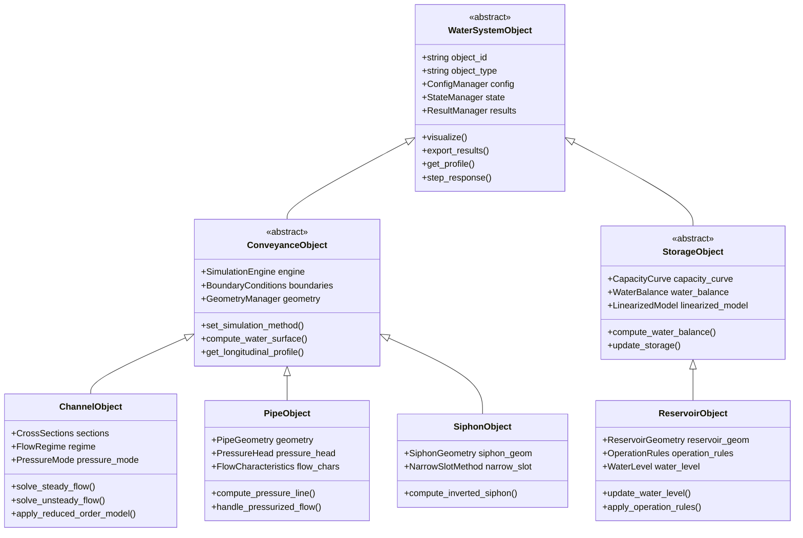

### 仿真方法体系

水系统对象的仿真方法按照空间表示方式分为集总式模型和分布式模型两大类。这种分类比传统的精细化-简化-降阶分类更能反映模型的本质特征。

#### 模型分类体系

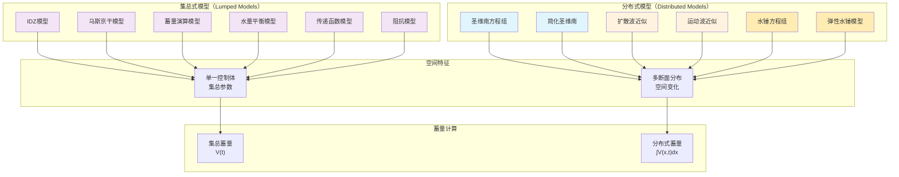

#### 蓄量计算对比

##### 集总式模型蓄量计算

| 模型类型 | 蓄量表达式 | 物理意义 | 计算方式 |
|----------|------------|----------|----------|
| IDZ模型 | V(t) = V₀ + ∫Q_in(τ)dτ - ∫Q_out(τ)dτ | 整体平均蓄量 | 时间积分 |
| 马斯京干模型 | V(t) = K·[x·Q_in + (1-x)·Q_out] | 线性化平衡蓄量 | 加权平均 |
| 蓄量演算模型 | V(t) = V(t-1) + (Q_in - Q_out)·Δt | 连续性方程蓄量 | 时步递推 |
| 水量平衡模型 | V(t) = V₀ + ∑(Q_in - Q_out)·Δt | 简化平衡蓄量 | 代数求和 |

##### 分布式模型蓄量计算

| 模型类型 | 蓄量表达式 | 物理意义 | 计算方式 |
|----------|------------|----------|----------|
| 圣维南方程组 | V(t) = ∫₀ᴸ A(x,t)dx | 总蓄水体积 | 空间积分 |
| 简化圣维南 | V(t) = ∫₀ᴸ A(x,t)dx | 近似总蓄量 | 数值积分 |
| 扩散波模型 | V(t) = ∫₀ᴸ A(x,t)dx | 扩散波蓄量 | 断面累加 |
| 运动波模型 | V(t) = ∫₀ᴸ A(x,t)dx | 运动波蓄量 | 简化积分 |

#### 明渠系统仿真方法

##### 集总式明渠模型

| 模型类型 | 空间表示 | 物理基础 | 适用场景 |
|----------|----------|----------|----------|
| IDZ模型 | 单节点 | 传递函数 | 系统控制分析 |
| 马斯京干模型 | 单节点 | 流量演算 | 洪水预报 |
| 蓄量演算模型 | 单节点 | 水量平衡 | 水库调度 |
| 水量平衡模型 | 单节点 | 连续性方程 | 概念性分析 |

##### 分布式明渠模型

| 模型类型 | 断面数量 | 物理方程 | 计算精度 |
|----------|----------|----------|----------|
| 圣维南方程组 | 多断面 | 完整方程组 | 最高精度 |
| 简化圣维南 | 多断面 | 忽略惯性项 | 高精度 |
| 扩散波近似 | 多断面 | 忽略局部加速度 | 中等精度 |
| 运动波近似 | 多断面 | 忽略所有惯性项 | 基本精度 |

#### 有压系统仿真方法

##### 集总式有压模型

| 模型类型 | 空间表示 | 物理基础 | 适用场景 |
|----------|----------|----------|----------|
| 传递函数模型 | 单节点 | 频域分析 | 控制系统设计 |
| 阻抗模型 | 单节点 | 阻抗特性 | 管网分析 |
| 马斯京干水锤 | 单节点 | 压力波演算 | 快速评估 |
| 集总参数模型 | 单节点 | 惯性-阻抗-容量 | 动态响应 |

##### 分布式有压模型

| 模型类型 | 断面数量 | 物理方程 | 计算精度 |
|----------|----------|----------|----------|
| 水锤方程组 | 多断面 | 完整方程组 | 最高精度 |
| 弹性水锤模型 | 多断面 | 考虑管壁弹性 | 高精度 |
| 刚性水锤模型 | 多断面 | 忽略管壁弹性 | 中等精度 |
| 准稳态模型 | 多断面 | 准静态近似 | 基本精度 |

## 核心类设计

### WaterSystemObject 基类

所有水系统对象的抽象基类，定义统一接口和通用功能。

#### 核心属性

| 属性名 | 类型 | 描述 |
|--------|------|------|
| object_id | string | 对象唯一标识符 |
| object_type | string | 对象类型标识 |
| config | ConfigManager | 配置管理器 |
| state | StateManager | 状态管理器 |
| results | ResultManager | 结果管理器 |
| twin_object | WaterSystemObject | 数字孪生对象引用 |

#### 核心方法

| 方法名 | 功能描述 | 返回值 |
|--------|----------|--------|
| load_config() | 从配置文件加载对象参数 | bool |
| validate_config() | 验证配置参数有效性 | ValidationResult |
| initialize() | 初始化对象状态 | bool |
| update_state() | 更新对象状态 | StateResult |
| get_profile() | 获取纵剖面数据 | ProfileData |
| visualize() | 生成可视化图表 | VisualizationResult |
| export_results() | 导出计算结果 | ExportResult |
| step_response() | 执行阶跃响应分析 | ResponseData |
| create_twin() | 创建数字孪生对象 | WaterSystemObject |

### ConveyanceObject 输水对象基类

所有输水对象（河道、管道、渠道、倒虹吸）的抽象基类。根据空间表示方式分为集总式对象和分布式对象两大类别。

#### 集总式对象 vs 分布式对象

| 特征类别 | 集总式对象 | 分布式对象 |
|----------|--------------|-------------|
| 空间表示 | 单一控制体，集总参数 | 多个断面，空间分布 |
| 几何信息 | 总长度、平均参数 | 详细断面几何 |
| 蓄量表示 | 集总蓄量 V(t) | 分布式蓄量 ∫V(x,t)dx |
| 计算精度 | 低到中等 | 中等到高 |
| 计算效率 | 高 | 低到中等 |
| 状态变量 | 入流、出流、蓄量 | 每个断面的水位、流量 |
| 物理机理 | 系统响应特性 | 具体物理过程 |
| 数值方法 | 普通微分方程 | 偏微分方程 |

#### 核心属性设计

##### 集总式对象特有属性

| 属性名 | 类型 | 描述 |
|--------|------|------|
| lumped_parameters | LumpedParams | 集总参数管理器 |
| system_response | ResponseFunction | 系统响应函数 |
| transfer_function | TransferFunction | 传递函数表示 |
| storage_volume | float | 当前蓄水量 |
| characteristic_time | float | 特征时间常数 |
| routing_coefficients | List[float] | 演算系数 |

##### 分布式对象特有属性

| 属性名 | 类型 | 描述 |
|--------|------|------|
| cross_sections | List[CrossSection] | 断面几何列表 |
| spatial_discretization | SpatialGrid | 空间离散化网格 |
| distributed_parameters | Dict[str, List] | 分布式参数 |
| node_variables | Dict[str, float] | 节点状态变量 |
| boundary_nodes | List[str] | 边界节点列表 |
| internal_nodes | List[str] | 内部节点列表 |
| total_storage | float | 总蓄量（由各断面积分得到） |

#### 仿真方法枚举

根据对象类型提供不同的仿真方法选项：

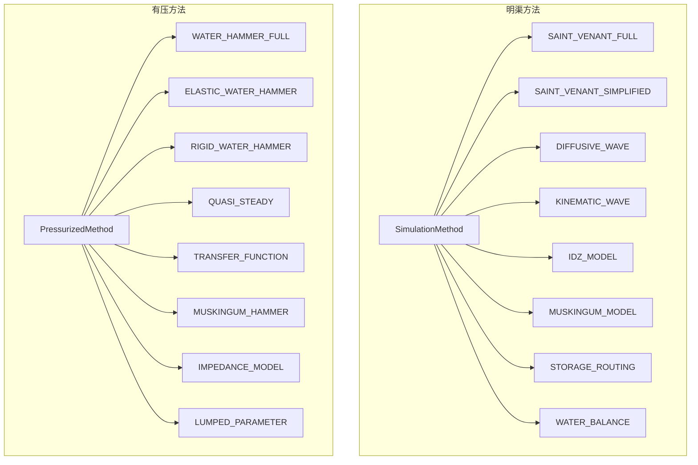

#### 方法实现

不同类型对象支持不同的仿真方法：

| 方法名 | 功能描述 | 明渠对象 | 有压对象 |
|--------|----------|----------|----------|
| set_simulation_method() | 设置仿真方法 | ✓ | ✓ |
| solve_steady_flow() | 恒定流计算 | ✓ | ✓ |
| solve_unsteady_flow() | 非恒定流计算 | ✓ | × |
| solve_water_hammer() | 水锤瞬变计算 | × | ✓ |
| compute_pressure_line() | 计算压力线 | × | ✓ |
| compute_water_surface() | 计算水面线 | ✓ | × |
| get_longitudinal_profile() | 获取纵剖面 | ✓ | ✓ |
| analyze_frequency_response() | 频率响应分析 | × | ✓ |
| compute_impedance() | 阻抗特性计算 | × | ✓ |
| compute_total_storage() | 计算总蓄量 | ✓ | ✓ |
| update_distributed_state() | 更新分布状态 | ✓(分布式) | ✓(分布式) |
| route_flow() | 流量演算 | ✓(集总式) | ✓(集总式) |

### StorageObject 存储对象基类

水库、湖泊、调蓄池等存储对象的抽象基类。

#### 核心属性

| 属性名 | 类型 | 描述 |
|--------|------|------|
| capacity_curve | CapacityCurve | 库容曲线 |
| water_balance | WaterBalance | 水量平衡计算器 |
| linearized_model | LinearizedModel | 线性化降阶模型 |
| operation_rules | OperationRules | 运行规则 |

#### 核心方法

| 方法名 | 功能描述 | 返回值 |
|--------|----------|--------|
| compute_water_balance() | 水量平衡计算 | BalanceResult |
| update_storage() | 更新蓄水量 | StorageResult |
| apply_operation_rules() | 应用运行规则 | OperationResult |
| linearize_around_point() | 在工作点线性化 | LinearizedModel |

## 配置管理体系

### 配置文件分层结构

配置文件采用分层设计，支持基础尺寸、参数设置、情景工况等不同层次的配置。

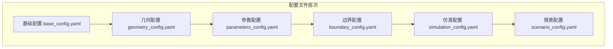

### 配置文件格式规范

#### 基础配置示例

```yaml
object_definition:
  object_id: "channel_001"
  object_type: "ChannelObject"
  name: "主干渠道"
  description: "从水库到分水口的主要输水渠道"
  
basic_properties:
  length: 5000.0  # 长度 (m)
  design_flow: 100.0  # 设计流量 (m³/s)
  design_velocity: 2.0  # 设计流速 (m/s)
  
simulation_preferences:
  default_method: "SAINT_VENANT_FULL"
  fallback_method: "IDZ_MODEL"
  enable_twin: true
```

#### 几何配置示例

```yaml
geometry_definition:
  cross_sections:
    - station: 0.0
      elevation: 100.0
      shape_type: "trapezoidal"
      bottom_width: 10.0
      side_slope: 1.5
      roughness: 0.025
      
    - station: 2500.0
      elevation: 99.0
      shape_type: "trapezoidal"
      bottom_width: 12.0
      side_slope: 1.5
      roughness: 0.025
      
    - station: 5000.0
      elevation: 98.0
      shape_type: "trapezoidal"
      bottom_width: 15.0
      side_slope: 2.0
      roughness: 0.030

geometric_functions:
  area_computation: "analytical"  # analytical | numerical
  wetted_perimeter: "precise"     # precise | approximate
  hydraulic_radius: "computed"    # computed | estimated
```

### ConfigManager 配置管理器

负责配置文件的加载、验证、合并和管理。

#### 核心功能

| 功能模块 | 描述 |
|----------|------|
| 配置加载 | 支持YAML、JSON等格式的配置文件 |
| 配置验证 | 验证配置参数的完整性和有效性 |
| 配置合并 | 支持多层配置文件的合并和覆盖 |
| 参数解析 | 自动解析配置参数并转换为对象属性 |
| 模板支持 | 支持配置模板和参数替换 |

## 仿真引擎设计

### SimulationEngine 仿真引擎

为每个水系统对象提供统一的仿真计算接口。根据对象类型分为明渠引擎和有压引擎。

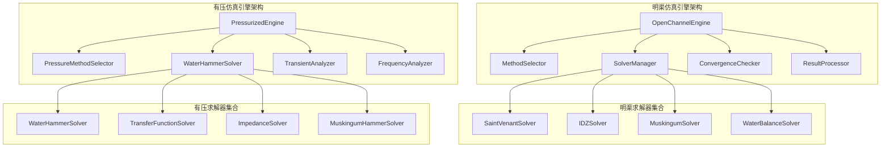

#### 方法选择策略对比

##### 明渠系统方法选择

| 条件 | 推荐方法 | 备选方法 |
|------|----------|----------|
| 高精度需求 | SAINT_VENANT_FULL | SAINT_VENANT_SIMPLIFIED |
| 实时仿真 | IDZ_MODEL | MUSKINGUM_MODEL |
| 长期仿真 | MUSKINGUM_MODEL | STORAGE_ROUTING |
| 粗估算 | WATER_BALANCE | KINEMATIC_WAVE |

##### 有压系统方法选择

| 条件 | 推荐方法 | 备选方法 |
|------|----------|----------|
| 水锤分析 | WATER_HAMMER_FULL | ELASTIC_WATER_HAMMER |
| 系统设计 | RIGID_WATER_HAMMER | QUASI_STEADY |
| 控制系统 | TRANSFER_FUNCTION | IMPEDANCE_MODEL |
| 快速评估 | LUMPED_PARAMETER | MUSKINGUM_HAMMER |

### 求解器统一接口

所有求解器实现统一的接口规范，但根据物理机理不同分为明渠求解器和有压求解器：

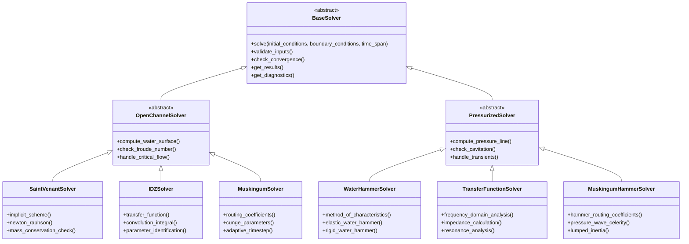

#### 求解器能力对比

| 能力类别 | 明渠求解器 | 有压求解器 |
|----------|--------------|-------------|
| 物理方程 | 圣维南方程组 | 水锤方程组 |
| 波动特性 | 重力波 | 压力波 |
| 特征线方法 | 水位-流速特征线 | 压力-流速特征线 |
| 边界条件 | 上游流量/下游水位 | 上游压力/下游压力 |
| 数值方法 | Preissmann格式 | 特征线法/有限元法 |
| 稳定性条件 | Courant数 < 1 | Courant数 < 1 |
| 频率响应 | 不适用 | 阻抗特性分析 |

## 状态管理体系

### StateManager 状态管理器

负责对象状态的存储、更新和历史记录管理。

#### 状态数据结构

| 状态类别 | 数据内容 | 更新频率 |
|----------|----------|----------|
| 瞬时状态 | 水位、流量、压力 | 每时步 |
| 累积状态 | 蓄水量、总流量 | 每时步 |
| 边界状态 | 边界条件、控制信号 | 按需 |
| 系统状态 | 运行模式、故障信息 | 按需 |

#### 状态存储格式

```yaml
current_state:
  timestamp: "2024-01-01T12:00:00"
  water_levels:
    upstream: 102.5
    downstream: 101.8
  flows:
    inflow: 95.2
    outflow: 94.8
  storages:
    current_volume: 125000.0
    capacity_ratio: 0.75

historical_states:
  time_series:
    - timestamp: "2024-01-01T11:00:00"
      water_level: 102.3
      flow: 94.5
    - timestamp: "2024-01-01T11:30:00"
      water_level: 102.4
      flow: 94.9
```

## 数字孪生功能

### 同步孪生机制

数字孪生系统支持多种孪生模式，不仅限于精细化模型与降阶模型之间的孪生，还包括同级别模型之间的同步孪生。根据孪生对象的复杂度关系，分为跨级孪生和同级孪生两大类。

#### 孪生模式分类

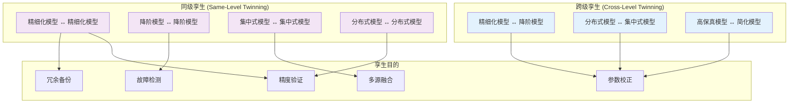

#### 同步孪生应用场景

##### 精细化模型同步孪生

| 应用场景 | 主模型 | 孪生模型 | 同步目的 |
|----------|--------|----------|----------|
| 算法验证 | 圣维南求解器A | 圣维南求解器B | 验证数值方法准确性 |
| 冗余计算 | 主计算节点 | 备份计算节点 | 提高系统可靠性 |
| 参数敏感性 | 标准参数模型 | 扰动参数模型 | 分析参数敏感性 |
| 边界条件对比 | 边界条件A | 边界条件B | 评估边界条件影响 |
| 网格收敛性 | 粗网格模型 | 细网格模型 | 验证网格无关性 |

##### 降阶模型同步孪生

| 应用场景 | 主模型 | 孪生模型 | 同步目的 |
|----------|--------|----------|----------|
| 模型选择 | IDZ模型 | 马斯京干模型 | 比较不同降阶方法 |
| 参数优化 | 初始参数模型 | 优化参数模型 | 在线参数调优 |
| 多目标优化 | 精度优先模型 | 速度优先模型 | 平衡精度与效率 |
| 故障诊断 | 主要模型 | 诊断模型 | 检测异常运行状态 |
| 集成预测 | 模型A | 模型B | 多模型集成预测 |

### 孪生同步策略

#### 实时同步策略

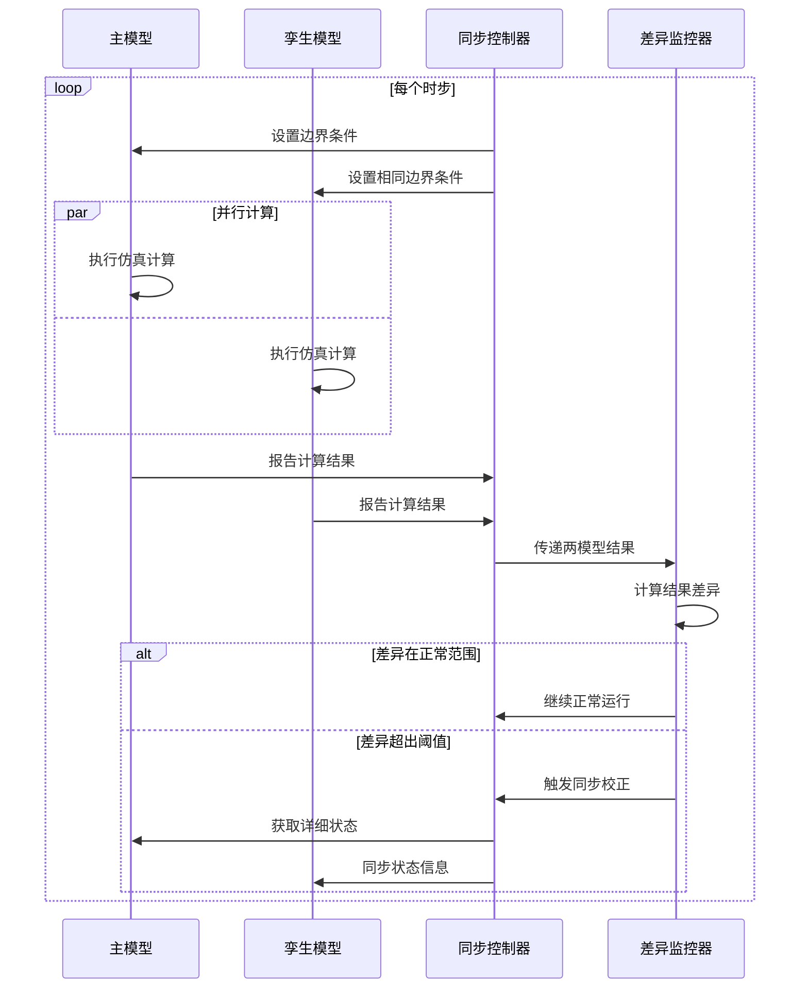

#### 周期性同步策略

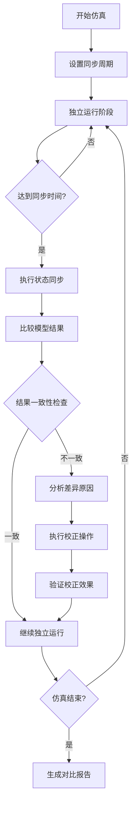

### 孪生对象创建策略

#### 同级孪生创建方法

| 主模型类型 | 孪生模型类型 | 创建策略 | 配置差异 |
|------------|--------------|----------|----------|
| SaintVenantModel | SaintVenantModel | 相同配置复制 | 数值方法、网格密度 |
| IDZModel | MuskingumModel | 参数映射转换 | 传递函数 → 路由系数 |
| MuskingumModel | MuskingumModel | 参数扰动复制 | K、X参数微调 |
| WaterBalanceModel | StorageRoutingModel | 物理关系升级 | 简化 → 详细库容曲线 |

#### 跨级孪生创建方法

| 主模型类型 | 孪生模型类型 | 创建策略 | 同步方式 |
|------------|--------------|----------|----------|
| SaintVenantModel | IDZModel | 系统辨识创建 | 实时状态同步 |
| SaintVenantModel | MuskingumModel | 参数标定创建 | 周期性校正 |
| ComplexDistributed | SimplifiedLumped | 降维映射创建 | 分层同步 |

### 差异分析与校正

#### 差异评估指标

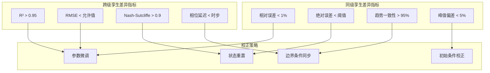

#### 自适应校正算法

##### 同级模型校正

| 差异类型 | 校正方法 | 校正强度 | 适用场景 |
|----------|----------|----------|----------|
| 参数漂移 | 参数平均化 | 轻微调整 | 数值误差累积 |
| 状态偏离 | 状态同步 | 强制校正 | 计算错误 |
| 趋势分歧 | 梯度校正 | 渐进调整 | 算法差异 |
| 突发差异 | 重新初始化 | 完全重置 | 异常情况 |

##### 跨级模型校正

| 差异类型 | 校正方法 | 校正强度 | 适用场景 |
|----------|----------|----------|----------|
| 系统性偏差 | 参数重新辨识 | 结构调整 | 模型不匹配 |
| 随机误差 | 卡尔曼滤波 | 状态估计 | 噪声干扰 |
| 动态延迟 | 相位补偿 | 时间校正 | 响应滞后 |
| 非线性偏离 | 分段线性化 | 局部校正 | 工况变化 |

### 参数辨识算法

根据孪生模式的不同，需要不同的参数辨识策略。

#### 同级孪生参数辨识

##### 精细化模型间参数辨识

| 参数类型 | 辨识方法 | 适用场景 | 更新频率 |
|----------|----------|----------|----------|
| 数值参数 | 相对误差最小化 | 数值方法对比 | 实时 |
| 物理参数 | 最小二乘法 | 糙率系数校正 | 周期性 |
| 边界条件 | 动态时间规整 | 边界条件不一致 | 按需 |
| 初始条件 | 状态向量对齐 | 初始化偏差 | 一次性 |

##### 降阶模型间参数辨证

| 模型组合 | 辨识参数 | 辨识方法 | 适用条件 |
|----------|----------|----------|----------|
| IDZ ↔ Muskingum | K, X 参数 | 传递函数拟合 | 线性系统 |
| Muskingum ↔ Muskingum | K, X 微调 | 敏感性分析 | 参数不确定性 |
| Storage ↔ WaterBalance | 库容系数 | 局部线性化 | 工况变化 |
| IDZ ↔ IDZ | 传递函数系数 | 交叉验证 | 数据充足 |

#### 跨级孪生参数辨识

##### 精细化模型→降阶模型

| 模型组合 | 辨识目标 | 辨识方法 | 验证策略 |
|----------|----------|----------|----------|
| SaintVenant → IDZ | 传递函数系数 | 系统辨识 | 阶跃响应验证 |
| SaintVenant → Muskingum | K, X 参数 | 非线性优化 | 独立数据集验证 |
| Distributed → Lumped | 集总参数 | 降维映射 | 多工况验证 |

##### 降阶模型→精细化模型

| 模型组合 | 辨识目标 | 辨识方法 | 适用场景 |
|----------|----------|----------|----------|
| IDZ → SaintVenant | 物理参数 | 反向工程 | 参数估计 |
| Muskingum → SaintVenant | 河道特性 | 经验关系式 | 初始设计 |
| Lumped → Distributed | 空间分布 | 插值外推 | 数据稀缺场景 |

#### 辨识算法实现

##### 实时参数辨识

```python
class RealTimeParameterIdentifier:
    def __init__(self, primary_model, twin_model):
        self.primary_model = primary_model
        self.twin_model = twin_model
        self.error_history = []
        self.parameter_history = []
    
    def identify_parameters(self, target_variables, observation_window=10):
        # 收集最近N个时步的误差数据
        recent_errors = self.error_history[-observation_window:]
        
        # 计算参数梯度
        gradients = self.compute_parameter_gradients(recent_errors)
        
        # 更新参数
        updated_params = self.gradient_descent_update(gradients)
        
        return updated_params
```

##### 周期性参数优化

```python
class PeriodicParameterOptimizer:
    def __init__(self, model_pair, optimization_interval=3600):
        self.model_pair = model_pair
        self.optimization_interval = optimization_interval
        self.last_optimization_time = 0
    
    def should_optimize(self, current_time):
        return (current_time - self.last_optimization_time) >= self.optimization_interval
    
    def batch_optimization(self, historical_data):
        # 使用历史数据进行批量优化
        objective_function = self.define_objective(historical_data)
        optimal_params = self.minimize_objective(objective_function)
        
        return optimal_params
```

## 可视化与结果管理

### ResultManager 结果管理器

统一管理所有计算结果和可视化输出。

#### 结果数据类型

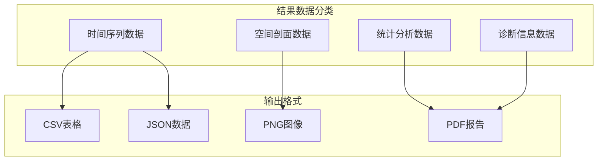

#### 可视化功能矩阵

根据对象类型和水力特性提供不同的可视化类型：

| 对象类型 | 明渠可视化 | 有压可视化 | 描述 |
|----------|------------|------------|------|
| ChannelObject | 水面线图 | - | 纵剖面水位分布 |
| PipeObject | - | 压力线图 | 管道压力分布 |
| ReservoirObject | 库容曲线 | 压力容积曲线 | 水位-容积关系 |
| SiphonObject | 水面线图 | 压力线图 | 根据运行模式 |
| 所有对象 | 时序图 | 时序图 | 状态变量时间变化 |
| 所有对象 | 阶跃响应图 | 频率响应图 | 系统动态特性 |

#### 对象特有可视化

##### 有压系统特有可视化

| 可视化类型 | 描述 | 适用场景 |
|------------|------|----------|
| 水锤波形图 | 压力振荡过程 | 水锤分析 |
| 阻抗特性图 | 频率-阻抗关系 | 系统设计 |
| 相位图 | 频率-相位关系 | 控制系统设计 |
| 气蚀区域图 | 气蚀发生区域 | 安全分析 |
| 压力包络线 | 压功包络线 | 态势分析 |

##### 明渠系统特有可视化

| 可视化类型 | 描述 | 适用场景 |
|------------|------|----------|
| 水面线剖面图 | 水面线及底高程 | 水力设计 |
| 流速分布图 | 断面流速分布 | 水力分析 |
| 弗劳德数分布 | 弗劳德数变化 | 流态分析 |
| 糙率分布图 | 糙率系数分布 | 参数校正 |
| 流量过程线 | 流量水位关系 | 边界条件分析 |

### 可视化模板系统

提供标准化的可视化模板，确保结果展示的一致性。

#### 模板配置示例

```yaml
visualization_templates:
  longitudinal_profile:
    chart_type: "line_plot"
    x_axis: "distance"
    y_axis: "elevation"
    series:
      - name: "底高程"
        data_source: "bed_elevation"
        style: "solid_line"
        color: "brown"
      - name: "水面线"
        data_source: "water_surface"
        style: "solid_line"
        color: "blue"
    
  time_series:
    chart_type: "time_plot"
    x_axis: "time"
    y_axis: "value"
    grid: true
    legend: true
```

## 阶跃响应分析

### 响应分析框架

为所有水系统对象提供统一的阶跃响应分析功能。

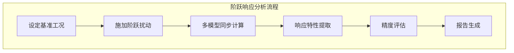

#### 响应特性指标

| 指标类别 | 具体指标 | 计算方法 |
|----------|----------|----------|
| 时域特性 | 上升时间、调节时间 | 响应曲线分析 |
| 频域特性 | 截止频率、相位裕度 | 傅里叶变换 |
| 精度指标 | R²、RMSE、MAE | 统计分析 |
| 稳定性 | 超调量、振荡衰减 | 动态特性 |

## 实现路径与示例

### 实现优先级

1. **第一阶段**：核心基类和配置管理
2. **第二阶段**：输水对象和仿真引擎
3. **第三阶段**：存储对象和状态管理
4. **第四阶段**：数字孪生和参数辨识
5. **第五阶段**：可视化和结果管理

### 典型使用示例

#### 典型使用示例

#### 创建河道对象示例（明渠系统）

```python
# 通过配置文件创建河道对象
channel = ChannelObject.from_config("configs/main_channel.yaml")

# 设置仿真方法
channel.set_simulation_method(SimulationMethod.SAINT_VENANT_FULL)

# 设置边界条件
channel.set_upstream_boundary(flow=100.0)
channel.set_downstream_boundary(water_level=95.0)

# 执行恒定流计算
steady_result = channel.solve_steady_flow()

# 获取水面线剖面
profile = channel.get_longitudinal_profile()

# 可视化结果
channel.visualize(template="longitudinal_profile")

# 创建数字孰生
twin_channel = channel.create_twin(model_type="IDZ")

# 执行阶跃响应分析
response = channel.step_response(
    disturbance_type="flow",
    magnitude=20.0,
    duration=3600.0
)
```

#### 创建同级孪生示例（精细化模型对比）

```python
# 创建主模型（使用标准参数）
primary_channel = ChannelObject.from_config("configs/main_channel.yaml")
primary_channel.set_simulation_method(SimulationMethod.SAINT_VENANT_FULL)

# 创建孪生模型（使用不同数值方法）
twin_channel = primary_channel.create_same_level_twin(
    twin_config={
        "numerical_scheme": "MacCormack",  # 不同于主模型的Preissmann
        "grid_size": 50,  # 不同的网格密度
        "time_step": 30.0  # 不同的时间步长
    }
)

# 设置同步策略
sync_controller = SynchronizationController(
    primary_model=primary_channel,
    twin_model=twin_channel,
    sync_mode="real_time",
    tolerance={
        "water_level": 0.01,  # 1cm
        "flow_rate": 0.1      # 0.1 m³/s
    }
)

# 执行同步仿真
results = sync_controller.run_synchronized_simulation(
    duration=3600.0,
    boundary_conditions={
        "upstream_flow": [100.0, 110.0, 120.0],
        "downstream_level": 95.0
    }
)

# 分析结果差异
comparison_report = sync_controller.generate_comparison_report()
print(f"最大水位差异: {comparison_report['max_level_diff']:.3f} m")
print(f"平均流量差异: {comparison_report['mean_flow_diff']:.3f} m³/s")
```

#### 创建同级孪生示例（降阶模型对比）

```python
# 创建 IDZ 主模型
idz_primary = IDZModel.from_config("configs/idz_model.yaml")

# 创建马斯京干孪生模型
muskingum_twin = idz_primary.create_cross_model_twin(
    target_model_type="MuskingumModel",
    parameter_mapping={
        "transfer_function": "routing_coefficients",
        "delay_time": "travel_time_K"
    }
)

# 设置自适应参数辨识
adaptive_identifier = AdaptiveParameterIdentifier(
    primary_model=idz_primary,
    twin_model=muskingum_twin,
    identification_method="transfer_function_fitting"
)

# 执行多模型对比仿真
comparison_results = adaptive_identifier.run_comparative_simulation(
    test_scenarios=[
        {"name": "low_flow", "inflow": 50.0},
        {"name": "design_flow", "inflow": 100.0},
        {"name": "flood_flow", "inflow": 200.0}
    ]
)

# 生成模型选择建议
model_selection = adaptive_identifier.recommend_model_selection()
print(f"推荐模型: {model_selection['recommended_model']}")
print(f"推荐理由: {model_selection['reason']}")
```

#### 创建跨级孪生示例（传统方式）

```python
# 创建精细化主模型
detailed_pipe = PipeObject.from_config("configs/detailed_pipe.yaml")
detailed_pipe.set_simulation_method(PressurizedMethod.WATER_HAMMER_FULL)

# 创建降阶孪生模型
transfer_function_twin = detailed_pipe.create_twin(
    model_type="TRANSFER_FUNCTION",
    auto_identification=True
)

# 设置实时校正策略
real_time_calibrator = RealTimeCalibrator(
    high_fidelity_model=detailed_pipe,
    reduced_order_model=transfer_function_twin,
    calibration_triggers={
        "error_threshold": 0.05,
        "time_interval": 300.0
    }
)

# 执行水锤仿真与实时校正
hammer_results = real_time_calibrator.run_water_hammer_analysis(
    trigger_event={
        "type": "valve_closure",
        "closure_time": 2.0,
        "start_time": 5.0
    },
    duration=20.0
)

# 分析校正效果
calibration_metrics = real_time_calibrator.get_calibration_metrics()
print(f"校正前 R²: {calibration_metrics['before_calibration_r2']:.3f}")
print(f"校正后 R²: {calibration_metrics['after_calibration_r2']:.3f}")
print(f"校正次数: {calibration_metrics['calibration_count']}")
```

#### 系统集成示例

```python
# 创建复合水系统
system = WaterSystem()
system.add_object(ReservoirObject.from_config("reservoir.yaml"))
system.add_object(ChannelObject.from_config("channel.yaml"))
system.add_object(ChannelObject.from_config("branch_channel.yaml"))

# 建立连接关系
system.connect("reservoir.outlet", "main_channel.inlet")
system.connect("main_channel.junction", "branch_channel.inlet")

# 系统仿真
system.run_simulation(
    start_time="2024-01-01",
    end_time="2024-01-02",
    time_step=300.0
)

# 系统级结果分析
system.generate_system_report()
```

## 技术风险与应对

### 主要技术风险

| 风险类别 | 具体风险 | 应对措施 |
|----------|----------|----------|
| 性能风险 | 统一接口导致性能下降 | 采用适配器模式，保持原有高效算法 |
| 兼容性风险 | 与现有代码不兼容 | 提供适配器和迁移工具 |
| 复杂性风险 | 架构过于复杂 | 分阶段实现，逐步迁移 |
| 维护风险 | 代码维护困难 | 充分的文档和测试覆盖 |

### 质量保证措施

1. **单元测试**：每个类和方法提供完整测试
2. **集成测试**：验证对象间协作正确性
3. **性能测试**：确保重构后性能不降低
4. **文档完备**：提供详细的API文档和使用指南
5. **示例丰富**：覆盖各种典型使用场景

## 迁移策略

### 现有代码迁移

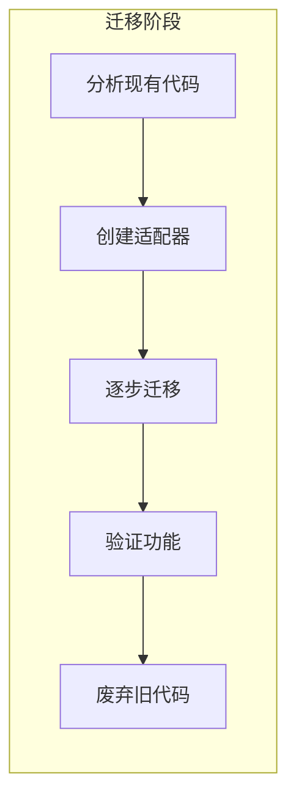

### 迁移时间表

| 阶段 | 时间 | 主要任务 |
|------|------|----------|
| 准备 | 1周 | 代码分析，架构设计 |
| 基础 | 2周 | 基类实现，配置系统 |
| 核心 | 4周 | 主要对象类实现 |
| 集成 | 2周 | 系统集成，测试 |
| 优化 | 1周 | 性能优化，文档完善 |

这个重构设计将彻底改变WaterNet的架构，使其成为一个真正面向对象、统一、可扩展的水系统仿真平台。通过配置驱动的方式，用户可以轻松创建和配置各种水系统对象，并通过数字孪生功能实现高精度和高效率的协同仿真。