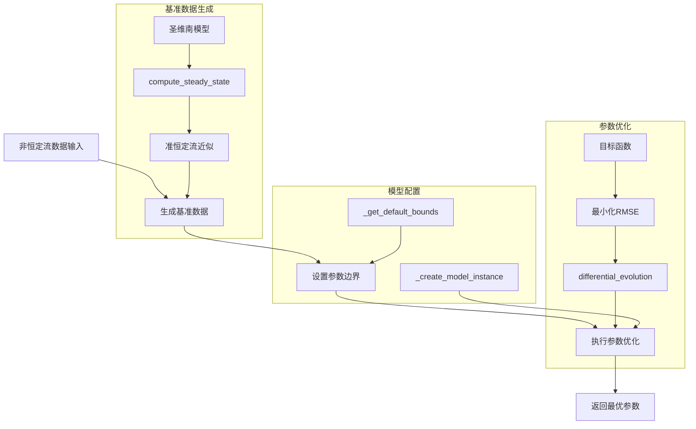

# 动态参数优化

<cite>
**Referenced Files in This Document**   
- [parameter_estimation.py](file://examples/parameter_estimation.py)
- [estimator.py](file://waternet/parameter_estimation/estimator.py)
- [lumped_models.py](file://waternet/models/lumped_models.py)
- [saint_venant.py](file://waternet/models/saint_venant.py)
- [COMPREHENSIVE_REDUCED_ORDER_MODELS_THEORY.md](file://examples/reduced_order_models_theory/COMPREHENSIVE_REDUCED_ORDER_MODELS_THEORY.md)
- [IDZ模型辨识项目完整文档.md](file://examples/advanced/IDZ模型辨识项目完整文档.md)
</cite>

## 目录

1. [引言](#引言)
2. [核心流程与架构](#核心流程与架构)
3. [基准数据生成](#基准数据生成)
4. [目标函数与优化算法](#目标函数与优化算法)
5. [参数边界与模型实例化](#参数边界与模型实例化)
6. [优化策略对比](#优化策略对比)
7. [专家级调优建议](#专家级调优建议)
8. [结论](#结论)

## 引言

本文档全面解析了WaterNet框架中动态参数优化的完整流程。该流程旨在为降阶水文模型（如马斯京干模型、IDZ模型）提供精确的参数标定，以提升其在洪水预报、河道演进等工程应用中的预测精度。整个流程以高精度的圣维南模型作为“真实”系统，通过生成准恒定流近似数据，驱动降阶模型进行参数寻优。文档将详细阐述从非恒定流数据输入到最优参数输出的每一个关键环节，包括`identify_dynamic_parameters`方法的实现、目标函数的设计、优化算法的配置以及不同优化策略的对比分析，为用户提供一套完整的、可复用的参数优化解决方案。

## 核心流程与架构

动态参数优化流程是一个系统性的工程，它将高保真的物理模型与高效的降阶模型相结合，通过自动化优化算法实现参数的精准标定。该流程的核心在于利用圣维南模型的物理真实性来“训练”降阶模型，使其在保持计算效率的同时，尽可能逼近真实系统的动态响应。

**Diagram sources**
- [estimator.py](file://waternet/parameter_estimation/estimator.py#L262-L296)
- [saint_venant.py](file://waternet/models/saint_venant.py#L183-L245)
- [lumped_models.py](file://waternet/models/lumped_models.py#L665-L790)

**Section sources**
- [estimator.py](file://waternet/parameter_estimation/estimator.py#L262-L296)

## 基准数据生成

基准数据的生成是整个优化流程的基石，它决定了优化的“目标”是什么。`identify_dynamic_parameters`方法通过调用`_generate_reference_data`，利用圣维南模型为每一个非恒定流输入数据点生成一个“准恒定流”近似解。

该过程的核心是`SaintVenantModel.compute_steady_state`方法。对于每一个输入的流量`Q_in`和下游水位`H_down`，该方法使用标准步进法（Standard Step Method）从下游向上游逐段求解恒定流水面线。它基于能量方程和曼宁公式，迭代计算每个断面的水位，并最终得到整个渠段的总蓄水量`total_volume`。这些数据点（`Q_in`, `H_down`, `total_volume`）共同构成了降阶模型需要逼近的“真实”状态。

这种“准恒定流”近似是一种巧妙的折衷。它避免了对整个非恒定流过程进行高成本的动态仿真，而是将复杂的动态问题分解为一系列静态问题的集合。降阶模型的目标就是在这些静态点上，使其出流`Q_out`尽可能接近输入的`Q_in`，从而在宏观上模拟出与圣维南模型相似的动态行为。

**Section sources**
- [estimator.py](file://waternet/parameter_estimation/estimator.py#L298-L327)
- [saint_venant.py](file://waternet/models/saint_venant.py#L183-L245)

## 目标函数与优化算法

### 目标函数设计

目标函数的设计原则是**最小化出流流量的均方根误差（RMSE）**。在`_optimize_parameters`方法中定义的`objective_function`是这一原则的直接体现。

该目标函数的工作流程如下：
1.  **创建模型实例**：根据当前优化算法提供的参数组合（如马斯京干模型的`K`和`x`），调用`_create_model_instance`创建一个降阶模型实例。
2.  **运行仿真**：使用基准数据中的`Q_in`序列作为输入，驱动该模型实例运行一次完整的仿真。
3.  **计算误差**：将模型仿真得到的出流`Q_sim`与基准数据中的出流`Q_ref`（即`Q_in`）进行比较，计算它们在重叠时间步长内的RMSE。
4.  **返回误差**：将计算得到的RMSE作为本次参数组合的“成本”返回给优化算法。

这种设计确保了优化过程直接关注模型最核心的输出——流量。通过最小化RMSE，优化算法会自动寻找那些能使模型出流与“真实”系统出流最吻合的参数。

### differential_evolution优化算法

流程采用`scipy.optimize.differential_evolution`作为核心优化器。这是一种基于群体的全局优化算法，特别适合处理非线性、非凸的优化问题，且对初始值不敏感。

在`_optimize_parameters`中，该算法的配置如下：
-   **目标函数**：`objective_function`，即上文所述的RMSE计算函数。
-   **搜索边界**：由`_get_default_bounds`和用户自定义边界共同确定的参数范围。
-   **最大迭代次数**：由`self.optimization_config['maxiter']`控制，文档中默认为100次，平衡了计算成本和收敛性。
-   **随机种子**：由`self.optimization_config['seed']`控制，确保结果的可重现性。

差分进化算法通过在参数空间中维护一个“种群”，并利用种群中个体的差异来生成新的候选解，从而有效地探索全局最优解，避免陷入局部最优。

**Section sources**
- [estimator.py](file://waternet/parameter_estimation/estimator.py#L342-L393)

## 参数边界与模型实例化

### 参数边界设定

合理的搜索空间是优化成功的关键。`_get_default_bounds`方法为不同类型的降阶模型预设了物理上合理的参数边界。

-   **马斯京干模型 (MuskingumModel)**：`K`（滞时常数）的边界为(100.0, 10000.0)秒，这覆盖了从短时洪水到长时演进的典型时间尺度。`x`（权重系数）的边界为(0.0, 0.5)，这是一个经典的理论范围，确保了模型的数值稳定性。
-   **IDZ模型 (IntegralDelayZeroModel)**：`tau`（零点时间常数）为(10.0, 3600.0)秒，`T_delay`（纯延迟时间）为(0.0, 1800.0)秒，`alpha`（极点时间常数）为(100.0, 7200.0)秒。这些边界反映了IDZ模型各参数的物理意义和典型量级。

用户可以通过`parameter_bounds`参数覆盖或扩展这些默认边界，以适应特定的工程场景。

### 物理关系函数简化

`_create_model_instance`方法在创建降阶模型实例时，采用了简化的物理关系函数。这些函数并非基于真实的渠道几何，而是基于基准数据的初始状态进行线性近似：
-   **V_to_H函数**：`H = H_up[0] + (V - V0) / 10000.0`，假设蓄量与水位呈线性关系。
-   **H_to_Q函数**：`Q = max(0.0, (H - H_up[0]) * 10.0)`，假设水位与出流呈线性关系。

这种简化是合理的，因为参数优化的核心目标是找到`K`、`x`等动态参数，而V-H和H-Q关系在此流程中被视为次要的、可简化的背景函数。这极大地降低了问题的复杂度，使优化过程能够专注于核心参数的寻优。

**Section sources**
- [estimator.py](file://waternet/parameter_estimation/estimator.py#L329-L340)
- [estimator.py](file://waternet/parameter_estimation/estimator.py#L395-L418)

## 优化策略对比

`parameter_estimation.py`中的网格搜索示例提供了一个与差分进化算法对比的基准。该示例展示了在实际工程应用中，如何根据问题的复杂度选择合适的优化策略。

| 特性 | 差分进化 (differential_evolution) | 网格搜索 (Grid Search) |
| :--- | :--- | :--- |
| **搜索方式** | 智能、自适应的全局搜索 | 穷举式、固定步长的遍历 |
| **计算效率** | 高，通常在较少的函数评估次数内收敛 | 低，计算量随参数维度指数增长 |
| **适用场景** | 复杂、高维、非线性问题 | 简单、低维、参数空间小的问题 |
| **结果质量** | 能找到接近全局最优的解 | 只能找到网格点上的最优解，可能错过更优解 |
| **实现复杂度** | 低，调用scipy库即可 | 高，需要手动编写嵌套循环 |

在`parameter_estimation.py`的示例中，网格搜索被用于一个二维参数空间（`K`和`x`），这在计算上是可行的。然而，如果参数维度增加（如IDZ模型有12个参数），网格搜索将变得完全不切实际。因此，差分进化等智能优化算法是处理复杂降阶模型参数寻优的首选。

**Section sources**
- [parameter_estimation.py](file://examples/parameter_estimation.py#L200-L250)

## 专家级调优建议

为了确保参数优化的成功和结果的可靠性，以下是一些专家级的调优建议：

1.  **初始值敏感性**：虽然差分进化算法对初始值不敏感，但`_create_model_instance`中使用的简化物理关系函数可能会引入偏差。建议在优化完成后，使用优化得到的参数和更精确的V-H/H-Q关系重新验证模型性能。
2.  **搜索空间设置**：预设的边界是合理的起点，但应根据具体工程经验进行调整。过宽的边界会增加计算成本，过窄的边界则可能排除了真实的最优解。可以先进行一次粗粒度的优化，再在最优解附近进行精细搜索。
3.  **计算效率**：对于大规模或实时应用，可以考虑降低`maxiter`或使用更高效的求解器。同时，确保`SaintVenantModel.compute_steady_state`的计算足够快，因为它是基准数据生成的瓶颈。
4.  **过拟合防范**：优化过程可能在训练数据上表现完美，但在新数据上泛化能力差。建议使用交叉验证，将数据分为训练集和验证集，监控验证集上的RMSE，防止过拟合。
5.  **结果验证**：最终的参数必须通过物理合理性检验。例如，马斯京干模型的`x`值应在0到0.5之间，`K`值应与渠道长度和坡度相匹配。结合`COMPREHENSIVE_REDUCED_ORDER_MODELS_THEORY.md`中的理论，可以对参数进行更深入的解读。

**Section sources**
- [COMPREHENSIVE_REDUCED_ORDER_MODELS_THEORY.md](file://examples/reduced_order_models_theory/COMPREHENSIVE_REDUCED_ORDER_MODELS_THEORY.md)
- [estimator.py](file://waternet/parameter_estimation/estimator.py)

## 结论

本文档系统地解析了WaterNet框架中动态参数优化的完整流程。该流程通过将高精度的圣维南模型作为基准，驱动降阶模型进行参数寻优，实现了物理真实性与计算效率的有机结合。`identify_dynamic_parameters`方法作为核心，协调了基准数据生成、参数边界设定和优化算法执行等关键步骤。以最小化出流流量RMSE为目标，结合差分进化算法，能够高效地找到最优参数。与网格搜索等传统方法相比，该流程在处理复杂、高维的优化问题时展现出显著的优势。通过遵循本文提供的专家级调优建议，用户可以有效地应用此流程，为各类水文模型提供精准的参数标定，从而提升其在工程实践中的预测能力和应用价值。