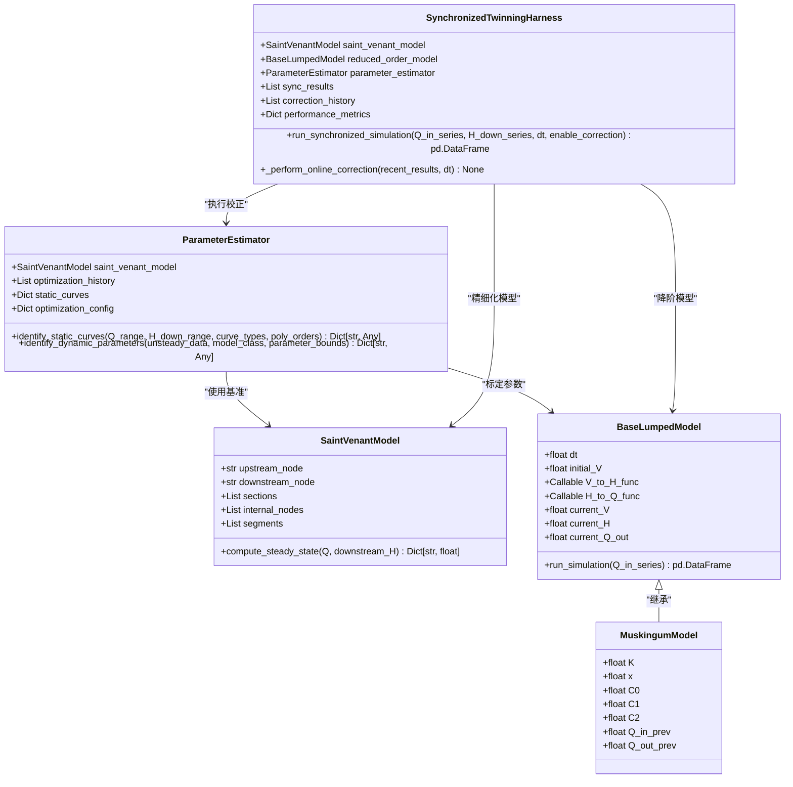
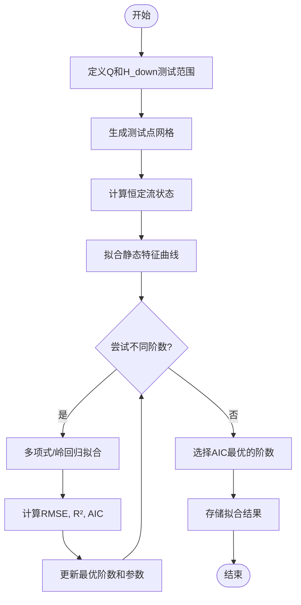
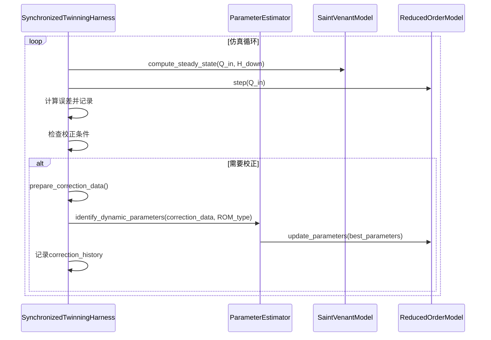

# 参数估计

<cite>
**本文档引用的文件**  
- [parameter_estimation.py](file://examples/parameter_estimation.py) - *新增动态优化功能*
- [estimator.py](file://waternet/parameter_estimation/estimator.py) - *新增动态优化功能*
- [saint_venant.py](file://waternet/models/saint_venant.py)
- [lumped_models.py](file://waternet/models/lumped_models.py)
- [simple_channel.yaml](file://examples/configs/simple_channel.yaml)
- [muskingum_model.yaml](file://examples/configs/muskingum_model.yaml)
- [twinning_harness.py](file://waternet/coordination/twinning_harness.py) - *新增在线校正功能*
</cite>

## 更新摘要
**已做更改**   
- 更新了“动态参数优化”章节，以反映新增的实时校正能力
- 新增了“在线校正机制”章节，详细说明动态优化功能
- 更新了相关代码示例和序列图以包含新的工作流程
- 增强了源代码跟踪系统，包含了新功能的相关文件

## 目录
1. [引言](#引言)
2. [核心组件](#核心组件)
3. [静态特征曲线辨识](#静态特征曲线辨识)
4. [动态参数优化](#动态参数优化)
5. [在线校正机制](#在线校正机制)
6. [工作流程示例](#工作流程示例)
7. [高级话题](#高级话题)
8. [性能调优建议](#性能调优建议)
9. [结论](#结论)

## 引言

参数估计是连接高精度物理模型与降阶模型的关键桥梁。在WaterNet系统中，`ParameterEstimator`类通过利用高精度的圣维南模型作为基准，为各类降阶模型（如马斯京干模型）提供精确的参数标定和在线校正功能。该机制确保了降阶模型能够在保持计算效率的同时，最大限度地保留物理系统的动态特性。

**Section sources**
- [estimator.py](file://waternet/parameter_estimation/estimator.py#L24-L418)

## 核心组件

`ParameterEstimator`是参数估计功能的核心实现，它依赖于高精度的`SaintVenantModel`作为基准，并为`BaseLumpedModel`的子类（如`MuskingumModel`）提供参数辨识服务。该设计实现了高精度模型与降阶模型之间的解耦，使得参数估计过程既准确又灵活。



**Diagram sources**  
- [estimator.py](file://waternet/parameter_estimation/estimator.py#L24-L418)
- [saint_venant.py](file://waternet/models/saint_venant.py#L32-L646)
- [lumped_models.py](file://waternet/models/lumped_models.py#L30-L790)
- [twinning_harness.py](file://waternet/coordination/twinning_harness.py#L25-L488) - *新增在线校正协调器*

**Section sources**
- [estimator.py](file://waternet/parameter_estimation/estimator.py#L24-L418)
- [saint_venant.py](file://waternet/models/saint_venant.py#L32-L646)
- [lumped_models.py](file://waternet/models/lumped_models.py#L30-L790)

## 静态特征曲线辨识

静态特征曲线辨识是参数估计的第一步，旨在建立系统在恒定流条件下的输入-输出关系。`ParameterEstimator`通过`identify_static_curves`方法实现此功能。

该方法首先在指定的流量（Q）和下游水位（H_down）范围内生成测试点网格，然后调用`SaintVenantModel`的`compute_steady_state`方法计算每个测试点的恒定流状态，获取上游水位（H_up）和总蓄水量（V）等关键数据。

随后，系统使用多项式回归对数据进行拟合，支持`V-H`（蓄水量-水位）和`Q-H`（流量-水位）两种曲线类型。为了提高数值稳定性，当数据矩阵的条件数过大时，系统会自动切换到岭回归（Ridge Regression）进行拟合。最终，系统通过AIC（赤池信息准则）等指标选择最优的多项式阶数，避免过拟合。



**Diagram sources**  
- [estimator.py](file://waternet/parameter_estimation/estimator.py#L50-L150)

**Section sources**
- [estimator.py](file://waternet/parameter_estimation/estimator.py#L50-L150)

## 动态参数优化

动态参数优化是参数估计的核心环节，旨在为降阶模型寻找最优的动态参数，使其在非恒定流条件下的响应与高精度模型的基准数据相匹配。

`ParameterEstimator`通过`identify_dynamic_parameters`方法实现此功能。其工作流程如下：
1.  **生成基准数据**：利用`SaintVenantModel`在非恒定流输入序列（Q_in, H_down）下生成参考数据。
2.  **定义目标函数**：构建一个目标函数，该函数创建一个待标定的降阶模型实例，运行仿真，并计算其输出与基准数据之间的均方根误差（RMSE）。
3.  **执行优化**：使用差分进化算法（differential_evolution）在指定的参数边界内搜索使目标函数最小化的参数组合。

优化算法的选择（差分进化）确保了全局搜索能力，避免陷入局部最优。收敛判断标准基于优化算法自身的成功标志和目标函数值的变化。

```mermaid
sequenceDiagram
participant PE as ParameterEstimator
participant SVM as SaintVenantModel
participant LM as LumpedModel
participant Opt as Optimizer
PE->>SVM : generate_reference_data(unsteady_data)
SVM-->>PE : reference_data (DataFrame)
PE->>PE : get_default_bounds(model_class)
PE->>Opt : differential_evolution(objective_function, bounds)
Opt->>LM : create_model_instance(params)
LM->>LM : run_simulation(Q_in_series)
LM-->>Opt : sim_results
Opt->>Opt : calculate RMSE(reference_data, sim_results)
Opt-->>PE : best_parameters, best_score
PE->>PE : store in optimization_history
```

**Diagram sources**  
- [estimator.py](file://waternet/parameter_estimation/estimator.py#L152-L250)

**Section sources**
- [estimator.py](file://waternet/parameter_estimation/estimator.py#L152-L250)

## 在线校正机制

根据最新的代码变更，参数估计模块新增了动态优化功能，支持模型参数的实时校正。这一功能通过`SynchronizedTwinningHarness`（同步孪生协调器）实现，它将`ParameterEstimator`集成到一个持续监控和自适应调整的框架中。

在线校正机制的工作流程如下：
1.  **持续监控**：协调器在仿真过程中持续记录精细化模型与降阶模型之间的输出误差。
2.  **触发判断**：当满足三个条件时触发校正：达到预设的校正间隔、近期平均误差超过阈值、且有足够的历史数据。
3.  **执行校正**：使用最近的仿真结果作为输入数据，调用`ParameterEstimator.identify_dynamic_parameters`方法重新辨识降阶模型的最优参数。
4.  **参数更新**：将辨识出的新参数应用到降阶模型中，并记录校正历史。

此机制实现了降阶模型的“在线学习”能力，使其能够根据实际运行情况动态调整自身参数，从而长期保持高精度。



**Diagram sources**  
- [twinning_harness.py](file://waternet/coordination/twinning_harness.py#L315-L373) - *在线校正核心逻辑*
- [estimator.py](file://waternet/parameter_estimation/estimator.py#L242-L250) - *被调用的参数辨识方法*

**Section sources**
- [twinning_harness.py](file://waternet/coordination/twinning_harness.py#L277-L382) - *新增的在线校正功能*

## 工作流程示例

`parameter_estimation.py`示例文件展示了完整的参数估计工作流程。该流程从配置文件中加载渠道几何和模型参数，创建高精度的圣维南模型作为“真实”系统，生成参考数据，然后通过网格搜索优化马斯京干模型的参数（K和x）。

该示例不仅演示了核心功能，还包含了结果验证、优化历史保存和可视化等完整的工程实践，为用户提供了可复用的模板。


**Diagram sources**  
- [parameter_estimation.py](file://examples/parameter_estimation.py#L1-L325)

**Section sources**
- [parameter_estimation.py](file://examples/parameter_estimation.py#L1-L325)

## 高级话题

### 参数敏感性分析
虽然当前实现未直接提供敏感性分析工具，但`optimization_history`记录了优化过程，可用于分析参数变化对目标函数的影响。

### 多目标优化
当前目标函数仅使用流量误差的RMSE。可通过扩展目标函数，加入水位误差、蓄水量误差等，实现多目标优化。

### 不确定性量化
通过分析`static_curves`中的拟合统计信息（如R²、RMSE）和优化过程的收敛性，可以对参数估计结果的不确定性进行初步评估。

## 性能调优建议

1.  **初始值选择**：虽然差分进化算法对初始值不敏感，但提供合理的参数边界（`parameter_bounds`）可以显著加速收敛。
2.  **约束设置**：应根据物理意义设置严格的参数边界，例如马斯京干模型的`x`参数应在[0, 0.5]范围内，`K`参数应为正值。
3.  **优化算法配置**：可通过调整`optimization_config`中的`maxiter`和`tol`来平衡计算精度和速度。
4.  **在线校正配置**：合理设置`correction_interval`和`correction_threshold`，避免过于频繁的校正影响计算效率。

## 结论

WaterNet的参数估计功能通过`ParameterEstimator`类，实现了从高精度物理模型到降阶模型的高效、准确的参数传递。该功能涵盖了静态特征曲线辨识和动态参数优化两大核心能力，并通过新增的在线校正机制，实现了模型的实时自适应优化。这一功能为构建可靠、高效的水力仿真系统提供了坚实的基础。通过提供的示例和灵活的API，用户可以轻松地将此功能集成到自己的工作流中。