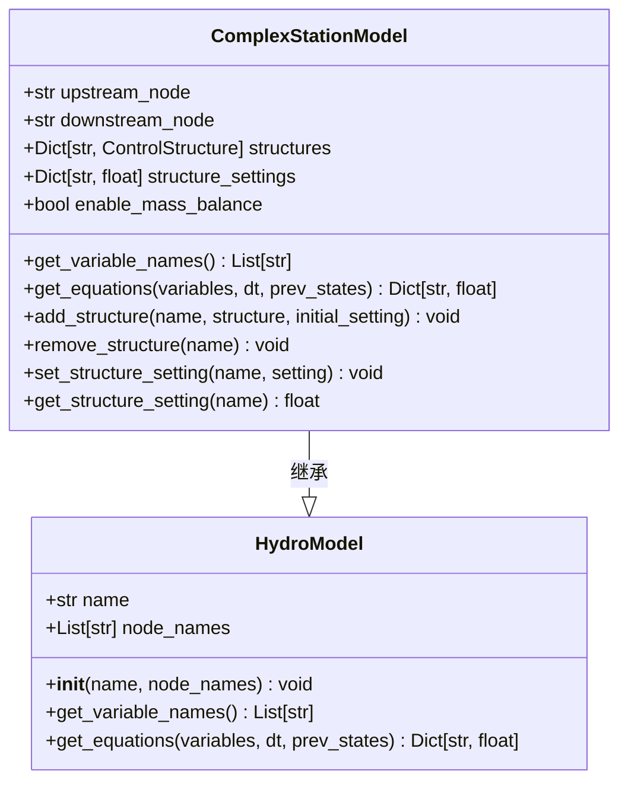
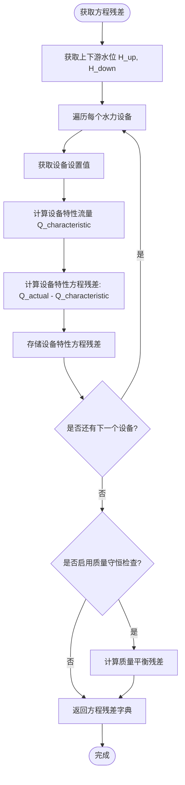
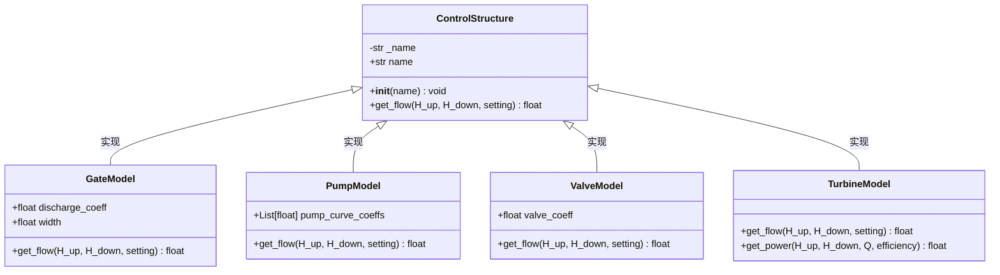
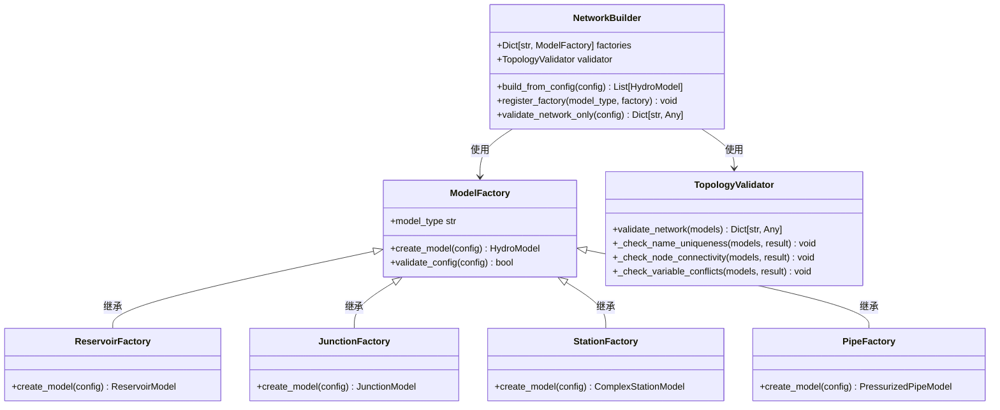
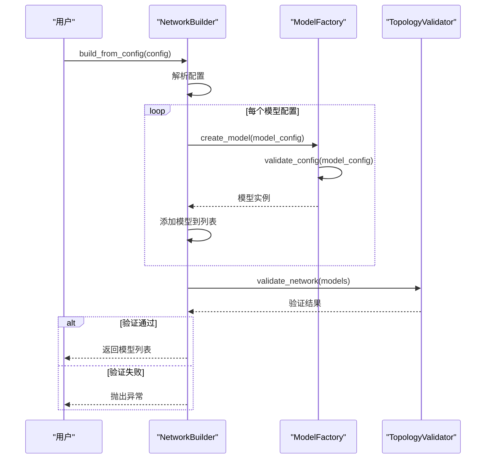
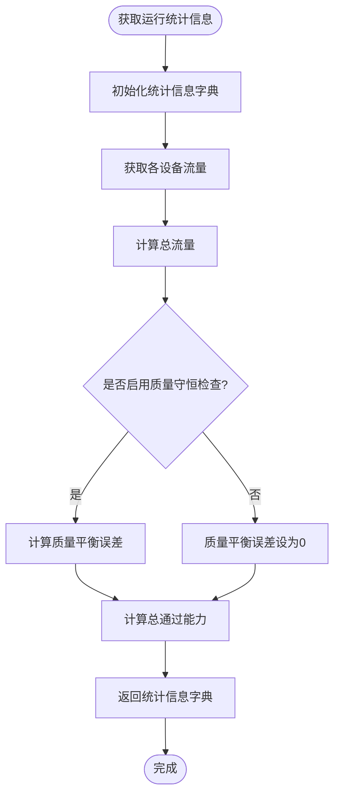
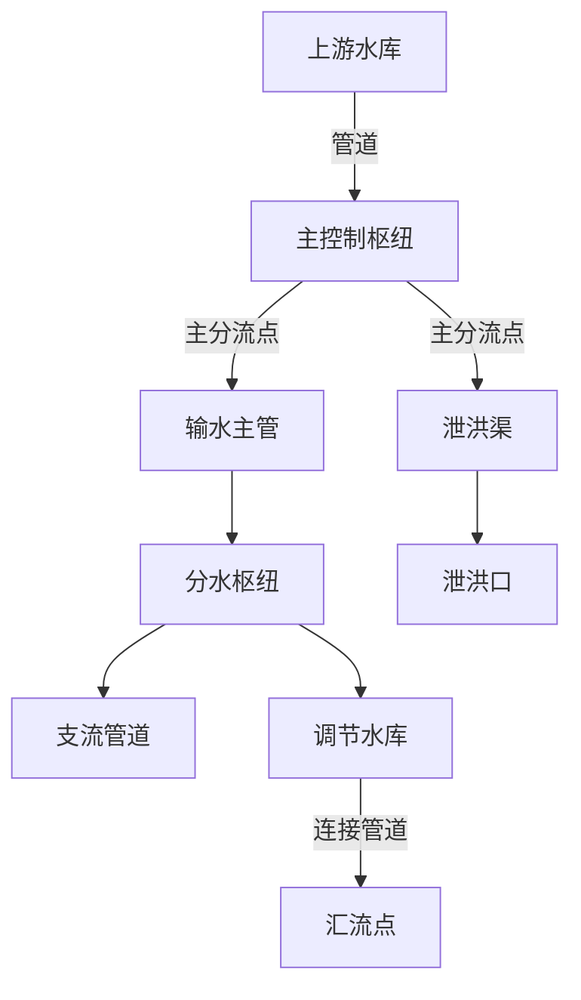
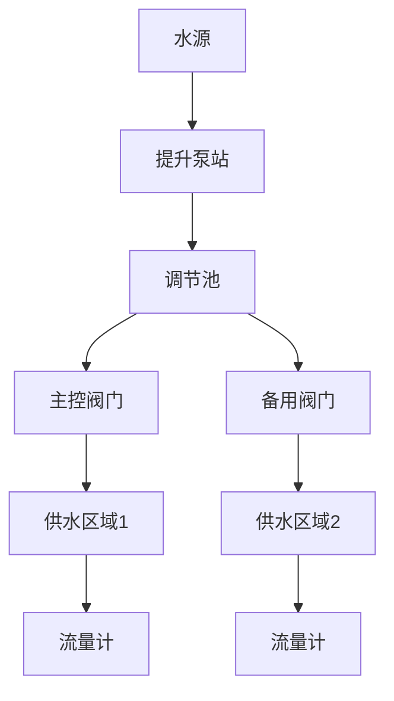
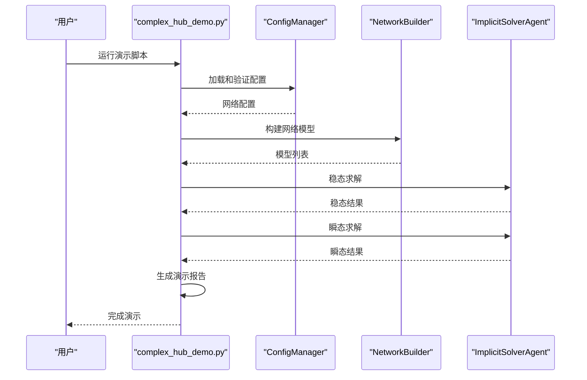

# 复杂枢纽建模

<cite>
**Referenced Files in This Document**   
- [complex_station_model.py](file://waternet/models/complex_station_model.py)
- [control_structure.py](file://physical_objects/control_structure.py)
- [network_builder.py](file://waternet/models/network_builder.py)
- [complex_hub_network.yaml](file://examples/configs/complex_hub_network.yaml)
- [complex_hub_demo.py](file://examples/complex_hub_demo.py)
</cite>

## 目录
1. [引言](#引言)
2. [复杂枢纽建模原理](#复杂枢纽建模原理)
3. [设备层建模方法](#设备层建模方法)
4. [控制逻辑与系统集成](#控制逻辑与系统集成)
5. [复杂枢纽系统示例](#复杂枢纽系统示例)
6. [在梯级水库中的应用](#在梯级水库中的应用)
7. [在城市供水系统中的应用](#在城市供水系统中的应用)
8. [结论](#结论)

## 引言

复杂枢纽建模是水力系统仿真中的核心环节，用于描述包含多种水力机械设备的综合枢纽系统。本文档详细阐述了复杂枢纽站模型的设计原理、设备层建模方法、控制逻辑和系统集成策略。通过层次化建模方法，实现了对闸门、泵站等设备的统一描述和系统级水量平衡的精确计算。

**Section sources**
- [complex_station_model.py](file://waternet/models/complex_station_model.py#L1-L50)
- [control_structure.py](file://physical_objects/control_structure.py#L1-L50)

## 复杂枢纽建模原理

复杂枢纽站模型采用层次化建模策略，将复杂的水力枢纽分解为设备层、控制层和系统层三个层次进行建模。

### 模型架构

复杂枢纽站模型通过`ComplexStationModel`类实现，该类继承自`HydroModel`基类，负责管理枢纽站内所有水力设备的统一接口和系统级计算。



**Diagram sources**
- [complex_station_model.py](file://waternet/models/complex_station_model.py#L43-L447)

**Section sources**
- [complex_station_model.py](file://waternet/models/complex_station_model.py#L43-L447)

### 方程系统构建

复杂枢纽站模型通过`get_equations`方法构建方程系统，主要包括设备特性方程和总体水量平衡方程。



**Diagram sources**
- [complex_station_model.py](file://waternet/models/complex_station_model.py#L135-L183)

**Section sources**
- [complex_station_model.py](file://waternet/models/complex_station_model.py#L135-L183)

## 设备层建模方法

设备层建模是复杂枢纽建模的基础，通过抽象基类`ControlStructure`定义了所有水力控制设备的统一接口。

### 水力设备抽象基类

`ControlStructure`类作为所有水力设备的抽象基类，定义了`get_flow`抽象方法，所有具体的控制结构都必须继承此基类并实现该方法。



**Diagram sources**
- [control_structure.py](file://physical_objects/control_structure.py#L25-L70)

**Section sources**
- [control_structure.py](file://physical_objects/control_structure.py#L25-L70)

### 具体设备模型实现

#### 闸门模型

闸门模型基于淹没孔口出流理论实现，流量计算公式为：Q = C_d × A × √(2g × ΔH)，其中A = width × opening。

```python
# 闸门流量计算
flow = self.discharge_coeff * area * math.sqrt(2 * g * head_diff)
```

**Section sources**
- [control_structure.py](file://physical_objects/control_structure.py#L75-L115)

#### 水泵模型

水泵模型基于水泵特性曲线的工作点求解，通过求解水泵曲线与管路特性的交点确定工作流量。

```python
# 水泵工作点求解
Q_solution = newton(equation, x0=1.0, maxiter=50)
```

**Section sources**
- [control_structure.py](file://physical_objects/control_structure.py#L117-L185)

#### 阀门模型

阀门模型基于流量特性的简化模型，流量计算公式为：Q = C_v × √(ΔH)，其中C_v = K_v × √(setting)。

```python
# 阀门流量计算
flow = self.valve_coeff * math.sqrt(opening) * math.sqrt(head_diff)
```

**Section sources**
- [control_structure.py](file://physical_objects/control_structure.py#L187-L225)

#### 水轮机模型

水轮机模型在流量控制模式下，setting直接表示目标流量，并支持功率计算。

```python
# 水轮机发电功率计算
power_kw = (rho * g * Q * head * eff) / 1000.0
```

**Section sources**
- [control_structure.py](file://physical_objects/control_structure.py#L227-L275)

## 控制逻辑与系统集成

复杂枢纽的控制逻辑和系统集成通过网络拓扑构建器实现，确保了模型的正确性和完整性。

### 网络拓扑构建器

`NetworkBuilder`类负责从配置文件构建完整的水力网络模型，通过工厂模式和拓扑验证确保网络模型的正确性。



**Diagram sources**
- [network_builder.py](file://waternet/models/network_builder.py#L520-L649)

**Section sources**
- [network_builder.py](file://waternet/models/network_builder.py#L520-L649)

### 模型构建流程

网络构建器通过`build_from_config`方法实现从配置到模型的转换过程。



**Diagram sources**
- [network_builder.py](file://waternet/models/network_builder.py#L537-L582)

**Section sources**
- [network_builder.py](file://waternet/models/network_builder.py#L537-L582)

### 运行统计信息获取

复杂枢纽站模型提供`get_operation_statistics`方法获取运行统计信息，包括水位、流量、设备设置等。



**Diagram sources**
- [complex_station_model.py](file://waternet/models/complex_station_model.py#L321-L356)

**Section sources**
- [complex_station_model.py](file://waternet/models/complex_station_model.py#L321-L356)

## 复杂枢纽系统示例

### 配置文件示例

以下是一个复杂枢纽网络的YAML配置文件示例：

```yaml
system:
  name: "梯级水库复杂枢纽系统"
  description: "包含上下游水库、主枢纽站、分流系统和输水管道的综合水力网络"

reservoirs:
  - name: "上游水库"
    initial_level: 110.0
    surface_area: 2500000.0
    bottom_level: 100.0

stations:
  - name: "主控制枢纽"
    station_type: "gate_station"
    upstream_node: "上游水库_出口"
    downstream_node: "主枢纽_下游"
    gates:
      - name: "主闸门1"
        width: 12.0
        discharge_coeff: 0.75
        initial_opening: 3.0
      - name: "主闸门2"
        width: 12.0
        discharge_coeff: 0.75
        initial_opening: 2.5
```

**Section sources**
- [complex_hub_network.yaml](file://examples/configs/complex_hub_network.yaml#L1-L50)

### 模型构建示例

通过`NetworkBuilder`从配置文件构建复杂枢纽系统：

```python
# 创建网络构建器
builder = NetworkBuilder()

# 从配置文件构建网络
models = builder.build_from_config('complex_hub_network.yaml')

# 验证网络拓扑
validation_result = builder.validate_network_only('complex_hub_network.yaml')
```

**Section sources**
- [network_builder.py](file://waternet/models/network_builder.py#L537-L582)

## 在梯级水库中的应用

复杂枢纽建模在梯级水库系统中具有重要应用价值，能够精确模拟多级水库之间的水力联系和调度策略。

### 系统架构

梯级水库系统通常包含多个水库、连接管道和控制枢纽，形成级联的水力系统。



**Diagram sources**
- [complex_hub_network.yaml](file://examples/configs/complex_hub_network.yaml#L1-L228)

**Section sources**
- [complex_hub_network.yaml](file://examples/configs/complex_hub_network.yaml#L1-L228)

### 控制策略

在梯级水库系统中，复杂枢纽模型支持多种控制策略，如水位控制、流量控制和优化调度。

```python
# 水位控制策略
def water_level_control(current_level, target_level, control_gain):
    error = target_level - current_level
    gate_opening = max(1.0, min(5.0, 3.0 + control_gain * error))
    return gate_opening

# 流量控制策略
def flow_control(current_flow, target_flow):
    if abs(current_flow - target_flow) > 1.0:
        return 1.0  # 启动泵站
    return 0.0  # 停止泵站
```

**Section sources**
- [complex_hub_network.yaml](file://examples/configs/complex_hub_network.yaml#L200-L228)

## 在城市供水系统中的应用

复杂枢纽建模在城市供水系统中同样具有重要应用，能够模拟供水管网中的泵站、阀门和调节池等设施。

### 供水系统架构

城市供水系统通常包含水源、泵站、调节池和配水管网等组成部分。



**Section sources**
- [complex_hub_network.yaml](file://examples/configs/complex_hub_network.yaml#L1-L228)

### 系统集成

通过`complex_hub_demo.py`演示脚本，可以实现复杂枢纽系统的完整功能演示。



**Diagram sources**
- [complex_hub_demo.py](file://examples/complex_hub_demo.py#L1-L610)

**Section sources**
- [complex_hub_demo.py](file://examples/complex_hub_demo.py#L1-L610)

## 结论

复杂枢纽建模通过层次化设计实现了对多种水力设备的统一描述和系统级水量平衡的精确计算。通过`ComplexStationModel`类和`ControlStructure`基类的协同工作，以及`NetworkBuilder`的拓扑构建能力，形成了完整的复杂枢纽建模框架。该框架在梯级水库和城市供水系统等应用场景中具有广泛的适用性，为水力系统的仿真和优化提供了强大的技术支持。