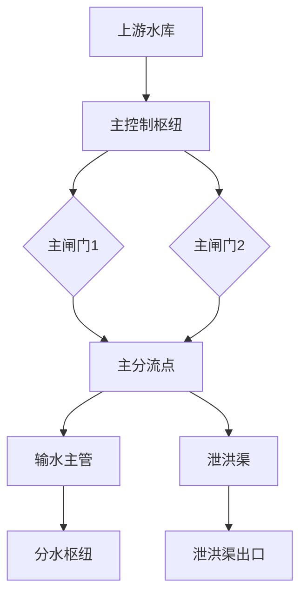
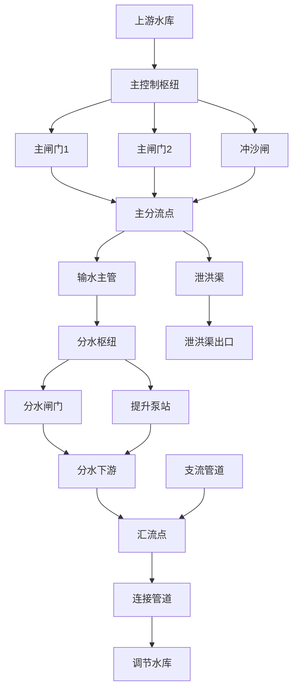
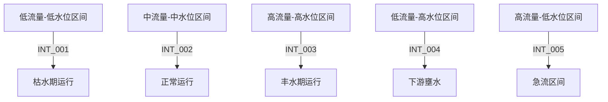

# 复杂枢纽示例

<cite>
**本文档引用文件**  
- [complex_hub_demo.py](file://examples/complex_hub_demo.py)
- [quick_complex_hub_demo.py](file://examples/quick_complex_hub_demo.py)
- [complex_hub_network.yaml](file://examples/configs/complex_hub_network.yaml)
- [complex_hub_config.py](file://waternet/config/complex_hub_config.py)
- [interval_optimization](file://examples/interval_optimization)
- [demo_five_intervals.py](file://examples/interval_optimization/demo_five_intervals.py)
- [application_examples.py](file://examples/interval_optimization/application_examples.py)
</cite>

## 目录
1. [简介](#简介)
2. [简单双闸门系统示例](#简单双闸门系统示例)
3. [多泵站-闸门协同控制系统示例](#多泵站-闸门协同控制系统示例)
4. [区间优化系统示例](#区间优化系统示例)
5. [配置方法与运行步骤](#配置方法与运行步骤)
6. [预期结果说明](#预期结果说明)

## 简介

本示例文档展示了WaterNet水力系统建模框架中复杂枢纽系统的完整实现。通过从简单双闸门系统到多泵站-闸门协同控制系统的逐步演示，全面呈现了复杂水力枢纽的建模、仿真与分析能力。

系统支持基于YAML配置文件的声明式建模，可精确描述水库、管道、枢纽站、连接点等水力组件及其拓扑关系。通过隐式求解器实现稳态和瞬态水力计算，并提供完整的验证与可视化功能。

**Section sources**
- [complex_hub_demo.py](file://examples/complex_hub_demo.py#L1-L611)
- [complex_hub_network.yaml](file://examples/configs/complex_hub_network.yaml#L1-L229)

## 简单双闸门系统示例

本示例展示了一个包含两个闸门的简单枢纽系统，用于演示基本的水力控制功能。



**Diagram sources**
- [complex_hub_network.yaml](file://examples/configs/complex_hub_network.yaml#L1-L229)

该系统包含：
- 上游水库作为水源
- 主控制枢纽配备两个主闸门
- 主分流点实现流量分配
- 输水主管和泄洪渠两条输出路径

**Section sources**
- [complex_hub_network.yaml](file://examples/configs/complex_hub_network.yaml#L1-L229)

## 多泵站-闸门协同控制系统示例

本示例展示了一个复杂的梯级水库枢纽系统，包含多级水库、泵站和闸门的协同控制。



**Diagram sources**
- [complex_hub_network.yaml](file://examples/configs/complex_hub_network.yaml#L1-L229)

该系统包含以下主要组件：

### 水库系统
- 上游水库：初始水位110.0m，水面面积250万平方米
- 调节水库：初始水位95.0m，水面面积180万平方米

### 枢纽站系统
- 主控制枢纽：包含三个闸门（主闸门1、主闸门2、冲沙闸）
- 分水枢纽：包含分水闸门和提升泵站

### 连接系统
- 主分流点：将流量按70%:30%比例分配至输水主管和泄洪渠
- 汇流点：汇集分水枢纽、支流管道和调节水库的水流

### 控制策略
- 主闸门1：水位控制，目标水位110.0m
- 提升泵站：流量控制，目标流量10.0m³/s，15分钟后启动

**Section sources**
- [complex_hub_network.yaml](file://examples/configs/complex_hub_network.yaml#L1-L229)
- [complex_hub_demo.py](file://examples/complex_hub_demo.py#L1-L611)

## 区间优化系统示例

本示例展示基于入口-出口双断面分段线性化的流量水位区间优化系统。

### 五个代表性区间



**Diagram sources**
- [demo_five_intervals.py](file://examples/interval_optimization/demo_five_intervals.py#L1-L323)

系统实现了以下核心功能：

1. **智能区间划分**：基于流量水位二维空间的自适应分段算法
2. **四方程IDZ建模**：完整的双断面耦合传递函数矩阵
3. **误差控制机制**：确保各区间线性化模型误差小于20%
4. **运行时切换**：支持区间间的平滑过渡和实时切换

**Section sources**
- [interval_optimization](file://examples/interval_optimization)
- [demo_five_intervals.py](file://examples/interval_optimization/demo_five_intervals.py#L1-L323)

## 配置方法与运行步骤

### 配置文件说明

系统使用YAML格式的配置文件定义水力网络，主要包含以下部分：

- **system**：系统基本信息
- **reservoirs**：水库配置
- **pipes**：管道配置
- **stations**：枢纽站配置
- **junctions**：连接点配置
- **initial_conditions**：初始条件
- **simulation_settings**：仿真设置

### 运行步骤

#### 1. 基本演示运行
```bash
python examples/complex_hub_demo.py --config examples/configs/complex_hub_network.yaml --output demo_output --mode all
```

#### 2. 快速演示运行
```bash
python examples/quick_complex_hub_demo.py
```

#### 3. 区间优化演示
```bash
# 运行五个代表性区间演示
python examples/interval_optimization/demo_five_intervals.py

# 运行应用示例
python examples/interval_optimization/application_examples.py
```

#### 4. 自定义配置运行
```bash
python examples/complex_hub_demo.py --config your_config.yaml --output your_output --mode steady
```

**Section sources**
- [complex_hub_demo.py](file://examples/complex_hub_demo.py#L1-L611)
- [quick_complex_hub_demo.py](file://examples/quick_complex_hub_demo.py#L1-L341)
- [application_examples.py](file://examples/interval_optimization/application_examples.py#L1-L502)

## 预期结果说明

### 稳态求解结果

系统将生成以下稳态求解结果：

- **水位分布**：各关键节点的稳定水位值
- **流量分布**：各管道和闸门的稳定流量值
- **收敛信息**：迭代次数、最终残差等求解统计信息

### 瞬态求解结果

系统将生成以下瞬态求解结果：

- **时间序列数据**：关键变量随时间的变化
- **动态响应**：系统对边界条件变化的响应特性
- **仿真报告**：完整的求解过程和结果分析

### 输出文件

运行成功后将生成以下文件：

- `steady_state_results.json`：稳态求解结果
- `transient_results.json`：瞬态求解结果
- `demo_report.json`：演示报告
- `steady_state_analysis.png`：稳态分析图表
- `transient_analysis.png`：瞬态分析图表
- `demo_*.log`：详细日志文件

### 成功标志

程序成功运行的标志包括：

- 返回码为0
- 日志中显示"演示成功完成"
- 输出目录中包含所有预期结果文件
- 关键指标满足要求（如误差小于20%）

**Section sources**
- [complex_hub_demo.py](file://examples/complex_hub_demo.py#L1-L611)
- [quick_complex_hub_demo.py](file://examples/quick_complex_hub_demo.py#L1-L341)
- [complex_hub_network.yaml](file://examples/configs/complex_hub_network.yaml#L1-L229)