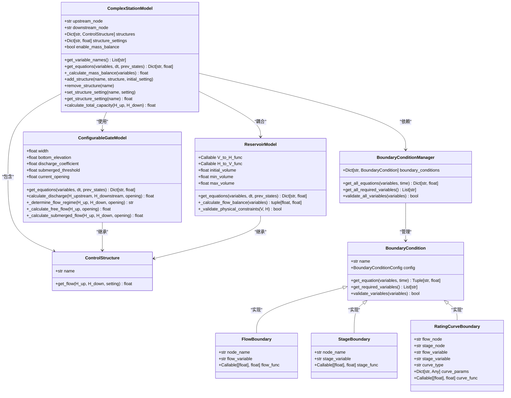
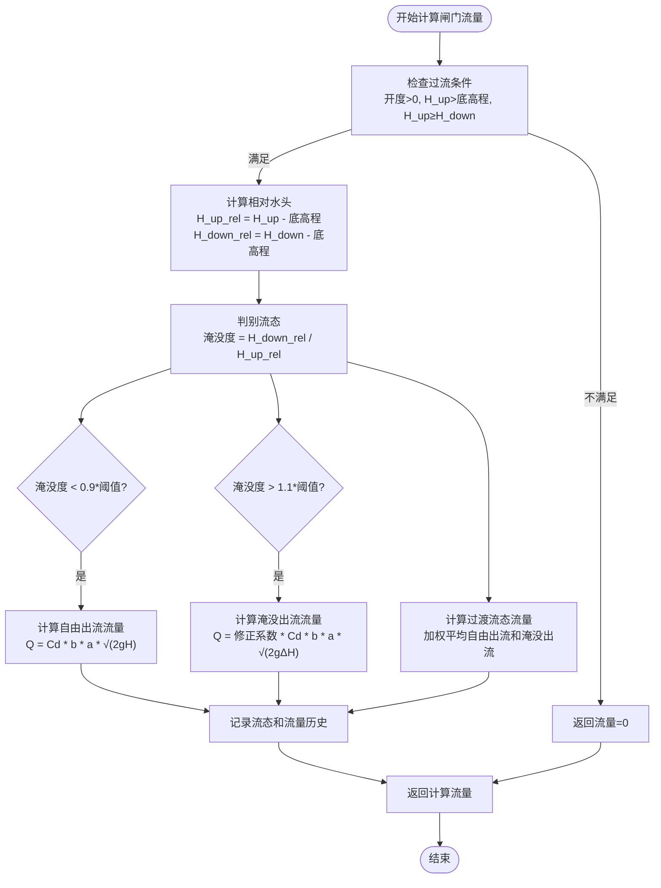
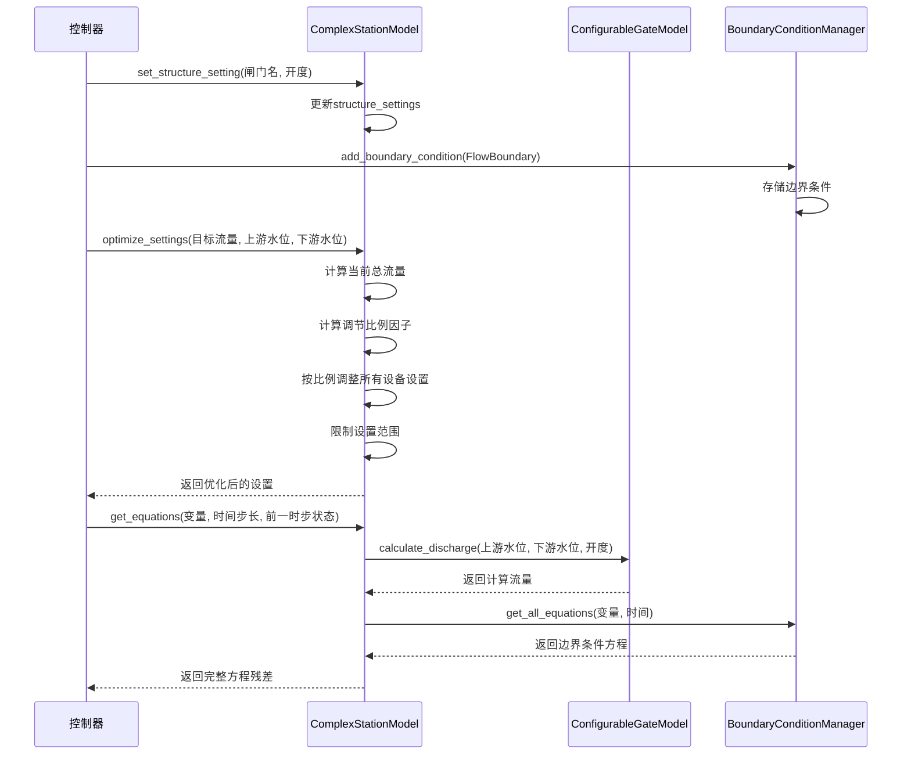
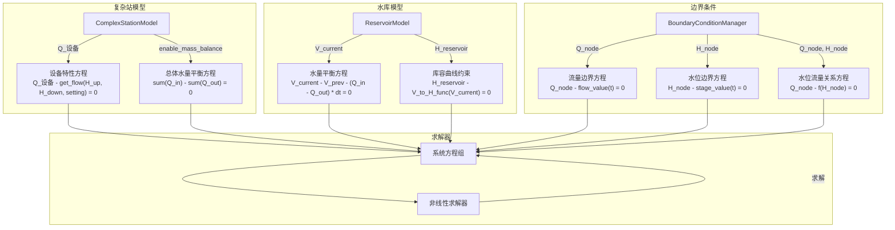
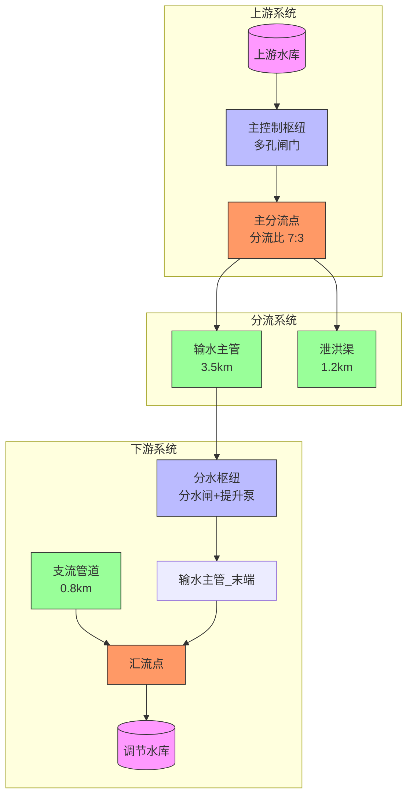

# 复杂站模型

<cite>
**本文档引用文件**  
- [complex_station_model.py](file://waternet/models/complex_station_model.py)
- [configurable_gate_model.py](file://waternet/models/configurable_gate_model.py)
- [reservoir_model.py](file://waternet/models/reservoir_model.py)
- [boundary_conditions.py](file://waternet/models/boundary_conditions.py)
- [reservoir_gate_channel_system.yaml](file://configs/reservoir_gate_channel_system.yaml)
- [complex_hub_network.yaml](file://examples/configs/complex_hub_network.yaml)
- [config_driven_reservoir_gate_system.py](file://examples/config_driven_reservoir_gate_system.py)
</cite>

## 目录
1. [系统架构](#系统架构)
2. [设备层建模](#设备层建模)
3. [控制策略集成](#控制策略集成)
4. [水力模型耦合方式](#水力模型耦合方式)
5. [梯级水库调度应用案例](#梯级水库调度应用案例)

## 系统架构

复杂站模型采用层次化设计，将水力枢纽系统分解为设备层、控制层和系统层三个层级，实现从局部到整体的统一建模。该模型通过`ComplexStationModel`类实现，能够集成多种水力机械设备（如闸门、泵站、阀门等），并统一处理其流量特性、控制逻辑和系统级水量平衡。

模型通过定义上下游连接节点（`upstream_node`和`downstream_node`）建立与外部系统的接口，并通过`structures`字典管理内部设备。每个设备通过`ControlStructure`基类定义统一的流量计算接口`get_flow(H_up, H_down, setting)`，确保不同设备类型在系统中的一致性。系统通过`get_equations`方法构建非线性方程组，包括设备特性方程和可选的总体水量平衡方程，为数值求解提供基础。

**图源**  
- [complex_station_model.py](file://waternet/models/complex_station_model.py#L43-L447)
- [configurable_gate_model.py](file://waternet/models/configurable_gate_model.py#L21-L547)
- [reservoir_model.py](file://waternet/models/reservoir_model.py#L26-L304)
- [boundary_conditions.py](file://waternet/models/boundary_conditions.py#L40-L138)

**节源**  
- [complex_station_model.py](file://waternet/models/complex_station_model.py#L43-L447)

## 设备层建模

设备层建模是复杂站模型的核心，通过`ConfigurableGateModel`类实现闸门动力学的精确描述。该模型基于配置文件驱动，支持自由出流、淹没出流和过渡流态的自动判别与计算。模型通过`calculate_discharge`方法实现流量计算，首先检查基本过流条件（开度、水位、水头差），然后计算淹没度（`H_down / H_up`）并根据预设阈值（`submerged_threshold`）判别流态。

对于自由出流，采用孔口流公式`Q = Cd * A * √(2g * H)`；对于淹没出流，采用淹没孔口流公式`Q = Cd * A * √(2g * (H_up - H_down))`，并引入淹没修正系数；对于过渡流态，则在自由出流和淹没出流流量之间进行线性插值。模型还支持堰流公式作为自由出流的替代计算方式，增强了对不同闸门类型的适应性。

**图源**  
- [configurable_gate_model.py](file://waternet/models/configurable_gate_model.py#L157-L204)

**节源**  
- [configurable_gate_model.py](file://waternet/models/configurable_gate_model.py#L21-L547)

## 控制策略集成

复杂站模型通过`structure_settings`字典集成设备控制策略，实现运行参数的动态调整。每个设备的控制参数（如闸门开度、泵站转速）通过`set_structure_setting`和`get_structure_setting`方法进行设置和获取。模型支持多种控制策略，包括恒定设置、水位控制、流量控制和协调控制。

在`reservoir_gate_channel_system.yaml`配置文件中，通过`control_strategy`字段定义控制模式（如`coordinated`协调控制）和流量分配比例。模型通过`optimize_settings`方法实现目标流量的优化调节，采用简化的比例调节算法，根据当前总流量与目标流量的比值调整所有设备的设置值，并限制调节幅度以保证稳定性。此外，边界条件框架通过`BoundaryConditionManager`统一管理流量边界、水位边界和水位流量关系边界，支持时变控制信号的集成。

**图源**  
- [complex_station_model.py](file://waternet/models/complex_station_model.py#L43-L447)
- [configurable_gate_model.py](file://waternet/models/configurable_gate_model.py#L21-L547)
- [boundary_conditions.py](file://waternet/models/boundary_conditions.py#L40-L138)

**节源**  
- [complex_station_model.py](file://waternet/models/complex_station_model.py#L43-L447)

## 水力模型耦合方式

复杂站模型通过变量耦合和方程集成的方式与水力模型实现无缝耦合。在`get_equations`方法中，模型通过`variables`字典获取上下游水位（`H_up`和`H_down`），并为每个设备生成特性方程`Q_设备 - get_flow(H_up, H_down, setting) = 0`。这些方程与系统中其他模型（如明渠、管道）的方程共同构成非线性方程组，由求解器统一求解。

水库模型通过`ReservoirModel`类实现，其核心是水量平衡方程`V_current = V_prev + (Q_in - Q_out) * dt`和库容曲线约束`H_reservoir = V_to_H_func(V_current)`。水库的流入量和流出量通过`_calculate_flow_balance`方法从连接对象的流量变量中识别和累加，实现了与复杂站模型的流量耦合。边界条件通过`BoundaryConditionManager`管理，其生成的方程（如`Q_node - flow_value(t) = 0`或`H_node - stage_value(t) = 0`）直接加入系统方程组，确保边界条件的精确满足。

**图源**  
- [complex_station_model.py](file://waternet/models/complex_station_model.py#L135-L183)
- [reservoir_model.py](file://waternet/models/reservoir_model.py#L103-L151)
- [boundary_conditions.py](file://waternet/models/boundary_conditions.py#L78-L98)

**节源**  
- [reservoir_model.py](file://waternet/models/reservoir_model.py#L26-L304)

## 梯级水库调度应用案例

梯级水库调度是复杂站模型的重要应用，通过`complex_hub_network.yaml`配置文件中的多级水库和枢纽站系统实现。该案例包含上游水库、调节水库、主控制枢纽、分水枢纽和输水管道等组件，形成一个复杂的梯级调度网络。上游水库作为水源，通过主控制枢纽的多孔闸门向输水主管和泄洪渠分流，输水主管经分水枢纽后与支流管道汇流，最终注入调节水库。

在调度过程中，主控制枢纽的闸门根据上游水库水位进行水位控制，确保上游水位稳定在目标值；分水枢纽的提升泵站根据需求流量进行流量控制，在特定时间启动。系统通过`config_driven_reservoir_gate_system.py`脚本实现配置驱动的仿真，支持恒定流测试和非恒定流测试（如阶跃响应）。仿真结果可用于评估调度方案的响应时间、超调量、调节时间和稳态误差等性能指标，为优化调度策略提供依据。

**图源**  
- [complex_hub_network.yaml](file://examples/configs/complex_hub_network.yaml#L1-L228)
- [config_driven_reservoir_gate_system.py](file://examples/config_driven_reservoir_gate_system.py#L1-L430)

**节源**  
- [complex_hub_network.yaml](file://examples/configs/complex_hub_network.yaml#L1-L228)