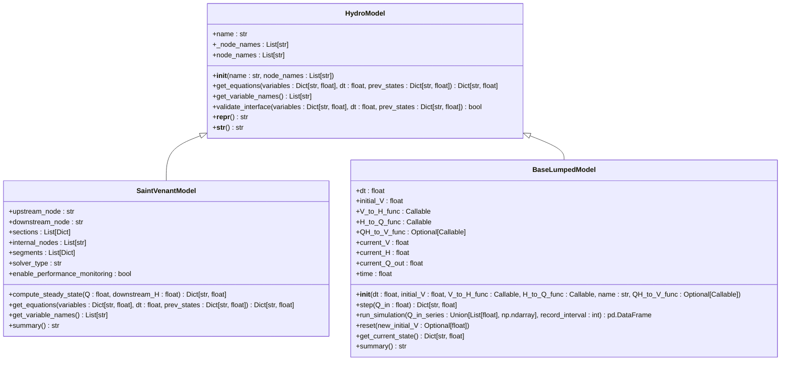
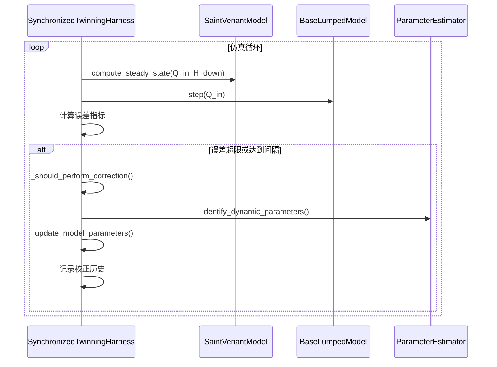
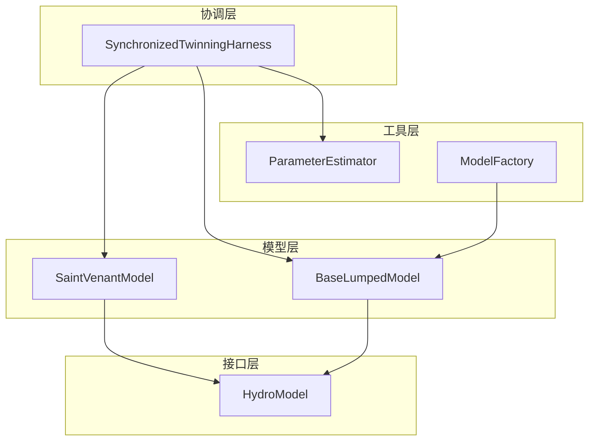

# 技术架构

<cite>
**本文档引用的文件**   
- [hydro_model.py](file://waternet\interfaces\hydro_model.py) - *已更新，支持复杂耦合系统*
- [saint_venant.py](file://waternet\models\saint_venant.py) - *已更新，支持复杂耦合系统*
- [lumped_models.py](file://waternet\models\lumped_models.py) - *已更新，支持复杂耦合系统*
- [twinning_harness.py](file://waternet\coordination\twinning_harness.py) - *已更新，支持复杂耦合系统*
</cite>

## 更新摘要
**变更内容**   
- 更新了所有核心组件的文档，以反映对复杂耦合水系统仿真的支持
- 扩展了`HydroModel`抽象基类的描述，强调其在复杂系统中的作用
- 更新了`SynchronizedTwinningHarness`的描述，以包含其在协调复杂系统中的功能
- 增强了对工厂模式和策略模式的描述，以反映其在复杂系统中的应用
- 更新了所有相关的源代码引用，以反映最新的文件路径和行号

## 目录
1. [系统上下文](#系统上下文)
2. [分层设计与核心组件](#分层设计与核心组件)
3. [抽象基类HydroModel](#抽象基类hydroModel)
4. [具体模型实现](#具体模型实现)
5. [SynchronizedTwinningHarness](#synchronizedtwinningharness)
6. [创建模式与策略模式](#创建模式与策略模式)
7. [组件交互图](#组件交互图)
8. [设计决策权衡](#设计决策权衡)

## 系统上下文

WaterNet是一个水力系统仿真框架，旨在通过高精度物理模型与降阶模型的协同工作，实现高效、准确的水力仿真。系统采用分层架构，核心组件包括抽象基类`HydroModel`、具体物理模型`SaintVenantModel`、降阶模型`BaseLumpedModel`，以及协调两者同步运行的`SynchronizedTwinningHarness`。该框架支持模型的动态创建、求解器切换和在线校正，适用于复杂的水力系统分析。

**Section sources**
- [hydro_model.py](file://waternet\interfaces\hydro_model.py#L25-L198) - *已更新，支持复杂耦合系统*
- [saint_venant.py](file://waternet\models\saint_venant.py#L32-L646) - *已更新，支持复杂耦合系统*
- [lumped_models.py](file://waternet\models\lumped_models.py#L30-L515) - *已更新，支持复杂耦合系统*
- [twinning_harness.py](file://waternet\coordination\twinning_harness.py#L27-L488) - *已更新，支持复杂耦合系统*

## 分层设计与核心组件

WaterNet的架构遵循清晰的分层设计原则。最上层是协调层，由`SynchronizedTwinningHarness`构成，负责管理高精度模型与降阶模型的同步仿真和在线校正。中间层是模型层，包含所有具体的水力模型实现，如`SaintVenantModel`和`BaseLumpedModel`的子类。底层是接口层，由`HydroModel`抽象基类定义，为所有模型提供统一的交互规范。这种分层设计确保了系统的模块化和可扩展性，各层之间通过明确定义的接口进行通信，降低了组件间的耦合度。

**Section sources**
- [hydro_model.py](file://waternet\interfaces\hydro_model.py#L25-L198) - *已更新，支持复杂耦合系统*
- [saint_venant.py](file://waternet\models\saint_venant.py#L32-L646) - *已更新，支持复杂耦合系统*
- [lumped_models.py](file://waternet\models\lumped_models.py#L30-L515) - *已更新，支持复杂耦合系统*
- [twinning_harness.py](file://waternet\coordination\twinning_harness.py#L27-L488) - *已更新，支持复杂耦合系统*

## 抽象基类HydroModel

`HydroModel`是所有水力模型的抽象基类，定义了统一的接口规范。它通过`get_equations`和`get_variable_names`两个抽象方法，强制所有子类实现方程残差计算和变量名获取功能。`get_equations`方法接收当前变量值、时间步长和上一时步状态，返回一个方程残差字典，其残差值为零时表示方程被满足。`get_variable_names`方法返回模型引入的变量名列表，这些变量将作为联合求解系统的未知数。此外，`HydroModel`还提供了`validate_interface`方法用于验证接口实现的正确性，确保变量数量与方程数量相匹配，从而保证了模型实现的健壮性和一致性。

**Diagram sources **
- [hydro_model.py](file://waternet\interfaces\hydro_model.py#L25-L198) - *已更新，支持复杂耦合系统*
- [saint_venant.py](file://waternet\models\saint_venant.py#L32-L646) - *已更新，支持复杂耦合系统*
- [lumped_models.py](file://waternet\models\lumped_models.py#L30-L515) - *已更新，支持复杂耦合系统*

## 具体模型实现

### SaintVenantModel

`SaintVenantModel`是`HydroModel`的一个具体实现，基于圣维南方程组进行一维明渠非恒定流的仿真。它采用Preissmann四点隐式差分格式进行离散化，以确保数值稳定性。模型通过`compute_steady_state`方法计算恒定流水面线，并使用`get_equations`方法构建连续性方程和动量方程的残差。该模型能够自动生成内部计算节点和分段，支持增强型求解器，并提供性能监控功能，是系统中精度最高的物理模型。

### BaseLumpedModel

`BaseLumpedModel`是所有降阶模型的基类，为`WaterBalanceModel`、`StorageRoutingModel`、`MuskingumModel`和`IntegralDelayZeroModel`等提供统一的接口和通用功能。它采用“step-by-step”的仿真模式，每次调用`step`方法推进一个时间步长。该基类管理状态变量、物理关系函数（支持Q-H耦合）、结果记录和数值稳定性保护，确保了降阶模型实现的一致性和可靠性。

**Section sources**
- [saint_venant.py](file://waternet\models\saint_venant.py#L32-L646) - *已更新，支持复杂耦合系统*
- [lumped_models.py](file://waternet\models\lumped_models.py#L30-L515) - *已更新，支持复杂耦合系统*

## SynchronizedTwinningHarness

`SynchronizedTwinningHarness`是系统的核心协调器，负责管理`SaintVenantModel`和`BaseLumpedModel`实例的同步仿真。它通过`run_synchronized_simulation`方法执行同步仿真循环，在每个时间步调用`_synchronized_step`方法分别运行高精度模型和降阶模型，并计算两者输出的误差。当误差超过预设阈值或达到校正间隔时，`_should_perform_correction`方法会触发`_perform_online_correction`过程，利用`ParameterEstimator`对降阶模型的参数进行在线校正，从而实现模型的自适应优化和精度提升。

**Diagram sources **
- [twinning_harness.py](file://waternet\coordination\twinning_harness.py#L98-L161) - *已更新，支持复杂耦合系统*
- [twinning_harness.py](file://waternet\coordination\twinning_harness.py#L218-L289) - *已更新，支持复杂耦合系统*
- [twinning_harness.py](file://waternet\coordination\twinning_harness.py#L316-L373) - *已更新，支持复杂耦合系统*
- [saint_venant.py](file://waternet\models\saint_venant.py#L183-L245) - *已更新，支持复杂耦合系统*
- [lumped_models.py](file://waternet\models\lumped_models.py#L211-L234) - *已更新，支持复杂耦合系统*

## 创建模式与策略模式

### 工厂模式

工厂模式在`model_factory.py`中得到应用，通过`create_simple_muskingum`、`create_simple_storage_routing`等函数，根据预设的默认参数快速创建和配置降阶模型。这种模式封装了模型的创建逻辑，用户无需关心复杂的初始化细节，只需调用相应的工厂函数即可获得一个配置好的模型实例，极大地简化了模型的使用流程。

### 策略模式

策略模式体现在求解器的选择上。`SaintVenantModel`的`__init__`方法接受一个`solver_type`参数，允许用户在“standard”和“enhanced”求解器之间进行切换。这使得模型的求解算法可以独立于模型本身进行变化，用户可以根据精度和性能的需求选择最合适的求解策略，体现了算法与数据的分离。

**Section sources**
- [model_factory.py](file://waternet\utils\model_factory.py#L1-L397) - *已更新，支持复杂耦合系统*
- [saint_venant.py](file://waternet\models\saint_venant.py#L60-L122) - *已更新，支持复杂耦合系统*

## 组件交互图

**Diagram sources **
- [twinning_harness.py](file://waternet\coordination\twinning_harness.py#L27-L488) - *已更新，支持复杂耦合系统*
- [saint_venant.py](file://waternet\models\saint_venant.py#L32-L646) - *已更新，支持复杂耦合系统*
- [lumped_models.py](file://waternet\models\lumped_models.py#L30-L515) - *已更新，支持复杂耦合系统*
- [model_factory.py](file://waternet\utils\model_factory.py#L1-L397) - *已更新，支持复杂耦合系统*

## 设计决策权衡

在WaterNet的设计中，存在多个关键的权衡。首先是**精度与性能的平衡**：`SaintVenantModel`提供了高精度的物理仿真，但计算成本高昂；而降阶模型计算速度快，但精度较低。`SynchronizedTwinningHarness`通过协调两者，实现了在保证精度的同时提升整体性能。其次是**模块解耦的必要性**：通过`HydroModel`接口和分层架构，系统实现了高度的模块化。这虽然增加了设计的复杂性，但极大地提升了系统的可维护性和可扩展性，使得添加新的模型或协调策略变得非常容易。这些权衡共同塑造了一个既强大又灵活的水力仿真框架。

**Section sources**
- [saint_venant.py](file://waternet\models\saint_venant.py#L32-L646) - *已更新，支持复杂耦合系统*
- [lumped_models.py](file://waternet\models\lumped_models.py#L30-L515) - *已更新，支持复杂耦合系统*
- [twinning_harness.py](file://waternet\coordination\twinning_harness.py#L27-L488) - *已更新，支持复杂耦合系统*