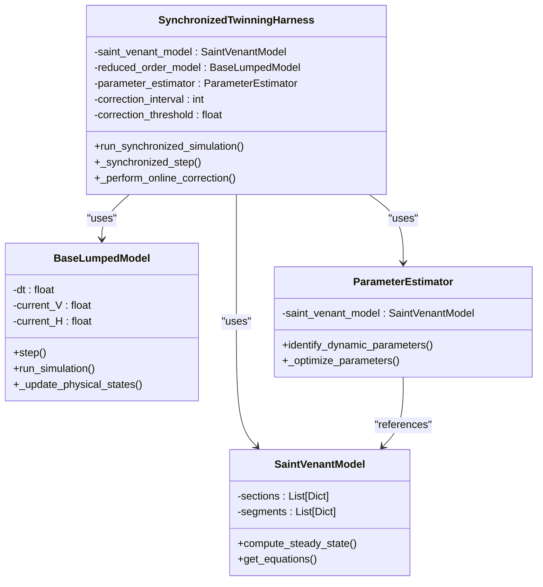
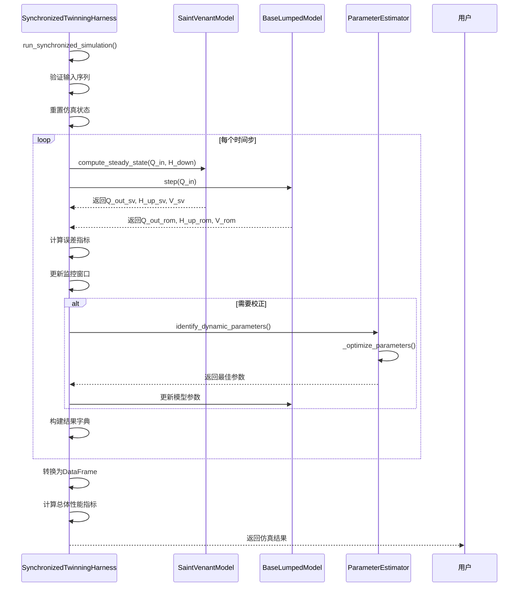
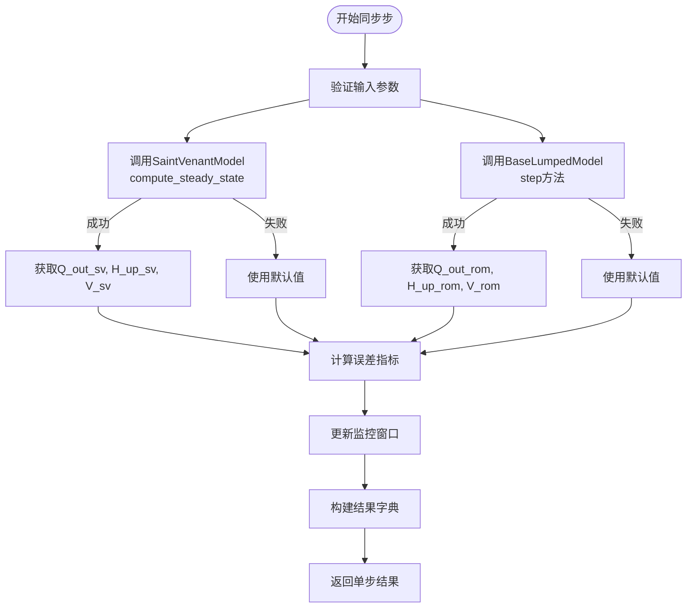
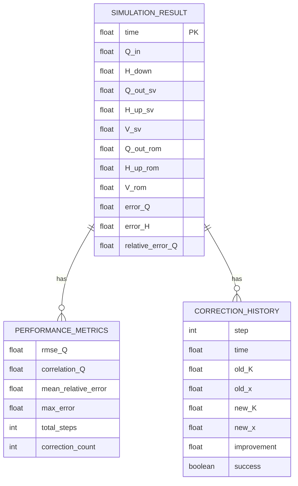

# 同步仿真机制

<cite>
**Referenced Files in This Document**   
- [SynchronizedTwinningHarness](file://waternet/coordination/twinning_harness.py)
- [SaintVenantModel](file://waternet/models/saint_venant.py)
- [BaseLumpedModel](file://waternet/models/lumped_models.py)
- [ParameterEstimator](file://waternet/parameter_estimation/estimator.py)
</cite>

## Table of Contents
1. [同步仿真机制](#同步仿真机制)
2. [核心组件](#核心组件)
3. [执行流程](#执行流程)
4. [状态同步与误差计算](#状态同步与误差计算)
5. [结果组织与性能评估](#结果组织与性能评估)
6. [典型调用示例](#典型调用示例)

## 同步仿真机制

`SynchronizedTwinningHarness` 类实现了精细化物理模型（`SaintVenantModel`）与降阶模型（`BaseLumpedModel`）的同步运行机制。该协调器通过统一的接口管理双模型的协同仿真，实现了数字孪生系统的核心协调功能。其主要特性包括实时同步仿真、在线参数校正、性能监控与分析、自适应优化策略以及结果对比与可视化。

协调器在初始化时验证两个模型的类型正确性，并创建一个 `ParameterEstimator` 实例用于后续的参数估计。它还配置了校正间隔和误差阈值等校正策略参数，并维护了同步仿真结果、校正历史和性能指标等状态记录。

**Section sources**
- [SynchronizedTwinningHarness](file://waternet/coordination/twinning_harness.py#L27-L488)

## 核心组件

同步仿真机制的核心在于 `SynchronizedTwinningHarness` 类，它协调两个关键模型组件：`SaintVenantModel` 和 `BaseLumpedModel`。

`SaintVenantModel` 是基于圣维南方程组的一维明渠非恒定流模型，实现了完整的物理水力学方程，包括连续性方程和动量方程。它采用Preissmann四点隐式差分格式进行离散化，确保数值计算的稳定性和精度。该模型支持恒定流和非恒定流计算，能够处理复杂的断面几何和边界条件。

`BaseLumpedModel` 是所有集总参数降阶模型的抽象基类，为 `MuskingumModel`、`StorageRoutingModel` 等具体降阶模型提供了统一的接口和通用功能。它采用“step-by-step”的仿真模式，每次调用 `step` 方法推进一个时间步长，并管理状态变量、物理关系函数和结果记录。



**Diagram sources**
- [SynchronizedTwinningHarness](file://waternet/coordination/twinning_harness.py#L27-L488)
- [SaintVenantModel](file://waternet/models/saint_venant.py#L32-L646)
- [BaseLumpedModel](file://waternet/models/lumped_models.py#L30-L515)
- [ParameterEstimator](file://waternet/parameter_estimation/estimator.py#L25-L418)

**Section sources**
- [SynchronizedTwinningHarness](file://waternet/coordination/twinning_harness.py#L27-L488)
- [SaintVenantModel](file://waternet/models/saint_venant.py#L32-L646)
- [BaseLumpedModel](file://waternet/models/lumped_models.py#L30-L515)

## 执行流程

`run_synchronized_simulation` 方法是同步仿真的主要入口，负责协调双模型的并行计算。该方法首先验证输入的时间序列长度是否匹配，然后重置仿真状态，进入主仿真循环。

在每个时间步，协调器调用 `_synchronized_step` 方法执行同步计算。该方法首先验证输入参数，然后并行执行两个模型的计算：`SaintVenantModel` 的 `compute_steady_state` 方法计算恒定流条件下的水力状态，而 `BaseLumpedModel` 的 `step` 方法推进降阶模型的一个时间步。



**Diagram sources**
- [SynchronizedTwinningHarness](file://waternet/coordination/twinning_harness.py#L98-L161)
- [SaintVenantModel](file://waternet/models/saint_venant.py#L183-L245)
- [BaseLumpedModel](file://waternet/models/lumped_models.py#L211-L234)

**Section sources**
- [SynchronizedTwinningHarness](file://waternet/coordination/twinning_harness.py#L98-L161)

## 状态同步与误差计算

`_synchronized_step` 方法是同步仿真的核心实现，负责在每个时间步协调两个模型的状态。该方法首先调用 `SaintVenantModel` 的 `compute_steady_state` 方法，基于能量方程和曼宁公式从下游向上游逐段计算恒定流水面线。计算结果包括各断面水位、分段流量和总蓄水量。

同时，该方法调用 `BaseLumpedModel` 的 `step` 方法，根据入流和当前状态计算降阶模型的新状态。对于 `MuskingumModel`，这涉及马斯京干公式的计算；对于 `StorageRoutingModel`，则涉及蓄量连续性方程的求解。

计算完成后，协调器计算两个模型输出之间的误差指标，包括流量误差 `error_Q`、水位误差 `error_H` 和相对流量误差 `relative_error_Q`。这些误差指标被用于后续的性能评估和在线校正决策。



**Diagram sources**
- [SynchronizedTwinningHarness](file://waternet/coordination/twinning_harness.py#L218-L289)

**Section sources**
- [SynchronizedTwinningHarness](file://waternet/coordination/twinning_harness.py#L218-L289)

## 结果组织与性能评估

同步仿真结果以 `pandas.DataFrame` 格式组织，包含丰富的字段信息。主要字段包括：`time`（仿真时间）、`Q_in`（输入流量）、`H_down`（下游水位）、`Q_out_sv`（圣维南模型输出流量）、`H_up_sv`（圣维南模型上游水位）、`V_sv`（圣维南模型蓄水量）、`Q_out_rom`（降阶模型输出流量）、`H_up_rom`（降阶模型上游水位）、`V_rom`（降阶模型蓄水量）、`error_Q`（流量误差）、`error_H`（水位误差）和 `relative_error_Q`（相对流量误差）。

仿真完成后，协调器调用 `_compute_overall_metrics` 方法计算总体性能指标，包括流量RMSE、相关系数、平均相对误差和最大误差。这些指标被存储在 `performance_metrics` 字典中，可用于后续的性能分析和报告生成。



**Diagram sources**
- [SynchronizedTwinningHarness](file://waternet/coordination/twinning_harness.py#L388-L442)

**Section sources**
- [SynchronizedTwinningHarness](file://waternet/coordination/twinning_harness.py#L388-L442)

## 典型调用示例

在洪水演进模拟中，同步仿真机制的典型调用示例如下：

```python
# 创建精细化模型和降阶模型实例
saint_venant_model = SaintVenantModel(...)
reduced_order_model = MuskingumModel(...)

# 创建同步孪生协调器
harness = SynchronizedTwinningHarness(
    saint_venant_model=saint_venant_model,
    reduced_order_model=reduced_order_model,
    correction_interval=10,
    correction_threshold=0.1
)

# 定义输入时间序列
Q_in_series = [100, 150, 200, 180, 160, 140, 120]  # m³/s
H_down_series = [99.4, 99.5, 99.6, 99.55, 99.5, 99.45, 99.4]  # m
dt = 60.0  # 时间步长，秒

# 运行同步仿真（启用校正）
results_df = harness.run_synchronized_simulation(
    Q_in_series=Q_in_series,
    H_down_series=H_down_series,
    dt=dt,
    enable_correction=True
)

# 获取性能摘要
summary = harness.get_performance_summary()
print(summary)
```

通过设置 `enable_correction` 参数，用户可以控制是否启用在线校正功能。当该参数为 `True` 时，协调器会在满足校正条件（达到校正间隔、误差超过阈值、有足够的数据）时，自动调用 `ParameterEstimator` 进行参数辨识，并更新降阶模型的参数，从而实现模型的自适应优化。

**Section sources**
- [SynchronizedTwinningHarness](file://waternet/coordination/twinning_harness.py#L98-L161)