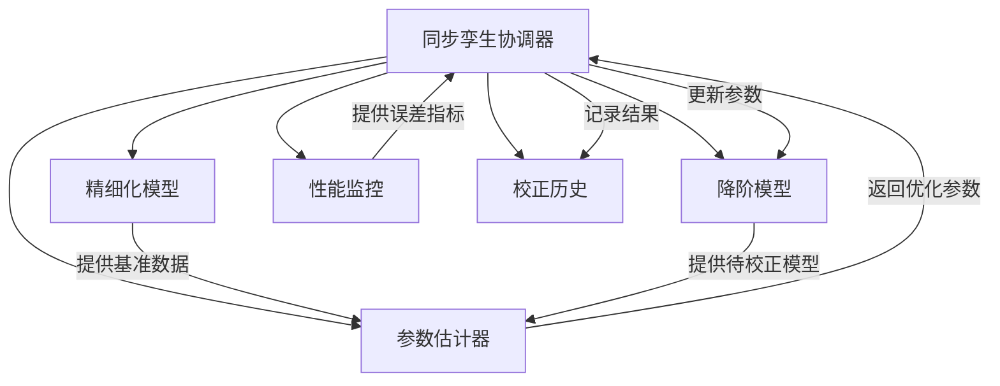
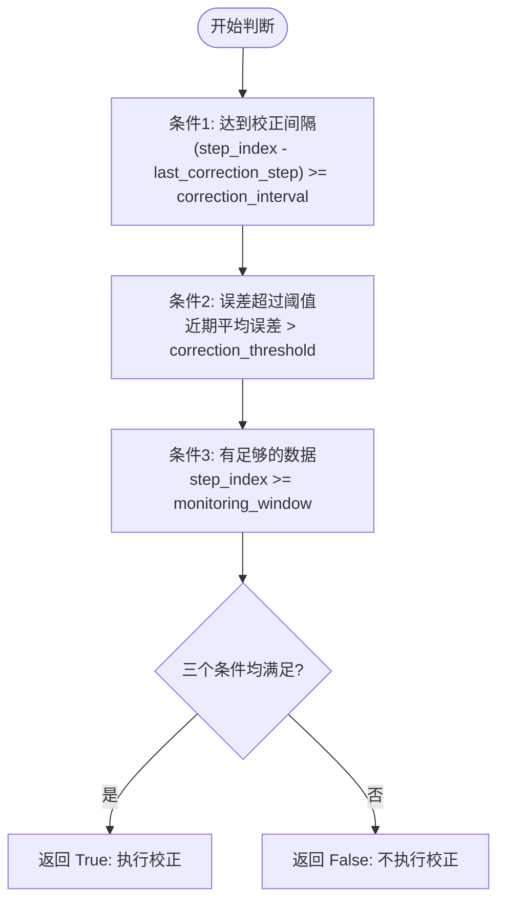
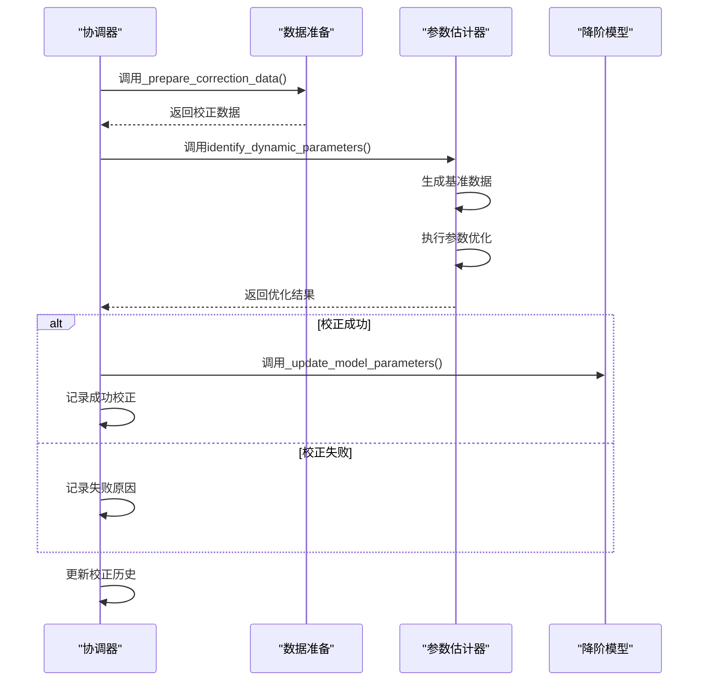
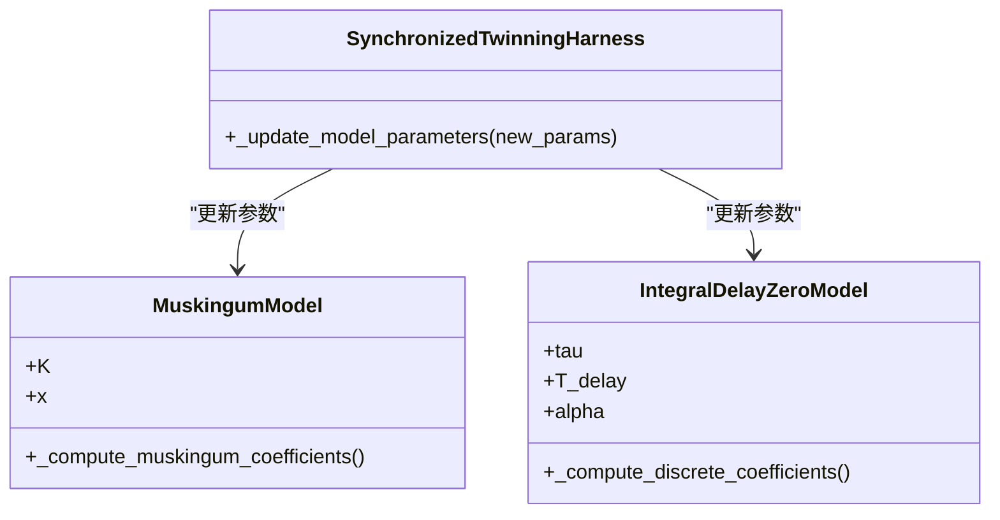
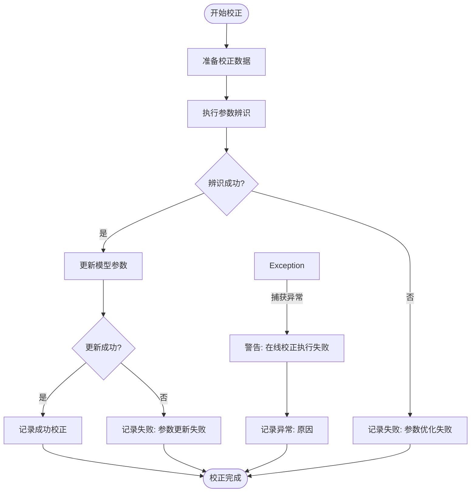

# 在线参数校正

<cite>
**Referenced Files in This Document**   
- [twinning_harness.py](file://waternet/coordination/twinning_harness.py)
- [estimator.py](file://waternet/parameter_estimation/estimator.py)
- [lumped_models.py](file://waternet/models/lumped_models.py)
- [muskingum_cunge.py](file://waternet/models/muskingum_cunge.py)
- [test_framework.py](file://tests/deep_channel/test_framework.py)
</cite>

## 目录
1. [引言](#引言)
2. [核心机制分析](#核心机制分析)
3. [校正触发逻辑](#校正触发逻辑)
4. [校正执行流程](#校正执行流程)
5. [参数更新机制](#参数更新机制)
6. [异常处理与日志记录](#异常处理与日志记录)
7. [性能统计与监控](#性能统计与监控)
8. [结论](#结论)

## 引言

在线参数校正机制是WaterNet系统中实现数字孪生模型自适应优化的核心功能。该机制通过持续监控模型性能，当检测到性能下降时自动触发参数优化过程，确保降阶模型能够准确反映精细化物理模型的动态行为。本文档深入解析该机制的实现原理，重点关注校正触发条件、执行流程、参数更新策略以及异常处理机制。

**Section sources**
- [twinning_harness.py](file://waternet/coordination/twinning_harness.py#L1-L50)

## 核心机制分析

在线参数校正机制由`SynchronizedTwinningHarness`类实现，该类作为精细化模型（如SaintVenantModel）与降阶模型（如MuskingumModel）之间的协调器，负责管理两者的同步运行和参数校正。其核心组件包括：

- **`ParameterEstimator`**：参数估计器，负责执行参数辨识算法
- **`_recent_errors`**：近期误差记录，用于判断性能下降
- **`correction_history`**：校正历史记录，存储每次校正的详细信息
- **`performance_metrics`**：性能指标，用于评估模型整体表现

该机制通过在仿真循环中定期检查校正条件，当条件满足时调用`_perform_online_correction`方法执行完整的校正流程。



**Diagram sources**
- [twinning_harness.py](file://waternet/coordination/twinning_harness.py#L1-L50)

**Section sources**
- [twinning_harness.py](file://waternet/coordination/twinning_harness.py#L1-L100)

## 校正触发逻辑

校正触发由`_should_perform_correction`方法控制，该方法基于三个关键条件的逻辑与（AND）运算来决定是否执行校正。

### 触发条件分析



**Diagram sources**
- [twinning_harness.py](file://waternet/coordination/twinning_harness.py#L291-L314)

**Section sources**
- [twinning_harness.py](file://waternet/coordination/twinning_harness.py#L291-L314)

#### 条件1：校正间隔

校正间隔由`correction_interval`参数控制，确保校正不会过于频繁。该条件通过比较当前时间步索引与上次校正时间步的差值来判断：

```python
interval_check = (step_index - self._last_correction_step) >= self.correction_interval
```

#### 条件2：误差阈值

当近期平均误差超过`correction_threshold`阈值时，触发校正。系统维护一个`_recent_errors`列表，存储最近的误差值，并计算最近3个时间步的平均误差：

```python
if len(self._recent_errors) >= 3:
    recent_avg_error = np.mean(self._recent_errors[-3:])
    threshold_check = recent_avg_error > self.correction_threshold
else:
    threshold_check = False
```

#### 条件3：数据窗口充足

确保有足够的数据用于校正，避免在仿真初期就进行校正。该条件通过比较当前时间步索引与`monitoring_window`的大小来判断：

```python
data_check = step_index >= self.monitoring_window
```

## 校正执行流程

当`_should_perform_correction`返回`True`时，系统调用`_perform_online_correction`方法执行完整的校正流程。

### 执行流程图



**Diagram sources**
- [twinning_harness.py](file://waternet/coordination/twinning_harness.py#L316-L373)
- [estimator.py](file://waternet/parameter_estimation/estimator.py#L262-L296)

**Section sources**
- [twinning_harness.py](file://waternet/coordination/twinning_harness.py#L316-L373)

### 数据准备

`_prepare_correction_data`方法负责收集最近`monitoring_window`步的输入数据，为参数辨识提供所需信息：

```python
def _prepare_correction_data(self, recent_results: List[Dict], dt: float) -> Dict[str, Any]:
    Q_in = [r['Q_in'] for r in recent_results]
    H_down = [r['H_down'] for r in recent_results]
    
    return {
        'Q_in': Q_in,
        'H_down': H_down,
        'dt': dt
    }
```

### 参数辨识

`_perform_online_correction`方法调用`ParameterEstimator`的`identify_dynamic_parameters`方法进行动态参数辨识。该过程包括：

1. **生成基准数据**：使用精细化模型（SaintVenantModel）生成非恒定流条件下的基准数据
2. **设置参数边界**：根据模型类型获取默认的参数搜索边界
3. **执行参数优化**：使用差分进化算法（differential_evolution）在参数空间中搜索最优解

```python
correction_result = self.parameter_estimator.identify_dynamic_parameters(
    correction_data, model_class)
```

## 参数更新机制

校正成功后，系统调用`_update_model_parameters`方法更新降阶模型的关键参数。

### 支持的模型类型



**Diagram sources**
- [twinning_harness.py](file://waternet/coordination/twinning_harness.py#L386-L409)
- [lumped_models.py](file://waternet/models/lumped_models.py#L300-L400)

**Section sources**
- [twinning_harness.py](file://waternet/coordination/twinning_harness.py#L386-L409)

### 更新流程

1. **马斯京干模型（MuskingumModel）**：
   - 更新`K`（滞时常数）和`x`（权重系数）参数
   - 调用`_compute_muskingum_coefficients()`重新计算C0、C1、C2系数

2. **IDZ模型（IntegralDelayZeroModel）**：
   - 更新`tau`（时间常数）、`T_delay`（延迟时间）和`alpha`（增益系数）
   - 调用`_compute_discrete_coefficients()`重新计算离散化系数

更新完成后，系统记录校正历史，包括旧参数、新参数、性能改善程度等信息。

## 异常处理与日志记录

系统实现了完善的异常处理和日志记录机制，确保校正过程的稳定性和可追溯性。

### 异常处理流程



**Section sources**
- [twinning_harness.py](file://waternet/coordination/twinning_harness.py#L316-L373)

### 日志记录策略

系统在关键步骤输出日志信息，便于调试和监控：

- **校正开始**：`print(f"执行在线校正，步骤 {self._step_counter}...")`
- **校正成功**：`print(f"校正成功，新参数: {correction_result['best_parameters']}")`
- **校正失败**：`print("校正失败")`
- **异常捕获**：`warnings.warn(f"在线校正执行失败: {e}")`

所有校正记录（无论成功或失败）都会被添加到`correction_history`列表中，包含时间、步骤、成功状态和原因等详细信息。

## 性能统计与监控

系统提供了`get_performance_summary`方法，用于获取校正过程的统计信息和性能摘要。

### 性能摘要内容

```python
def get_performance_summary(self) -> Dict[str, Any]:
    return {
        '总体性能': self.performance_metrics,
        '校正历史': {
            '校正次数': len(self.correction_history),
            '成功次数': sum(1 for c in self.correction_history if c.get('success', False)),
            '最近校正': self.correction_history[-1] if self.correction_history else None
        },
        '模型信息': {
            '精细化模型': self.saint_venant_model.name,
            '降阶模型': self.reduced_order_model.name,
            '当前参数': self._get_current_parameters()
        }
    }
```

**Section sources**
- [twinning_harness.py](file://waternet/coordination/twinning_harness.py#L459-L476)

### 监控指标

系统监控以下关键性能指标：

- **RMSE**：流量输出的均方根误差
- **相关系数**：精细化模型与降阶模型输出的相关性
- **平均相对误差**：平均相对误差百分比
- **最大误差**：仿真过程中的最大绝对误差

这些指标在每次仿真完成后通过`_compute_overall_metrics`方法计算并存储在`performance_metrics`字典中。

## 结论

在线参数校正机制通过`_should_perform_correction`方法的三重条件判断，确保了校正的合理性和有效性。当条件满足时，`_perform_online_correction`方法协调`ParameterEstimator`执行完整的参数辨识流程，从数据准备到参数优化，再到模型更新和历史记录。该机制支持多种降阶模型（如MuskingumModel和IntegralDelayZeroModel），并提供了完善的异常处理和性能监控功能，确保了数字孪生系统的自适应能力和可靠性。