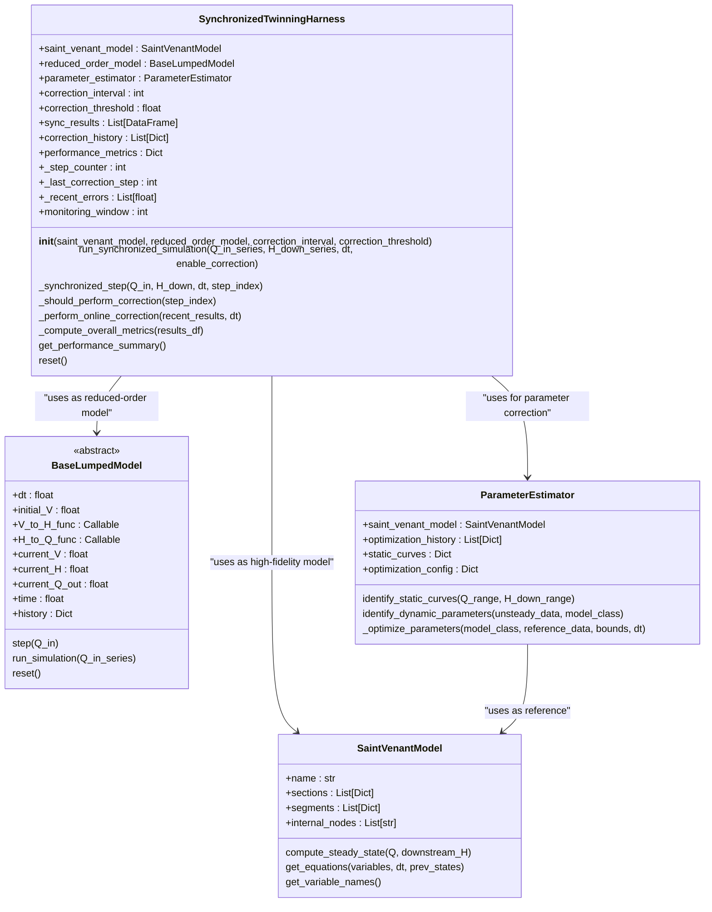
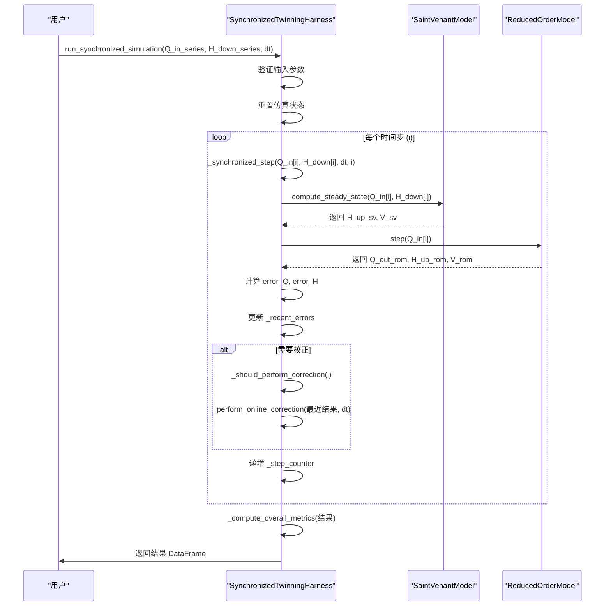
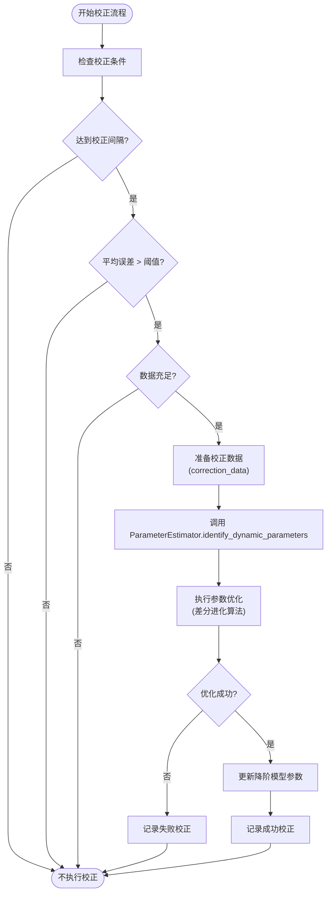

# 数字孪生协调机制

<cite>
**Referenced Files in This Document**   
- [SynchronizedTwinningHarness](file://waternet/coordination/twinning_harness.py)
- [ParameterEstimator](file://waternet/parameter_estimation/estimator.py)
- [SaintVenantModel](file://waternet/models/saint_venant.py)
- [BaseLumpedModel](file://waternet/models/lumped_models.py)
</cite>

## 目录
1. [引言](#引言)
2. [协调器初始化与模型验证](#协调器初始化与模型验证)
3. [同步仿真执行流程](#同步仿真执行流程)
4. [在线参数校正机制](#在线参数校正机制)
5. [性能监控与评估指标](#性能监控与评估指标)
6. [状态变化回调与外部通知](#状态变化回调与外部通知)
7. [典型应用场景](#典型应用场景)
8. [结论](#结论)

## 引言

数字孪生技术通过构建物理系统的虚拟映射，实现了对复杂工程过程的实时监控、预测和优化。在水文模拟领域，数字孪生系统面临着高精度物理模型计算成本高与快速降阶模型精度不足的矛盾。为解决这一挑战，WaterNet框架引入了`SynchronizedTwinningHarness`（同步孪生协调器），该机制通过协调高保真圣维南模型与快速降阶模型的同步仿真，实现了精度与效率的平衡。本技术文档全面阐述了该协调机制的设计原理、核心组件和工作流程，重点说明了其在实时洪水预报和调度决策支持中的应用价值。

**Section sources**
- [SynchronizedTwinningHarness](file://waternet/coordination/twinning_harness.py#L27-L488)

## 协调器初始化与模型验证

`SynchronizedTwinningHarness`的初始化是构建数字孪生系统的第一步，其核心任务是验证并整合两个关键模型实例：高精度的圣维南物理模型和快速的降阶模型。在`__init__`方法中，协调器首先对传入的模型实例进行严格的类型检查，确保`saint_venant_model`是`SaintVenantModel`的实例，而`reduced_order_model`是`BaseLumpedModel`的子类实例。这种类型验证保证了后续操作的兼容性，防止了因模型类型错误导致的运行时异常。

初始化过程不仅限于验证，还包括创建一个`ParameterEstimator`（参数估计器）实例。该估计器以圣维南模型作为基准，为后续的在线参数校正提供高精度的参考数据。同时，协调器会初始化多个状态记录器，如`sync_results`用于存储同步仿真结果，`correction_history`用于追踪校正历史，以及`performance_metrics`用于记录性能指标。此外，校正间隔`correction_interval`和误差阈值`correction_threshold`等配置参数也被设置，为后续的自适应校正策略奠定了基础。

**Diagram sources**
- [SynchronizedTwinningHarness](file://waternet/coordination/twinning_harness.py#L27-L488)
- [SaintVenantModel](file://waternet/models/saint_venant.py#L123-L646)
- [BaseLumpedModel](file://waternet/models/lumped_models.py#L124-L1098)
- [ParameterEstimator](file://waternet/parameter_estimation/estimator.py#L24-L418)

**Section sources**
- [SynchronizedTwinningHarness](file://waternet/coordination/twinning_harness.py#L57-L119)

## 同步仿真执行流程

`SynchronizedTwinningHarness`的核心功能由`run_synchronized_simulation`方法驱动，该方法实现了高保真模型与降阶模型在每个时间步的并行驱动与结果比较。执行流程始于对输入参数的验证，确保入流序列`Q_in_series`和下游水位序列`H_down_series`长度一致且非空。随后，协调器调用`_reset_simulation_state`方法重置内部计数器和状态记录器，为新的仿真周期做准备。

主仿真循环通过`_synchronized_step`方法在每个时间步执行。该方法首先调用圣维南模型的`compute_steady_state`方法，基于当前入流`Q_in`和下游水位`H_down`计算出上游水位`H_up_sv`和总蓄水量`V_sv`。同时，降阶模型的`step`方法被调用，根据入流`Q_in`推进其内部状态，输出`Q_out_rom`、`H_up_rom`和`V_rom`。协调器将两个模型的输出进行比较，计算流量误差`error_Q`和水位误差`error_H`，并将这些误差指标记录在`_recent_errors`列表中，用于后续的性能监控和校正决策。

**Diagram sources**
- [SynchronizedTwinningHarness](file://waternet/coordination/twinning_harness.py#L121-L289)
- [SaintVenantModel](file://waternet/models/saint_venant.py#L183-L245)
- [BaseLumpedModel](file://waternet/models/lumped_models.py#L211-L234)

**Section sources**
- [SynchronizedTwinningHarness](file://waternet/coordination/twinning_harness.py#L121-L289)

## 在线参数校正机制

在线参数校正是`SynchronizedTwinningHarness`实现自适应优化的核心。该机制通过`_should_perform_correction`和`_perform_online_correction`两个方法协同工作。`_should_perform_correction`方法在每个时间步检查三个条件：是否达到了预设的校正间隔、最近几个时间步的平均误差是否超过了`correction_threshold`、以及是否有足够的数据（至少一个监控窗口长度）用于校正。只有当这三个条件同时满足时，才会触发校正流程。

一旦触发，`_perform_online_correction`方法将被调用。该方法首先从`_synchronized_step`的输出结果中提取最近的仿真数据，构建一个包含`Q_in`和`H_down`序列的`correction_data`字典。然后，它将`correction_data`和降阶模型的类型传递给`ParameterEstimator`的`identify_dynamic_parameters`方法。参数估计器利用圣维南模型作为基准，生成一个高精度的“参考数据集”，并使用差分进化算法（differential evolution）在参数空间中搜索最优解，以最小化降阶模型与参考数据之间的RMSE（均方根误差）。当优化成功时，协调器调用`_update_model_parameters`方法，将新参数应用到降阶模型上，并记录校正历史。

**Diagram sources**
- [SynchronizedTwinningHarness](file://waternet/coordination/twinning_harness.py#L291-L378)
- [ParameterEstimator](file://waternet/parameter_estimation/estimator.py#L262-L296)

**Section sources**
- [SynchronizedTwinningHarness](file://waternet/coordination/twinning_harness.py#L291-L378)

## 性能监控与评估指标

协调器通过一套综合的性能监控指标来量化两个模型之间的差异，并评估整体仿真质量。这些指标分为两类：实时监控指标和总体性能指标。

实时监控主要依赖于`_recent_errors`列表，该列表维护一个固定长度（由`monitoring_window`定义，通常为20步）的近期流量误差队列。`_should_perform_correction`方法通过计算该队列的平均值来判断是否触发校正，实现了对模型性能的动态感知。

在仿真结束后，`_compute_overall_metrics`方法会计算一系列总体性能指标。核心指标包括：
- **RMSE (均方根误差)**：衡量降阶模型输出流量与圣维南模型输出流量之间的绝对差异，计算公式为`sqrt(mean((Q_sv - Q_rom)^2))`。
- **相关系数 (Pearson Correlation Coefficient)**：衡量两个模型输出流量序列的线性相关性，值越接近1表示相关性越强。
- **平均相对误差**：以百分比形式表示的平均误差，计算公式为`mean(|Q_sv - Q_rom| / max(Q_sv, 1e-6)) * 100`。
- **最大误差**：整个仿真过程中出现的最大绝对误差。

这些指标被汇总到`performance_metrics`字典中，并可通过`get_performance_summary`方法获取，为用户提供了对协调器性能的全面洞察。

**Section sources**
- [SynchronizedTwinningHarness](file://waternet/coordination/twinning_harness.py#L429-L476)

## 状态变化回调与外部通知

虽然当前代码实现中未直接包含回调函数，但`SynchronizedTwinningHarness`的设计为外部系统集成提供了清晰的接口。`get_performance_summary`方法返回一个包含“总体性能”、“校正历史”和“模型信息”的详细字典，这本身就是一种状态通知机制。外部系统可以定期调用此方法，轮询协调器的当前状态。

更进一步，`correction_history`列表记录了每一次校正的详细信息，包括成功与否、新旧参数以及性能提升。外部监控系统可以监听此列表的变化，当有新的校正记录被添加时，即可视为一个“状态变化事件”，并据此触发警报、日志记录或向调度决策系统推送更新后的模型参数。这种设计模式使得协调器能够无缝集成到更大的实时监控和决策支持系统中。

**Section sources**
- [SynchronizedTwinningHarness](file://waternet/coordination/twinning_harness.py#L459-L476)

## 典型应用场景

`SynchronizedTwinningHarness`在实时洪水预报和调度决策支持中具有典型的应用价值。

在**实时洪水预报**场景中，系统需要快速响应上游来水的变化。降阶模型因其计算速度快，能够提供近乎实时的洪水过程线预测。然而，其精度可能随时间漂移。协调器通过定期与高精度的圣维南模型进行比对，一旦发现预报偏差超过阈值，便立即触发在线参数校正，动态调整降阶模型的参数（如马斯京干模型的K和x系数），从而确保预报结果的长期准确性。这解决了传统方法中“预报快但不准”或“预报准但太慢”的难题。

在**调度决策支持**场景中，调度员需要评估不同调度方案（如水库泄流）对下游的影响。协调器可以并行运行多个孪生实例，每个实例代表一种调度方案。通过比较不同方案下协调器的性能指标和校正历史，调度员可以直观地评估各方案的可靠性和稳定性，选择最优的调度策略。此外，协调器提供的性能摘要为决策过程提供了量化的依据，增强了决策的科学性。

**Section sources**
- [SynchronizedTwinningHarness](file://waternet/coordination/twinning_harness.py#L27-L488)

## 结论

`SynchronizedTwinningHarness`作为WaterNet框架中的核心协调机制，成功地将高精度物理模型的准确性与降阶模型的计算效率相结合。通过严谨的初始化验证、高效的同步仿真流程、智能的在线参数校正和全面的性能监控，该机制构建了一个自适应、自优化的数字孪生系统。它不仅解决了水文模拟中的精度与效率矛盾，还为实时洪水预报和调度决策支持等关键应用提供了强大的技术支撑。未来的工作可以进一步探索更复杂的回调机制和与外部系统的深度集成，以充分发挥数字孪生技术的潜力。