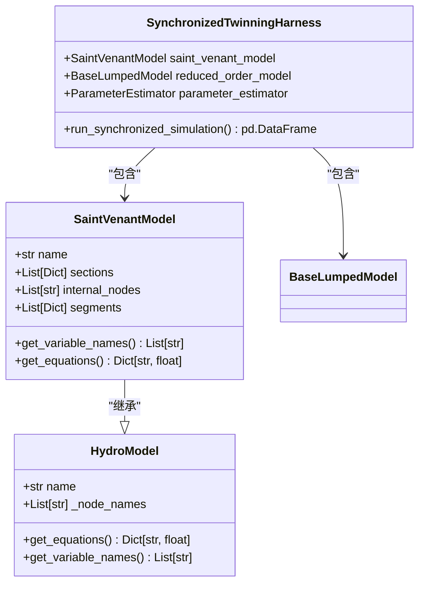
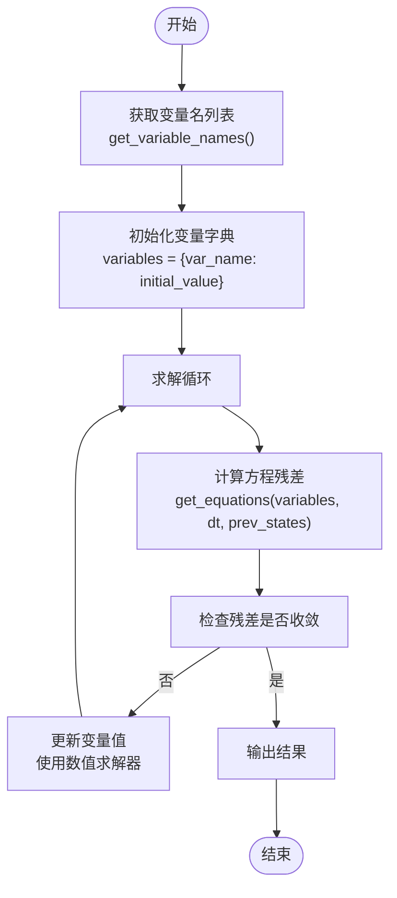
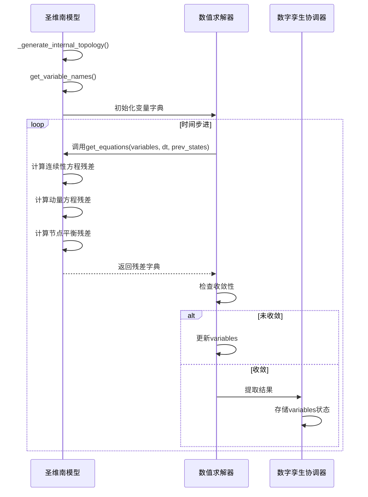

# 变量系统

<cite>
**Referenced Files in This Document**  
- [saint_venant.py](file://waternet/models/saint_venant.py)
- [hydro_model.py](file://waternet/interfaces/hydro_model.py)
- [twinning_harness.py](file://waternet/coordination/twinning_harness.py)
- [simple_channel.yaml](file://examples/configs/simple_channel.yaml)
- [basic_usage.py](file://examples/basic_usage.py)
</cite>

## 目录
1. [变量体系架构](#变量体系架构)
2. [变量命名规范与系统耦合](#变量命名规范与系统耦合)
3. [变量字典与非线性方程组](#变量字典与非线性方程组)
4. [变量生命周期管理](#变量生命周期管理)
5. [变量访问与数据交互](#变量访问与数据交互)

## 变量体系架构

圣维南模型的变量体系基于物理水力学原理构建，通过`get_variable_names`方法自动生成分段流量和内部节点水位变量。该方法首先遍历模型的分段（segments）结构，为每个分段添加流量变量（`seg['flow_var']`），然后为每个内部节点（`internal_nodes`）生成以`H_`为前缀的水位变量。

变量体系的设计实现了物理过程的离散化表示：分段流量变量代表了明渠中各计算段的水流状态，而内部节点水位变量则反映了断面间的水力连接关系。这种设计确保了变量数量与控制方程数量的严格匹配，为非线性方程组的求解提供了数学基础。

**Section sources**
- [saint_venant.py](file://waternet/models/saint_venant.py#L505-L526)
- [saint_venant.py](file://waternet/models/saint_venant.py#L32-L646)

## 变量命名规范与系统耦合

变量命名规范采用标准化的前缀标识系统，确保了变量在整个数字孪生系统中的唯一性和可识别性。分段流量变量采用`Q_{model_name}_seg_{index}`格式，其中`Q`表示流量，`model_name`为模型标识符，`seg`表示分段，`index`为分段索引。内部节点水位变量采用`H_{node_name}`格式，其中`H`表示水位，`node_name`为节点名称。

该命名规范在系统耦合中发挥关键作用：前缀`Q`和`H`作为语义标识符，使系统能够自动识别变量的物理含义；模型名称的嵌入确保了多模型耦合时变量的全局唯一性；索引机制支持了拓扑结构的自动解析。这种设计使得不同模型（如圣维南模型与降阶模型）能够通过共享边界节点的水位变量实现无缝耦合。

**Diagram sources**
- [saint_venant.py](file://waternet/models/saint_venant.py#L32-L646)
- [hydro_model.py](file://waternet/interfaces/hydro_model.py#L25-L198)
- [twinning_harness.py](file://waternet/coordination/twinning_harness.py#L45-L77)

**Section sources**
- [saint_venant.py](file://waternet/models/saint_venant.py#L32-L646)
- [hydro_model.py](file://waternet/interfaces/hydro_model.py#L25-L198)

## 变量字典与非线性方程组

变量字典在非线性方程组求解中扮演核心角色，它将物理变量与数学求解过程连接起来。`get_equations`方法接收包含当前变量值的字典（`variables`）和上一时步状态（`prev_states`），输出方程残差字典。每个残差对应一个控制方程，如连续性方程、动量方程或节点流量平衡方程。

变量字典与方程输出的对应关系通过命名约定实现：连续性方程残差命名为`continuity_seg_{index}`，动量方程残差为`momentum_seg_{index}`，节点平衡方程为`balance_{node_name}`。这种命名一致性确保了求解器能够正确地将变量变化与方程残差关联，通过牛顿迭代法等数值方法求解非线性方程组。

**Diagram sources**
- [saint_venant.py](file://waternet/models/saint_venant.py#L357-L454)
- [saint_venant.py](file://waternet/models/saint_venant.py#L505-L526)

**Section sources**
- [saint_venant.py](file://waternet/models/saint_venant.py#L357-L454)

## 变量生命周期管理

变量的生命周期涵盖初始化、状态传递和结果提取三个阶段。在初始化阶段，模型根据断面几何数据自动生成分段和内部节点，进而通过`_generate_internal_topology`方法创建变量名。状态传递发生在时间步进过程中，当前时步的变量值通过`variables`字典传递给`get_equations`方法，而上一时步的状态通过`prev_states`字典传递，实现了时间维度上的状态延续。

结果提取通过分析`get_equations`返回的残差字典实现。当残差收敛到设定阈值时，`variables`字典中的值即为当前时步的物理状态。该字典可直接用于提取特定断面的水位或分段的流量，例如通过`variables[f'H_{node_name}']`访问节点水位，或通过`variables[seg['flow_var']]`获取分段流量。

**Diagram sources**
- [saint_venant.py](file://waternet/models/saint_venant.py#L32-L646)
- [saint_venant.py](file://waternet/models/saint_venant.py#L357-L454)
- [twinning_harness.py](file://waternet/coordination/twinning_harness.py#L45-L77)

**Section sources**
- [saint_venant.py](file://waternet/models/saint_venant.py#L32-L646)

## 变量访问与数据交互

变量系统通过标准化的命名约定支持与降阶模型和数字孪生协调器的数据交互。在`basic_usage.py`示例中，通过`variables[f'H_{node_name}']`语法可直接访问特定断面的水位，通过`variables[seg['flow_var']]`可获取分段流量。这种基于字符串格式化的访问方式既灵活又安全。

与数字孪生协调器的交互通过`SynchronizedTwinningHarness`实现。该协调器管理圣维南模型与降阶模型的同步仿真，通过比较两者输出的流量和水位变量来计算误差，并在误差超过阈值时触发在线参数校正。变量命名规范确保了不同模型间的状态变量能够正确对齐，实现了精细化模型与降阶模型的协同工作。

**Section sources**
- [basic_usage.py](file://examples/basic_usage.py#L433-L470)
- [twinning_harness.py](file://waternet/coordination/twinning_harness.py#L45-L77)