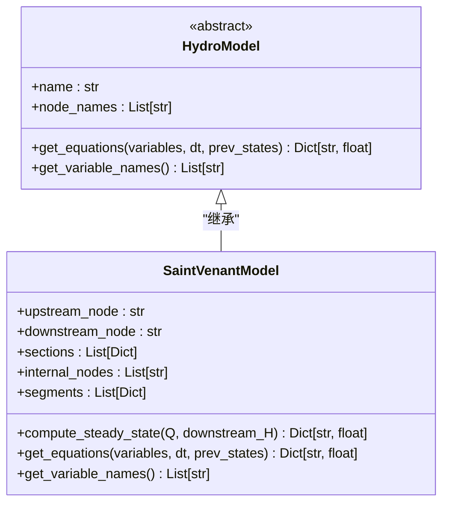
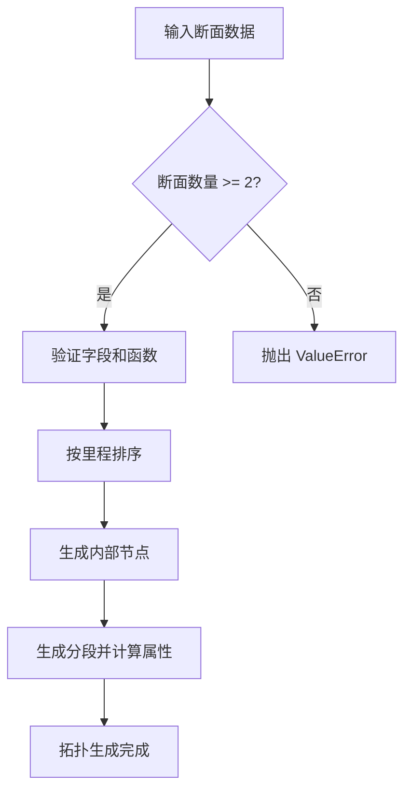
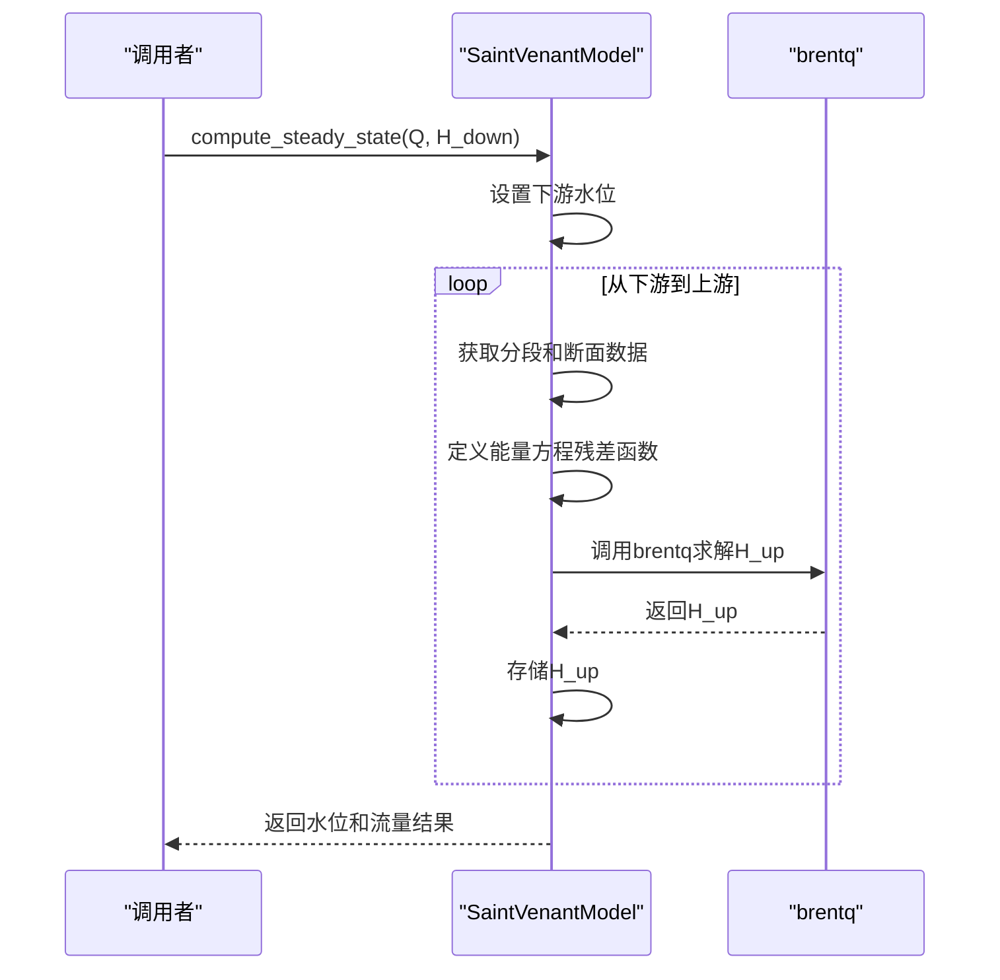
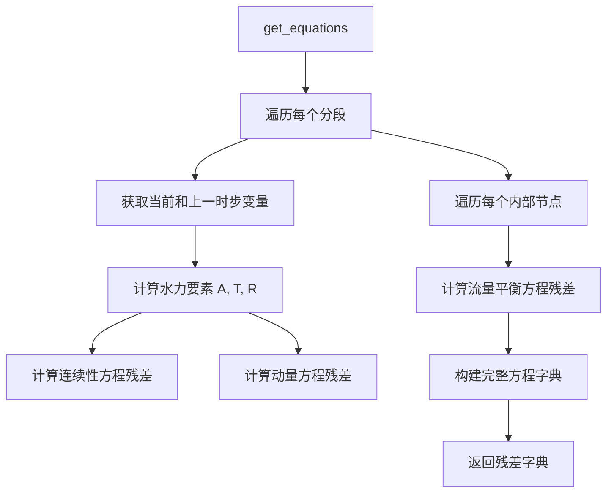

# 圣维南模型技术设计

<cite>
**本文档引用的文件**   
- [saint_venant.py](file://waternet/models/saint_venant.py)
- [hydro_model.py](file://waternet/interfaces/hydro_model.py)
- [standard_five_section.py](file://waternet/config/standard_five_section.py)
- [geometry_config.py](file://tests/deep_channel/geometry_config.py)
</cite>

## 目录
1. [引言](#引言)
2. [核心架构与继承关系](#核心架构与继承关系)
3. [模型初始化与数据验证](#模型初始化与数据验证)
4. [内部拓扑生成机制](#内部拓扑生成机制)
5. [恒定流计算逻辑](#恒定流计算逻辑)
6. [非恒定流方程离散化](#非恒定流方程离散化)
7. [变量与方程系统构建](#变量与方程系统构建)
8. [数值求解与系统耦合](#数值求解与系统耦合)
9. [结论](#结论)

## 引言
圣维南模型（SaintVenantModel）是WaterNet水力仿真系统中的核心物理模型，实现了基于圣维南方程组的一维明渠非恒定流计算。该模型作为`HydroModel`抽象基类的具体实现，为复杂水力系统的联合求解提供了精确的物理基础。本技术设计文档详细阐述了其内部实现机制，包括Preissmann四点隐式差分格式的应用、模型初始化流程、恒定流与非恒定流的计算逻辑，以及如何通过`get_equations`和`get_variable_names`方法构建联合求解系统。

**Section sources**
- [saint_venant.py](file://waternet/models/saint_venant.py#L32-L646)
- [hydro_model.py](file://waternet/interfaces/hydro_model.py#L25-L198)

## 核心架构与继承关系
圣维南模型通过继承`HydroModel`抽象基类，实现了标准化的水力模型接口。`HydroModel`定义了所有紧耦合水力模型必须遵循的契约，其核心是两个抽象方法：`get_equations`和`get_variable_names`。这种设计确保了不同复杂度的模型（如简化的Muskingum模型或复杂的IDZ模型）可以在同一个求解框架下协同工作。

圣维南模型作为`HydroModel`的具体实现，不仅满足了接口契约，还通过其物理完备性为系统提供了高精度的仿真能力。其核心职责是将连续的圣维南方程组离散化为一组代数方程，并管理模型内部的未知变量，从而无缝集成到全局的非线性方程求解器中。



**Diagram sources **
- [saint_venant.py](file://waternet/models/saint_venant.py#L32-L646)
- [hydro_model.py](file://waternet/interfaces/hydro_model.py#L25-L198)

**Section sources**
- [saint_venant.py](file://waternet/models/saint_venant.py#L32-L646)
- [hydro_model.py](file://waternet/interfaces/hydro_model.py#L25-L198)

## 模型初始化与数据验证
模型的初始化过程是确保计算可靠性的第一步。`__init__`方法接收模型标识符、边界节点名称以及一个包含断面几何数据的列表。每个断面数据必须包含五个必需字段：`mileage`（里程桩号）、`elevation`（底高程）、`roughness`（曼宁糙率系数）、`area_func`（面积函数）和`top_width_func`（水面宽函数）。

在初始化过程中，系统会执行严格的输入验证：
1.  **数量验证**：检查断面列表是否至少包含两个断面，以确保能定义一个有效的明渠。
2.  **字段验证**：遍历每个断面，确保所有必需字段都存在。
3.  **函数类型验证**：确认`area_func`和`top_width_func`是可调用的函数对象，这是后续水力计算的基础。
4.  **排序处理**：根据`mileage`字段对断面进行升序排序，保证空间上的连续性。

通过这一系列验证，模型从源头上杜绝了因输入数据错误而导致的计算失败。

**Section sources**
- [saint_venant.py](file://waternet/models/saint_venant.py#L42-L80)

## 内部拓扑生成机制
初始化验证通过后，模型会自动调用`_generate_internal_topology`方法，根据断面数据生成内部计算所需的拓扑结构。这一过程是模型智能化的关键，它将离散的断面信息转化为一个连续的计算网格。

拓扑生成包含两个核心部分：
1.  **内部节点生成**：对于除首尾之外的每一个断面，都会创建一个对应的内部计算节点。这些节点的命名遵循`{model_name}_internal_{index}`的规则，用于存储该断面的水位变量。
2.  **分段属性计算**：在每两个相邻断面之间生成一个分段。`_calculate_segment_properties`方法会计算每个分段的平均属性，包括：
    *   **长度 (length)**：上下游断面里程的绝对差值。
    *   **坡度 (slope)**：上下游断面底高程的差值除以分段长度。
    *   **平均糙率 (roughness)**：上下游断面糙率的算术平均值。

此机制将复杂的明渠离散为一系列具有平均属性的计算单元，为后续的数值求解奠定了基础。



**Diagram sources **
- [saint_venant.py](file://waternet/models/saint_venant.py#L183-L245)

**Section sources**
- [saint_venant.py](file://waternet/models/saint_venant.py#L183-L245)

## 恒定流计算逻辑
恒定流计算通过`compute_steady_state`方法实现，采用从下游向上游逐段计算的“标准步进法”。该方法以恒定流量`Q`和下游边界水位`downstream_H`作为输入，输出整个渠道的水位分布。

计算流程如下：
1.  **边界设置**：将下游边界断面的水位设为给定的`downstream_H`。
2.  **逆向迭代**：从最下游的分段开始，依次向上游推进。
3.  **上游水位求解**：对于每个分段，调用`_solve_steady_water_level`方法，基于能量方程求解上游断面的水位。能量方程的核心是：
    `H_up + V_up²/(2g) = H_down + V_down²/(2g) + hf`
    其中`hf`是水头损失，通过曼宁公式`hf = L * n² * V_avg² / R_avg^(4/3)`计算。
4.  **数值求解**：`_solve_steady_water_level`方法将能量方程转化为一个残差函数，并使用`scipy.optimize.brentq`等根求解器进行数值求解，以找到使残差为零的上游水位`H_up`。

该方法确保了在恒定流条件下，计算出的水面线满足能量守恒原理。



**Diagram sources **
- [saint_venant.py](file://waternet/models/saint_venant.py#L183-L245)

**Section sources**
- [saint_venant.py](file://waternet/models/saint_venant.py#L183-L245)

## 非恒定流方程离散化
非恒定流的计算是圣维南模型的核心，通过`get_equations`方法实现。该方法采用**Preissmann四点隐式差分格式**对圣维南方程组进行时空离散化，确保了数值计算的稳定性和精度。

### 连续性方程离散化
连续性方程`∂A/∂t + ∂Q/∂x = 0`的离散化形式为：
`dA_dt_avg + dQ_dx = 0`
其中：
*   `dA_dt_avg`是断面面积对时间的平均变化率，通过`(A - A_prev) / dt`计算。
*   `dQ_dx`是流量对空间的导数，在同一分段内流量不变，因此该项为0。

### 动量方程离散化
动量方程`∂Q/∂t + ∂(Q²/A)/∂x + gA∂H/∂x + gA(Sf - S0) = 0`的离散化由`_compute_momentum_residual`方法完成，各项计算如下：
*   **时间导数项**：`dQ_dt = (Q - Q_prev) / dt`
*   **对流项**：`d_momentum_flux_dx = (momentum_flux_down - momentum_flux_up) / L`
*   **压力项**：`pressure_term = g * A_avg * dH_dx`
*   **摩阻项**：`friction_term = g * A_avg * (Sf - S0)`，其中`Sf`由曼宁公式计算。

Preissmann格式的隐式特性使得该模型能够使用较大的时间步长，非常适合长时段的洪水演进模拟。



**Diagram sources **
- [saint_venant.py](file://waternet/models/saint_venant.py#L357-L454)

**Section sources**
- [saint_venant.py](file://waternet/models/saint_venant.py#L357-L454)

## 变量与方程系统构建
`get_variable_names`和`get_equations`是模型与求解器交互的桥梁，它们共同构建了一个封闭的非线性方程系统。

### 变量体系
`get_variable_names`方法返回模型引入的所有未知变量名，形成求解系统的未知数向量。变量分为两类：
1.  **分段流量变量**：如`Q_{model_name}_seg_{i}`，表示第`i`个分段的流量。
2.  **内部节点水位变量**：如`H_{model_name}_internal_{i}`，表示第`i`个内部节点的水位。

### 联合求解系统
`get_equations`方法返回一个残差字典，其方程数量与变量数量严格相等，保证了系统的可解性。系统包含三类方程：
1.  **分段方程**：为每个分段生成一个连续性方程和一个动量方程。
2.  **节点平衡方程**：为每个内部节点生成一个流量平衡方程，确保流入节点的总流量等于流出的总流量。这是模型内部耦合的关键，它将相邻分段的流量变量关联起来。

通过这种方式，圣维南模型将一个连续的物理问题转化为一个由`N`个变量和`N`个方程组成的代数系统，可以被通用的非线性求解器（如`fsolve`）高效求解。

```mermaid
erDiagram
SEGMENT ||--o{ EQUATION : "生成"
SEGMENT ||--o{ VARIABLE : "拥有"
NODE ||--o{ EQUATION : "生成"
VARIABLE ||--o{ SYSTEM : "构成"
EQUATION ||--o{ SYSTEM : "构成"
class SEGMENT {
index
length
slope
roughness
}
class NODE {
name
water_level
}
class VARIABLE {
name
value
}
class EQUATION {
name
residual
}
class SYSTEM {
variables: List[VARIABLE]
equations: List[EQUATION]
}
```

**Diagram sources **
- [saint_venant.py](file://waternet/models/saint_venant.py#L505-L526)
- [saint_venant.py](file://waternet/models/saint_venant.py#L357-L454)

**Section sources**
- [saint_venant.py](file://waternet/models/saint_venant.py#L505-L526)
- [saint_venant.py](file://waternet/models/saint_venant.py#L357-L454)

## 数值求解与系统耦合
圣维南模型的设计使其能够无缝集成到WaterNet的联合求解框架中。当求解器（如`fsolve`）需要评估当前变量下的系统状态时，它会调用`get_equations`方法。

求解过程是一个迭代过程：
1.  求解器提供一组当前的变量猜测值（`variables`）和上一时步的状态（`prev_states`）。
2.  `get_equations`方法根据这些值计算出所有方程的残差。
3.  求解器分析残差，调整变量值，并重复此过程，直到所有残差都收敛到一个足够小的值。

`get_variable_names`方法确保了求解器知道需要调整哪些变量。内部节点的流量平衡方程是系统耦合的物理体现，它强制模型内部的流量必须满足连续性，从而保证了整个计算域的水力学一致性。这种基于残差的接口设计，使得圣维南模型可以与水库、管道、泵站等其他水力元件模型并行求解，共同构成一个完整的水系统仿真。

**Section sources**
- [saint_venant.py](file://waternet/models/saint_venant.py#L357-L454)
- [saint_venant.py](file://waternet/models/saint_venant.py#L505-L526)

## 结论
圣维南模型通过继承`HydroModel`接口，实现了物理水力学方程的精确数值求解。其核心在于利用Preissmann四点隐式差分格式，将复杂的偏微分方程组离散化为一个可求解的代数系统。模型的初始化流程确保了输入数据的可靠性，自动化的内部拓扑生成机制简化了用户操作。`get_equations`和`get_variable_names`方法的精巧设计，不仅构建了模型内部的求解系统，还通过流量平衡方程实现了内部耦合，使其能够作为WaterNet联合求解框架中的一个高保真组件，为复杂水系统的精确仿真提供了坚实的物理基础。