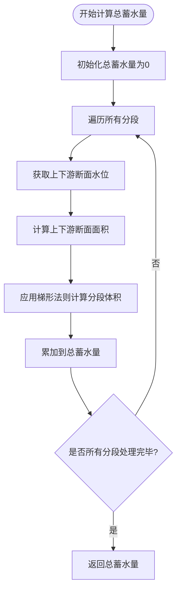

# 恒定流计算

<cite>
**Referenced Files in This Document**   
- [saint_venant.py](file://waternet/models/saint_venant.py)
- [test_cases.py](file://tests/deep_channel/test_cases.py)
- [integration_interface.py](file://waternet/models/integration_interface.py)
- [test_case_1.py](file://tests/deep_channel/test_case_1.py)
</cite>

## 目录
1. [恒定流计算机制概述](#恒定流计算机制概述)
2. [标准步进法实现逻辑](#标准步进法实现逻辑)
3. [能量方程残差构造](#能量方程残差构造)
4. [_brentq求解器应用](#_brentq求解器应用)
5. [曼宁公式实现](#曼宁公式实现)
6. [总蓄水量积分计算](#总蓄水量积分计算)
7. [实际调用示例](#实际调用示例)

## 恒定流计算机制概述

圣维南模型中的恒定流计算通过`compute_steady_state`方法实现，该方法采用标准步进法从下游边界水位出发，逆向逐段求解上游水位。此方法是恒定流分析的核心，它基于能量方程和曼宁公式，通过数值方法求解水面线。

该方法首先验证输入参数的合理性，确保流量为正值。然后初始化水位数组，并设置下游边界条件。计算过程从下游向上游逐段进行，对每个分段调用`_solve_steady_water_level`方法求解上游断面水位。最后，通过`_calculate_total_volume`方法计算总蓄水量，并将结果组织成字典返回。

**Section sources**
- [saint_venant.py](file://waternet/models/saint_venant.py#L183-L245)

## 标准步进法实现逻辑

标准步进法的实现逻辑体现在`compute_steady_state`方法中，该方法从下游边界水位出发，逆向逐段求解上游水位。算法流程如下：首先设置下游断面水位为已知边界条件，然后从最后一个分段开始，依次向前计算每个上游断面的水位。

对于每个分段，方法获取下游断面水位（已知），然后调用`_solve_steady_water_level`方法求解上游断面水位。求解过程基于能量方程，考虑了动能项、势能项和摩擦损失项。计算完成后，将求得的上游水位作为下一个分段的下游边界条件，如此迭代直至求解到最上游断面。

该方法实现了从下游到上游的逆向计算逻辑，确保了水位计算的连续性和物理合理性。通过这种逐段求解的方式，能够准确地构建整个渠道的恒定流水面线。

**Section sources**
- [saint_venant.py](file://waternet/models/saint_venant.py#L183-L245)

## 能量方程残差构造

能量方程残差的构造在`_energy_equation`函数中实现，该函数是`_solve_steady_water_level`方法的内部函数。残差函数的构造包括动能项、势能项和摩擦损失项的数值计算。

动能项计算为流速平方除以2倍重力加速度（V²/(2g)），其中流速通过流量除以过水断面面积得到。势能项即为水位高程。摩擦损失项采用曼宁公式计算，为分段长度乘以糙率系数平方乘以平均流速平方，再除以平均水力半径的4/3次方。

残差函数返回上游总能量与下游总能量加摩擦损失之差。上游总能量为上游水位加上游动能项，下游总能量为下游水位加下游动能项。当残差为零时，表示能量方程平衡，此时的上游水位即为所求解。

**Section sources**
- [saint_venant.py](file://waternet/models/saint_venant.py#L247-L321)

## _brentq求解器应用

_brentq求解器在`_solve_steady_water_level`方法中用于求解能量方程，确保水位求解的收敛性。该方法首先定义能量方程残差函数，然后确定求解范围，最后调用`brentq`函数进行求解。

求解范围根据上游断面底高程和下游水位确定，确保搜索区间包含物理合理的水位值。`brentq`函数采用二分法结合逆二次插值的混合算法，在指定区间内寻找使残差函数为零的根。该算法具有良好的收敛性和稳定性，即使在函数行为复杂的情况下也能可靠地找到解。

当`brentq`求解失败时，方法提供了一个简单的估算作为备用方案，确保计算过程不会因单个分段的求解失败而中断。这种容错机制提高了整个恒定流计算过程的鲁棒性。

**Section sources**
- [saint_venant.py](file://waternet/models/saint_venant.py#L247-L321)

## 曼宁公式实现

曼宁公式在`_solve_steady_water_level`方法中用于计算摩擦损失项，其具体实现包括平均水力半径和流速的计算。水力半径通过过水断面面积除以湿周得到，其中湿周的计算考虑了断面几何形状。

对于矩形断面，湿周为水面宽加上两倍水深。流速通过流量除以过水断面面积计算得到。平均水力半径和平均流速分别取上下游断面相应值的算术平均。

摩擦损失项的计算公式为：hf = L × n² × V_avg² / R_avg^(4/3)，其中L为分段长度，n为曼宁糙率系数，V_avg为平均流速，R_avg为平均水力半径。该实现准确反映了曼宁公式在明渠恒定流计算中的应用。

**Section sources**
- [saint_venant.py](file://waternet/models/saint_venant.py#L247-L321)

## 总蓄水量积分计算

总蓄水量的计算在`_calculate_total_volume`方法中实现，采用梯形法则对各分段体积进行积分。该方法遍历所有分段，对每个分段计算其体积，然后累加得到总蓄水量。

对于每个分段，首先获取上下游断面的水位，然后通过断面几何函数计算上下游断面的过水面积。分段体积采用梯形法则计算，即分段长度乘以（上游面积加下游面积）除以2。

这种积分方法简单而有效，能够准确地估算渠道的总蓄水量。梯形法则的选择考虑了计算精度和效率的平衡，适用于大多数工程计算场景。

**Diagram sources**
- [saint_venant.py](file://waternet/models/saint_venant.py#L323-L355)

**Section sources**
- [saint_venant.py](file://waternet/models/saint_venant.py#L323-L355)

## 实际调用示例

实际调用示例展示了如何设置流量和下游水位边界条件以获得完整水面线。在`TestCase2_ParameterIdentification`类的`_identify_characteristic_curves`方法中，通过循环不同的流量和下游水位组合，调用`compute_steady_state`方法生成恒定流数据点。

该示例首先定义流量范围和水位范围，然后对每个组合调用恒定流计算方法。计算结果包括各断面水位、分段流量和总蓄水量，这些数据可用于后续的特征曲线拟合和参数辨识。

这种调用方式演示了恒定流计算在实际工程分析中的应用，如构建流量-水位关系曲线、验证模型物理合理性等。通过系统地调用恒定流计算功能，可以全面评估渠道的水力特性。

**Section sources**
- [test_cases.py](file://tests/deep_channel/test_cases.py#L82-L137)