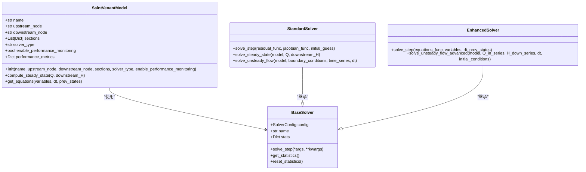
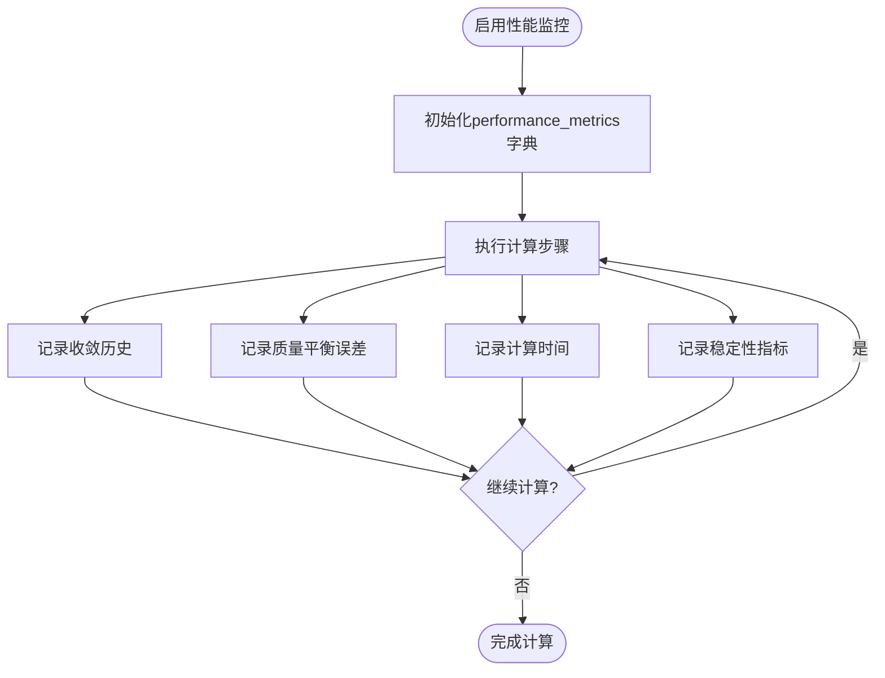

# 性能监控

<cite>
**本文档引用的文件**
- [saint_venant.py](file://waternet/models/saint_venant.py)
- [solvers.py](file://waternet/models/solvers.py)
</cite>

## 目录
1. [简介](#简介)
2. [性能监控机制](#性能监控机制)
3. [性能指标记录](#性能指标记录)
4. [性能数据应用](#性能数据应用)
5. [编程接口示例](#编程接口示例)
6. [模型优化建议](#模型优化建议)

## 简介
本文档详细描述WaterNet水力模型系统中性能监控功能的技术实现。重点说明`enable_performance_monitoring`参数的作用机制及其对模型行为的影响，解释性能监控数据的记录方式和实际应用价值，并提供访问和分析这些数据的编程接口示例。

**Section sources**
- [saint_venant.py](file://waternet/models/saint_venant.py#L1-L50)

## 性能监控机制
`enable_performance_monitoring`参数是圣维南模型中的一个布尔型配置选项，用于控制是否启用详细的性能监控功能。当该参数设置为`True`时，系统会自动创建`performance_metrics`字典来记录关键性能指标。

该参数在`SaintVenantModel`类的初始化方法中被处理，如果启用，系统会初始化一个包含多个性能指标数组的字典，用于在模型运行过程中持续收集性能数据。这种设计允许用户在不改变核心模型逻辑的情况下，灵活地开启或关闭性能监控功能。

性能监控机制与模型的求解过程紧密集成，能够在每个计算步骤中自动收集和记录相关指标，为后续的模型调试和优化提供数据支持。



**Diagram sources**
- [saint_venant.py](file://waternet/models/saint_venant.py#L100-L150)
- [solvers.py](file://waternet/models/solvers.py#L45-L77)

**Section sources**
- [saint_venant.py](file://waternet/models/saint_venant.py#L100-L150)

## 性能指标记录
当启用性能监控时，系统通过`performance_metrics`字典记录四类关键性能指标：

### 收敛历史
收敛历史记录了每次迭代的收敛情况，包括迭代次数和最终残差值。这些数据来自求解器的统计信息，反映了模型求解过程的收敛速度和稳定性。

### 质量平衡误差
质量平衡误差指标记录了连续性方程的残差值，反映了模型在水量守恒方面的精度。该指标通过`get_equations`方法计算得到，是评估模型物理合理性的重要依据。

### 计算时间
计算时间指标记录了每个计算步骤的耗时，用于评估模型的计算效率。这些数据可以帮助识别性能瓶颈，优化计算流程。

### 稳定性指标
稳定性指标包括数值稳定性相关的各种参数，如最大残差、迭代次数等。这些指标有助于评估模型在不同工况下的数值稳定性。

所有性能指标都被组织在`performance_metrics`字典中，采用数组形式存储，便于后续的时间序列分析和可视化。



**Diagram sources**
- [saint_venant.py](file://waternet/models/saint_venant.py#L130-L140)
- [solvers.py](file://waternet/models/solvers.py#L87-L142)

**Section sources**
- [saint_venant.py](file://waternet/models/saint_venant.py#L130-L140)

## 性能数据应用
收集的性能数据在模型调试、结果验证和数值稳定性分析中具有重要的实际应用价值。

### 模型调试
通过分析收敛历史，可以识别求解过程中的收敛困难区域，帮助调整求解器参数，如松弛因子、最大迭代次数等。质量平衡误差的异常波动可能指示模型输入数据或边界条件存在问题。

### 结果验证
性能指标为模型结果的可靠性提供了量化依据。例如，持续较高的质量平衡误差可能表明模型结果不可靠，需要重新检查模型配置或输入数据。

### 数值稳定性分析
稳定性指标可以帮助评估模型在不同工况下的数值稳定性。通过分析不同流量条件下的稳定性指标变化，可以确定模型的稳定工作范围，为实际应用提供指导。

这些性能数据还可以用于模型的持续改进，通过对比不同模型配置下的性能表现，选择最优的模型参数组合。

**Section sources**
- [saint_venant.py](file://waternet/models/saint_venant.py#L357-L454)

## 编程接口示例
以下示例展示了如何访问和分析性能监控数据：

```python
# 创建圣维南模型并启用性能监控
model = SaintVenantModel(
    name="channel_1",
    upstream_node="node_1",
    downstream_node="node_2", 
    sections=section_data,
    enable_performance_monitoring=True
)

# 执行计算
result = model.compute_steady_state(Q=10.0, downstream_H=99.0)

# 访问性能数据
if hasattr(model, 'performance_metrics'):
    # 获取收敛历史
    convergence_history = model.performance_metrics['convergence_history']
    
    # 获取质量平衡误差
    mass_balance_errors = model.performance_metrics['mass_balance_errors']
    
    # 获取计算时间
    computational_times = model.performance_metrics['computational_times']
    
    # 获取稳定性指标
    stability_indicators = model.performance_metrics['stability_indicators']
    
    # 分析性能数据
    avg_computation_time = sum(computational_times) / len(computational_times)
    max_mass_balance_error = max(mass_balance_errors)
    
    print(f"平均计算时间: {avg_computation_time:.3f}秒")
    print(f"最大质量平衡误差: {max_mass_balance_error:.6f}")
```

**Section sources**
- [saint_venant.py](file://waternet/models/saint_venant.py#L130-L140)

## 模型优化建议
基于性能监控数据，可以提出以下模型优化建议：

1. **调整求解器参数**：根据收敛历史分析，适当调整松弛因子和最大迭代次数，以提高求解效率。
2. **优化网格划分**：根据稳定性指标，调整断面划分密度，在保证精度的同时提高计算效率。
3. **改进初始猜测**：利用历史计算结果作为初始猜测，可以显著减少迭代次数，提高收敛速度。
4. **选择合适的求解器**：根据问题特性选择标准求解器或增强求解器，平衡计算精度和效率。

通过持续监控和分析性能数据，可以不断优化模型配置和求解参数，提高模型的整体性能和可靠性。

**Section sources**
- [solvers.py](file://waternet/models/solvers.py#L87-L142)
- [solvers.py](file://waternet/models/solvers.py#L204-L253)