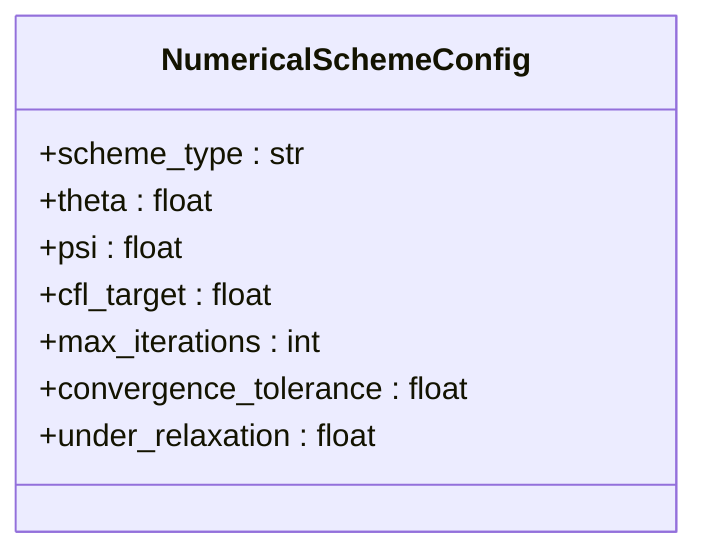
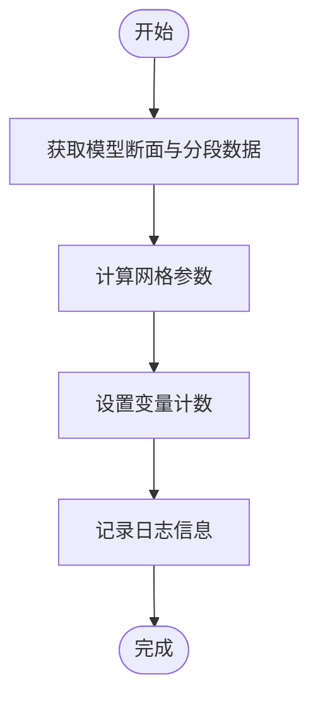
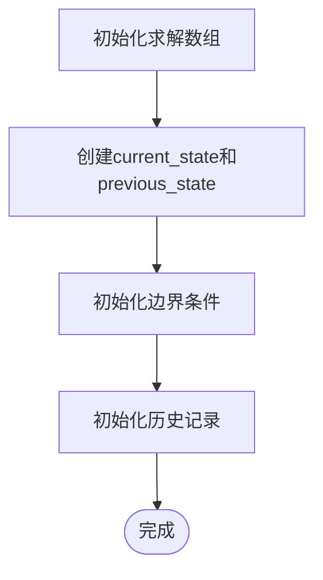
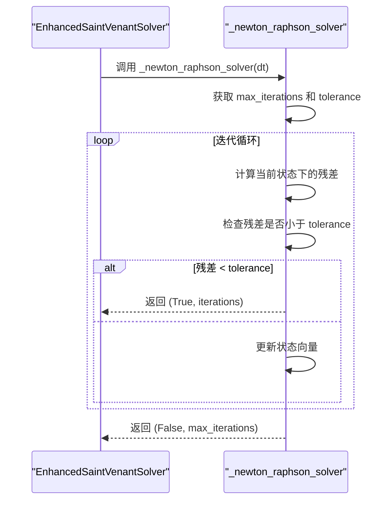
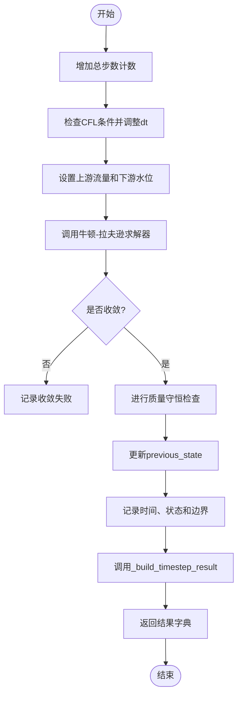
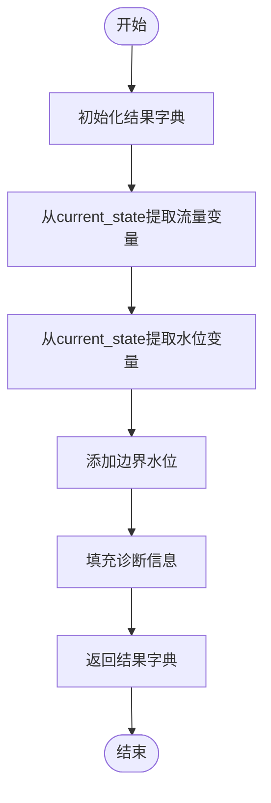
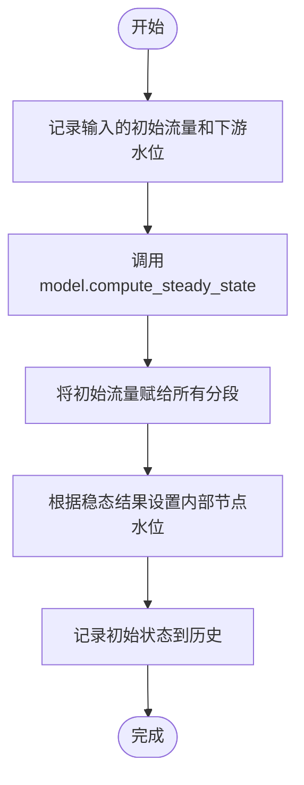

# 增强求解器

<cite>
**Referenced Files in This Document**   
- [tests/deep_channel/enhanced_solver.py](file://tests/deep_channel/enhanced_solver.py)
- [waternet/models/saint_venant.py](file://waternet/models/saint_venant.py)
- [examples/advanced/deep_channel_demo.py](file://examples/advanced/deep_channel_demo.py)
</cite>

## 目录
1. [引言](#引言)
2. [核心组件](#核心组件)
3. [数值格式配置](#数值格式配置)
4. [求解器初始化与网格构建](#求解器初始化与网格构建)
5. [非线性求解机制](#非线性求解机制)
6. [时间步求解流程](#时间步求解流程)
7. [结果构建与诊断信息](#结果构建与诊断信息)
8. [使用示例](#使用示例)

## 引言
增强型圣维南求解器（EnhancedSaintVenantSolver）是WaterNet框架中用于求解一维非恒定流明渠水力模型的核心组件。该求解器基于圣维南方程组，采用牛顿-拉夫逊迭代法处理非线性问题，并通过精细的数值配置和稳定性控制机制，确保了计算的精度与鲁棒性。本文档详细阐述了其内部工作机制、关键配置参数以及使用方法。

## 核心组件
增强型圣维南求解器的主要功能是求解由圣维南模型（SaintVenantModel）定义的非恒定流问题。它通过封装复杂的数值计算过程，为用户提供了一个简洁高效的接口。求解器能够处理复杂的边界条件，并在每个时间步内通过迭代求解实现状态的推进。

**Section sources**
- [tests/deep_channel/enhanced_solver.py](file://tests/deep_channel/enhanced_solver.py#L47-L312)

## 数值格式配置
`NumericalSchemeConfig` 类定义了求解器所使用的数值格式的关键参数，这些参数直接影响求解的精度、稳定性和计算效率。

**Diagram sources**
- [tests/deep_channel/enhanced_solver.py](file://tests/deep_channel/enhanced_solver.py#L26-L34)

### 参数说明
- **theta (时间加权系数)**: 控制时间导数项的离散化方式。当 `theta=0.5` 时为Crank-Nicolson格式（二阶精度），`theta=1.0` 时为完全隐式格式（一阶精度，但更稳定）。默认值 `0.6` 在精度和稳定性之间取得了良好平衡。
- **psi (空间加权系数)**: 影响动量方程中空间导数项的离散化。它与 `theta` 共同决定了Preissmann四点隐式格式的特性，对数值耗散和色散有重要影响。
- **max_iterations (最大迭代次数)**: 牛顿-拉夫逊迭代的最大允许次数。此值应足够大以保证收敛，但也不宜过大以避免不必要的计算开销。默认值20适用于大多数情况。
- **convergence_tolerance (收敛容差)**: 判断迭代收敛的阈值，通常为残差向量的无穷范数。较小的值（如 `1e-6`）能保证更高的精度，但可能导致迭代次数增加或难以收敛。用户应根据实际精度需求和计算资源进行权衡。

## 求解器初始化与网格构建
求解器的初始化过程包括数值网格的构建和状态数组的分配，这是求解前的必要准备步骤。

### 网格构建
`_setup_numerical_grid` 方法根据底层圣维南模型的几何数据自动构建计算网格。

**Diagram sources**
- [tests/deep_channel/enhanced_solver.py](file://tests/deep_channel/enhanced_solver.py#L82-L98)

该方法首先获取模型的断面（sections）和分段（segments）数量，然后计算每个分段的长度（`dx_array`），并确定最小和最大网格间距。最后，它计算出求解所需的总变量数，即分段流量变量数（`n_flow_vars`）与内部节点水位变量数（`n_head_vars`）之和。

### 状态数组分配
`_initialize_solution_arrays` 方法负责分配存储求解状态的数组。

**Diagram sources**
- [tests/deep_channel/enhanced_solver.py](file://tests/deep_channel/enhanced_solver.py#L99-L113)

该方法创建了两个核心的NumPy数组：`current_state` 和 `previous_state`，它们的长度等于总变量数 `n_total_vars`。`current_state` 存储当前时间步的流量和水位，而 `previous_state` 存储上一个时间步的状态，用于计算时间导数。同时，该方法还初始化了边界条件和用于存储求解历史的列表。

## 非线性求解机制
增强求解器采用牛顿-拉夫逊迭代法来求解由圣维南方程离散化后形成的非线性方程组。

**Diagram sources**
- [tests/deep_channel/enhanced_solver.py](file://tests/deep_channel/enhanced_solver.py#L238-L244)

`_newton_raphson_solver` 方法是求解非线性系统的核心。它在一个循环中迭代，每次迭代都计算当前状态下的方程残差。如果残差的最大值小于预设的 `convergence_tolerance`，则认为求解已收敛，返回成功标志和迭代次数。否则，它会根据雅可比矩阵（在完整实现中）和残差来更新状态向量。该过程会一直持续，直到达到 `max_iterations` 或成功收敛。

## 时间步求解流程
`solve_time_step` 方法定义了求解单个时间步的完整流程，它将边界条件更新与状态推进紧密耦合。

**Diagram sources**
- [tests/deep_channel/enhanced_solver.py](file://tests/deep_channel/enhanced_solver.py#L154-L209)

该流程首先递增总步数统计。如果启用了自适应时间步长，则调用 `_check_cfl_condition` 方法，根据当前波速和网格尺寸动态调整时间步长 `dt`，以确保满足CFL稳定性条件。接着，将传入的 `upstream_flow` 和 `downstream_water_level` 设置为当前时间步的边界条件。然后，调用 `_newton_raphson_solver` 进行迭代求解。求解后，会检查是否收敛，并根据配置决定是否进行质量守恒检查。最后，更新状态并记录历史，调用 `_build_timestep_result` 构建并返回结果。

## 结果构建与诊断信息
`_build_timestep_result` 方法负责将求解得到的内部状态转换为结构化的结果字典，其中包含了丰富的诊断信息。

**Diagram sources**
- [tests/deep_channel/enhanced_solver.py](file://tests/deep_channel/enhanced_solver.py#L251-L283)

该方法首先创建一个包含基本时间信息和收敛状态的结果字典。然后，它遍历 `current_state` 数组，将前 `n_flow_vars` 个元素作为各分段的流量，存入 `flow_variables` 字典；将后 `n_head_vars` 个元素作为各内部节点的水位，存入 `water_levels` 字典。此外，它还会调用 `_get_upstream_water_level` 方法（基于上游流量估算）来获取上游边界水位，并将下游边界水位直接加入。最后，它会填充一个 `diagnostics` 字典，其中包含了最大流速、弗劳德数、总体积以及从 `statistics` 中获取的质量守恒误差等关键诊断指标，为用户评估求解质量和系统行为提供了重要依据。

## 使用示例
`set_initial_conditions` 方法提供了一个便捷的接口来建立合理的初始场。

**Diagram sources**
- [tests/deep_channel/enhanced_solver.py](file://tests/deep_channel/enhanced_solver.py#L115-L152)

该方法首先利用底层模型的 `compute_steady_state` 方法，根据给定的 `initial_flow` 和 `downstream_water_level` 计算出一个恒定流的水面线。然后，它将这个稳态解作为初始条件：将 `initial_flow` 赋给所有分段的流量变量，并根据稳态计算结果中各断面的水位，设置相应内部节点的水位变量。最后，它将这个初始状态记录到 `time_history`、`state_history` 和 `boundary_history` 中，为后续的非恒定流计算奠定了基础。这种方法确保了初始场是物理上合理的，避免了因初始条件突变而引起的数值振荡。