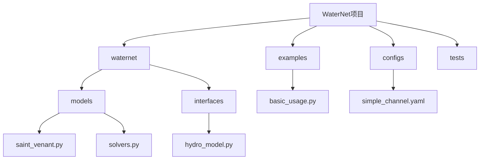
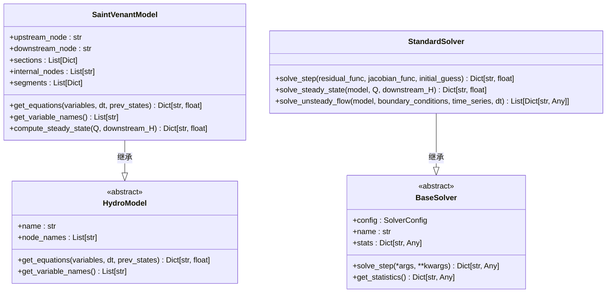
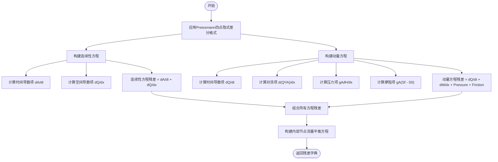
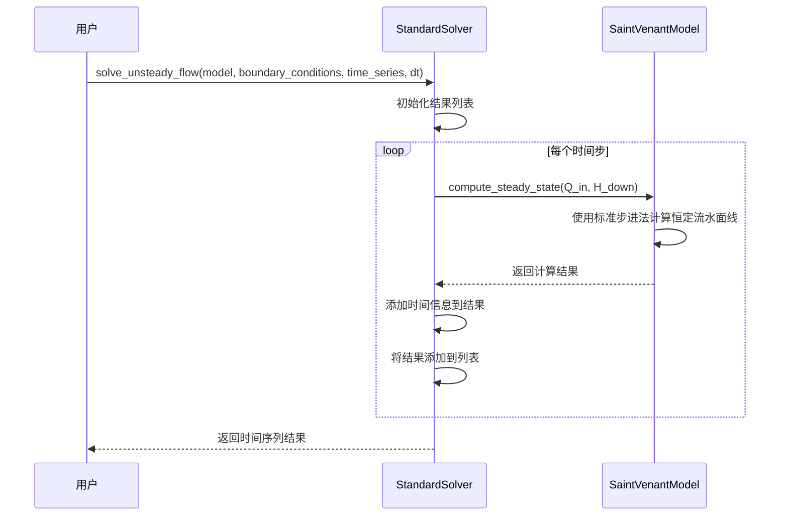

# 标准求解器

<cite>
**本文档引用文件**   
- [saint_venant.py](file://waternet/models/saint_venant.py)
- [solvers.py](file://waternet/models/solvers.py)
- [hydro_model.py](file://waternet/interfaces/hydro_model.py)
- [simple_channel.yaml](file://configs/example_configs/simple_channel.yaml)
- [basic_usage.py](file://examples/basic_usage.py)
</cite>

## 目录
1. [引言](#引言)
2. [项目结构](#项目结构)
3. [核心组件](#核心组件)
4. [架构概述](#架构概述)
5. [详细组件分析](#详细组件分析)
6. [依赖分析](#依赖分析)
7. [性能考虑](#性能考虑)
8. [故障排除指南](#故障排除指南)
9. [结论](#结论)

## 引言
本文档详细说明了WaterNet框架中圣维南模型标准求解器的实现机制。该求解器基于Preissmann四点隐式差分格式，用于求解一维明渠非恒定流问题。文档重点阐述了连续性方程和动量方程的数值离散化方法，以及内部节点流量平衡方程的构建逻辑。通过分析`SaintVenantModel`类和`StandardSolver`类的实现，展示了如何生成非恒定流计算所需的残差方程组，并讨论了标准求解器在数值稳定性与计算效率之间的权衡。

## 项目结构
WaterNet项目采用模块化设计，主要目录包括`waternet`（核心代码）、`examples`（使用示例）、`configs`（配置文件）和`tests`（单元测试）。核心模型实现位于`waternet/models`目录下，其中`saint_venant.py`文件定义了基于圣维南方程组的物理水力学模型，`solvers.py`文件提供了标准和增强型求解器的实现。接口规范定义在`waternet/interfaces`目录下，确保了不同模型之间的统一交互。



**Diagram sources**
- [saint_venant.py](file://waternet/models/saint_venant.py)
- [solvers.py](file://waternet/models/solvers.py)
- [hydro_model.py](file://waternet/interfaces/hydro_model.py)

**Section sources**
- [saint_venant.py](file://waternet/models/saint_venant.py)
- [solvers.py](file://waternet/models/solvers.py)

## 核心组件
核心组件包括`SaintVenantModel`类和`StandardSolver`类。`SaintVenantModel`实现了完整的圣维南方程组，包括连续性方程和动量方程，并采用Preissmann四点隐式差分格式进行离散化。`StandardSolver`类提供了求解非线性方程组的标准方法，支持牛顿法和简单迭代法。这两个组件通过`get_equations`接口方法紧密协作，前者生成方程残差，后者求解这些方程。

**Section sources**
- [saint_venant.py](file://waternet/models/saint_venant.py#L32-L646)
- [solvers.py](file://waternet/models/solvers.py#L80-L194)

## 架构概述
系统架构采用分层设计，上层为模型定义，下层为求解器实现。`SaintVenantModel`继承自`HydroModel`抽象基类，实现了`get_equations`和`get_variable_names`等核心接口。`StandardSolver`继承自`BaseSolver`，负责求解由模型生成的方程组。这种设计实现了模型与求解器的解耦，允许不同的模型使用相同的求解器，也允许为同一模型选择不同的求解策略。



**Diagram sources**
- [saint_venant.py](file://waternet/models/saint_venant.py#L32-L646)
- [solvers.py](file://waternet/models/solvers.py#L45-L77)

## 详细组件分析

### 圣维南模型分析
`SaintVenantModel`类实现了基于圣维南方程组的一维明渠非恒定流模型。它通过`_generate_internal_topology`方法自动生成内部计算节点和分段，并通过`get_equations`方法构建离散化的方程组。

#### 连续性方程和动量方程的数值实现


**Diagram sources**
- [saint_venant.py](file://waternet/models/saint_venant.py#L357-L454)

**Section sources**
- [saint_venant.py](file://waternet/models/saint_venant.py#L32-L646)

### 标准求解器分析
`StandardSolver`类实现了求解非线性方程组的标准方法。它支持牛顿法和简单不动点迭代，通过松弛因子控制迭代过程的稳定性。

#### 非恒定流求解流程


**Diagram sources**
- [solvers.py](file://waternet/models/solvers.py#L140-L194)

**Section sources**
- [solvers.py](file://waternet/models/solvers.py#L80-L194)

## 依赖分析
系统组件之间的依赖关系清晰，`SaintVenantModel`依赖于`HydroModel`接口，`StandardSolver`依赖于`BaseSolver`基类。求解过程通过`get_equations`方法将模型与求解器连接起来，实现了松耦合设计。

```mermaid
graph TD
A[HydroModel] --> B[SaintVenantModel]
C[BaseSolver] --> D[StandardSolver]
B --> E[get_equations]
D --> F[solve_step]
E --> F : 提供残差函数
```

**Diagram sources**
- [saint_venant.py](file://waternet/models/saint_venant.py)
- [solvers.py](file://waternet/models/solvers.py)

**Section sources**
- [saint_venant.py](file://waternet/models/saint_venant.py)
- [solvers.py](file://waternet/models/solvers.py)

## 性能考虑
标准求解器在数值稳定性与计算效率之间进行了权衡。它采用准恒定流近似来简化非恒定流计算，牺牲了一定的物理精度以换取更高的计算效率。对于常规工况，这种近似能够提供足够精确的结果，同时保持较低的计算成本。对于需要更高精度的场景，可以切换到增强型求解器。

## 故障排除指南
常见问题包括模型初始化失败和求解不收敛。初始化失败通常是由于断面数据不足或格式错误，应检查`sections`参数是否包含至少两个断面，且每个断面都包含必需的字段。求解不收敛可能是由于边界条件不合理或时间步长过大，建议检查流量和水位的合理性，并尝试减小时间步长。

**Section sources**
- [saint_venant.py](file://waternet/models/saint_venant.py#L100-L150)
- [solvers.py](file://waternet/models/solvers.py#L100-L120)

## 结论
本文档详细介绍了WaterNet框架中圣维南模型标准求解器的实现。该求解器基于Preissmann四点隐式差分格式，能够有效求解一维明渠非恒定流问题。通过分析其架构和实现细节，展示了如何在保证数值稳定性的同时，实现高效的计算。对于常规工况，标准求解器提供了一个可靠且高效的解决方案。