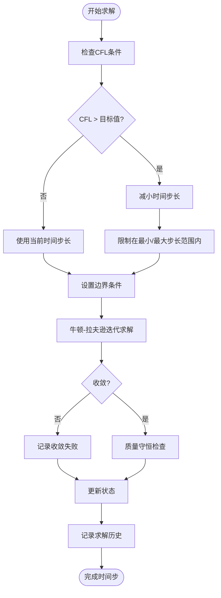

# 求解器配置

<cite>
**Referenced Files in This Document**  
- [enhanced_solver.py](file://tests/deep_channel/enhanced_solver.py)
- [saint_venant.py](file://waternet/models/saint_venant.py)
- [simulation_config.yaml](file://examples/configs/simulation_config.yaml)
</cite>

## 目录
1. [求解器类型与创建机制](#求解器类型与创建机制)
2. [增强型求解器配置](#增强型求解器配置)
3. [求解流程与参数设置](#求解流程与参数设置)
4. [高级功能实现原理](#高级功能实现原理)
5. [配置示例与优化策略](#配置示例与优化策略)

## 求解器类型与创建机制

圣维南模型支持标准求解器和增强型求解器两种模式。通过 `solver_type` 参数控制求解行为，该参数在 `SaintVenantModel` 初始化时设置，可选值为 "standard" 或 "enhanced"。

当调用 `solve_with_enhanced_solver` 方法时，系统会自动检查当前模型的 `solver_type`。若当前类型非 "enhanced"，系统将发出警告并自动切换至增强模式，确保使用高性能求解器进行计算。

增强型求解器的创建通过 `create_enhanced_solver` 方法实现。该方法位于 `SaintVenantModel` 类中，负责实例化 `EnhancedSaintVenantSolver` 对象。此方法接受数值格式配置和稳定性控制配置作为可选参数，若未提供则使用默认配置。

**Section sources**
- [saint_venant.py](file://waternet/models/saint_venant.py#L109)
- [saint_venant.py](file://waternet/models/saint_venant.py#L586-L607)
- [saint_venant.py](file://waternet/models/saint_venant.py#L609-L646)

## 增强型求解器配置

增强型求解器通过 `NumericalSchemeConfig` 和 `StabilityConfig` 两个配置类进行精细化控制。

`NumericalSchemeConfig` 定义了数值格式的核心参数：
- **scheme_type**: 差分格式类型，默认为 "preissmann"
- **theta**: 时间加权系数，控制时间离散的隐式程度
- **psi**: 空间加权系数，影响空间导数的离散精度
- **cfl_target**: 目标CFL数，用于自适应时间步长控制
- **max_iterations**: 牛顿-拉夫逊迭代求解的最大迭代次数
- **convergence_tolerance**: 收敛容差，判断迭代是否收敛的阈值
- **under_relaxation**: 亚松弛系数，提高迭代稳定性

`StabilityConfig` 负责求解过程的稳定性控制：
- **enable_adaptive_timestep**: 是否启用自适应时间步长
- **min_timestep**: 允许的最小时间步长（秒）
- **max_timestep**: 允许的最大时间步长（秒）
- **cfl_safety_factor**: CFL安全系数，用于保守调整时间步长
- **enable_mass_conservation_check**: 是否启用质量守恒验证

这些配置在 `EnhancedSaintVenantSolver` 初始化时被应用，为求解器提供完整的控制参数。

**Section sources**
- [enhanced_solver.py](file://tests/deep_channel/enhanced_solver.py#L26-L34)
- [enhanced_solver.py](file://tests/deep_channel/enhanced_solver.py#L38-L44)
- [enhanced_solver.py](file://tests/deep_channel/enhanced_solver.py#L50-L69)

## 求解流程与参数设置

`solve_with_enhanced_solver` 方法定义了完整的非恒定流求解流程。该方法接收初始流量、初始下游水位、上游入流序列、下游水位序列和时间步长作为参数。

求解流程首先通过 `set_initial_conditions` 方法设置初始条件。该方法利用 `compute_steady_state` 计算恒定流水面线，为非恒定流计算提供物理合理的初始状态。初始状态包括各分段的流量和内部节点的水位。

随后，求解器进入时间步进循环。对于每个时间步，`solve_time_step` 方法执行以下操作：
1. 检查CFL条件并调整时间步长
2. 设置当前时间步的边界条件
3. 使用牛顿-拉夫逊迭代求解非线性方程组
4. 执行质量守恒检查
5. 更新状态并记录求解历史

求解结果包含详细的时间序列数据、求解器历史记录和统计信息，便于后续分析和验证。

**Section sources**
- [saint_venant.py](file://waternet/models/saint_venant.py#L609-L646)
- [enhanced_solver.py](file://tests/deep_channel/enhanced_solver.py#L115-L152)
- [enhanced_solver.py](file://tests/deep_channel/enhanced_solver.py#L154-L209)

## 高级功能实现原理

增强型求解器实现了多项高级功能以确保计算的稳定性和准确性。

自适应时间步长控制基于CFL条件实现。`_check_cfl_condition` 方法计算每个分段的CFL数，取最大值与目标CFL数比较。若超过目标值，则按比例减小时间步长，并应用安全系数进行保守调整。调整后的时间步长被限制在 `min_timestep` 和 `max_timestep` 之间。

CFL条件检查通过 `_calculate_wave_speed` 方法获取重力波波速，然后计算 `wave_speed * dt / dx` 得到CFL数。该机制确保数值解的稳定性，防止因时间步长过大导致的振荡或发散。

质量守恒验证在每个时间步执行。`_check_mass_conservation` 方法计算系统总质量的变化，将其作为求解精度的指标。该误差被记录在统计信息中，可用于评估求解质量。

求解器还实现了详细的性能统计，记录总步数、收敛失败次数、时间步长调整次数和质量守恒误差等指标，为性能分析和问题诊断提供数据支持。



**Diagram sources**
- [enhanced_solver.py](file://tests/deep_channel/enhanced_solver.py#L211-L231)
- [enhanced_solver.py](file://tests/deep_channel/enhanced_solver.py#L233-L236)
- [enhanced_solver.py](file://tests/deep_channel/enhanced_solver.py#L246-L249)

**Section sources**
- [enhanced_solver.py](file://tests/deep_channel/enhanced_solver.py#L211-L231)
- [enhanced_solver.py](file://tests/deep_channel/enhanced_solver.py#L233-L236)
- [enhanced_solver.py](file://tests/deep_channel/enhanced_solver.py#L246-L249)
- [enhanced_solver.py](file://tests/deep_channel/enhanced_solver.py#L74-L80)

## 配置示例与优化策略

以下是一个典型的配置示例，展示了如何平衡数值稳定性与计算效率：

```yaml
simulation_type: unsteady
time_step: 60.0
total_time: 7200.0  # 2 hours
output_interval: 60.0

boundary_conditions:
  upstream_type: flow
  downstream_type: level
  upstream_values: [8.0, 10.0, 12.0, 15.0, 18.0, 15.0, 12.0, 10.0, 8.0]
  downstream_values: 99.4

output:
  save_results: true
  output_format: csv
  plot_results: true
```

为优化性能，建议采用以下策略：
1. **初始配置**：使用相对保守的 `cfl_target` (0.5) 和 `cfl_safety_factor` (0.8)，确保稳定性
2. **网格优化**：合理设计断面间距，避免过大的网格尺寸差异
3. **迭代控制**：根据问题复杂度调整 `max_iterations` 和 `convergence_tolerance`
4. **监控分析**：利用求解器统计信息分析收敛行为和质量守恒误差

通过调整 `NumericalSchemeConfig` 中的 `theta` 和 `psi` 参数，可以在数值耗散和相位误差之间进行权衡。较高的 `theta` 值增加数值耗散，有利于稳定性但可能过度平滑解；而接近0.5的 `psi` 值通常能提供较好的精度。

**Section sources**
- [simulation_config.yaml](file://examples/configs/simulation_config.yaml#L1-L14)