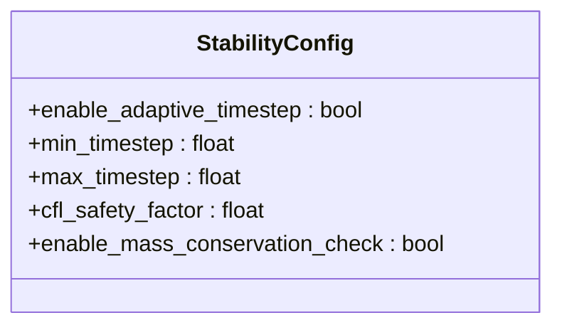
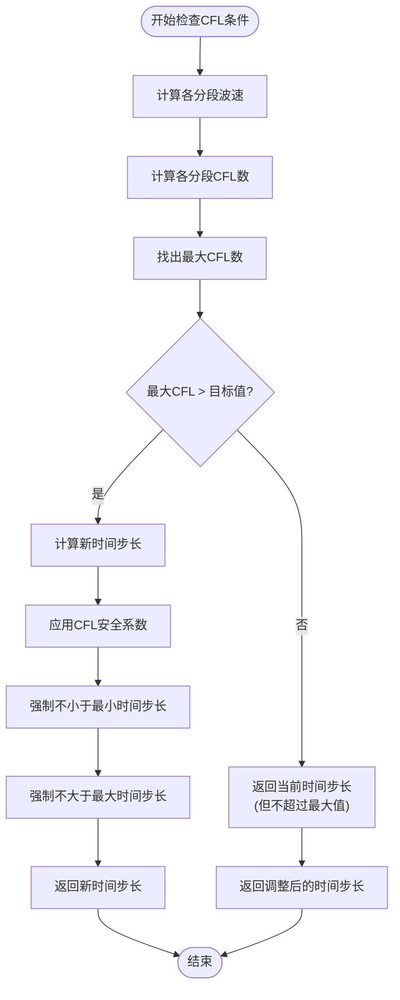
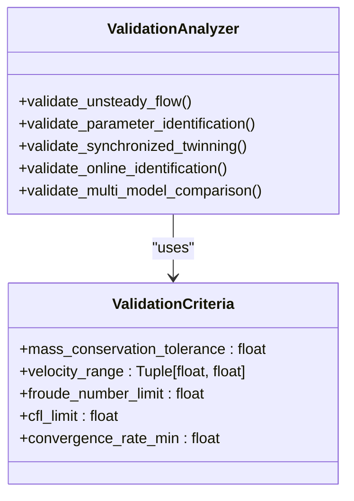
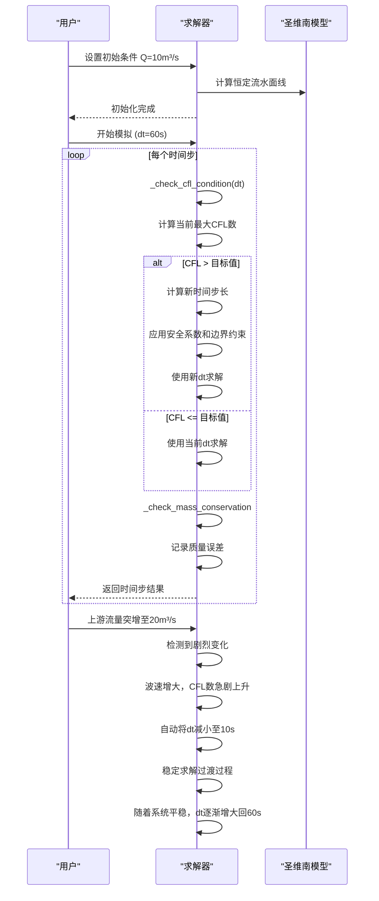

# 自适应控制

<cite>
**Referenced Files in This Document**   
- [enhanced_solver.py](file://tests/deep_channel/enhanced_solver.py)
- [saint_venant.py](file://waternet/models/saint_venant.py)
- [validation_tools.py](file://tests/deep_channel/validation_tools.py)
</cite>

## 目录
1. [引言](#引言)
2. [自适应时间步长控制机制](#自适应时间步长控制机制)
3. [稳定性配置参数协同作用](#稳定性配置参数协同作用)
4. [CFL条件检查与动态调整](#cfl条件检查与动态调整)
5. [质量守恒验证功能](#质量守恒验证功能)
6. [突变边界条件下的自适应控制案例](#突变边界条件下的自适应控制案例)
7. [结论](#结论)

## 引言

本文档详细阐述了WaterNet水力模型中求解器的自适应控制机制，重点分析了CFL条件检查与自适应时间步长调整算法。该机制是确保数值模拟稳定性和计算效率的核心。通过动态调整时间步长，系统能够在保证数值稳定性的同时，最大限度地提高计算效率。文档深入探讨了`StabilityConfig`配置类中各参数的协同作用，解释了`_check_cfl_condition`方法如何根据波速和网格尺寸动态调整时间步长，并阐述了质量守恒验证功能的实现原理。最后，通过实际案例展示了在突变边界条件下，自适应控制如何有效防止数值振荡。

**Section sources**
- [enhanced_solver.py](file://tests/deep_channel/enhanced_solver.py#L1-L312)

## 自适应时间步长控制机制

自适应时间步长控制机制是WaterNet求解器的核心功能之一，旨在根据当前的物理状态和数值稳定性要求，动态地调整模拟的时间步长。该机制通过在每个时间步开始时调用`_check_cfl_condition`方法来实现。如果当前时间步长可能导致数值不稳定（即CFL数超过目标值），则该方法会计算一个更小的、满足稳定性要求的新时间步长。反之，如果当前时间步长远小于稳定性允许的最大值，则可以适当增大时间步长以提高计算效率。这种动态调整策略使得求解器能够在模拟初期或边界条件剧烈变化时采用较小的时间步长以保证稳定性，而在系统状态平稳时采用较大的时间步长以提升效率。

**Section sources**
- [enhanced_solver.py](file://tests/deep_channel/enhanced_solver.py#L211-L231)

## 稳定性配置参数协同作用

`StabilityConfig`类定义了控制求解器稳定性的关键参数，这些参数协同工作以确保模拟的鲁棒性。

**Diagram sources**
- [enhanced_solver.py](file://tests/deep_channel/enhanced_solver.py#L38-L44)

- **enable_adaptive_timestep**: 该布尔参数是自适应控制的总开关。当设置为`True`时，求解器会在每个时间步调用`_check_cfl_condition`方法来评估和调整时间步长。若设置为`False`，则使用用户指定的固定时间步长，不进行任何动态调整。
- **min_timestep 和 max_timestep**: 这两个参数定义了自适应时间步长的上下限。`min_timestep`确保时间步长不会过小，从而避免计算时间无限延长；`max_timestep`则防止时间步长过大，确保模拟结果的精度和物理合理性。它们为自适应算法提供了硬性约束。
- **cfl_safety_factor**: 这是一个安全系数，用于在计算新时间步长时引入保守性。当CFL数超过目标值时，新的时间步长会乘以这个小于1的系数，使得实际采用的时间步长比理论最大值更小，从而提供额外的稳定性裕度，防止因计算误差或模型非线性导致的不稳定。

这些参数共同构成了一个灵活而稳健的控制框架，允许用户根据具体模拟需求和计算资源进行精细调优。

**Section sources**
- [enhanced_solver.py](file://tests/deep_channel/enhanced_solver.py#L38-L44)

## CFL条件检查与动态调整

`_check_cfl_condition`方法是实现自适应控制的核心算法。其工作流程如下：

**Diagram sources**
- [enhanced_solver.py](file://tests/deep_channel/enhanced_solver.py#L211-L231)

1.  **计算波速**: 方法遍历模型的所有分段，调用`_calculate_wave_speed`函数计算每个分段的重力波波速。该波速通常与水流深度和重力加速度相关。
2.  **计算CFL数**: 对于每个分段，利用公式 `CFL = (波速 * 当前时间步长) / 网格尺寸` 计算其CFL数。网格尺寸`dx`由分段的长度决定。
3.  **确定最大CFL**: 找出所有分段中的最大CFL数，因为整个系统的稳定性由最严格的条件决定。
4.  **调整时间步长**: 如果最大CFL数超过了`numerical_config.cfl_target`（目标CFL数），则需要减小时间步长。新的时间步长`dt_new`通过比例关系计算：`dt_new = dt * (cfl_target / max_cfl)`。然后，将`cfl_safety_factor`乘以`dt_new`以增加稳定性裕度。
5.  **应用边界约束**: 最后，将计算出的新时间步长与`min_timestep`和`max_timestep`进行比较，确保最终采用的时间步长在用户设定的范围内。

通过这一系列步骤，求解器能够根据当前的物理状态（波速）和空间离散化（网格尺寸）动态地、安全地调整时间步长，确保数值解的稳定性。

**Section sources**
- [enhanced_solver.py](file://tests/deep_channel/enhanced_solver.py#L211-L231)

## 质量守恒验证功能

质量守恒是水力模拟的基本物理定律。WaterNet通过`_check_mass_conservation`方法来验证每个时间步的模拟结果是否满足质量守恒。

**Diagram sources**
- [validation_tools.py](file://tests/deep_channel/validation_tools.py#L20-L42)
- [validation_tools.py](file://tests/deep_channel/validation_tools.py#L45-L571)

该功能的实现原理如下：
- 在`StabilityConfig`中，`enable_mass_conservation_check`参数控制此功能的开关。
- 当该功能启用时，`solve_time_step`方法在每个时间步求解完成后，会调用`_check_mass_conservation`方法。
- 该方法通过比较流入和流出系统的水量，以及系统内部蓄水量的变化，来计算质量平衡误差。
- 计算出的误差值会被记录在求解器的`statistics`字典中的`mass_conservation_errors`列表里，供后续分析和监控使用。
- `ValidationCriteria`类中定义了`mass_conservation_tolerance`，作为判断质量守恒是否满足的阈值，用于后续的模型验证。

这一机制为模拟结果的物理合理性提供了重要的量化指标。

**Section sources**
- [enhanced_solver.py](file://tests/deep_channel/enhanced_solver.py#L278-L281)
- [validation_tools.py](file://tests/deep_channel/validation_tools.py#L20-L42)

## 突变边界条件下的自适应控制案例

在突变边界条件下（如上游流量突然阶跃变化），自适应控制机制能有效防止数值振荡并优化计算效率。

**Diagram sources**
- [enhanced_solver.py](file://tests/deep_channel/enhanced_solver.py#L211-L231)
- [saint_venant.py](file://waternet/models/saint_venant.py#L300-L315)

**案例分析**:
1.  **初始平稳状态**: 系统处于恒定流状态，波速较低。自适应控制允许使用较大的时间步长（如60秒），计算效率高。
2.  **边界突变**: 当上游流量发生阶跃变化时，水流状态剧烈变化，导致计算出的波速显著增大。
3.  **自动减小步长**: `_check_cfl_condition`方法检测到CFL数远超目标值，根据算法自动将时间步长大幅减小（例如减小到10秒）。这确保了在系统剧烈变化的过渡期内，数值解的稳定性，有效抑制了可能产生的数值振荡。
4.  **恢复效率**: 随着水流状态逐渐趋于新的平衡，波速下降，CFL数也随之降低。自适应控制机制会逐步增大时间步长，直至恢复到最大允许值，从而在保证精度的同时，最大化后续计算的效率。

此案例充分展示了自适应控制在处理非平稳、非线性问题时的巨大优势，它在稳定性和效率之间实现了智能的动态平衡。

**Section sources**
- [enhanced_solver.py](file://tests/deep_channel/enhanced_solver.py#L211-L231)
- [saint_venant.py](file://waternet/models/saint_venant.py#L300-L315)

## 结论

WaterNet的自适应控制机制通过`StabilityConfig`配置和`_check_cfl_condition`算法，实现了对求解过程的精细化管理。`enable_adaptive_timestep`、`min_timestep`、`max_timestep`和`cfl_safety_factor`等参数协同作用，构建了一个既灵活又安全的控制框架。该机制能够根据实时的物理状态（波速）和空间离散化（网格尺寸）动态调整时间步长，确保在任何工况下都能满足CFL稳定性条件。同时，集成的质量守恒验证功能为模拟结果的物理合理性提供了重要保障。在突变边界条件等挑战性场景下，该机制能自动降低时间步长以防止数值振荡，并在系统平稳后恢复高效率计算，显著提升了模型的鲁棒性和实用性。