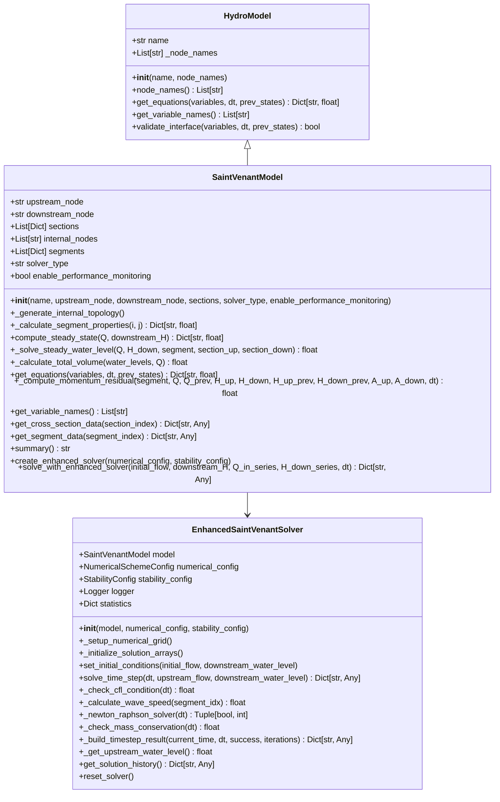
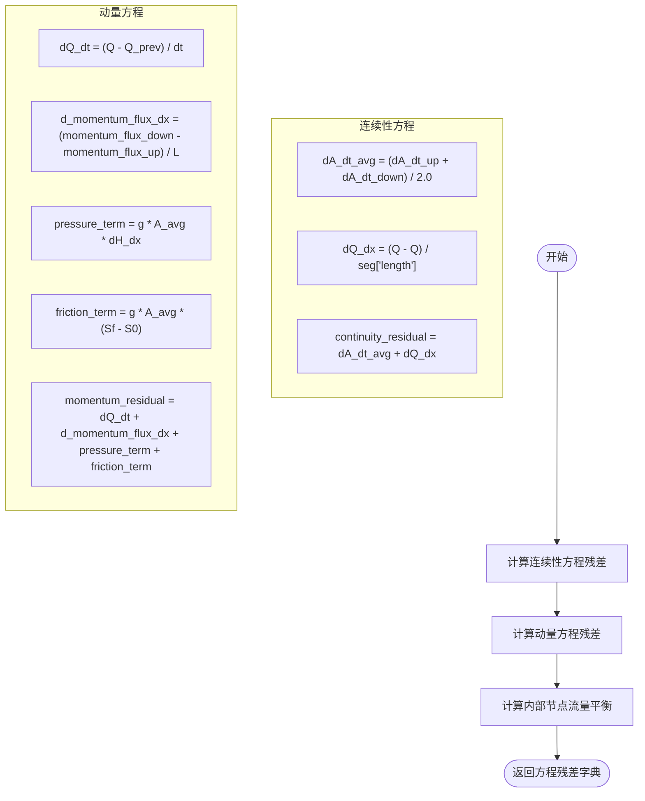
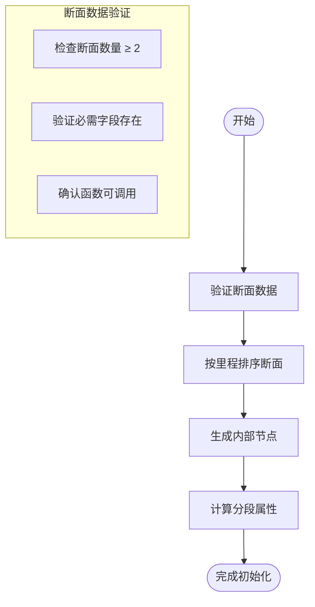
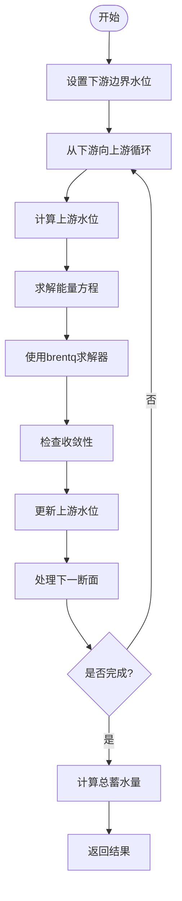
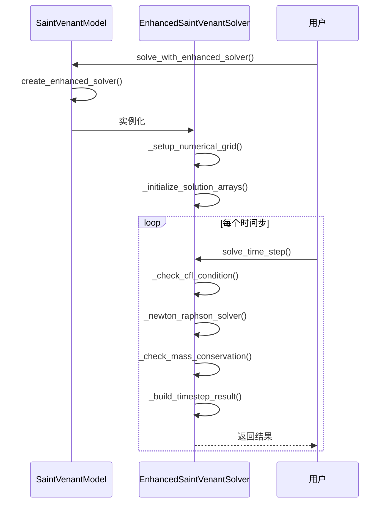

# 物理模型架构

<cite>
**Referenced Files in This Document**   
- [saint_venant.py](file://waternet/models/saint_venant.py)
- [hydro_model.py](file://waternet/interfaces/hydro_model.py)
- [enhanced_solver.py](file://tests/deep_channel/enhanced_solver.py)
</cite>

## 目录
1. [引言](#引言)
2. [核心架构](#核心架构)
3. [圣维南模型实现](#圣维南模型实现)
4. [方程离散化方法](#方程离散化方法)
5. [初始化流程](#初始化流程)
6. [求解机制](#求解机制)
7. [增强求解器](#增强求解器)
8. [性能监控](#性能监控)

## 引言
本文档详细描述了WaterNet系统中圣维南模型的技术架构。该模型作为`HydroModel`抽象基类的具体实现，用于模拟一维非恒定流明渠水力过程。文档重点阐述了Preissmann四点隐式差分格式的应用、模型初始化流程、恒定流与非恒定流的求解机制，以及增强求解器的创建与调用方式。

## 核心架构
圣维南模型遵循WaterNet系统的统一接口规范，继承自`HydroModel`抽象基类，实现了物理水力学方程的完整数值求解能力。



**Diagram sources**
- [hydro_model.py](file://waternet/interfaces/hydro_model.py#L25-L198)
- [saint_venant.py](file://waternet/models/saint_venant.py#L32-L646)
- [enhanced_solver.py](file://tests/deep_channel/enhanced_solver.py#L47-L312)

**Section sources**
- [saint_venant.py](file://waternet/models/saint_venant.py#L32-L646)
- [hydro_model.py](file://waternet/interfaces/hydro_model.py#L25-L198)

## 圣维南模型实现
`SaintVenantModel`类实现了基于圣维南方程组的一维明渠非恒定流模型，通过Preissmann四点隐式差分格式进行离散化，确保数值计算的稳定性和精度。

### 抽象基类接口
`SaintVenantModel`继承自`HydroModel`抽象基类，必须实现两个核心方法：
- `get_equations`: 返回模型方程的残差字典
- `get_variable_names`: 返回模型引入的变量名列表

这种设计确保了所有水力模型在联合求解系统中具有统一的交互接口。

### 模型属性
模型包含以下关键属性：
- `upstream_node`和`downstream_node`: 边界节点名称
- `sections`: 断面几何数据列表，包含里程、高程、糙率及面积和水面宽函数
- `internal_nodes`: 内部计算节点名称列表
- `segments`: 分段属性数据列表
- `solver_type`: 求解器类型（标准或增强）
- `enable_performance_monitoring`: 是否启用性能监控

**Section sources**
- [saint_venant.py](file://waternet/models/saint_venant.py#L32-L646)

## 方程离散化方法
圣维南模型实现了连续性方程和动量方程的离散化形式，采用Preissmann四点隐式差分格式。

### 连续性方程
连续性方程 ∂A/∂t + ∂Q/∂x = 0 通过Preissmann格式离散化为：
```
dA_dt_avg + dQ_dx = 0
```
其中dA_dt_avg是断面面积的时间导数平均值，dQ_dx是流量的空间导数。

### 动量方程
动量方程 ∂Q/∂t + ∂(Q²/A)/∂x + gA∂H/∂x + gA(Sf - S0) = 0 离散化为多个项的组合：
- 时间导数项：dQ_dt
- 对流项：d_momentum_flux_dx
- 压力项：pressure_term
- 摩阻项：friction_term



**Diagram sources**
- [saint_venant.py](file://waternet/models/saint_venant.py#L357-L454)

**Section sources**
- [saint_venant.py](file://waternet/models/saint_venant.py#L357-L454)

## 初始化流程
模型初始化时执行完整的断面数据验证、内部拓扑生成和分段属性计算流程。

### 断面数据验证
初始化时对输入的断面数据进行严格验证：
- 检查断面数量是否至少为2个
- 验证每个断面是否包含必需字段（里程、高程、糙率、面积函数、水面宽函数）
- 确认面积函数和水面宽函数是否为可调用对象

### 内部拓扑生成
根据断面数据自动生成内部计算节点和分段：
- 内部节点命名规则：{model_name}_internal_{index}
- 分段流量变量命名规则：Q_{model_name}_seg_{index}

### 分段属性计算
为相邻断面之间的每个分段计算平均属性：
- 分段长度：上下游断面里程差的绝对值
- 平均坡度：高程差除以长度
- 平均糙率：上下游断面糙率的平均值



**Section sources**
- [saint_venant.py](file://waternet/models/saint_venant.py#L32-L646)

## 求解机制
圣维南模型支持恒定流和非恒定流两种求解机制。

### 恒定流计算
恒定流计算使用标准步进法从下游向上游逐段计算水面线，基于能量方程和曼宁公式。



**Section sources**
- [saint_venant.py](file://waternet/models/saint_venant.py#L257-L355)

### 非恒定流仿真
非恒定流仿真采用时间步进求解机制，通过迭代求解联合方程组。

#### 变量体系构建
`get_variable_names`方法构建模型的变量体系：
- 分段流量变量：Q_{model_name}_seg_{index}
- 内部节点水位变量：H_{node_name}

#### 联合求解系统
`get_equations`方法构建联合求解系统的残差方程：
- 每个分段的连续性方程
- 每个分段的动量方程
- 每个内部节点的流量平衡方程

**Section sources**
- [saint_venant.py](file://waternet/models/saint_venant.py#L505-L526)

## 增强求解器
增强求解器提供了更高级的数值求解能力和稳定性控制。

### 创建与调用
通过`create_enhanced_solver`方法创建增强求解器实例，并通过`solve_with_enhanced_solver`方法进行调用。

### 求解流程
增强求解器的求解流程包括：
1. 设置数值网格
2. 初始化求解数组
3. 设置初始条件
4. 时间步进求解



**Diagram sources**
- [enhanced_solver.py](file://tests/deep_channel/enhanced_solver.py#L154-L209)

**Section sources**
- [saint_venant.py](file://waternet/models/saint_venant.py#L600-L646)
- [enhanced_solver.py](file://tests/deep_channel/enhanced_solver.py#L154-L209)

## 性能监控
模型实现了全面的性能监控功能，用于跟踪求解过程中的关键指标。

### 监控指标
当启用性能监控时，模型会记录以下指标：
- 收敛历史
- 质量平衡误差
- 计算时间
- 稳定性指标

### 统计信息
增强求解器维护详细的统计信息：
- 总时间步数
- 收敛失败次数
- 时间步长调整次数
- 质量守恒误差历史
- 计算耗时

**Section sources**
- [saint_venant.py](file://waternet/models/saint_venant.py#L32-L646)
- [enhanced_solver.py](file://tests/deep_channel/enhanced_solver.py#L47-L312)