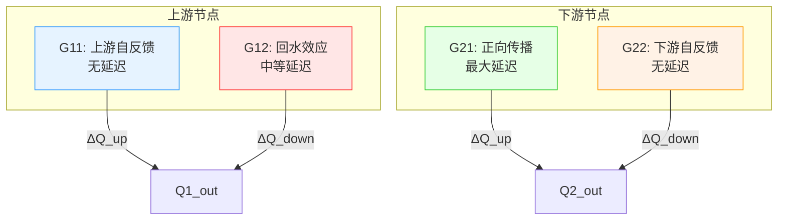
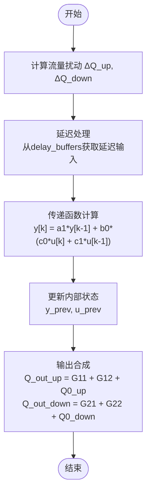

# IDZ模型

<cite>
**本文档引用文件**  
- [IntegralDelayZeroModel](file://waternet/models/lumped_models.py#L793-L1097)
- [idz_linearizer.py](file://waternet/models/idz_linearizer.py)
- [FOUR_EQUATION_IDZ_THEORY.md](file://examples/reduced_order_models_theory/FOUR_EQUATION_IDZ_THEORY.md)
- [IDZ模型辨识综合分析报告.md](file://examples/advanced/IDZ模型辨识综合分析报告.md)
- [idz_model.yaml](file://configs/example_configs/idz_model.yaml)
</cite>

## 目录
1. [引言](#引言)
2. [核心理论基础](#核心理论基础)
3. [传递函数矩阵与物理意义](#传递函数矩阵与物理意义)
4. [模型参数体系](#模型参数体系)
5. [线性化与离散化机制](#线性化与离散化机制)
6. [状态管理与内部实现](#状态管理与内部实现)
7. [高级应用与工程价值](#高级应用与工程价值)
8. [结论](#结论)

## 引言

IDZ模型（IntegralDelayZeroModel）是一种基于四方程耦合系统的先进河道水力系统模型，能够完整描述上下游节点间的双向水力耦合关系。该模型通过传递函数矩阵将上游和下游的入流与出流动态关联，精确捕捉正向传播、回水效应及局部调蓄等复杂水力现象。本技术文档深入解析IDZ模型的核心机制，涵盖其数学结构、参数体系、线性化方法、离散化实现以及在复杂河网仿真和数字孪生在线校正中的高级应用。

**Section sources**
- [FOUR_EQUATION_IDZ_THEORY.md](file://examples/reduced_order_models_theory/FOUR_EQUATION_IDZ_THEORY.md#L1-L244)
- [IDZ模型辨识综合分析报告.md](file://examples/advanced/IDZ模型辨识综合分析报告.md#L1-L168)

## 核心理论基础

IDZ模型建立在双节点传递函数矩阵的理论框架之上，摒弃了传统模型的简化假设，直接基于稳态物理条件进行建模。其核心思想是将河道视为一个具有四个独立传递函数的耦合系统，每个传递函数对应不同的水力响应路径。

### 平衡点定义

模型的线性化基准点为稳态流量与水位值 `(Q0_up, H0_up, Q0_down, H0_down)`，对应的平衡蓄量 `V0` 由物理关系直接计算得出，无需额外假设。计算支持两种模式：

1. **Q-H耦合模式**（推荐）：
   $$
   V0 = f(Q_{avg}, H_{avg}), \quad \text{其中} \quad Q_{avg} = \frac{Q0_{up} + Q0_{down}}{2}, \quad H_{avg} = \frac{H0_{up} + H0_{down}}{2}
   $$

2. **传统V-H模式**（兼容）：
   $$
   V0 = f(H_{avg})
   $$

这种基于真实物理条件的平衡点定义方式显著提升了模型的物理合理性和预测精度。

### 线性化机理

模型在平衡点附近进行线性化处理：
- 输入扰动：`ΔQ_up = Q_in_up - Q0_up`，`ΔQ_down = Q_in_down - Q0_down`
- 输出响应：由传递函数矩阵作用于扰动向量
- 最终输出：线性响应叠加平衡点偏移

此方法确保了模型在小扰动下的动态行为能够准确反映真实系统的响应特性。

**Section sources**
- [FOUR_EQUATION_IDZ_THEORY.md](file://examples/reduced_order_models_theory/FOUR_EQUATION_IDZ_THEORY.md#L1-L244)
- [IntegralDelayZeroModel](file://waternet/models/lumped_models.py#L793-L1097)

## 传递函数矩阵与物理意义

IDZ模型采用2×2传递函数矩阵描述双节点系统的完整耦合关系：

$$
\begin{bmatrix}
Q1_{out} \\
Q2_{out}
\end{bmatrix}
=
\begin{bmatrix}
G11(s) & G12(s) \\
G21(s) & G22(s)
\end{bmatrix}
\begin{bmatrix}
\Delta Q1_{in} \\
\Delta Q2_{in}
\end{bmatrix}
+
\begin{bmatrix}
Q0_{up} \\
Q0_{down}
\end{bmatrix}
$$

### 四个传递函数的物理意义

| 传递函数 | 物理意义 | 特点 |
|---------|--------|------|
| **G11(s)** | 上游输入 → 上游输出（上游自反馈） | 无延迟（T11 = 0），快速响应，反映上游节点的本地动态特性 |
| **G12(s)** | 下游输入 → 上游输出（下游回水上游） | 有延迟（T12 > 0），体现回水效应，即下游水位变化对上游的影响 |
| **G21(s)** | 上游输入 → 下游输出（上游传至下游） | 延迟最大（T21 > T12），主导正向传播过程，如洪峰从上游向下游的传播 |
| **G22(s)** | 下游输入 → 下游输出（下游自反馈） | 无延迟（T22 = 0），反映下游节点的本地响应和局部调蓄能力 |



**Diagram sources**
- [FOUR_EQUATION_IDZ_THEORY.md](file://examples/reduced_order_models_theory/FOUR_EQUATION_IDZ_THEORY.md#L1-L244)
- [IntegralDelayZeroModel](file://waternet/models/lumped_models.py#L793-L1097)

## 模型参数体系

每个传递函数采用积分延迟零点形式：

$$
G_{ij}(s) = \frac{(\tau_{ij} \cdot s + 1) \cdot \exp(-T_{ij} \cdot s)}{\alpha_{ij} \cdot s + 1}
$$

### 参数物理含义

- **τ_ij (零点时间常数)**：控制响应的超调和振荡特性，单位为秒。一般范围为60-300秒，主传播路径（G21）可取较大值。
- **T_ij (延迟时间)**：描述信号传播的纯延迟，单位为秒。决定了水力扰动的传播速度。
- **α_ij (极点时间常数)**：控制系统的响应速度和稳定性，单位为秒。要求 α > τ 以保证稳定性。

### 参数设计原则

#### 延迟时间设计
```
T11 = 0      # 上游本地响应，无延迟
T12 > 0      # 回水效应，中等延迟
T21 > T12    # 正向传播，最大延迟  
T22 = 0      # 下游本地响应，无延迟
```
推荐比例：`T21 : T12 : T11 : T22 = 2 : 1 : 0 : 0`

#### 时间常数设计
- **零点时间常数 τ**：控制超调和振荡，一般范围60-300秒。
- **极点时间常数 α**：控制响应速度，一般要求 α > τ。推荐范围200-600秒。

#### 参数关系约束
```
α11, α22 ∈ [200, 400]    # 本地响应，中等速度
α12, α21 ∈ [300, 600]    # 传播响应，较慢速度
τ_ij < α_ij             # 稳定性约束
```

**Section sources**
- [FOUR_EQUATION_IDZ_THEORY.md](file://examples/reduced_order_models_theory/FOUR_EQUATION_IDZ_THEORY.md#L1-L244)
- [idz_model.yaml](file://configs/example_configs/idz_model.yaml#L1-L23)

## 线性化与离散化机制

### 线性化过程

模型在稳态平衡点 `(Q0_up, H0_up, Q0_down, H0_down)` 附近进行线性化：
1. 计算输入扰动：`dQ_up = Q_in_up - Q0_up`，`dQ_down = Q_in_down - Q0_down`
2. 将扰动向量输入传递函数矩阵
3. 计算线性响应并叠加平衡点偏移得到最终输出

### 离散化实现

模型采用一阶保持器（ZOH）方法进行离散化，将连续传递函数转换为差分方程形式。对于每个传递函数，离散化系数计算如下：

- **极点部分**：`a1 = exp(-dt / alpha)`
- **零点部分**：`c0 = 1.0 + tau / dt`，`c1 = -tau / dt`

离散化后的差分方程为：
$$
y[k] = a1 \cdot y[k-1] + b0 \cdot (c0 \cdot u[k] + c1 \cdot u[k-1])
$$

此方法保证了数值稳定性和计算效率，适用于实时仿真。

**Section sources**
- [FOUR_EQUATION_IDZ_THEORY.md](file://examples/reduced_order_models_theory/FOUR_EQUATION_IDZ_THEORY.md#L1-L244)
- [IntegralDelayZeroModel](file://waternet/models/lumped_models.py#L931-L956)

## 状态管理与内部实现

### 内部延迟缓冲区（delay_buffers）

每个传递函数维护独立的延迟缓冲区，用于实现纯延迟环节。延迟步数由 `delay_steps = ceil(T / dt)` 计算得出。缓冲区采用滑动窗口机制，每步更新时移除最老的输入值并加入新的输入值。

### 状态变量（internal_states）

每个传递函数维护一组内部状态变量，包括：
- `y_prev`：上一步的输出值
- `u_prev`：上一步的输入值

这些状态变量用于递归计算当前输出，确保了系统的记忆性和动态特性。

### 仿真步骤

每个时间步的计算流程如下：
1. **扰动计算**：计算相对于平衡点的流量扰动。
2. **延迟处理**：从延迟缓冲区获取延迟后的输入信号。
3. **传递函数计算**：使用离散化系数和内部状态计算响应。
4. **输出合成**：将四个传递函数的响应叠加并加上平衡点偏移，得到最终的上下游出流量。



**Diagram sources**
- [IntegralDelayZeroModel](file://waternet/models/lumped_models.py#L958-L1044)
- [FOUR_EQUATION_IDZ_THEORY.md](file://examples/reduced_order_models_theory/FOUR_EQUATION_IDZ_THEORY.md#L1-L244)

## 高级应用与工程价值

### 复杂河网系统仿真

IDZ模型因其完整的双向耦合能力，特别适用于复杂河网系统的仿真。通过将多个IDZ模型串联或并联，可以构建大规模水力网络，精确模拟洪水传播、回水效应和多节点调度等复杂过程。

### 数字孪生在线校正

模型支持在线更新平衡点和参数，使其成为数字孪生系统的核心组件。通过实时数据驱动，可以动态调整 `Q0_up, H0_up, Q0_down, H0_down` 等平衡点参数，实现模型的在线校正和自适应优化。

### 模型辨识与参数估计

`idz_linearizer.py` 模块提供了完整的参数辨识功能，能够基于圣维南模型等高精度参考模型，通过优化算法自动辨识12个独立参数。该过程包括：
- 生成多样化的测试信号（阶跃、脉冲、斜坡）
- 计算参考模型的响应
- 使用差分进化等优化算法最小化误差

### 工程应用优势

| 特性 | 传统马斯京干模型 | 四方程IDZ模型 |
|------|------------------|--------------|
| 参数数量 | 2个 | 12个 |
| 耦合方式 | 单向 | 双向 |
| 回水效应 | 无 | 有 |
| 传播机理 | 线性水库 | 传递函数矩阵 |
| 适用场景 | 简单河道 | 复杂河网 |
| 计算复杂度 | 低 | 高 |

**Section sources**
- [idz_linearizer.py](file://waternet/models/idz_linearizer.py#L49-L509)
- [IntegralDelayZeroModel](file://waternet/models/lumped_models.py#L1061-L1078)

## 结论

IDZ模型通过四方程耦合系统实现了河道水力过程的高精度建模，在理论和工程应用上均取得了显著突破：

1. **理论创新**：摒弃传统简化假设，基于真实稳态物理条件进行线性化，提升了模型的物理机理清晰度。
2. **技术先进**：采用传递函数矩阵全面描述双向水力耦合，能够同时捕捉正向传播和回水效应。
3. **工程实用**：12个独立参数提供了高度的灵活性和可定制性，适用于复杂河网系统和数字孪生平台。
4. **数值可靠**：基于控制理论的离散化方法保证了数值稳定性和计算效率。

该模型代表了WaterNet框架在降阶水力建模领域的最新进展，为洪水预报、水资源调度和水力系统控制提供了强有力的理论支撑和实现工具。