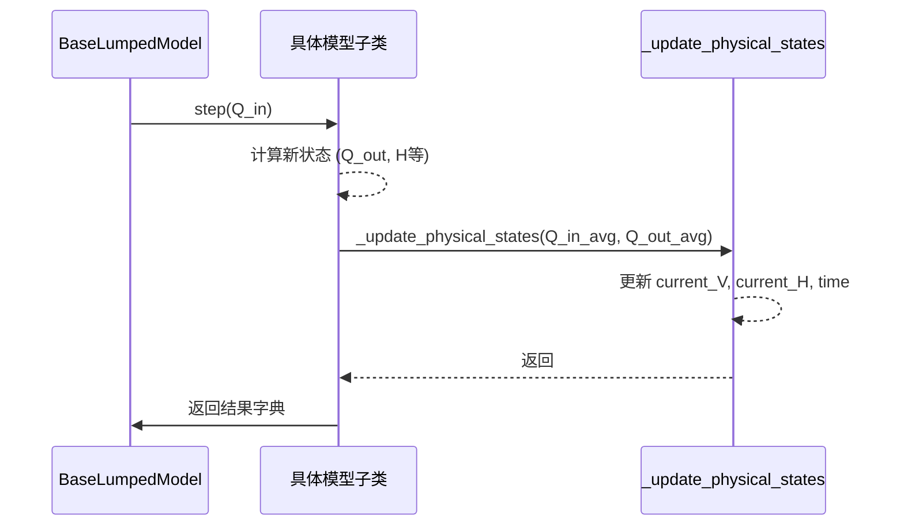

# 降阶模型基类

<cite>
**Referenced Files in This Document**  
- [lumped_models.py](file://waternet/models/lumped_models.py)
</cite>

## 目录
1. [引言](#引言)
2. [核心属性与物理意义](#核心属性与物理意义)
3. [仿真循环与状态管理](#仿真循环与状态管理)
4. [物理函数与数值保护](#物理函数与数值保护)
5. [子类继承与实现范式](#子类继承与实现范式)
6. [通用方法与调用模式](#通用方法与调用模式)
7. [数值稳定性与验证机制](#数值稳定性与验证机制)

## 引言

`BaseLumpedModel` 是 WaterNet 水文模型框架中的抽象基类，为所有集总参数降阶模型提供统一的接口和核心功能。该基类采用“步进式”（step-by-step）的仿真模式，通过 `step()` 方法实现时间推进，确保了不同降阶模型在接口和行为上的一致性。它不仅管理着时间、蓄水量、水位和流量等核心状态变量，还内置了结果记录、数值保护和物理一致性验证等关键功能，是构建具体降阶模型（如水量平衡模型、蓄量演算模型、马斯京干模型等）的基石。

**Section sources**
- [lumped_models.py](file://waternet/models/lumped_models.py#L30-L515)

## 核心属性与物理意义

`BaseLumpedModel` 定义了一系列核心属性，这些属性共同构成了模型的物理基础。

- **`dt`**: 时间步长（秒），定义了仿真推进的基本时间单位，必须为正值。
- **`initial_V`**: 初始蓄水量（m³），表示模型开始仿真时的初始状态，必须为非负值。
- **`V_to_H_func`**: 蓄量-水位关系函数，一个可调用对象，用于将蓄水量 `V` 转换为对应的水位 `H`，即 `H = f(V)`。
- **`H_to_Q_func`**: 水位-出流关系函数，一个可调用对象，用于将水位 `H` 转换为对应的出流量 `Q`，即 `Q = f(H)`。
- **`QH_to_V_func`**: 流量-水位耦合的蓄量函数，一个可选的可调用对象，用于根据流量 `Q` 和水位 `H` 共同计算蓄水量 `V`，即 `V = f(Q, H)`。如果提供了此函数，模型将优先使用这种更精确的物理关系，以提升模拟的物理精度。

这些属性在 `__init__` 方法中被初始化，并经过严格的参数验证，确保了模型的物理合理性。

**Section sources**
- [lumped_models.py](file://waternet/models/lumped_models.py#L61-L124)

## 仿真循环与状态管理

模型的核心仿真逻辑通过 `step()` 抽象方法实现，该方法定义了“步进式”仿真循环的骨架。

**Diagram sources**
- [lumped_models.py](file://waternet/models/lumped_models.py#L211-L234)
- [lumped_models.py](file://waternet/models/lumped_models.py#L236-L279)

### `step()` 方法
`step()` 是一个抽象方法，所有继承 `BaseLumpedModel` 的子类都必须重写此方法。它接收当前时间步的入流量 `Q_in`，计算并返回一个包含出流量、水位、蓄水量和时间等信息的结果字典。子类在实现时，应调用 `_update_physical_states()` 方法来更新内部的物理状态。

### `_update_physical_states()` 方法
该方法是状态更新的核心，它根据平均入流和平均出流来更新蓄水量和水位。它支持两种计算模式：
1.  **传统连续性方程模式**：当未提供 `QH_to_V_func` 时，直接使用 `dV = (Q_in_avg - Q_out_avg) * dt` 计算蓄水量变化。
2.  **Q-H耦合模式**：当提供了 `QH_to_V_func` 时，会先用连续性方程估算新水位，再利用 `QH_to_V_func` 函数计算更精确的蓄水量，从而实现更高物理精度的模拟。

**Section sources**
- [lumped_models.py](file://waternet/models/lumped_models.py#L211-L234)
- [lumped_models.py](file://waternet/models/lumped_models.py#L236-L279)

## 物理函数与数值保护

为了确保模型在各种输入条件下都能稳定运行，基类提供了安全的物理函数调用和数值保护机制。

### 安全的物理函数调用
- **`_safe_V_to_H()`**: 安全地调用 `V_to_H_func`。它会先将蓄水量限制在 `_min_volume` 和 `_max_volume` 之间，然后调用函数。如果函数返回非有限值或抛出异常，会发出警告并返回当前水位作为安全值。
- **`_safe_H_to_Q()`**: 安全地调用 `H_to_Q_func`。同样会处理非有限值和异常情况，并将负的出流量强制设为0，以保证物理合理性。

### `QH_to_V_func` 的支持
`_compute_volume_from_QH()` 方法是支持流量-水位耦合的关键。它会优先尝试使用 `QH_to_V_func` 根据给定的流量和水位计算蓄水量。如果计算失败或结果异常，则会回退到传统方法，确保了功能的健壮性。

**Section sources**
- [lumped_models.py](file://waternet/models/lumped_models.py#L145-L160)
- [lumped_models.py](file://waternet/models/lumped_models.py#L191-L208)
- [lumped_models.py](file://waternet/models/lumped_models.py#L162-L189)

## 子类继承与实现范式

`BaseLumpedModel` 的设计遵循了面向对象的继承原则，为子类提供了清晰的扩展范式。

1.  **继承基类**：子类通过 `class MyModel(BaseLumpedModel):` 的方式继承。
2.  **实现 `step()` 方法**：子类必须重写 `step()` 方法，实现其特定的水力计算逻辑。
3.  **调用基类功能**：在 `step()` 方法中，子类应调用 `_update_physical_states()` 来更新状态，并调用 `_record_state()` 来记录历史数据。
4.  **可选重写 `__init__`**：子类可以重写 `__init__` 方法以接受额外的参数，并在最后调用 `super().__init__()` 来初始化基类部分。

这种范式确保了所有降阶模型都遵循统一的接口和行为规范。

**Section sources**
- [lumped_models.py](file://waternet/models/lumped_models.py#L30-L515)

## 通用方法与调用模式

基类提供了一系列通用方法，简化了模型的使用。

- **`run_simulation()`**: 运行完整的仿真序列。它接收一个入流时间序列，循环调用 `step()` 方法，并按指定间隔记录结果，最终返回一个包含所有仿真数据的 `pandas.DataFrame`。
- **`reset()`**: 将模型重置到初始状态。可以指定新的初始蓄水量，这在进行多场景模拟时非常有用。
- **`get_history_dataframe()`**: 获取一个包含所有历史状态（时间、蓄水量、水位、出入流等）的 `pandas.DataFrame`，便于后续的数据分析和可视化。

**Section sources**
- [lumped_models.py](file://waternet/models/lumped_models.py#L300-L358)
- [lumped_models.py](file://waternet/models/lumped_models.py#L402-L409)

## 数值稳定性与验证机制

为了保障模型的数值稳定性和物理一致性，基类内置了多重保护机制。

### 数值稳定性保护
- **边界限制**：通过 `_min_volume` 和 `_max_volume` 属性对蓄水量进行硬性限制，防止其出现负值或无限增长。
- **历史数据长度限制**：`_record_state()` 方法会限制历史数据的最大长度（默认10000条），防止内存溢出。

### 物理函数验证机制
- **`_validate_initial_state()`**: 在模型初始化时自动调用，用于验证 `V_to_H_func` 和 `H_to_Q_func` 函数在初始蓄水量下的输出是否为有效、有限的数值，确保模型从一个物理上合理的状态开始。
- **`validate_physical_functions()`**: 提供一个公共方法，允许用户在模型运行前，对物理关系函数在整个测试范围内的有效性进行批量验证。

这些机制共同作用，确保了 `BaseLumpedModel` 及其所有子类在各种复杂场景下都能稳定、可靠地运行。

**Section sources**
- [lumped_models.py](file://waternet/models/lumped_models.py#L126-L143)
- [lumped_models.py](file://waternet/models/lumped_models.py#L378-L398)