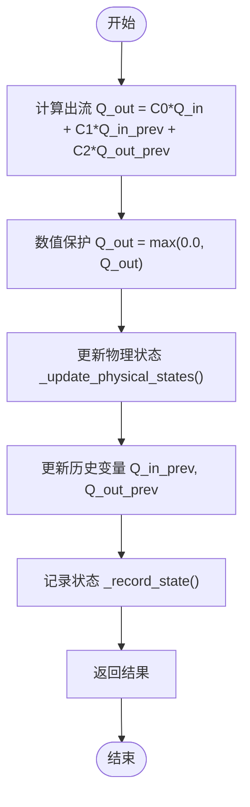

# 马斯京干模型

<cite>
**Referenced Files in This Document**  
- [lumped_models.py](file://waternet/models/lumped_models.py)
- [muskingum_model.yaml](file://examples/configs/muskingum_model.yaml)
- [analyze_muskingum_theory.py](file://examples/reduced_order_models_theory/analyze_muskingum_theory.py)
- [THEORY_REFERENCE.md](file://examples/reduced_order_models_theory/THEORY_REFERENCE.md)
</cite>

## 目录
1. [简介](#简介)
2. [核心算法与数学推导](#核心算法与数学推导)
3. [关键参数物理意义](#关键参数物理意义)
4. [模型初始化与系数计算](#模型初始化与系数计算)
5. [递推计算与状态更新](#递推计算与状态更新)
6. [物理几何关联](#物理几何关联)
7. [典型应用场景](#典型应用场景)
8. [与圣维南模型对比](#与圣维南模型对比)
9. [结论](#结论)

## 简介

马斯京干模型（Muskingum Model）是一种经典的河道洪水演进模型，基于线性水库理论，广泛应用于天然河道和明渠的洪水传播计算。该模型通过简化圣维南方程，将复杂的非线性偏微分方程组转化为线性常微分方程，从而实现高效计算。模型的核心在于其递推公式，能够根据当前和历史的入流、出流数据，预测未来的出流情况。

**Section sources**
- [lumped_models.py](file://waternet/models/lumped_models.py#L665-L790)

## 核心算法与数学推导

马斯京干模型的核心方程为：
```
Q_out = C0 * Q_in + C1 * Q_in_prev + C2 * Q_out_prev
```
该方程是圣维南方程在特定条件下的线性化简化形式。圣维南方程组由连续性方程和动量方程组成：
- 连续性方程：∂A/∂t + ∂Q/∂x = 0
- 动量方程：∂Q/∂t + ∂(Q²/A)/∂x + gA∂H/∂x = gA(S₀ - Sf)

马斯京干模型通过忽略惯性项（∂Q/∂t）和对流项（∂(Q²/A)/∂x），并对压力项进行线性化处理，最终得到上述线性递推公式。这种简化假设适用于河道坡度较缓、弗劳德数较小且流量变化相对缓慢的场景。

**Section sources**
- [analyze_muskingum_theory.py](file://examples/reduced_order_models_theory/analyze_muskingum_theory.py#L20-L35)
- [THEORY_REFERENCE.md](file://examples/reduced_order_models_theory/THEORY_REFERENCE.md#L10-L25)

## 关键参数物理意义

马斯京干模型包含两个关键参数：滞时常数K和权重系数x。

- **滞时常数K**：反映洪峰传播时间，单位为秒。其物理意义为河段长度L与波速c的比值，即K ≈ L/c。K值越大，表示洪水波传播速度越慢。
- **权重系数x**：反映楔形蓄量的影响，取值范围为0 ≤ x ≤ 0.5。当x=0时，模型表现为纯水库效应；当x=0.5时，模型表现为纯传播效应。

这两个参数共同决定了洪水波的传播速度和衰减程度。合理选择K和x值对于模型的准确性至关重要。

**Section sources**
- [THEORY_REFERENCE.md](file://examples/reduced_order_models_theory/THEORY_REFERENCE.md#L140-L150)
- [analyze_muskingum_theory.py](file://examples/reduced_order_models_theory/analyze_muskingum_theory.py#L220-L225)

## 模型初始化与系数计算

在模型初始化过程中，根据时间步长dt、滞时常数K和权重系数x计算马斯京干系数C0、C1、C2。具体计算公式如下：
```
C0 = (-Kx + 0.5*dt) / (K - Kx + 0.5*dt)
C1 = (Kx + 0.5*dt) / (K - Kx + 0.5*dt)
C2 = (K - Kx - 0.5*dt) / (K - Kx + 0.5*dt)
```
为保证数值稳定性，需验证系数和是否接近1。若系数和与1的偏差超过1e-6，则会发出警告。

**Section sources**
- [lumped_models.py](file://waternet/models/lumped_models.py#L700-L720)

## 递推计算与状态更新

`step()`方法利用历史入流Q_in_prev和出流Q_out_prev进行递推计算。首先根据马斯京干公式计算出流Q_out，然后通过`_update_physical_states()`方法更新蓄水量和水位。更新过程中，采用平均入流和出流计算蓄水量变化，并通过V_to_H_func和H_to_Q_func函数确保物理一致性。



**Diagram sources**
- [lumped_models.py](file://waternet/models/lumped_models.py#L740-L779)
- [lumped_models.py](file://waternet/models/lumped_models.py#L236-L279)

**Section sources**
- [lumped_models.py](file://waternet/models/lumped_models.py#L740-L779)

## 物理几何关联

模型通过V_to_H_func和H_to_Q_func函数与物理几何关联。V_to_H_func定义了蓄量与水位的关系，H_to_Q_func定义了水位与出流的关系。这些函数可以根据实际河道的几何特性进行定制，从而提高模型的准确性。

**Section sources**
- [lumped_models.py](file://waternet/models/lumped_models.py#L740-L779)

## 典型应用场景

马斯京干模型适用于天然河道的洪水演进模拟。配置示例如下：
```yaml
model_type: muskingum
parameters:
  K: 3600.0
  x: 0.2
  dt: 60.0
  initial_V: 12000.0
physical_relations:
  V_to_H:
    type: linear
    base_level: 99.0
    coefficient: 0.000125
  H_to_Q:
    type: weir
    threshold: 99.0
    coefficient: 25.0
    exponent: 1.5
```

**Section sources**
- [muskingum_model.yaml](file://examples/configs/muskingum_model.yaml#L1-L17)

## 与圣维南模型对比

与高精度的圣维南模型相比，马斯京干模型在计算效率和精度上存在显著差异。圣维南模型能够精确模拟复杂的水力现象，但计算成本高；而马斯京干模型通过线性化简化，大幅提高了计算速度，适用于工程应用中的快速估算。两者的选择应根据具体场景的需求进行权衡。

**Section sources**
- [THEORY_REFERENCE.md](file://examples/reduced_order_models_theory/THEORY_REFERENCE.md#L40-L50)
- [analyze_muskingum_theory.py](file://examples/reduced_order_models_theory/analyze_muskingum_theory.py#L226-L235)

## 结论

马斯京干模型作为一种经典的洪水演进模型，通过线性化简化实现了高效计算。其核心在于递推公式和关键参数的物理意义。尽管精度相对较低，但在工程应用中具有重要的实用价值。未来的发展方向包括混合建模、自适应系统和数据驱动的参数优化。