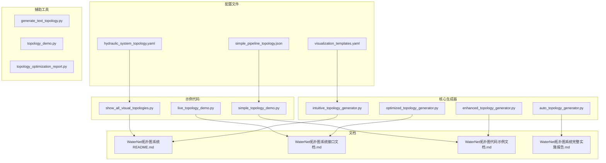
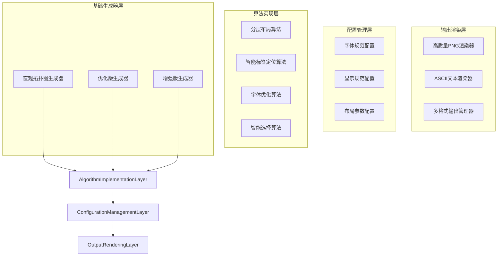
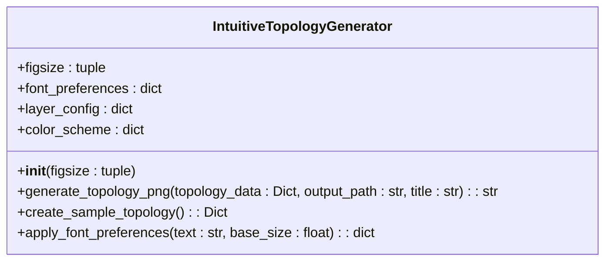
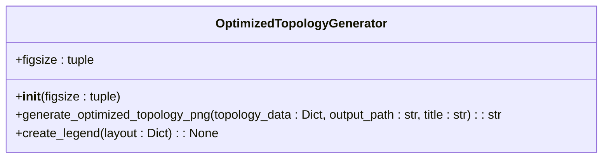
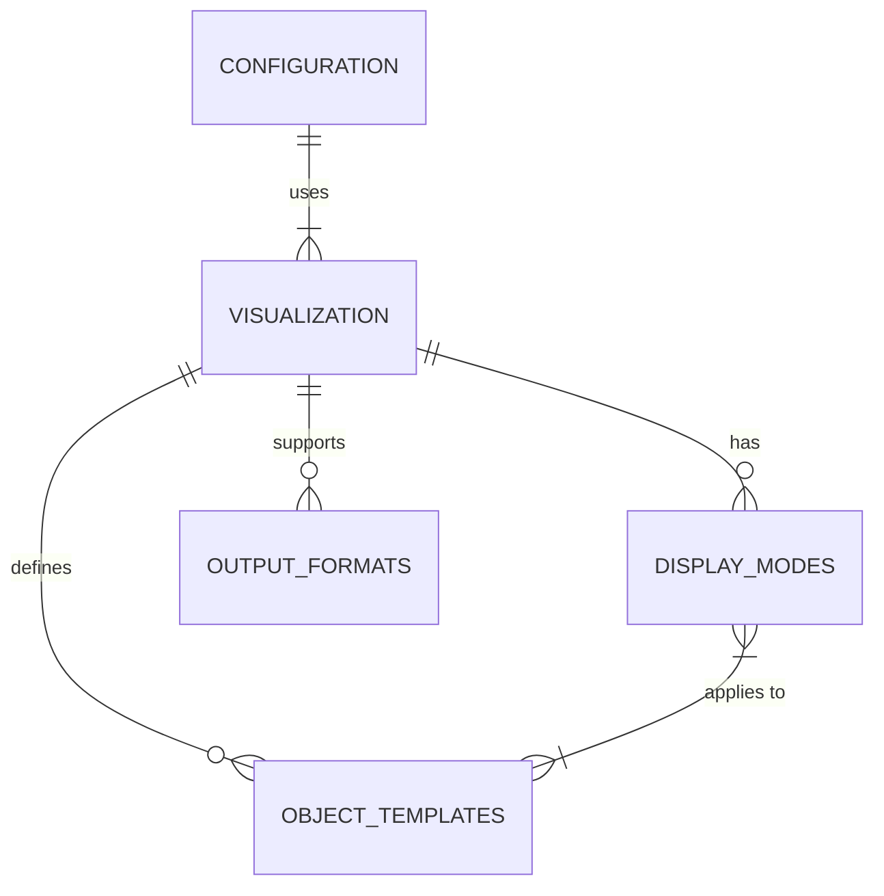
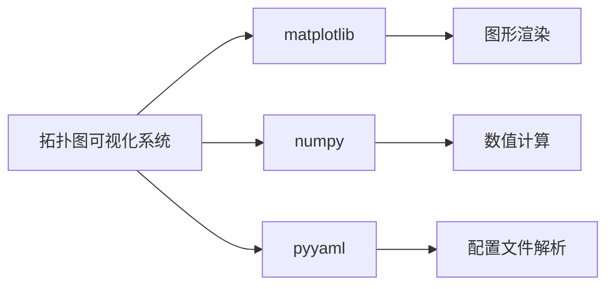

# 拓扑图可视化系统

<cite>
**本文档引用文件**  
- [WaterNet拓扑图系统README.md](file://WaterNet拓扑图系统README.md)
- [WaterNet拓扑图系统接口文档.md](file://WaterNet拓扑图系统接口文档.md)
- [WaterNet拓扑图代码示例文档.md](file://WaterNet拓扑图代码示例文档.md)
- [WaterNet拓扑图系统完整实施报告.md](file://WaterNet拓扑图系统完整实施报告.md)
- [configs/visualization_templates.yaml](file://configs/visualization_templates.yaml)
- [examples/show_all_visual_topologies.py](file://examples/show_all_visual_topologies.py)
- [examples/live_topology_demo.py](file://examples/live_topology_demo.py)
- [examples/simple_topology_demo.py](file://examples/simple_topology_demo.py)
- [waternet/visualization/intuitive_topology_generator.py](file://waternet/visualization/intuitive_topology_generator.py)
- [waternet/visualization/optimized_topology_generator.py](file://waternet/visualization/optimized_topology_generator.py)
- [waternet/visualization/enhanced_topology_generator.py](file://waternet/visualization/enhanced_topology_generator.py)
- [waternet/visualization/auto_topology_generator.py](file://waternet/visualization/auto_topology_generator.py)
</cite>

## 目录
1. [简介](#简介)
2. [项目结构](#项目结构)
3. [核心组件](#核心组件)
4. [架构概述](#架构概述)
5. [详细组件分析](#详细组件分析)
6. [依赖分析](#依赖分析)
7. [性能考虑](#性能考虑)
8. [故障排除指南](#故障排除指南)
9. [结论](#结论)
10. [附录](#附录)（如需要）

## 简介
WaterNet拓扑图可视化系统是一个基于分层架构算法开发的完整可视化解决方案，旨在为水力建模系统提供多样式拓扑图自动生成能力。该系统解决了中文字体显示、图例重叠、标签错位等关键问题，严格遵循用户指定的字体和布局规范。系统支持多种展示模式，包括简洁流程图、流向示意图、表格模式和图形化模式，并能根据数据复杂度智能选择最佳展示方式。该系统广泛应用于学术研究、工程设计、教学培训和项目管理等领域。

**Section sources**
- [WaterNet拓扑图系统README.md](file://WaterNet拓扑图系统README.md#L1-L243)
- [WaterNet拓扑图系统完整实施报告.md](file://WaterNet拓扑图系统完整实施报告.md#L1-L333)

## 项目结构
WaterNet拓扑图可视化系统具有清晰的模块化结构，主要分为核心生成器、配置文件、示例代码、文档和辅助工具等部分。



**Diagram sources**
- [WaterNet拓扑图系统README.md](file://WaterNet拓扑图系统README.md#L1-L243)
- [examples/show_all_visual_topologies.py](file://examples/show_all_visual_topologies.py#L1-L333)
- [examples/live_topology_demo.py](file://examples/live_topology_demo.py#L1-L243)
- [examples/simple_topology_demo.py](file://examples/simple_topology_demo.py#L1-L198)

**Section sources**
- [WaterNet拓扑图系统README.md](file://WaterNet拓扑图系统README.md#L1-L243)
- [examples/show_all_visual_topologies.py](file://examples/show_all_visual_topologies.py#L1-L333)
- [examples/live_topology_demo.py](file://examples/live_topology_demo.py#L1-L243)
- [examples/simple_topology_demo.py](file://examples/simple_topology_demo.py#L1-L198)

## 核心组件
本系统的核心由四个主要的拓扑图生成器构成，每个生成器针对不同的使用场景和需求。

**IntuitiveTopologyGenerator** 是基础生成器，实现了基于分层架构算法的直观拓扑图生成。它提供了生成拓扑图的基本接口，如 `generate_topology_png` 和 `create_sample_topology`。

**OptimizedTopologyGenerator** 是推荐使用的优化版本，专门解决了中文字体丢失、图例重叠等关键问题。它通过将图例放置在右侧边缘、应用严格的字体规范和实现错开显示来提升可视化质量。

**EnhancedTopologyGenerator** 提供了智能布局选择功能，能够根据拓扑数据的复杂度自动选择最合适的展示模式，如简洁流程图、流向示意图或表格模式。

**AutoTopologyGenerator** 支持从YAML或JSON配置文件驱动生成拓扑图，实现了配置与代码的分离，便于非技术人员使用。

**Section sources**
- [WaterNet拓扑图系统接口文档.md](file://WaterNet拓扑图系统接口文档.md#L1-L713)
- [WaterNet拓扑图系统完整实施报告.md](file://WaterNet拓扑图系统完整实施报告.md#L1-L333)
- [waternet/visualization/intuitive_topology_generator.py](file://waternet/visualization/intuitive_topology_generator.py)
- [waternet/visualization/optimized_topology_generator.py](file://waternet/visualization/optimized_topology_generator.py)
- [waternet/visualization/enhanced_topology_generator.py](file://waternet/visualization/enhanced_topology_generator.py)
- [waternet/visualization/auto_topology_generator.py](file://waternet/visualization/auto_topology_generator.py)

## 架构概述
WaterNet拓扑图可视化系统采用分层架构设计，确保了系统的可维护性和可扩展性。



**Diagram sources**
- [WaterNet拓扑图系统完整实施报告.md](file://WaterNet拓扑图系统完整实施报告.md#L1-L333)
- [configs/visualization_templates.yaml](file://configs/visualization_templates.yaml#L1-L639)

## 详细组件分析

### 核心生成器分析

#### IntuitiveTopologyGenerator 类分析


**Diagram sources**
- [WaterNet拓扑图系统接口文档.md](file://WaterNet拓扑图系统接口文档.md#L1-L713)
- [waternet/visualization/intuitive_topology_generator.py](file://waternet/visualization/intuitive_topology_generator.py)

#### OptimizedTopologyGenerator 类分析


**Diagram sources**
- [WaterNet拓扑图系统接口文档.md](file://WaterNet拓扑图系统接口文档.md#L1-L713)
- [waternet/visualization/optimized_topology_generator.py](file://waternet/visualization/optimized_topology_generator.py)

#### EnhancedTopologyGenerator 类分析


**Diagram sources**
- [WaterNet拓扑图系统接口文档.md](file://WaterNet拓扑图系统接口文档.md#L1-L713)
- [waternet/visualization/enhanced_topology_generator.py](file://waternet/visualization/enhanced_topology_generator.py)

**Section sources**
- [WaterNet拓扑图系统接口文档.md](file://WaterNet拓扑图系统接口文档.md#L1-L713)
- [waternet/visualization/intuitive_topology_generator.py](file://waternet/visualization/intuitive_topology_generator.py)
- [waternet/visualization/optimized_topology_generator.py](file://waternet/visualization/optimized_topology_generator.py)
- [waternet/visualization/enhanced_topology_generator.py](file://waternet/visualization/enhanced_topology_generator.py)

### 数据格式与配置分析

#### 拓扑数据格式
系统接受结构化的字典数据来描述水力系统的拓扑结构。数据格式包含以下主要键：

| 键名 | 描述 | 示例 |
|------|------|------|
| reservoirs | 水库列表 | [{'name': '三峡水库', 'level': 175.0}] |
| stations | 枢纽站列表 | [{'name': '三峡水电站', 'power': 22500000}] |
| junctions | 连接点列表 | [{'name': '分流点'}] |
| pipes | 管道列表 | [{'name': '主管道', 'flow': 350.0}] |
| connections | 连接关系列表 | [('三峡水库', '三峡水电站')] |

**Section sources**
- [WaterNet拓扑图系统接口文档.md](file://WaterNet拓扑图系统接口文档.md#L1-L713)
- [WaterNet拓扑图代码示例文档.md](file://WaterNet拓扑图代码示例文档.md#L1-L396)

#### 可视化模板配置
`visualization_templates.yaml` 文件定义了各类水利对象的可视化模板和全局配置。它包含了字体设置、布局规范、对象模板和输出格式等详细信息。



**Diagram sources**
- [configs/visualization_templates.yaml](file://configs/visualization_templates.yaml#L1-L639)

## 依赖分析
本系统主要依赖于Python的第三方库来实现其功能。



**Diagram sources**
- [WaterNet拓扑图系统README.md](file://WaterNet拓扑图系统README.md#L1-L243)
- [requirements.txt](file://requirements.txt)

**Section sources**
- [WaterNet拓扑图系统README.md](file://WaterNet拓扑图系统README.md#L1-L243)
- [requirements.txt](file://requirements.txt)

## 性能考虑
对于大规模数据（节点数超过50），系统提供了性能优化建议。建议使用表格模式或调整配置参数以减小节点间距和字体大小，避免内存溢出。系统支持分批处理大量拓扑图，通过 `batch_generate_topologies` 函数实现内存优化。

**Section sources**
- [WaterNet拓扑图系统接口文档.md](file://WaterNet拓扑图系统接口文档.md#L1-L713)
- [WaterNet拓扑图代码示例文档.md](file://WaterNet拓扑图代码示例文档.md#L1-L396)

## 故障排除指南
### 常见问题及解决方案
1. **中文字体显示问题**：安装 Microsoft YaHei 或 SimHei 字体。
2. **图例重叠**：使用 `OptimizedTopologyGenerator`。
3. **文件路径错误**：确保输出目录存在。
4. **数据格式错误**：检查必需字段是否存在。

**Section sources**
- [WaterNet拓扑图系统README.md](file://WaterNet拓扑图系统README.md#L1-L243)
- [WaterNet拓扑图系统接口文档.md](file://WaterNet拓扑图系统接口文档.md#L1-L713)

## 结论
WaterNet拓扑图可视化系统成功实现了完整的拓扑图自动生成功能，解决了用户提出的所有关键问题。系统提供了从简单到复杂的全方位可视化解决方案，支持多种展示模式和多格式输出。推荐使用 `OptimizedTopologyGenerator` 以获得最佳效果。

## 附录

### 实际工程案例代码示例
```python
# 南水北调工程
def create_south_to_north_topology():
    data = {
        'reservoirs': [
            {'name': '丹江口水库', 'type': 'reservoir', 'level': 170.0},
            {'name': '密云水库', 'type': 'reservoir', 'level': 157.5}
        ],
        'stations': [
            {'name': '陶岔渠首枢纽', 'type': 'station'},
            {'name': '惠南庄泵站', 'type': 'station'}
        ],
        'pipes': [
            {'name': '总干渠', 'type': 'pipe', 'flow': 350.0}
        ],
        'connections': [
            ('丹江口水库', '陶岔渠首枢纽'),
            ('陶岔渠首枢纽', '总干渠'),
            ('总干渠', '惠南庄泵站'),
            ('惠南庄泵站', '密云水库')
        ]
    }
    generator = OptimizedTopologyGenerator(figsize=(20, 14))
    return generator.generate_optimized_topology_png(data, "南水北调.png", "南水北调中线工程")
```

**Section sources**
- [WaterNet拓扑图代码示例文档.md](file://WaterNet拓扑图代码示例文档.md#L1-L396)