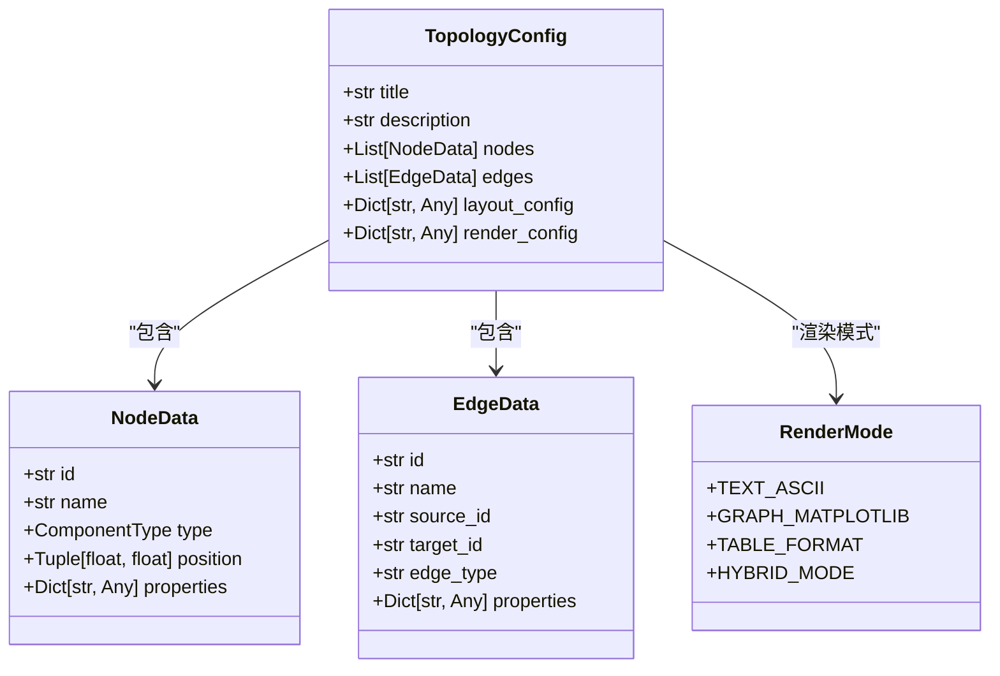
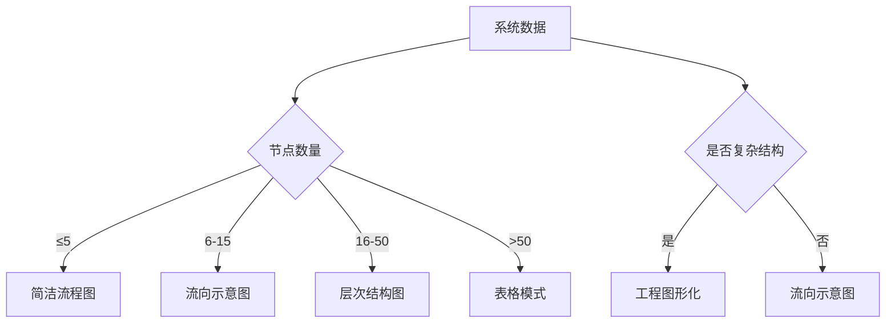
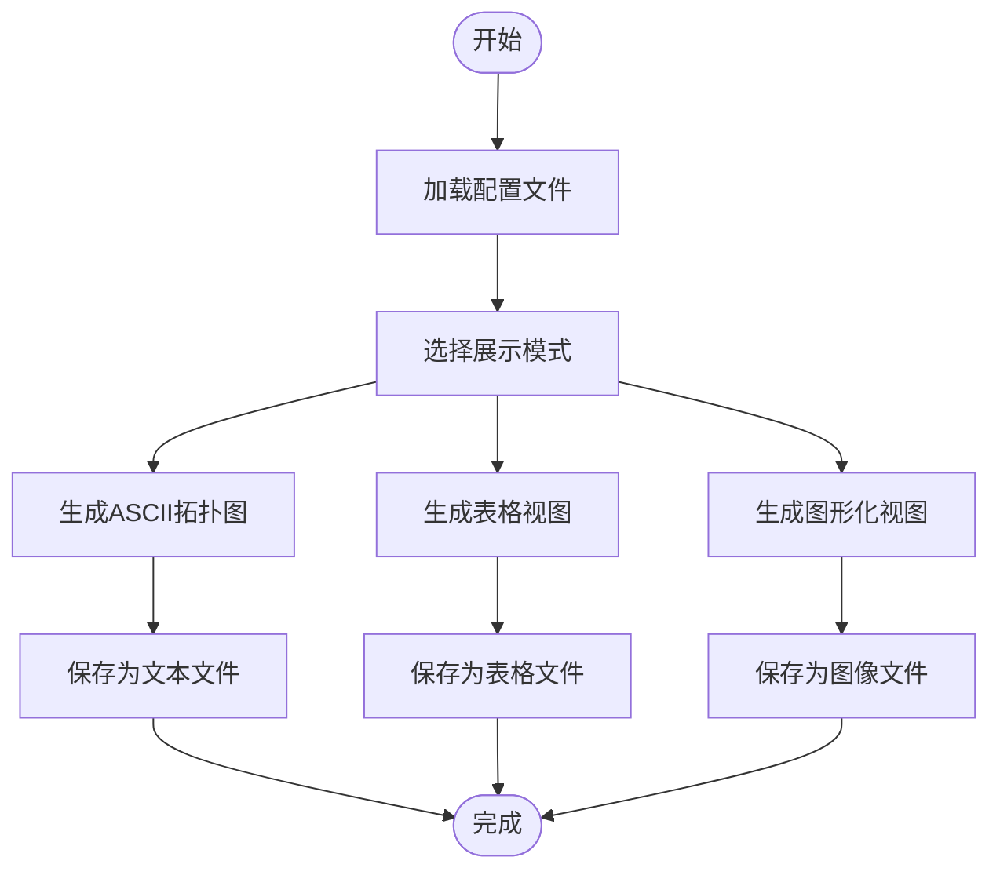
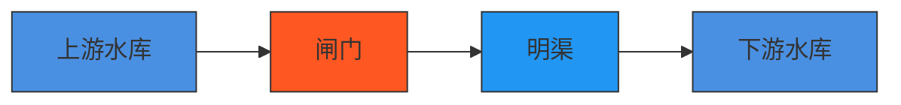
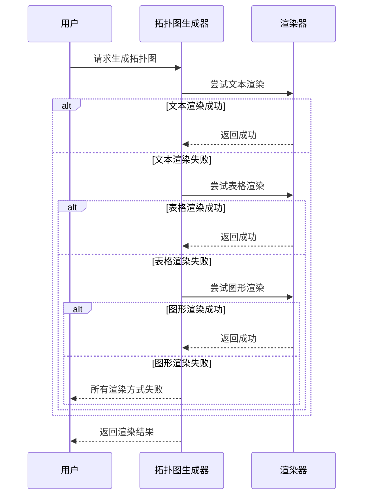

# 拓扑图系统示例

<cite>
**本文档引用文件**   
- [topology_generator.py](file://waternet/visualization/topology_generator.py)
- [config_driven_visualizer.py](file://waternet/visualization/config_driven_visualizer.py)
- [text_ascii_renderer.py](file://waternet/visualization/text_ascii_renderer.py)
- [table_renderer.py](file://waternet/visualization/table_renderer.py)
- [visualization_templates.yaml](file://configs/visualization_templates.yaml)
- [final_topology_demo.py](file://examples/final_topology_demo.py)
- [multi_topology_demo.py](file://examples/multi_topology_demo.py)
- [config_driven_reservoir_gate_system.py](file://examples/config_driven_reservoir_gate_system.py)
- [WaterNet拓扑图系统接口文档.md](file://WaterNet拓扑图系统接口文档.md)
- [WaterNet拓扑图代码示例文档.md](file://WaterNet拓扑图代码示例文档.md)
</cite>

## 目录
1. [引言](#引言)
2. [配置驱动的拓扑图生成](#配置驱动的拓扑图生成)
3. [多重拓扑图展示方式](#多重拓扑图展示方式)
4. [多格式输出演示](#多格式输出演示)
5. [工程案例研究](#工程案例研究)
6. [错误处理与可靠性](#错误处理与可靠性)
7. [总结](#总结)

## 引言
本文档旨在为拓扑图系统提供全面的示例，涵盖从基础使用到高级工程应用的各个方面。系统支持多种可视化方式，包括文本ASCII艺术风格、表格模式和图形化模式，并具备自动降级策略以确保可靠性。通过配置文件驱动，用户可以灵活定制拓扑图的展示方式和详细程度。

## 配置驱动的拓扑图生成
拓扑图系统支持通过YAML或JSON配置文件驱动生成，允许用户定义系统结构、组件属性和可视化参数。配置文件包含系统标题、节点、边和渲染配置等信息。

**图源**
- [topology_generator.py](file://waternet/visualization/topology_generator.py#L27-L43)

**节源**
- [topology_generator.py](file://waternet/visualization/topology_generator.py#L188-L285)

## 多重拓扑图展示方式
系统提供多种拓扑图展示方式，以适应不同场景和用户需求。包括简洁流程图、流向示意图、层次结构图、网络拓扑图和表格模式等。

**图源**
- [visualization_templates.yaml](file://configs/visualization_templates.yaml#L100-L130)

**节源**
- [multi_topology_demo.py](file://examples/multi_topology_demo.py#L358-L394)

## 多格式输出演示
系统支持多种输出格式，包括ASCII艺术文本、表格、图形和交互式HTML。用户可以根据需要选择最适合的输出方式。

**图源**
- [config_driven_visualizer.py](file://waternet/visualization/config_driven_visualizer.py#L30-L352)

**节源**
- [config_driven_visualizer.py](file://waternet/visualization/config_driven_visualizer.py#L30-L352)

## 工程案例研究
以水库-闸门-明渠系统为例，展示如何使用拓扑图系统进行工程分析。系统通过配置文件定义组件和连接关系，并生成相应的拓扑图。

**图源**
- [config_driven_reservoir_gate_system.py](file://examples/config_driven_reservoir_gate_system.py#L0-L438)

**节源**
- [config_driven_reservoir_gate_system.py](file://examples/config_driven_reservoir_gate_system.py#L0-L438)

## 错误处理与可靠性
系统具备完善的错误处理机制，确保在渲染失败时能够自动降级到其他可用方式。渲染器会检查环境支持情况，并在失败时记录错误信息。

**图源**
- [topology_generator.py](file://waternet/visualization/topology_generator.py#L188-L285)

**节源**
- [topology_generator.py](file://waternet/visualization/topology_generator.py#L188-L285)

## 总结
拓扑图系统提供了灵活、可靠的可视化解决方案，支持多种展示方式和输出格式。通过配置文件驱动，用户可以轻松定制拓扑图的外观和内容。系统具备自动降级策略，确保在各种环境下都能生成有效的拓扑图。

**节源**
- [final_topology_demo.py](file://examples/final_topology_demo.py#L200-L250)