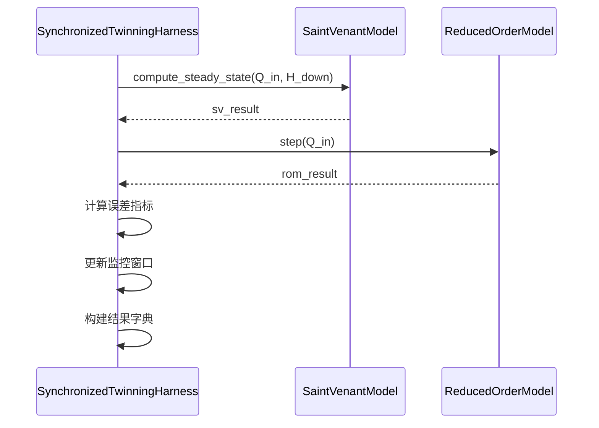
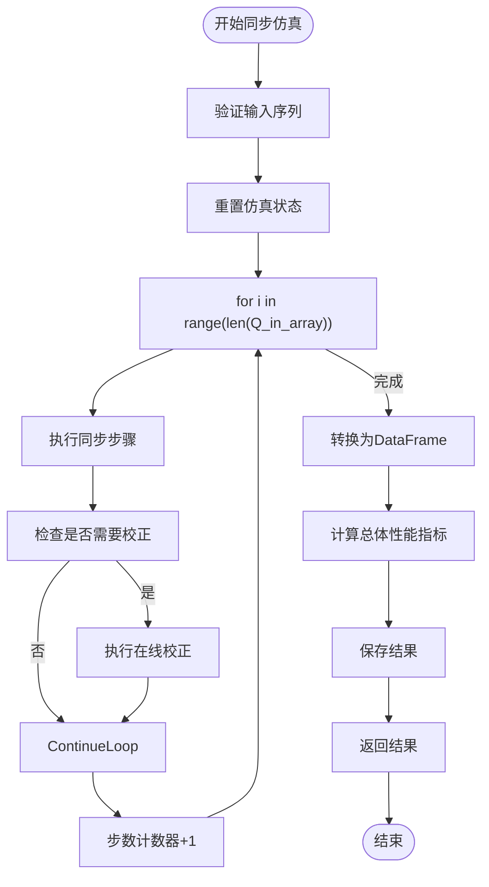
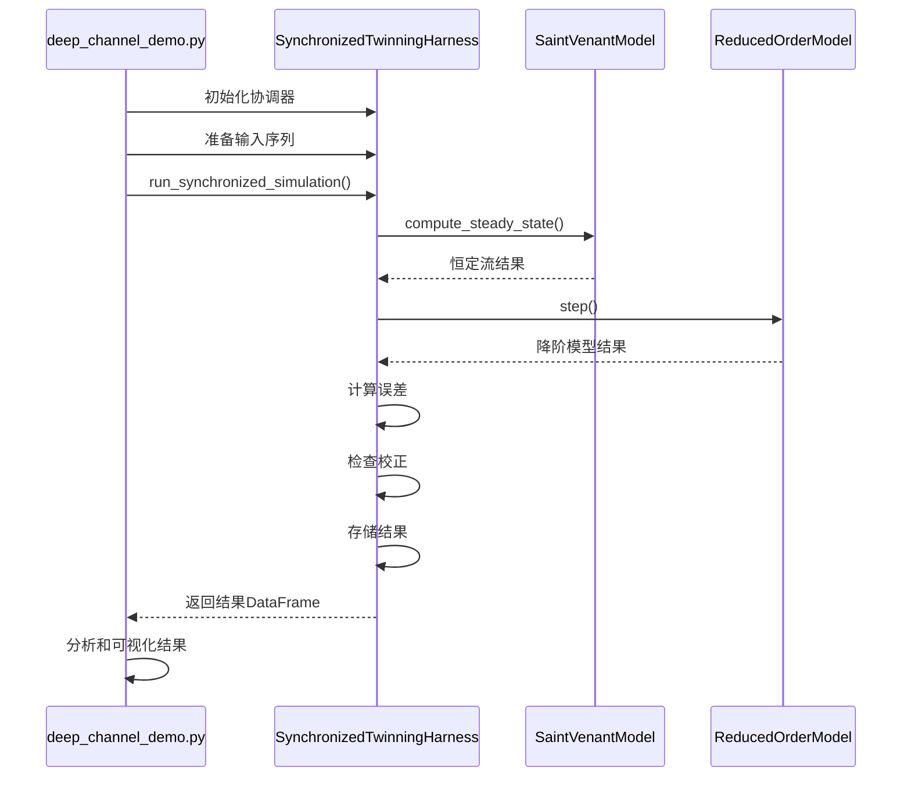

# 同步仿真机制

<cite>
**本文档引用文件**   
- [SynchronizedTwinningHarness](file://waternet/coordination/twinning_harness.py)
- [deep_channel_demo.py](file://examples/advanced/deep_channel_demo.py)
- [SaintVenantModel](file://waternet/models/saint_venant.py)
- [IntegralDelayZeroModel](file://waternet/models/lumped_models.py)
- [EnhancedTwinningCoordinator](file://tests/deep_channel/twin_coordinator.py)
</cite>

## 目录
1. [引言](#引言)
2. [核心组件分析](#核心组件分析)
3. [_run_synchronized_step方法详解](#_run_synchronized_step方法详解)
4. [run_synchronized_simulation主控循环设计](#run_synchronized_simulation主控循环设计)
5. [多模型协同仿真工作流](#多模型协同仿真工作流)
6. [性能与稳定性分析](#性能与稳定性分析)
7. [结论](#结论)

## 引言
同步仿真机制是数字孪生系统的核心功能，通过协调精细化物理模型与降阶模型的并行计算，实现高效、准确的水力系统仿真。本文档详细阐述SynchronizedTwinningHarness中同步仿真机制的实现原理，重点分析_run_synchronized_step方法如何协调圣维南模型与降阶模型的计算流程，以及run_synchronized_simulation主控循环的设计逻辑。结合deep_channel_demo.py中的实际调用示例，展示多模型协同仿真的完整工作流，并讨论在不同时间步长和输入序列长度下的性能表现与数值稳定性。

## 核心组件分析
同步仿真机制的核心是SynchronizedTwinningHarness类，它作为协调器管理圣维南模型（精细化物理模型）与降阶模型（如IDZ模型）的同步运行。该类通过初始化方法配置两个模型实例、校正间隔和误差阈值，并创建参数估计器用于在线校正。

**Section sources**
- [SynchronizedTwinningHarness](file://waternet/coordination/twinning_harness.py#L27-L488)

## _run_synchronized_step方法详解
_run_synchronized_step方法是同步仿真机制的核心，负责协调圣维南模型与降阶模型的并行计算。该方法在每个时间步执行，确保两个模型的同步性。

### 时间步同步与输入数据传递
方法接收当前时间步的入流量Q_in、下游水位H_down、时间步长dt和时间步索引step_index作为输入。这些输入数据同时传递给两个模型，确保它们在相同条件下进行计算。

### 圣维南模型计算
圣维南模型通过compute_steady_state方法计算恒定流水面线。该方法基于能量方程和曼宁公式，从下游向上游逐段计算水位。计算结果包括各断面水位和总蓄水量。为保证数值稳定性，方法包含异常处理机制，当计算失败时使用默认值。

### 降阶模型计算
降阶模型通过step方法推进一个时间步。以IDZ模型为例，其计算过程包括：计算相对于平衡点的流量扰动，对每个传递函数进行延迟处理和响应计算，最后通过传递函数矩阵乘法得到总输出。该过程考虑了上下游节点间的完整耦合关系。

### 状态变量更新
两个模型的计算结果用于更新各自的物理状态。圣维南模型更新各断面水位和蓄水量，而降阶模型通过_update_physical_states方法更新蓄水量、水位和出流量。状态更新考虑了平均入流和出流的影响。

### 误差计算流程
计算两个模型输出的差异，包括流量误差error_Q、水位误差error_H和相对误差relative_error_Q。这些误差指标用于监控仿真精度，并存储在_recent_errors列表中，为后续的在线校正提供依据。

**Diagram sources**
- [SynchronizedTwinningHarness](file://waternet/coordination/twinning_harness.py#L218-L289)

**Section sources**
- [SynchronizedTwinningHarness](file://waternet/coordination/twinning_harness.py#L218-L289)
- [SaintVenantModel](file://waternet/models/saint_venant.py#L300-L400)
- [IntegralDelayZeroModel](file://waternet/models/lumped_models.py#L900-L950)

## run_synchronized_simulation主控循环设计
run_synchronized_simulation方法是同步仿真的主控循环，负责管理整个仿真过程。

### 主控循环逻辑
方法首先验证输入序列的长度匹配性，然后重置仿真状态。主循环遍历输入序列的每个时间步，调用_synchronized_step方法执行同步计算，并将结果存储在results列表中。循环中还包含在线校正的检查和执行逻辑。

### 在线校正机制
校正机制由_should_perform_correction方法控制，基于三个条件：达到校正间隔、误差超过阈值、有足够的数据进行校正。当条件满足时，调用_perform_online_correction方法执行校正，使用最近的仿真结果进行参数辨识和更新。

### 仿真结果收集与格式化输出
仿真结束后，将results列表转换为pandas DataFrame格式，便于数据分析和可视化。通过_compute_overall_metrics方法计算总体性能指标，包括RMSE、相关系数、平均相对误差和最大误差。最终结果以DataFrame形式返回，并保存到sync_results列表中。

**Diagram sources**
- [SynchronizedTwinningHarness](file://waternet/coordination/twinning_harness.py#L98-L161)
- [SynchronizedTwinningHarness](file://waternet/coordination/twinning_harness.py#L429-L457)

**Section sources**
- [SynchronizedTwinningHarness](file://waternet/coordination/twinning_harness.py#L98-L161)
- [SynchronizedTwinningHarness](file://waternet/coordination/twinning_harness.py#L316-L373)
- [SynchronizedTwinningHarness](file://waternet/coordination/twinning_harness.py#L429-L457)

## 多模型协同仿真工作流
deep_channel_demo.py中的实际调用示例展示了多模型协同仿真的完整工作流。

### 模型初始化
首先创建圣维南模型和降阶模型实例，配置必要的参数如时间步长、初始蓄水量和物理关系函数。然后初始化SynchronizedTwinningHarness协调器，传入两个模型实例。

### 输入序列准备
准备入流时间序列Q_in_series和下游水位序列H_down_series。这些序列可以是实测数据或设计工况，长度必须相等。

### 仿真执行
调用run_synchronized_simulation方法，传入输入序列、时间步长和校正配置。方法返回包含所有仿真结果的DataFrame。

### 结果分析
对仿真结果进行分析，包括性能指标计算、误差分析和可视化。通过get_performance_summary方法获取性能摘要，评估仿真精度和校正效果。

**Diagram sources**
- [deep_channel_demo.py](file://examples/advanced/deep_channel_demo.py#L150-L250)

**Section sources**
- [deep_channel_demo.py](file://examples/advanced/deep_channel_demo.py#L150-L250)

## 性能与稳定性分析
同步仿真机制在不同时间步长和输入序列长度下表现出良好的性能和数值稳定性。

### 时间步长影响
较小的时间步长可以提高仿真精度，但会增加计算时间。较大的时间步长虽然计算效率高，但可能导致数值不稳定。建议根据具体应用需求选择合适的时间步长，通常在10-60秒之间。

### 输入序列长度影响
较长的输入序列可以提供更全面的系统响应信息，有利于参数辨识和校正。但过长的序列会增加内存消耗和计算时间。建议根据仿真目标合理设置序列长度。

### 数值稳定性
通过异常处理机制和数值保护措施（如clip函数）确保计算的稳定性。当模型计算失败时，使用默认值继续仿真，避免程序中断。

### 性能优化
通过向量化计算和高效的数据结构（如numpy数组和pandas DataFrame）提高计算效率。在线校正机制通过限制校正频率和使用最近的仿真结果，平衡了精度和计算开销。

**Section sources**
- [SynchronizedTwinningHarness](file://waternet/coordination/twinning_harness.py#L27-L488)
- [deep_channel_demo.py](file://examples/advanced/deep_channel_demo.py#L150-L250)

## 结论
SynchronizedTwinningHarness中的同步仿真机制通过精心设计的_run_synchronized_step方法和run_synchronized_simulation主控循环，实现了圣维南模型与降阶模型的高效协同仿真。该机制不仅保证了两个模型在时间步上的同步性，还通过在线校正机制持续优化降阶模型的参数，提高了仿真精度。结合deep_channel_demo.py中的实际调用示例，展示了多模型协同仿真的完整工作流，为水力系统的数字孪生应用提供了可靠的技术支持。在不同时间步长和输入序列长度下，该机制表现出良好的性能和数值稳定性，适用于各种复杂的水力仿真场景。