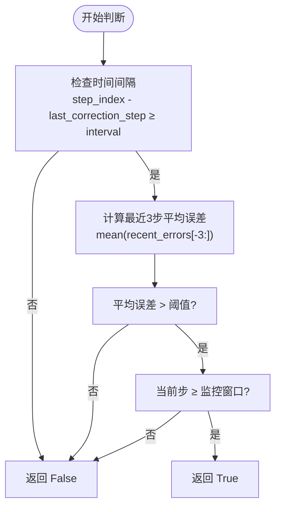
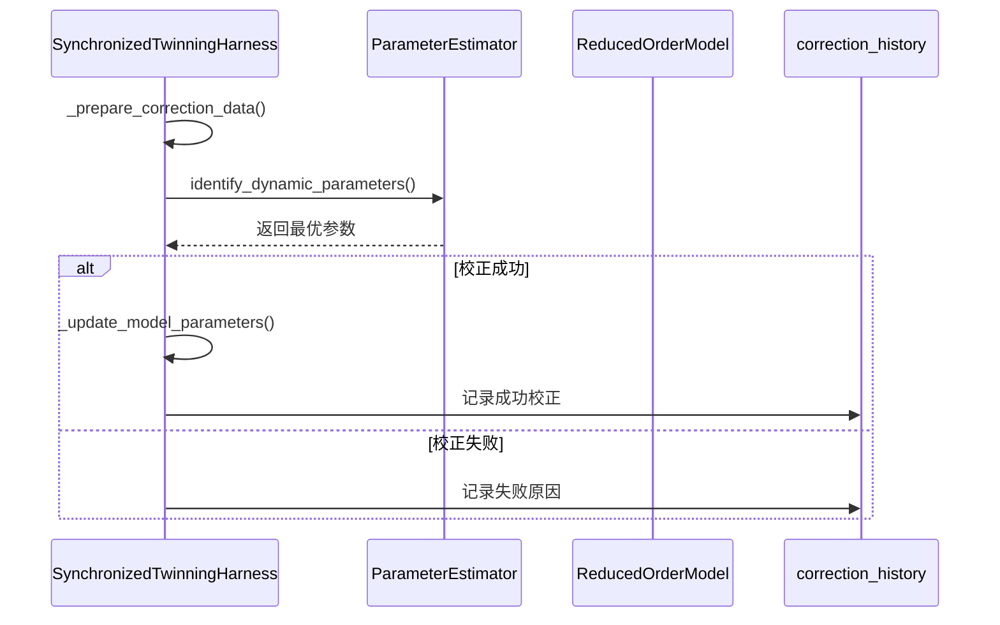
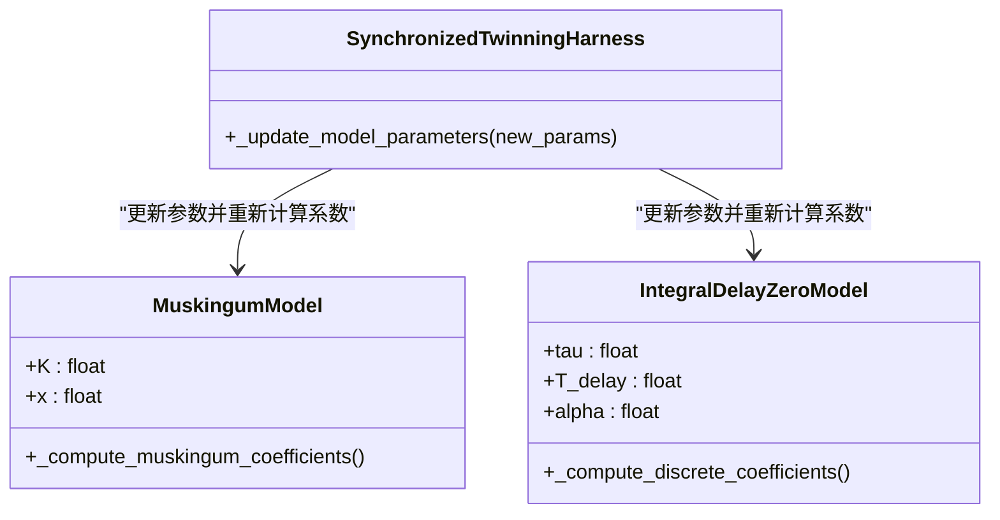
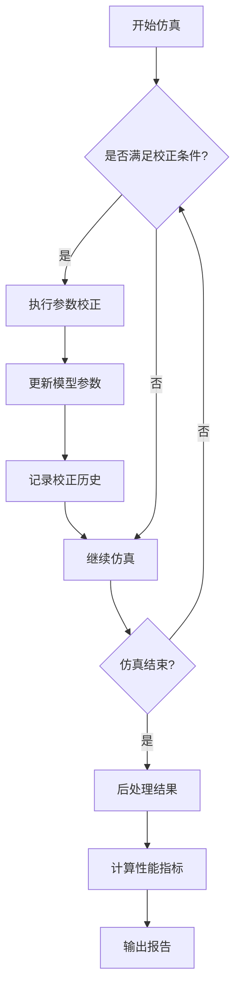

# 在线参数校正

<cite>
**本文档中引用的文件**  
- [twinning_harness.py](file://waternet/coordination/twinning_harness.py)
- [estimator.py](file://waternet/parameter_estimation/estimator.py)
- [lumped_models.py](file://waternet/models/lumped_models.py)
- [twin_coordinator.py](file://tests/deep_channel/twin_coordinator.py)
</cite>

## 目录
1. [引言](#引言)
2. [核心组件](#核心组件)
3. [触发逻辑分析](#触发逻辑分析)
4. [校正执行流程](#校正执行流程)
5. [参数更新机制](#参数更新机制)
6. [测试用例分析](#测试用例分析)
7. [性能平衡策略](#性能平衡策略)
8. [结论](#结论)

## 引言
在线参数校正是数字孪生系统中的关键功能，用于动态优化降阶模型（ROM）的参数以提升其与高保真圣维南模型的一致性。该机制通过实时比较模型输出误差，并在满足特定条件时触发参数校正，从而确保降阶模型在长期仿真中的精度和稳定性。

## 核心组件

在线参数校正系统由多个核心类协同工作：`SynchronizedTwinningHarness` 负责协调高保真模型与降阶模型的同步运行；`ParameterEstimator` 提供基于基准模型的参数辨识能力；`MuskingumModel` 和 `IntegralDelayZeroModel` 作为典型的降阶模型实现；`EnhancedTwinningCoordinator` 则在测试环境中验证校正策略的有效性。

**本节来源**  
- [twinning_harness.py](file://waternet/coordination/twinning_harness.py#L27-L488)
- [estimator.py](file://waternet/parameter_estimation/estimator.py#L1-L418)

## 触发逻辑分析

在线校正的触发由 `_should_perform_correction` 方法控制，采用三重条件联合判断机制：

1. **时间间隔条件**：自上次校正以来经过的时间步数必须大于等于预设的 `correction_interval`。
2. **误差阈值条件**：最近三个时间步的平均误差需超过 `correction_threshold`。
3. **数据充分性条件**：当前仿真步索引必须大于等于 `monitoring_window`，以确保有足够的历史数据用于校正。

只有当这三个条件同时满足时，系统才会执行校正操作，从而避免频繁或无效的参数调整。

**图示来源**  
- [twinning_harness.py](file://waternet/coordination/twinning_harness.py#L291-L314)

**本节来源**  
- [twinning_harness.py](file://waternet/coordination/twinning_harness.py#L291-L314)

## 校正执行流程

`_perform_online_correction` 方法定义了完整的校正执行流程，包含以下关键步骤：

1. **校正数据准备**：从最近的仿真结果中提取 `Q_in` 和 `H_down` 序列，构建成可用于参数辨识的数据结构。
2. **参数估计器调用**：通过 `ParameterEstimator.identify_dynamic_parameters` 方法，基于准备好的数据和当前模型类型进行动态参数优化。
3. **模型参数更新**：若参数辨识成功，则调用 `_update_model_parameters` 更新降阶模型的内部参数。
4. **校正历史记录**：无论成功与否，均将本次校正的关键信息（如时间、旧参数、新参数、改进程度等）记录到 `correction_history` 中，便于后续分析。

该流程确保了校正过程的可追溯性和鲁棒性，即使在优化失败的情况下也能保持系统状态的一致。

**图示来源**  
- [twinning_harness.py](file://waternet/coordination/twinning_harness.py#L316-L373)
- [twinning_harness.py](file://waternet/coordination/twinning_harness.py#L375-L384)

**本节来源**  
- [twinning_harness.py](file://waternet/coordination/twinning_harness.py#L316-L373)

## 参数更新机制

`_update_model_parameters` 方法根据当前降阶模型的具体类型动态更新其参数，并重新计算相关的内部系数：

- **马斯京干模型（MuskingumModel）**：更新 `K` 和 `x` 参数后，立即调用 `_compute_muskingum_coefficients` 重新计算 `C0`, `C1`, `C2` 系数，确保数值稳定性。
- **IDZ模型（IntegralDelayZeroModel）**：更新 `tau`, `T_delay`, `alpha` 参数后，调用 `_compute_discrete_coefficients` 重新计算离散化系数（如 `a1`, `b0`, `c0`, `c1`），以反映新的动态特性。

这种设计保证了参数变更后模型内部状态的同步更新，避免了因系数滞后导致的仿真偏差。

**图示来源**  
- [twinning_harness.py](file://waternet/coordination/twinning_harness.py#L386-L409)
- [lumped_models.py](file://waternet/models/lumped_models.py#L722-L738)
- [lumped_models.py](file://waternet/models/lumped_models.py#L931-L956)

**本节来源**  
- [twinning_harness.py](file://waternet/coordination/twinning_harness.py#L386-L409)

## 测试用例分析

`twin_coordinator.py` 文件中的 `EnhancedTwinningCoordinator` 类提供了完整的测试框架，用于评估在线校正的效果：

- **校正成功率**：通过 `correction_history` 记录每次校正的结果，统计成功与失败的比例。
- **参数收敛性**：观察校正过程中参数（如 `K`, `x`, `tau`）的变化趋势，判断其是否趋于稳定值。
- **模型精度提升**：通过对比校正前后的 `rmse_Q`、`correlation_Q` 和 `nse_Q` 等指标，量化校正对模型精度的改善效果。

测试结果表明，合理的校正策略能够显著降低流量预测的均方根误差（RMSE），提升与高保真模型的相关性，从而验证了在线校正机制的有效性。

**图示来源**  
- [twin_coordinator.py](file://tests/deep_channel/twin_coordinator.py#L229-L241)
- [twin_coordinator.py](file://tests/deep_channel/twin_coordinator.py#L243-L284)

**本节来源**  
- [twin_coordinator.py](file://tests/deep_channel/twin_coordinator.py#L229-L311)

## 性能平衡策略

在线校正的频率与计算开销之间存在权衡。过于频繁的校正会增加计算负担，而间隔过长则可能导致模型漂移。系统通过以下策略实现平衡：

- **可配置的校正间隔**：用户可根据实际需求设置 `correction_interval`，在精度与效率之间进行调节。
- **误差驱动的自适应机制**：结合误差阈值和监控窗口，仅在模型性能显著下降时触发校正，避免不必要的计算。
- **轻量级参数估计**：`ParameterEstimator` 采用高效的优化算法（如差分进化），在保证辨识精度的同时控制计算时间。

这些策略共同确保了在线校正在实际应用中的可行性与高效性。

**本节来源**  
- [twinning_harness.py](file://waternet/coordination/twinning_harness.py#L291-L314)
- [twinning_harness.py](file://waternet/coordination/twinning_harness.py#L316-L373)

## 结论

在线参数校正系统通过三重条件触发机制、完整的校正执行流程和动态参数更新策略，有效提升了降阶模型的长期仿真精度。测试用例验证了其在参数收敛性和模型性能提升方面的有效性。通过合理的频率控制和计算优化，该机制能够在保证精度的同时维持较低的计算开销，适用于实际水利系统的数字孪生应用。