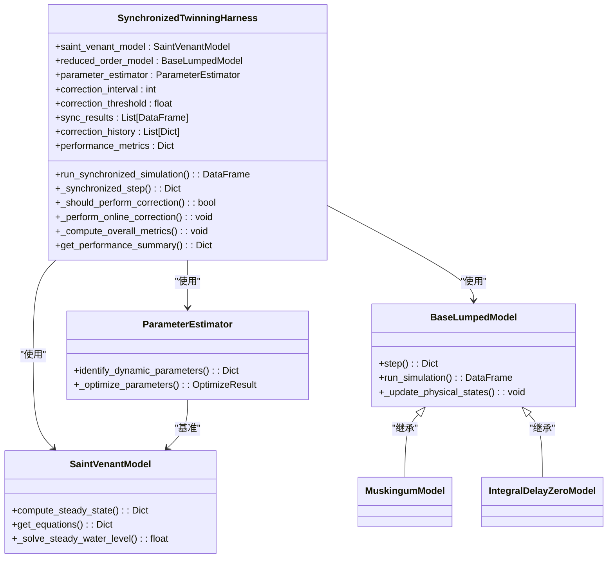
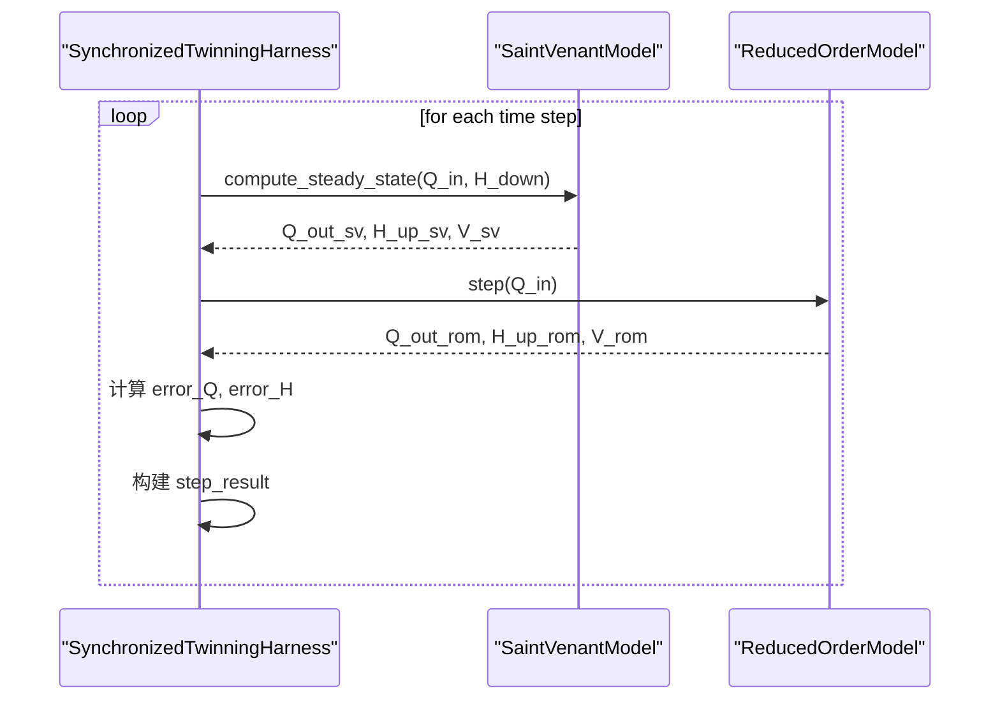
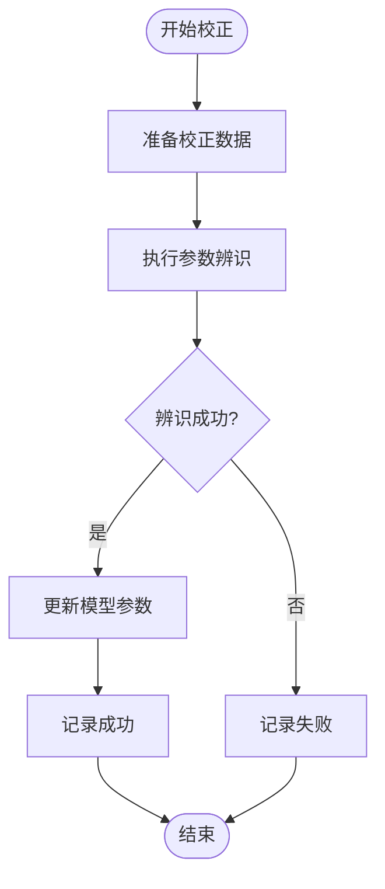
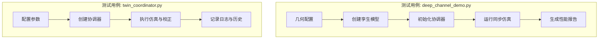

# 数字孪生协调

<cite>
**本文档引用的文件**   
- [twinning_harness.py](file://waternet/coordination/twinning_harness.py)
- [deep_channel_demo.py](file://examples/advanced/deep_channel_demo.py)
- [twin_coordinator.py](file://tests/deep_channel/twin_coordinator.py)
- [saint_venant.py](file://waternet/models/saint_venant.py)
- [lumped_models.py](file://waternet/models/lumped_models.py)
- [estimator.py](file://waternet/parameter_estimation/estimator.py)
- [enhanced_models.py](file://tests/deep_channel/enhanced_models.py)
</cite>

## 目录
1. [引言](#引言)
2. [核心架构与设计](#核心架构与设计)
3. [并行仿真与状态同步机制](#并行仿真与状态同步机制)
4. [在线参数校正系统](#在线参数校正系统)
5. [性能监控与误差反馈](#性能监控与误差反馈)
6. [实际应用案例分析](#实际应用案例分析)
7. [系统权衡与优化](#系统权衡与优化)
8. [结论](#结论)

## 引言

数字孪生技术通过构建物理系统的虚拟映射，实现了对复杂工程过程的实时仿真与预测。本技术文档详细阐述了`SynchronizedTwinningHarness`（同步孪生协调器）的设计与实现，该协调器是WaterNet数字孪生系统的核心组件。它通过精细化物理模型（如圣维南模型）与快速降阶模型（如马斯京干模型、IDZ模型）的协同工作，解决了高精度与高效率之间的矛盾。协调器不仅实现了两种模型的并行仿真与状态同步，还集成了在线参数校正、性能监控与自适应优化等高级功能，确保了数字孪生体能够持续、准确地反映物理系统的动态行为。

## 核心架构与设计

同步孪生协调器采用模块化、分层的设计理念，其核心架构由多个关键组件构成，实现了关注点分离和高内聚低耦合。

**图源**
- [twinning_harness.py](file://waternet/coordination/twinning_harness.py#L27-L488)
- [saint_venant.py](file://waternet/models/saint_venant.py#L32-L646)
- [lumped_models.py](file://waternet/models/lumped_models.py#L30-L515)
- [estimator.py](file://waternet/parameter_estimation/estimator.py#L24-L418)

**本节来源**
- [twinning_harness.py](file://waternet/coordination/twinning_harness.py#L27-L488)

## 并行仿真与状态同步机制

协调器的核心功能是管理精细化模型与降阶模型的并行仿真，并确保两者状态的实时同步。这一过程通过`run_synchronized_simulation`方法驱动，其内部的`_synchronized_step`方法是实现同步的关键。

### 仿真流程

1.  **精细化模型计算**：协调器调用`SaintVenantModel`的`compute_steady_state`方法，基于当前的入流`Q_in`和下游水位`H_down`，计算出精细化的物理状态，包括上游水位`H_up_sv`和总蓄水量`V_sv`。该模型求解完整的圣维南方程组，精度高但计算成本大。
2.  **降阶模型计算**：同时，协调器调用`BaseLumpedModel`的`step`方法，利用简化的物理关系（如马斯京干方程或IDZ传递函数）进行快速计算，得到降阶模型的输出`Q_out_rom`和`H_up_rom`。
3.  **状态同步与误差计算**：将两个模型的输出结果进行对比，计算流量误差`error_Q`和水位误差`error_H`。这些误差指标是评估模型同步精度和触发后续校正的直接依据。
4.  **结果整合**：将两个模型的计算结果、误差指标以及时间步信息整合到一个结果字典中，形成单步的同步仿真输出。

**图源**
- [twinning_harness.py](file://waternet/coordination/twinning_harness.py#L98-L161)
- [twinning_harness.py](file://waternet/coordination/twinning_harness.py#L218-L289)

**本节来源**
- [twinning_harness.py](file://waternet/coordination/twinning_harness.py#L98-L289)

## 在线参数校正系统

为了应对物理系统参数随时间变化或初始标定不准确的问题，协调器集成了在线参数校正功能。该系统是一个闭环反馈机制，能够根据实时仿真误差动态调整降阶模型的参数。

### 触发条件

校正并非在每个时间步都执行，而是由`_should_perform_correction`方法根据三个条件共同判断：
1.  **时间间隔**：自上次校正以来，已达到预设的`correction_interval`（例如10步）。
2.  **误差阈值**：最近`monitoring_window`（例如20步）内的平均流量误差超过了`correction_threshold`（例如0.1 m³/s）。
3.  **数据充足**：当前仿真步数已超过`monitoring_window`，以确保有足够的数据用于参数辨识。

### 执行流程

当所有触发条件满足时，`_perform_online_correction`方法被调用，执行以下流程：
1.  **数据准备**：从最近的仿真结果中提取`Q_in`和`H_down`序列，作为校正所需的数据。
2.  **参数辨识**：调用`ParameterEstimator`的`identify_dynamic_parameters`方法。该方法以精细化模型的输出作为“基准真值”，通过优化算法（如差分进化）搜索降阶模型的最佳参数，使得降阶模型的仿真结果与基准真值的误差最小化。
3.  **参数更新**：将辨识出的最优参数通过`_update_model_parameters`方法应用到降阶模型上，并重新计算相关的内部系数（如马斯京干系数）。
4.  **历史记录**：将本次校正的步骤、时间、新旧参数及效果记录到`correction_history`中，便于后续分析。

**图源**
- [twinning_harness.py](file://waternet/coordination/twinning_harness.py#L291-L373)
- [twinning_harness.py](file://waternet/coordination/twinning_harness.py#L386-L409)
- [estimator.py](file://waternet/parameter_estimation/estimator.py#L24-L418)

**本节来源**
- [twinning_harness.py](file://waternet/coordination/twinning_harness.py#L291-L409)

## 性能监控与误差反馈

协调器内置了全面的性能监控体系，用于量化仿真质量并为校正系统提供反馈。

### 指标计算

在仿真结束后，`_compute_overall_metrics`方法会计算一系列关键性能指标：
-   **RMSE (均方根误差)**：衡量流量预测的绝对误差大小。
-   **相关系数**：衡量降阶模型输出与精细化模型输出的线性相关性。
-   **平均相对误差**：以百分比形式表示的平均误差水平。
-   **最大误差**：仿真过程中出现的最大瞬时误差。

这些指标被汇总到`performance_metrics`字典中，通过`get_performance_summary`方法对外提供。

### 误差反馈控制逻辑

性能监控与校正系统形成了一个闭环控制回路：
1.  **误差检测**：在每个时间步，`_synchronized_step`方法计算瞬时误差，并将其存入`_recent_errors`队列。
2.  **误差评估**：`_should_perform_correction`方法定期评估`_recent_errors`队列中的平均误差，判断是否超过阈值。
3.  **控制执行**：一旦误差超标，触发校正流程，通过调整模型参数来“纠正”系统偏差。
4.  **效果验证**：校正后，新的仿真结果会重新计算误差，形成新的反馈，从而实现系统的自适应和持续优化。

这种设计确保了数字孪生体能够“学习”并适应物理系统的变化，维持长期的高仿真精度。

**本节来源**
- [twinning_harness.py](file://waternet/coordination/twinning_harness.py#L429-L476)

## 实际应用案例分析

`deep_channel_demo.py`和`twin_coordinator.py`中的测试用例展示了协调器的实际应用。

### `deep_channel_demo.py` 案例

该脚本演示了从几何配置、模型创建到数字孪生仿真的完整流程。它首先配置了一个五断面明渠的几何参数，然后创建了`EnhancedMuskingumModel`和`IntegralDelayZeroModel`作为孪生模型，并通过`EnhancedTwinningCoordinator`协调它们与精细化模型的同步仿真。脚本输出了详细的性能指标，如流量RMSE、相关系数和Nash-Sutcliffe效率系数（NSE），并生成了性能总结报告，直观地展示了数字孪生系统的精度与效率优势。

### `twin_coordinator.py` 案例

该文件中的`EnhancedTwinningCoordinator`类是对基础协调器的扩展，它提供了更丰富的配置选项和日志记录功能。其`run_synchronized_simulation`方法的执行流程与基础协调器类似，但`_execute_correction`方法在测试中采用了简化的随机参数调整策略，用于验证校正流程的可行性。该案例强调了协调器的可扩展性和模块化设计。

**本节来源**
- [deep_channel_demo.py](file://examples/advanced/deep_channel_demo.py#L0-L342)
- [twin_coordinator.py](file://tests/deep_channel/twin_coordinator.py#L42-L311)

## 系统权衡与优化

在实际应用中，需要在系统延迟、数据同步频率与校正精度之间进行权衡。

-   **系统延迟**：主要由精细化模型的计算时间决定。虽然降阶模型计算极快，但协调器的总体延迟受限于最慢的组件。优化策略包括使用更高效的求解器或在非关键时段降低精细化模型的计算频率。
-   **数据同步频率**：即`dt`（时间步长）。较高的同步频率（小`dt`）能更精确地捕捉系统动态，但会增加计算负担。较低的频率则可能丢失高频细节。选择应基于系统的时间尺度和精度要求。
-   **校正精度**：由`correction_threshold`和`monitoring_window`控制。过低的阈值会导致频繁校正，增加计算开销；过高的阈值则可能容忍较大的误差。较大的监控窗口能提供更稳定的误差评估，但响应较慢。`correction_interval`则直接控制了校正的频率。

通过合理配置这些参数，可以在保证足够精度的前提下，实现系统性能的最优化。

**本节来源**
- [twinning_harness.py](file://waternet/coordination/twinning_harness.py#L27-L488)
- [deep_channel_demo.py](file://examples/advanced/deep_channel_demo.py#L0-L342)

## 结论

`SynchronizedTwinningHarness`是一个功能强大且设计精巧的数字孪生协调器。它通过并行仿真机制，巧妙地结合了精细化物理模型的高精度与降阶模型的高效率。其核心的在线参数校正系统，利用精细化模型作为“教师”，持续指导和优化降阶模型这个“学生”，实现了数字孪生体的自适应学习。结合全面的性能监控和误差反馈控制，该协调器能够确保数字孪生系统在长时间运行中保持高保真度。通过`deep_channel_demo.py`等测试用例的验证，该设计在明渠水力仿真等场景中表现出卓越的性能，为构建高效、可靠的数字孪生应用提供了坚实的技术基础。