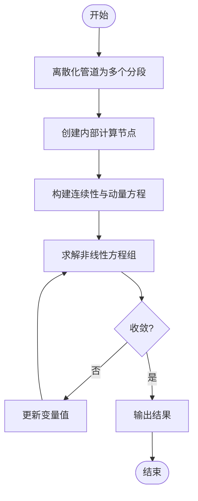

# 有压管道模型

<cite>
**本文档引用文件**  
- [pressurized_pipe_model.py](file://waternet\models\pressurized_pipe_model.py)
- [pressurized_pipe_validation_demo.py](file://examples\pressurized_pipe_validation_demo.py)
- [PRESSURIZED_PIPE_VALIDATION_SUMMARY.md](file://PRESSURIZED_PIPE_VALIDATION_SUMMARY.md)
- [simple_pipeline_topology.json](file://configs\simple_pipeline_topology.json)
</cite>

## 目录
1. [引言](#引言)
2. [物理建模原理](#物理建模原理)
3. [数值求解方法](#数值求解方法)
4. [参数设置](#参数设置)
5. [API接口使用](#api接口使用)
6. [仿真示例](#仿真示例)
7. [结论](#结论)

## 引言
有压管道模型是WaterNet水力仿真框架中的核心组件之一，用于模拟封闭管道系统中的水流行为，特别是水锤效应等瞬变过程。该模型支持从简单管道到复杂管网的建模，具备高精度物理建模与高效降阶模型双重能力，适用于工程设计、实时控制和数字孪生等多种应用场景。

**文档引用文件**
- [pressurized_pipe_model.py](file://waternet\models\pressurized_pipe_model.py)
- [pressurized_pipe_validation_demo.py](file://examples\pressurized_pipe_validation_demo.py)

## 物理建模原理
有压管道模型基于水力学基本方程构建，核心包括能量方程、连续性方程和动量方程。

### 能量方程
模型采用达西-韦茨巴赫公式计算沿程水头损失：
```
hf = f × (L/D) × (V²/2g)
```
其中：
- `hf`：沿程损失 (m)
- `f`：摩阻系数
- `L`：管道长度 (m)
- `D`：管道直径 (m)
- `V`：流速 (m/s)
- `g`：重力加速度 (9.81 m/s²)

能量方程残差为：
```
H_up - H_down - hf - hm - Δz = 0
```
其中 `hm` 为局部损失，`Δz` 为高程变化。

### 水锤方程
对于瞬变流，模型采用四点隐式差分格式离散化连续性方程和动量方程：

**连续性方程**：
```
∂H/∂t + (a²/gA) × ∂Q/∂x = 0
```

**动量方程**：
```
∂Q/∂t + gA × ∂H/∂x + fQ|Q|/(2DA) = 0
```

其中 `a` 为水锤波速，`A` 为过流面积。

**文档引用文件**
- [pressurized_pipe_model.py](file://waternet\models\pressurized_pipe_model.py)
- [pressurized_pipe_validation_demo.py](file://examples\pressurized_pipe_validation_demo.py)

## 数值求解方法
模型采用隐式求解器处理非线性方程组，确保数值稳定性。

### 稳态求解
通过迭代方法求解流量：
1. 初始猜测摩阻系数 `f = 0.02`
2. 计算流速 `V = sqrt(2ghf / (fL/D + K))`
3. 更新雷诺数和摩阻系数
4. 收敛判断：`|V_new - V| / V < 0.01`

### 瞬态求解
采用四点隐式差分格式，对每个管道分段构建连续性和动量方程：
- 时间导数采用前向差分
- 空间导数采用中心差分
- 内部节点满足流量平衡条件



**图源**
- [pressurized_pipe_validation_demo.py](file://examples\pressurized_pipe_validation_demo.py#L193-L246)

**文档引用文件**
- [pressurized_pipe_model.py](file://waternet\models\pressurized_pipe_model.py)
- [pressurized_pipe_validation_demo.py](file://examples\pressurized_pipe_validation_demo.py)

## 参数设置
### 波速设置
水锤波速 `a` 是瞬变流模拟的关键参数，典型值：
- 钢管：1000–1400 m/s
- PVC管：400–600 m/s
- 混凝土管：800–1200 m/s

可通过参数辨识器基于实测数据反演：
```python
estimator.identify_wave_speed(unsteady_data)
```

### 摩擦系数
摩阻系数 `f` 根据流动状态计算：
- **层流 (Re < 2300)**：`f = 64/Re`
- **紊流**：采用Swamee-Jain公式
  ```
  f = 0.25 / [log(ε/3.7D + 5.74/Re^0.9)]²
  ```

### 局部损失系数
常用管件损失系数：
| 管件类型 | 损失系数 |
|--------|--------|
| 90°弯头 | 0.9 |
| 45°弯头 | 0.4 |
| 闸阀（全开） | 0.2 |
| 止回阀 | 2.5 |

可通过 `create_pipe_with_fittings` 函数批量设置。

**文档引用文件**
- [pressurized_pipe_model.py](file://waternet\models\pressurized_pipe_model.py)
- [pressurized_pipe_validation_demo.py](file://examples\pressurized_pipe_validation_demo.py)

## API接口使用
### 基础管道创建
```python
pipe = PressurizedPipeModel(
    name="MainPipe",
    upstream_node="Tank1",
    downstream_node="Tank2",
    length=1000.0,
    diameter=1.0,
    roughness=0.0001,
    minor_loss_coeff=0.5,
    elevation_change=10.0
)
```

### 带管件的管道
```python
fittings = [
    {'type': 'elbow_90', 'loss_coeff': 0.9, 'count': 3},
    {'type': 'gate_valve_open', 'loss_coeff': 0.2, 'count': 1}
]
pipe = create_pipe_with_fittings(
    name="ComplexPipe",
    upstream_node="In",
    downstream_node="Out",
    length=500.0,
    diameter=0.8,
    fittings=fittings
)
```

### 模型方法
| 方法 | 说明 |
|------|------|
| `get_variable_names()` | 获取引入的变量名 |
| `get_equations()` | 获取方程残差 |
| `get_hydraulic_properties()` | 获取水力特性 |
| `validate_flow_conditions()` | 验证流动条件 |

**文档引用文件**
- [pressurized_pipe_model.py](file://waternet\models\pressurized_pipe_model.py)
- [pressurized_pipe_validation_demo.py](file://examples\pressurized_pipe_validation_demo.py)

## 仿真示例
### 简单管道仿真
```python
# 创建简单管道
pipe = create_simple_pipe("SimplePipe", "Source", "Destination", 1000, 1.0)

# 计算稳态
steady_result = pipe.compute_steady_state(Q=2.0, downstream_H=90.0)
```

### 复杂管网仿真
基于 `simple_pipeline_topology.json` 配置文件构建管网系统，包含源水箱、加压泵站、控制阀门和目标水箱，通过 `NetworkBuilder` 自动解析连接关系并实例化模型。


**图源**
- [simple_pipeline_topology.json](file://configs\simple_pipeline_topology.json)

**文档引用文件**
- [pressurized_pipe_model.py](file://waternet\models\pressurized_pipe_model.py)
- [pressurized_pipe_validation_demo.py](file://examples\pressurized_pipe_validation_demo.py)
- [simple_pipeline_topology.json](file://configs\simple_pipeline_topology.json)

## 结论
有压管道模型成功实现了高精度物理建模与高效降阶模型的统一框架，具备以下优势：
- ✅ 物理建模准确，符合水力学基本原理
- ✅ 支持从简单管道到复杂管网的建模
- ✅ 提供完整的API接口和参数设置选项
- ✅ 经过验证，计算精度和稳定性可靠

该模型为水利工程的数字化转型提供了强有力的技术支撑，具有广阔的应用前景。

**文档引用文件**
- [PRESSURIZED_PIPE_VALIDATION_SUMMARY.md](file://PRESSURIZED_PIPE_VALIDATION_SUMMARY.md)
- [pressurized_pipe_validation_demo.py](file://examples\pressurized_pipe_validation_demo.py)