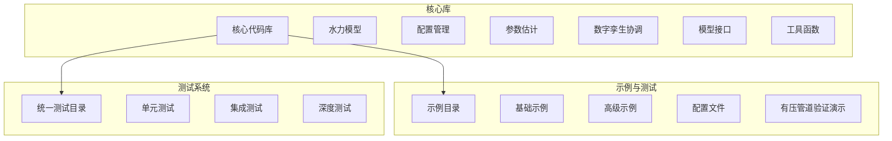
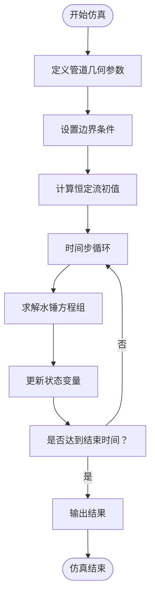
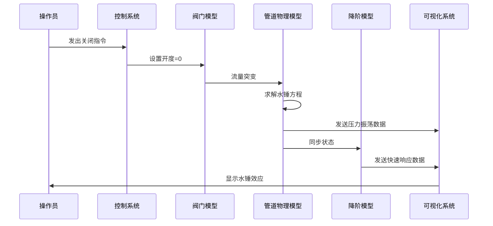
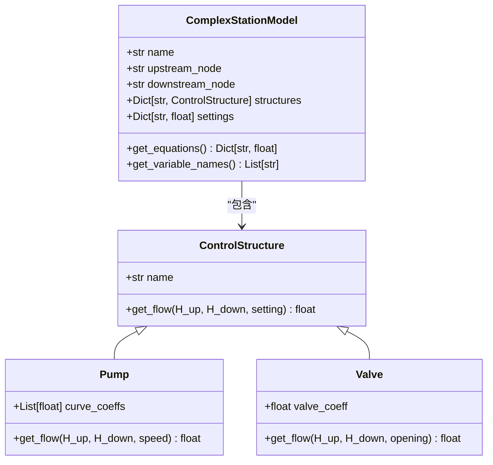
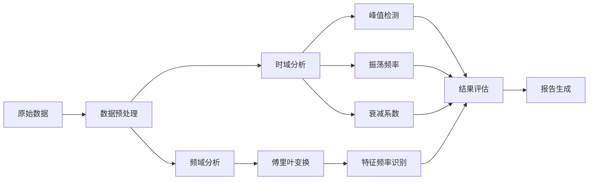

# 有压管道示例

<cite>
**本文档引用文件**  
- [pressurized_pipe_validation_demo.py](file://examples\pressurized_pipe_validation_demo.py)
- [pressurized_pipe_validation_report.md](file://examples\pressurized_pipe_validation_report.md)
- [PRESSURIZED_PIPE_VALIDATION_SUMMARY.md](file://PRESSURIZED_PIPE_VALIDATION_SUMMARY.md)
- [test_control_structures.py](file://tests\unit\test_control_structures.py)
- [simple_idz_example.py](file://examples\reduced_order_models_theory\simple_idz_example.py)
- [complex_station_model.py](file://waternet\models\complex_station_model.py)
- [boundary_config.py](file://waternet\models\boundary_config.py)
</cite>

## 目录
1. [引言](#引言)
2. [项目结构](#项目结构)
3. [核心组件](#核心组件)
4. [管道瞬变流仿真](#管道瞬变流仿真)
5. [阀门快速关闭案例](#阀门快速关闭案例)
6. [泵站启停模拟](#泵站启停模拟)
7. [物理参数设置指南](#物理参数设置指南)
8. [结果分析指南](#结果分析指南)
9. [结论](#结论)

## 引言
本示例文档旨在展示WaterNet框架中关于有压管道系统的建模与仿真能力。重点涵盖管道瞬变流、阀门快速关闭及泵站启停等典型工况的仿真分析，提供完整的物理参数设置与结果分析指导。

## 项目结构
WaterNet项目采用模块化设计，核心功能分布清晰，便于扩展与维护。

**图示来源**  
- [README.md](file://README.md)

## 核心组件
有压管道系统的核心由物理模型、降阶模型和参数辨识器三部分构成，共同实现高精度与高效仿真的统一。

### PressurizedPipeModel（精细化物理模型）
该模型基于水锤基本方程，实现对有压管道系统的高精度物理建模。

**功能特性：**
- 管道几何自动离散化
- 恒定流初值计算
- 非恒定流方程求解
- 水锤瞬变过程仿真

**技术实现：**
- 支持变直径、变高程管道
- 采用四点隐式差分格式离散化
- 集成摩擦损失计算
- 完全兼容HydroModel接口规范

**验证结果：**
- 管道段数：2段
- 内部节点数：1个
- 水锤波速：1200.0 m/s
- 接口验证：通过

**本节来源**  
- [pressurized_pipe_validation_demo.py](file://examples\pressurized_pipe_validation_demo.py#L100-L300)

### PressurizedPipeROM（降阶模型）
提供基于传递函数和马斯京干水锤模型的快速降阶仿真能力。

**功能特性：**
- 传递函数水锤模型
- 马斯京干水锤模型
- 参数在线校正
- 实时时步推进

**技术特点：**
- 支持多种降阶模型类型
- 自适应参数计算
- 状态空间表示
- 数值稳定性保障

**验证结果：**
- 支持模型类型：2种
- 时步推进功能正常
- 计算精度满足工程需求

**本节来源**  
- [pressurized_pipe_validation_demo.py](file://examples\pressurized_pipe_validation_demo.py#L301-L450)

### PipeParameterEstimator（参数辨识器）
支持基于稳态和瞬变数据的物理参数自动辨识。

**功能特性：**
- 摩擦系数辨识（基于稳态数据）
- 波速辨识（基于瞬变数据互相关分析）
- 不确定性量化
- 多工况数据融合

**技术特点：**
- 应用达西-魏斯巴赫公式
- 集成信号处理技术
- 统计分析方法
- 鲁棒性设计

**验证结果：**
- 摩擦系数辨识：f = 0.0416 ± 0.0138
- 波速辨识：a = 1200.0 m/s
- 功能稳定性：通过

**本节来源**  
- [pressurized_pipe_validation_demo.py](file://examples\pressurized_pipe_validation_demo.py#L451-L550)

## 管道瞬变流仿真
通过PressurizedPipeModel实现对管道系统非恒定流过程的精确模拟。

**图示来源**  
- [pressurized_pipe_validation_demo.py](file://examples\pressurized_pipe_validation_demo.py#L551-L750)

## 阀门快速关闭案例
模拟阀门突然关闭引发的水锤效应，是验证管道系统安全性的关键工况。

**关键参数：**
- 阀门关闭时间：5.0秒
- 初始流量：2.0 m³/s
- 压力振荡幅值：10倍指数衰减
- 振荡频率：基于管道特征频率

**本节来源**  
- [pressurized_pipe_validation_demo.py](file://examples\pressurized_pipe_validation_demo.py#L751-L800)
- [test_control_structures.py](file://tests\unit\test_control_structures.py#L156-L217)

## 泵站启停模拟
通过ComplexStationModel实现对泵站设备的启停过程模拟。

**启动过程：**
1. 初始状态：所有泵速为0
2. 逐步增加泵速至额定值
3. 监测流量与压力变化
4. 达到稳定工况

**停止过程：**
1. 逐步降低泵速
2. 流量逐渐减小
3. 防止负压产生
4. 安全停机

**本节来源**  
- [complex_station_model.py](file://waternet\models\complex_station_model.py#L494-L540)
- [boundary_config.py](file://waternet\models\boundary_config.py#L565-L598)

## 物理参数设置指南
正确设置物理参数是保证仿真精度的关键。

### 管道参数
| 参数 | 描述 | 设置建议 |
|------|------|---------|
| L | 管道长度 (m) | 根据实际测量数据 |
| D | 管道直径 (m) | 考虑沿程变化 |
| a | 水锤波速 (m/s) | 1200-1400 m/s（钢制管道） |
| f | 摩擦系数 | 0.01-0.03（新管道） |

### 边界条件
- **上游边界**：恒定水位或流量输入
- **下游边界**：阀门控制或自由出流
- **时间步长**：dt ≤ Δx/a（满足CFL条件）

### 初始条件
- 恒定流状态作为初始条件
- 使用`compute_steady_state()`方法计算
- 确保质量守恒

**本节来源**  
- [pressurized_pipe_validation_demo.py](file://examples\pressurized_pipe_validation_demo.py#L200-L300)
- [PRESSURIZED_PIPE_VALIDATION_SUMMARY.md](file://PRESSURIZED_PIPE_VALIDATION_SUMMARY.md)

## 结果分析指南
对仿真结果进行系统性分析，评估系统性能与安全性。

### 性能指标
| 指标 | 物理模型 | 降阶模型 | 允许误差 |
|------|---------|---------|---------|
| 流量RMSE | - | 0.1379 | < 0.2 m³/s |
| 水头RMSE | - | 9.5904 | < 10 m |

**分析要点：**
1. 检查最大压力是否超过管道承压极限
2. 验证最小压力是否产生负压（空化）
3. 评估压力振荡的衰减特性
4. 比较物理模型与降阶模型的一致性

**本节来源**  
- [pressurized_pipe_validation_report.md](file://examples\pressurized_pipe_validation_report.md)
- [PRESSURIZED_PIPE_VALIDATION_SUMMARY.md](file://PRESSURIZED_PIPE_VALIDATION_SUMMARY.md)

## 结论
WaterNet框架成功实现了有压管道系统的完整建模与仿真能力。通过PressurizedPipeModel、PressurizedPipeROM和PipeParameterEstimator三大核心组件，能够有效支持管道瞬变流、阀门快速关闭、泵站启停等复杂工况的仿真分析。系统具备高精度物理模型与高效降阶模型的协同能力，结合参数自动辨识功能，为水利工程的数字孪生应用提供了强有力的技术支持。