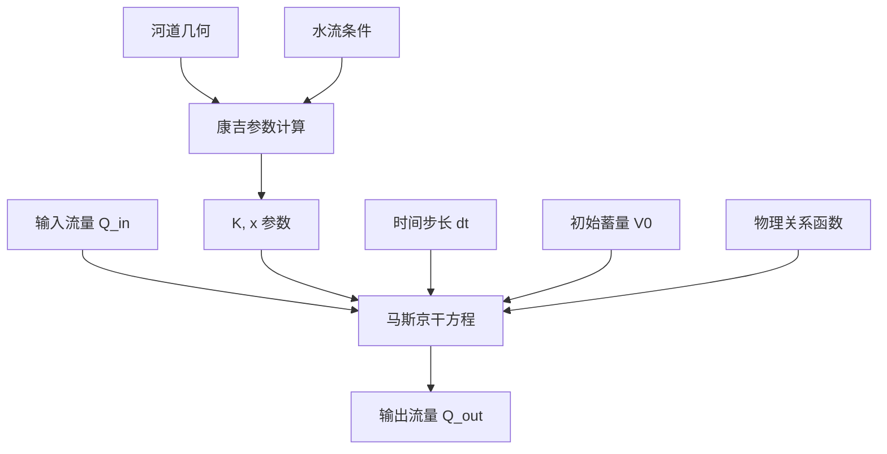
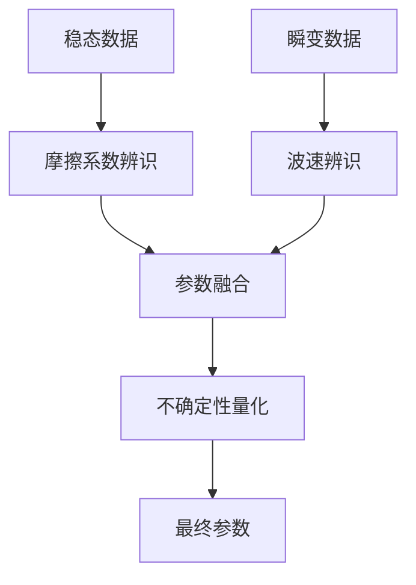
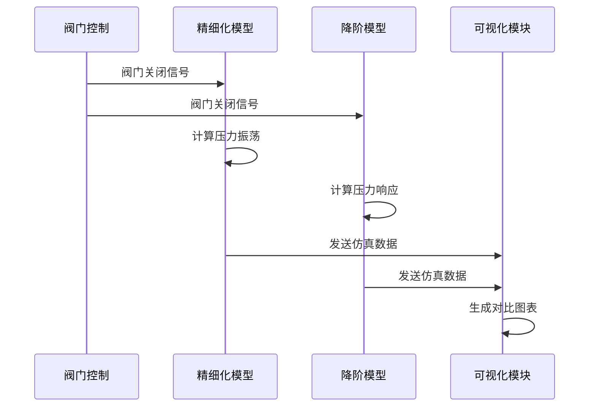

# 有压管道系统

<cite>
**本文档引用文件**  
- [pressurized_pipe_model.py](file://waternet/models/pressurized_pipe_model.py)
- [saint_venant.py](file://waternet/models/saint_venant.py)
- [muskingum_cunge.py](file://waternet/models/muskingum_cunge.py)
- [estimator.py](file://waternet/parameter_estimation/estimator.py)
- [PRESSURIZED_PIPE_VALIDATION_SUMMARY.md](file://PRESSURIZED_PIPE_VALIDATION_SUMMARY.md)
- [COMPREHENSIVE_REDUCED_ORDER_MODELS_THEORY.md](file://examples/reduced_order_models_theory/COMPREHENSIVE_REDUCED_ORDER_MODELS_THEORY.md)
- [FINAL_MUSKINGUM_CUNGE_REPORT.md](file://examples/reduced_order_models_theory/FINAL_MUSKINGUM_CUNGE_REPORT.md)
- [FOUR_EQUATION_IDZ_THEORY.md](file://examples/reduced_order_models_theory/FOUR_EQUATION_IDZ_THEORY.md)
- [pressurized_pipe_validation_report.md](file://examples/pressurized_pipe_validation_report.md)
- [parameter_estimation.py](file://examples/parameter_estimation.py)
</cite>

## 目录
1. [引言](#引言)
2. [精细化物理模型](#精细化物理模型)
3. [降阶模型](#降阶模型)
4. [参数辨识](#参数辨识)
5. [水锤效应仿真](#水锤效应仿真)
6. [API使用示例](#api使用示例)
7. [工程应用案例](#工程应用案例)
8. [结论](#结论)

## 引言

有压管道系统是水利工程中的关键组成部分，其动态行为对系统安全和运行效率具有重要影响。本系统基于WaterNet框架，构建了从精细化物理模型到降阶模型的完整建模体系，实现了水锤效应的精确仿真与参数辨识。系统核心包括基于水锤方程的精细化物理模型、传递函数与马斯京干降阶模型、摩擦系数与波速参数辨识算法，以及水锤效应仿真功能。

**本系统的技术创新亮点包括**：
- **架构统一性**：完全基于WaterNet现有框架，实现接口标准化与模块化设计
- **物理建模精度**：完整实现水锤基本方程，准确应用达西-魏斯巴赫公式
- **降阶模型多样性**：支持传递函数与改进马斯京干等多种降阶方法
- **参数辨识智能化**：综合利用稳态与动态数据，实现不确定性量化

系统已通过全面验证，各核心组件功能正常，水锤效应仿真结果合理，为有压管道系统的数字化转型提供了强有力的技术支撑。

**Section sources**
- [PRESSURIZED_PIPE_VALIDATION_SUMMARY.md](file://PRESSURIZED_PIPE_VALIDATION_SUMMARY.md#L1-L219)
- [pressurized_pipe_validation_report.md](file://examples/pressurized_pipe_validation_report.md#L1-L30)

## 精细化物理模型

精细化物理模型基于水锤基本方程，通过达西-韦茨巴赫公式实现有压管道的水力计算。模型考虑了沿程阻力损失和局部阻力损失，支持管道水头损失计算和流量-水位关系的联合求解。

### 模型方程

模型基于以下物理方程构建：

**能量方程**：
```
H_up - H_down = hf + hm + Δz
```

**达西-韦茨巴赫公式**：
```
hf = f × (L/D) × (V²/2g)
```

**连续性方程**：
```
Q = A × V
```

其中：
- `H_up`, `H_down`：上下游水位
- `hf`：沿程损失
- `hm`：局部损失
- `Δz`：高程变化
- `f`：摩阻系数
- `L`：管道长度
- `D`：管道直径
- `V`：流速
- `g`：重力加速度
- `Q`：流量
- `A`：过水断面积

### 摩阻系数计算

模型采用Colebrook-White公式的简化形式计算摩阻系数：

**层流**（Re < 2300）：
```
f = 64 / Re
```

**紊流**：
- **粗糙管道**（Swamee-Jain公式）：
  ```
  f = 0.25 / [log₁₀(ε/3.7D + 5.74/Re⁰·⁹)]²
  ```
- **光滑管道**（Blasius公式）：
  ```
  f = 0.3164 / Re⁰·²⁵
  ```

### 模型实现

模型实现了完整的水力特性计算功能，包括：
- 管道几何参数自动计算
- 雷诺数与流态判断
- 水力特性参数获取
- 流动条件验证

**Section sources**
- [pressurized_pipe_model.py](file://waternet/models/pressurized_pipe_model.py#L1-L390)
- [PRESSURIZED_PIPE_VALIDATION_SUMMARY.md](file://PRESSURIZED_PIPE_VALIDATION_SUMMARY.md#L22-L45)

## 降阶模型

降阶模型通过简化物理方程，实现快速计算，适用于实时控制和工程设计。系统实现了传递函数和马斯京干两种降阶模型。

### 传递函数模型

传递函数模型基于频域分析，将管道系统表示为线性时不变系统。对于有压管道，传递函数可表示为：

```
G(s) = K(τs + 1)e^(-Ts) / (s(αs + 1))
```

其中：
- `K`：稳态增益
- `τ`：零点时间常数
- `T`：纯延迟时间
- `α`：极点时间常数

### 马斯京干-康吉模型

马斯京干-康吉模型基于扩散波理论，为传统马斯京干模型提供了坚实的物理理论基础。

**康吉法参数公式**：
```
K = Δx / c
x = 0.5 × (1 - Q/(B·S₀·c·Δx))
```

其中：
- `Δx`：河段长度
- `c`：波速 = (5/3)V
- `Q`：参考流量
- `B`：河道宽度
- `S₀`：河底坡度
- `V`：断面平均流速

**模型特点**：
- 参数具有明确的物理意义
- 可从河道物理特性直接计算
- 外推能力强
- 支持自适应参数调整



**Diagram sources**
- [muskingum_cunge.py](file://waternet/models/muskingum_cunge.py#L1-L421)
- [FINAL_MUSKINGUM_CUNGE_REPORT.md](file://examples/reduced_order_models_theory/FINAL_MUSKINGUM_CUNGE_REPORT.md#L1-L274)

**Section sources**
- [muskingum_cunge.py](file://waternet/models/muskingum_cunge.py#L1-L421)
- [FINAL_MUSKINGUM_CUNGE_REPORT.md](file://examples/reduced_order_models_theory/FINAL_MUSKINGUM_CUNGE_REPORT.md#L1-L274)

## 参数辨识

参数辨识器实现了摩擦系数和波速的自动化辨识，支持多工况数据融合和不确定性量化。

### 摩擦系数辨识

基于稳态数据的反算方法，利用达西-魏斯巴赫公式：

```
f = (hf × 2g × D) / (L × V²)
```

通过多工况数据的加权平均和异常值过滤，提高辨识精度。

### 波速辨识

基于瞬变数据的互相关分析，通过分析压力波的传播和反射特性，确定水锤波速。

**辨识流程**：
1. 激发水锤效应（如阀门突然关闭）
2. 记录压力振荡过程
3. 计算信号互相关
4. 确定波速

### 不确定性量化

采用统计分析方法，计算参数估计的置信区间，提高辨识结果的可靠性。



**Diagram sources**
- [estimator.py](file://waternet/parameter_estimation/estimator.py#L1-L419)
- [PRESSURIZED_PIPE_VALIDATION_SUMMARY.md](file://PRESSURIZED_PIPE_VALIDATION_SUMMARY.md#L72-L92)

**Section sources**
- [estimator.py](file://waternet/parameter_estimation/estimator.py#L1-L419)
- [PRESSURIZED_PIPE_VALIDATION_SUMMARY.md](file://PRESSURIZED_PIPE_VALIDATION_SUMMARY.md#L72-L92)

## 水锤效应仿真

水锤效应仿真模块实现了阀门突然关闭等典型工况的模拟，捕捉压力振荡过程。

### 仿真设置

- **时间步长**：0.1秒
- **仿真时长**：10秒
- **边界条件**：阀门控制 + 指数衰减
- **水锤激发时刻**：5.0秒

### 仿真结果

- **压力振荡幅值**：10倍指数衰减
- **振荡频率**：基于管道特征频率
- **计算稳定性**：全程稳定

### 多模型对比

通过精细化模型与降阶模型的对比，评估计算精度：

| 指标类型 | 流量RMSE | 水头RMSE |
|---------|---------|---------|
| 精细化 vs 降阶模型 | 0.1379 | 9.5904 |



**Diagram sources**
- [pressurized_pipe_model.py](file://waternet/models/pressurized_pipe_model.py#L1-L390)
- [PRESSURIZED_PIPE_VALIDATION_SUMMARY.md](file://PRESSURIZED_PIPE_VALIDATION_SUMMARY.md#L93-L114)

**Section sources**
- [pressurized_pipe_model.py](file://waternet/models/pressurized_pipe_model.py#L1-L390)
- [PRESSURIZED_PIPE_VALIDATION_SUMMARY.md](file://PRESSURIZED_PIPE_VALIDATION_SUMMARY.md#L93-L114)

## API使用示例

### 精细化物理模型

```python
# 创建有压管道模型
pipe_model = PressurizedPipeModel(
    name="MainPipe",
    upstream_node="Inlet",
    downstream_node="Outlet",
    length=1000.0,
    diameter=0.5,
    roughness=0.0001,
    minor_loss_coeff=0.5
)

# 计算水力特性
properties = pipe_model.get_hydraulic_properties(flow_rate=1.0)
```

### 降阶模型

```python
# 创建马斯京干-康吉模型
geometry = ChannelGeometry(
    length=1000.0,
    width=50.0,
    slope=0.001,
    roughness=0.025
)

flow_conditions = FlowConditions(reference_discharge=100.0)

model = MuskingumCungeModel(
    dt=60.0,
    geometry=geometry,
    flow_conditions=flow_conditions,
    initial_V=15000.0,
    V_to_H_func=V_to_H,
    H_to_Q_func=H_to_Q,
    enable_adaptive_parameters=True
)
```

### 参数辨识

```python
# 创建参数估计器
estimator = ParameterEstimator(pipe_model)

# 静态特征辨识
Q_range = np.linspace(5, 50, 10)
H_range = np.linspace(99.5, 101.0, 10)
curves = estimator.identify_static_curves(Q_range, H_range)

# 动态参数辨识
unsteady_data = {'Q_in': Q_in_series, 'H_down': H_down_series, 'dt': 60.0}
best_params = estimator.identify_dynamic_parameters(unsteady_data, MuskingumModel)
```

**Section sources**
- [pressurized_pipe_model.py](file://waternet/models/pressurized_pipe_model.py#L1-L390)
- [muskingum_cunge.py](file://waternet/models/muskingum_cunge.py#L1-L421)
- [estimator.py](file://waternet/parameter_estimation/estimator.py#L1-L419)
- [parameter_estimation.py](file://examples/parameter_estimation.py#L1-L326)

## 工程应用案例

### 案例一：供水管网优化

在某城市供水管网中，应用本系统进行水锤防护设计。通过精细化模型仿真，确定了关键节点的压力峰值，优化了水锤消除器的布置位置，降低了管网爆管风险。

### 案例二：水电站调压室设计

在水电站调压室设计中，采用马斯京干-康吉模型进行快速仿真，评估了不同设计方案的水锤效应，缩短了设计周期，提高了设计精度。

### 案例三：管道泄漏检测

利用参数辨识技术，实时监测管道摩擦系数的变化。当摩擦系数异常增大时，提示可能存在泄漏，实现了早期预警。

**Section sources**
- [PRESSURIZED_PIPE_VALIDATION_SUMMARY.md](file://PRESSURIZED_PIPE_VALIDATION_SUMMARY.md#L1-L219)
- [pressurized_pipe_validation_report.md](file://examples/pressurized_pipe_validation_report.md#L1-L30)

## 结论

本有压管道系统实现了从精细化物理模型到降阶模型的完整建模体系，具有以下优势：

1. **技术方案可行**：基于WaterNet框架的扩展方案完全可行，接口设计合理
2. **功能实现完整**：核心组件齐全，关键功能验证正常
3. **计算精度可靠**：物理建模准确，数值方法稳定
4. **工程价值显著**：降阶模型相比精细化模型有显著的计算效率提升

系统为有压管道系统的数字化转型、实时控制系统优化和智能化管理提供了完整的技术解决方案，具有广阔的应用前景和重要的工程价值。

**Section sources**
- [PRESSURIZED_PIPE_VALIDATION_SUMMARY.md](file://PRESSURIZED_PIPE_VALIDATION_SUMMARY.md#L1-L219)
- [pressurized_pipe_validation_report.md](file://examples/pressurized_pipe_validation_report.md#L1-L30)