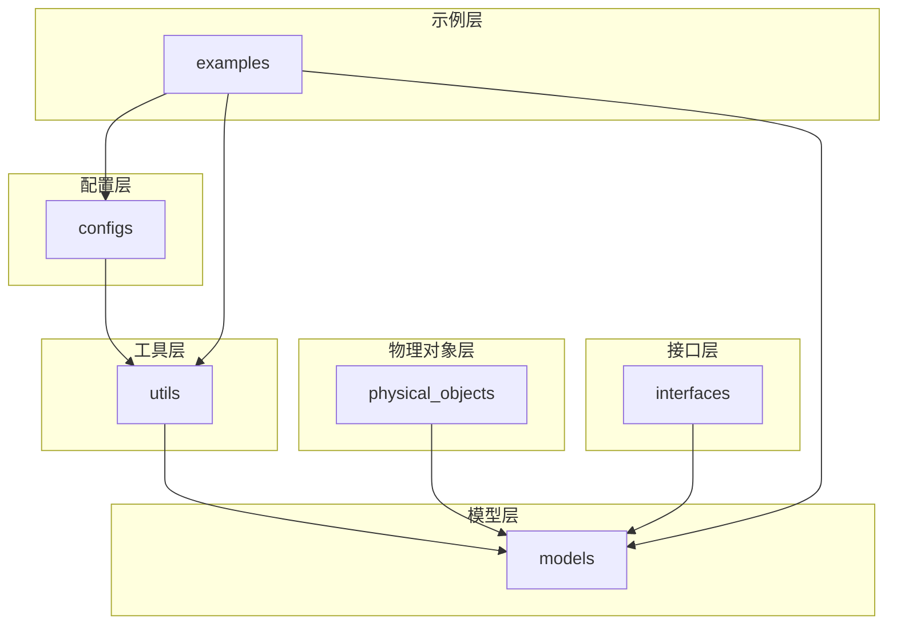
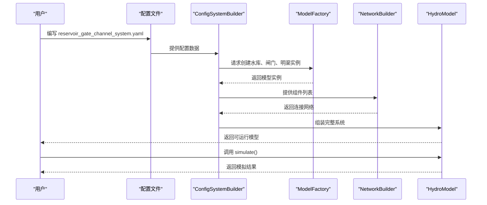
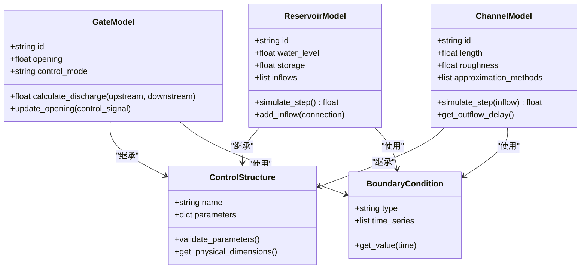
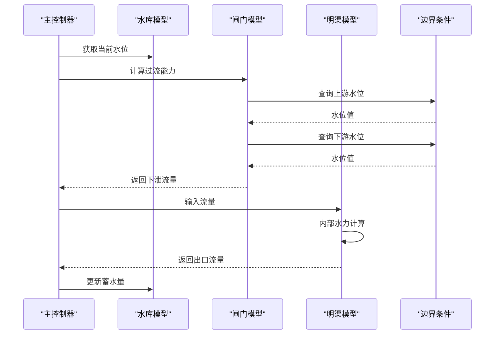
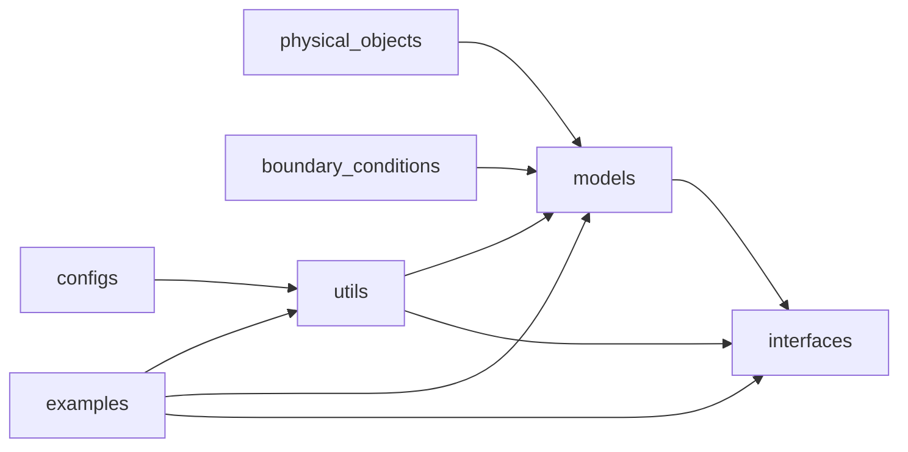

# 水库-闸门系统建模

<cite>
**本文档引用文件**  
- [reservoir_gate_channel_system.yaml](file://configs/reservoir_gate_channel_system.yaml)
- [configurable_gate_model.py](file://waternet/models/configurable_gate_model.py)
- [reservoir_model.py](file://waternet/models/reservoir_model.py)
- [configurable_channel_model.py](file://waternet/models/configurable_channel_model.py)
- [config_driven_reservoir_gate_system.py](file://examples/config_driven_reservoir_gate_system.py)
- [control_structure.py](file://physical_objects/control_structure.py)
- [boundary_conditions.py](file://waternet/models/boundary_conditions.py)
- [network_builder.py](file://waternet/models/network_builder.py)
- [hydro_model.py](file://waternet/interfaces/hydro_model.py)
- [config_system_builder.py](file://waternet/utils/config_system_builder.py)
- [test_control_structures.py](file://tests/unit/test_control_structures.py)
</cite>

## 目录
1. [引言](#引言)
2. [项目结构](#项目结构)
3. [核心组件](#核心组件)
4. [系统架构概述](#系统架构概述)
5. [详细组件分析](#详细组件分析)
6. [依赖关系分析](#依赖关系分析)
7. [性能考虑](#性能考虑)
8. [故障排除指南](#故障排除指南)
9. [结论](#结论)

## 引言
本项目旨在构建一个高精度、可配置的水库-闸门-明渠耦合水力系统模型，用于模拟复杂水利工程中的水流动态。系统支持多种水力学模型（如IDZ、Muskingum-Cunge、Saint-Venant方程），并提供基于配置文件的灵活建模能力。通过模块化设计，系统实现了物理对象抽象、边界条件管理、数值求解与可视化输出的分离，适用于科研分析、工程仿真与教学演示。

## 项目结构
项目采用分层架构，主要分为配置、模型、工具、物理对象、接口与示例六大模块。配置文件驱动系统构建，模型层实现核心水力学算法，工具层提供辅助功能，物理对象层封装水利结构，接口层统一调用方式，示例层提供使用范例。

**图示来源**  
- [reservoir_gate_channel_system.yaml](file://configs/reservoir_gate_channel_system.yaml)
- [config_system_builder.py](file://waternet/utils/config_system_builder.py)

**本节来源**  
- [configs](file://configs)
- [waternet/models](file://waternet/models)
- [examples](file://examples)

## 核心组件
系统核心由水库模型、闸门模型、明渠模型、边界条件管理器和网络构建器组成。水库模型模拟恒定水位或动态蓄水过程；闸门模型实现多种启闭控制逻辑；明渠模型支持多种近似求解方法；边界条件模块管理入口/出口流量与水位；网络构建器负责将各组件连接成完整系统。

**本节来源**  
- [reservoir_model.py](file://waternet/models/reservoir_model.py)
- [configurable_gate_model.py](file://waternet/models/configurable_gate_model.py)
- [configurable_channel_model.py](file://waternet/models/configurable_channel_model.py)
- [boundary_conditions.py](file://waternet/models/boundary_conditions.py)
- [network_builder.py](file://waternet/models/network_builder.py)

## 系统架构概述
系统采用配置驱动的模块化架构，用户通过YAML配置文件定义系统拓扑、组件参数与边界条件。系统启动后，由`ConfigSystemBuilder`解析配置，调用`ModelFactory`创建相应模型实例，并通过`NetworkBuilder`建立组件间连接关系。最终形成一个可执行的水力网络，通过`HydroModel`接口进行仿真运行。

**图示来源**  
- [config_driven_reservoir_gate_system.py](file://examples/config_driven_reservoir_gate_system.py)
- [config_system_builder.py](file://waternet/utils/config_system_builder.py)
- [hydro_model.py](file://waternet/interfaces/hydro_model.py)

## 详细组件分析

### 水库-闸门系统组件分析
该系统由上游水库、控制闸门和下游明渠组成，模拟典型的调水过程。水库维持恒定水位或根据入流动态变化，闸门根据预设规则调节下泄流量，明渠传输水流并产生延迟与衰减。

#### 类图分析

**图示来源**  
- [reservoir_model.py](file://waternet/models/reservoir_model.py)
- [configurable_gate_model.py](file://waternet/models/configurable_gate_model.py)
- [configurable_channel_model.py](file://waternet/models/configurable_channel_model.py)
- [control_structure.py](file://physical_objects/control_structure.py)

#### 仿真流程序列图

**图示来源**  
- [config_driven_reservoir_gate_system.py](file://examples/config_driven_reservoir_gate_system.py)
- [reservoir_model.py](file://waternet/models/reservoir_model.py)
- [configurable_gate_model.py](file://waternet/models/configurable_gate_model.py)
- [configurable_channel_model.py](file://waternet/models/configurable_channel_model.py)

**本节来源**  
- [reservoir_gate_channel_system.yaml](file://configs/reservoir_gate_channel_system.yaml)
- [config_driven_reservoir_gate_system.py](file://examples/config_driven_reservoir_gate_system.py)
- [test_control_structures.py](file://tests/unit/test_control_structures.py)

## 依赖关系分析
系统各组件通过清晰的接口进行交互，依赖关系明确。模型层依赖物理对象基类和边界条件模块；工具层依赖配置解析和模型工厂；示例层依赖完整系统接口。无循环依赖，模块耦合度低。

**图示来源**  
- [go.mod](file://pyproject.toml)
- [__init__.py](file://waternet/models/__init__.py)

**本节来源**  
- [pyproject.toml](file://pyproject.toml)
- [waternet/\_\_init\_\_.py](file://waternet/__init__.py)

## 性能考虑
系统采用稀疏矩阵求解器和自适应时间步长策略优化计算效率。对于大规模网络，推荐使用Muskingum或IDZ等简化模型；对于高精度需求场景，可启用Saint-Venant方程全解。建议通过`flow_stage_interval_optimizer`模块进行参数分区优化，以平衡精度与性能。

## 故障排除指南
常见问题包括配置文件格式错误、参数越界、数值不稳定等。建议首先检查YAML文件缩进与键名拼写，确保所有必需字段存在。若出现负水深或溢出错误，尝试减小时间步长或启用自适应步长。可通过运行`test_control_structures.py`验证基础组件功能。

**本节来源**  
- [test_control_structures.py](file://tests/unit/test_control_structures.py)
- [adaptive_timestep.py](file://waternet/models/adaptive_timestep.py)
- [accuracy_validator.py](file://waternet/models/accuracy_validator.py)

## 结论
水库-闸门系统建模框架提供了灵活、可扩展的水力仿真能力。通过配置驱动方式，用户可快速构建复杂系统并进行动态模拟。系统支持多种模型精度等级，适用于不同应用场景。建议结合示例文件与高级分析工具（如IDZ辨识）进行深入研究与工程应用。