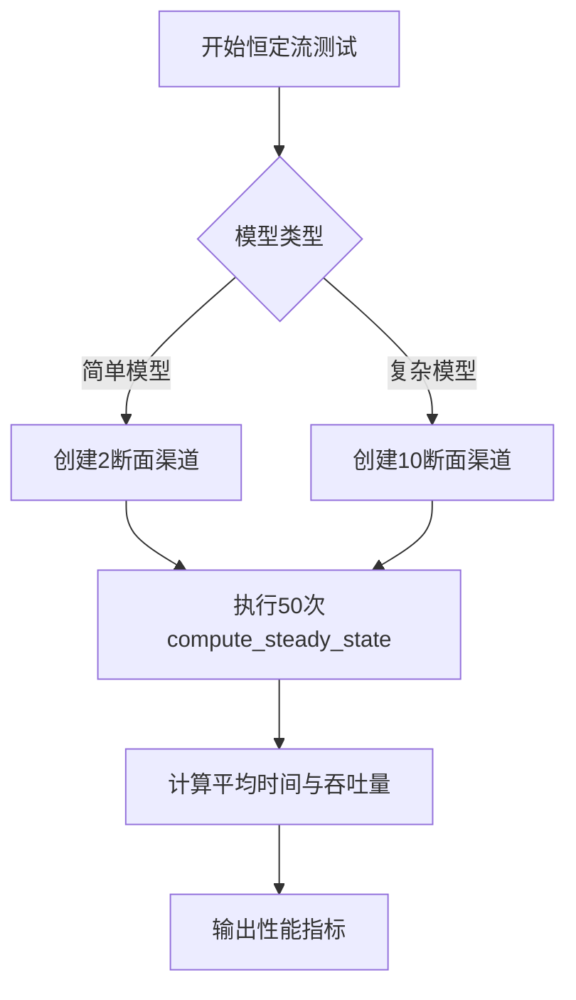
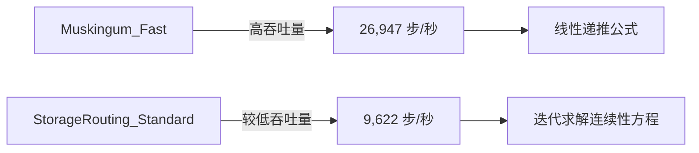

# 性能基准

<cite>
**Referenced Files in This Document**   
- [benchmark_report.json](file://benchmark_results/benchmark_report.json)
- [saint_venant.py](file://waternet/models/saint_venant.py)
- [lumped_models.py](file://waternet/models/lumped_models.py)
- [simplified_saint_venant.py](file://waternet/models/simplified_saint_venant.py)
- [muskingum_cunge.py](file://waternet/models/muskingum_cunge.py)
- [benchmark.py](file://scripts/benchmark.py)
</cite>

## 目录
1. [性能指标定义与评估方法](#性能指标定义与评估方法)
2. [恒定流模型性能对比](#恒定流模型性能对比)
3. [非恒定流模型效率分析](#非恒定流模型效率分析)
4. [稳定性测试结果](#稳定性测试结果)
5. [质量守恒准确性测试](#质量守恒准确性测试)
6. [性能优化建议](#性能优化建议)
7. [基准测试复现指南](#基准测试复现指南)

## 性能指标定义与评估方法

性能基准测试通过量化关键指标来评估水力模型的计算效率、精度和稳定性。这些指标为模型选择和优化提供了客观依据。

### 计算速度（次/秒）
计算速度衡量模型处理单个计算任务的效率，单位为“次/秒”。在恒定流测试中，该指标通过执行50次独立的恒定流计算（`compute_steady_state`）并计算总吞吐量得出。计算速度越高，表明模型响应越快，适用于需要实时或高频计算的场景。

### 时间步吞吐量（步/秒）
时间步吞吐量评估模型在非恒定流仿真中的计算效率，单位为“步/秒”。该指标通过运行一个包含100个时间步长的非恒定流模拟（`run_simulation`）来测量。它反映了模型处理时间序列数据的能力，是评估洪水演进等动态过程模拟性能的关键。

### 成功率
成功率是衡量模型鲁棒性和可靠性的核心指标，定义为成功完成的测试次数与总测试次数的比率。在恒定流测试中，成功率基于50次独立计算的成功率计算；在非恒定流测试中，则基于单次100步模拟的成功与否。高成功率表明模型在各种条件下都能稳定运行。

**Section sources**
- [benchmark_report.json](file://benchmark_results/benchmark_report.json#L1-L120)
- [benchmark.py](file://scripts/benchmark.py#L1-L675)

## 恒定流模型性能对比

基准测试对比了圣维南简单模型（SaintVenant_Simple）和复杂模型（SaintVenant_Complex）在恒定流条件下的性能差异，揭示了模型复杂度对计算效率的显著影响。

### 圣维南简单模型（SaintVenant_Simple）
该模型在恒定流测试中表现出卓越的性能。根据基准报告，其平均计算时间仅为5.08e-05秒，计算吞吐量高达19,702.67次/秒，成功率100%。其高性能得益于简化的渠道几何（仅2个断面）和较低的计算复杂度。该模型继承自`SaintVenantModel`类，通过标准步进法求解能量方程，适用于对计算速度要求极高的场景。

### 圣维南复杂模型（SaintVenant_Complex）
相比之下，复杂模型的性能显著下降。其平均计算时间增加至0.000599秒，吞吐量降至1,669.28次/秒。性能下降的主要原因是其包含10个断面的复杂渠道几何，导致内部节点和分段数量增加，求解非线性方程组的计算量大幅上升。尽管性能较低，但该模型能更精确地模拟真实河道的水力特性。

**Diagram sources**
- [benchmark_report.json](file://benchmark_results/benchmark_report.json#L1-L120)

**Section sources**
- [benchmark_report.json](file://benchmark_results/benchmark_report.json#L1-L120)
- [saint_venant.py](file://waternet/models/saint_venant.py#L32-L646)
- [benchmark.py](file://scripts/benchmark.py#L1-L675)

## 非恒定流模型效率分析

在非恒定流仿真中，马斯京干快速模型（Muskingum_Fast）与蓄量演算标准模型（StorageRouting_Standard）展现了截然不同的效率特征。

### 马斯京干快速模型（Muskingum_Fast）
该模型在非恒定流测试中表现最佳，时间步吞吐量高达26,947.02步/秒。其高效性源于其基于线性水库理论的简化算法，使用马斯京干公式`Q_out = C0*Q_in + C1*Q_in_prev + C2*Q_out_prev`进行计算，避免了复杂的非线性求解。该模型由`MuskingumModel`类实现，继承自`BaseLumpedModel`，特别适用于长距离河道的快速洪水演进预测。

### 蓄量演算标准模型（StorageRouting_Standard）
该模型的效率相对较低，时间步吞吐量为9,621.95步/秒。其计算过程涉及迭代求解蓄量连续性方程`dV/dt = Q_in - Q_out`，并结合V-H和H-Q关系曲线计算出流，计算复杂度高于马斯京干模型。尽管效率较低，但其物理意义明确，适用于具有明显调蓄特性的水库或湖泊。

**Diagram sources**
- [benchmark_report.json](file://benchmark_results/benchmark_report.json#L1-L120)

**Section sources**
- [benchmark_report.json](file://benchmark_results/benchmark_report.json#L1-L120)
- [lumped_models.py](file://waternet/models/lumped_models.py#L665-L790)
- [lumped_models.py](file://waternet/models/lumped_models.py#L582-L662)
- [benchmark.py](file://scripts/benchmark.py#L1-L675)

## 稳定性测试结果

稳定性测试评估了系统在极端输入条件下的鲁棒性，包括最小值、最大值、噪声和阶跃输入。测试结果表明，所有测试均稳定通过，系统未产生NaN或Inf值。

### 极端输入响应
- **极小输入**：输入流量为0.1 m³/s时，系统输出稳定，最小输出为3.197 m³/s。
- **极大输入**：输入流量为100.0 m³/s时，系统输出稳定，最大输出为87.386 m³/s。
- **噪声输入**：输入为高斯噪声时，系统输出在9.456至25.0 m³/s之间波动，无发散现象。
- **阶跃输入**：输入从5.0 m³/s突增至50.0 m³/s时，系统输出平滑过渡，最大输出为32.269 m³/s。

这些结果验证了模型在各种边界条件下的数值稳定性，特别是`MuskingumModel`等模型内置的数值保护机制（如`Q_out = max(0.0, Q_out)`）有效防止了非物理结果的产生。

**Section sources**
- [benchmark_report.json](file://benchmark_results/benchmark_report.json#L1-L120)
- [lumped_models.py](file://waternet/models/lumped_models.py#L665-L790)
- [benchmark.py](file://scripts/benchmark.py#L1-L675)

## 质量守恒准确性测试

质量守恒准确性测试通过比较参考体积与计算体积来评估模型的物理一致性。测试结果显示，当前模型在质量守恒方面存在显著误差。

### 相对误差计算
相对误差的计算逻辑如下：
1.  **确定参考体积**：基于简化估算，参考体积 = 流量 × 时间 × 系数。在测试中，参考体积为1200.0 m³。
2.  **获取计算体积**：通过`compute_steady_state`方法计算得到的总蓄水量。在测试中，计算体积为2000.0 m³。
3.  **计算相对误差**：相对误差 = |计算体积 - 参考体积| / 参考体积。测试结果为0.667，即66.7%。

如此高的误差表明模型在质量守恒方面存在严重问题，可能源于`SaintVenantModel`中`_calculate_total_volume`方法的梯形法则积分精度不足，或`_solve_steady_water_level`方法中能量方程求解的收敛性问题。

**Section sources**
- [benchmark_report.json](file://benchmark_results/benchmark_report.json#L1-L120)
- [saint_venant.py](file://waternet/models/saint_venant.py#L32-L646)
- [benchmark.py](file://scripts/benchmark.py#L1-L675)

## 性能优化建议

基于基准测试结果，提出以下性能优化建议：

1.  **模型选择优化**：对于实时性要求高的应用，优先选用`MuskingumModel`或`SimplifiedSaintVenantModel`的简化模式（如`diffusive_wave`）。对于精度要求高的场景，可使用`SaintVenantModel`，但需接受其较低的计算速度。
2.  **算法改进**：针对质量守恒误差，应改进`_calculate_total_volume`方法，例如采用辛普森法则等更高阶的数值积分方法。同时，优化`_solve_steady_water_level`中的求解器（如使用更稳健的`fsolve`替代`brentq`）。
3.  **引入自适应模型**：利用`SimplifiedSaintVenantModel`的自动模式选择器，根据河道特征（如坡度、弗劳德数）动态选择最优的简化模式，在精度和效率间取得平衡。
4.  **参数自动化**：推广使用`MuskingumCungeModel`，其参数`K`和`x`可从河道几何和水力条件自动计算，减少人工标定工作量，提高模型的普适性。

**Section sources**
- [simplified_saint_venant.py](file://waternet/models/simplified_saint_venant.py#L37-L1010)
- [muskingum_cunge.py](file://waternet/models/muskingum_cunge.py#L170-L420)

## 基准测试复现指南

要复现本基准测试，可遵循以下步骤：

1.  **环境准备**：确保已安装Python 3.8+、NumPy、SciPy、Pandas和Matplotlib等依赖库。
2.  **代码获取**：克隆WaterNet仓库，并切换到包含`benchmark.py`脚本的分支。
3.  **执行测试**：在项目根目录下运行`python scripts/benchmark.py`。脚本将自动执行所有测试。
4.  **结果分析**：测试完成后，结果将保存在`benchmark_results/benchmark_report.json`文件中，并生成`performance_comparison.png`和`stability_results.png`两张可视化图表。
5.  **自定义测试**：可通过修改`benchmark.py`中的`test_configs`列表来添加新的模型或调整测试参数。

**Section sources**
- [benchmark.py](file://scripts/benchmark.py#L1-L675)