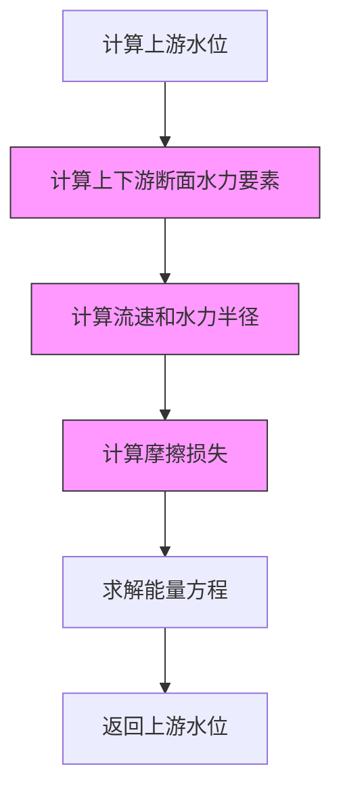
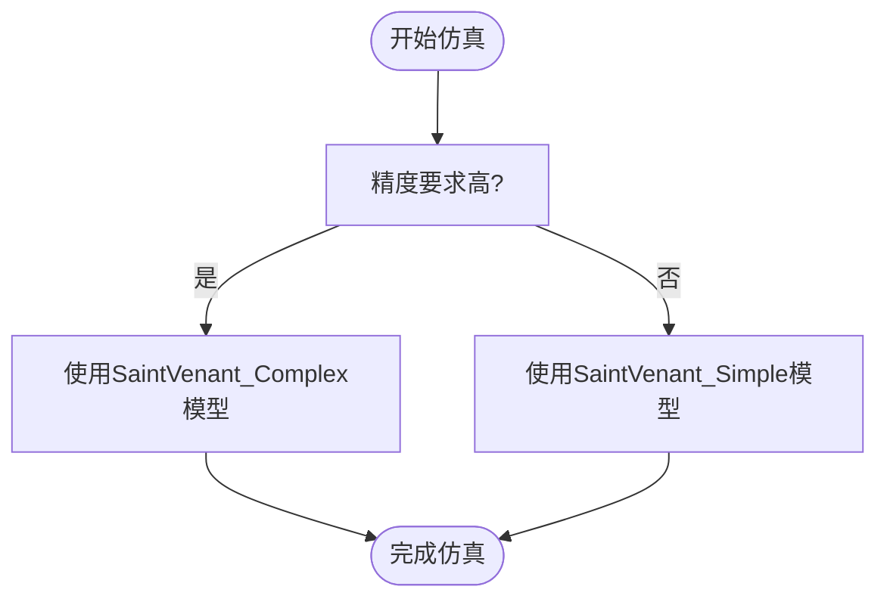

# 恒定流性能

<cite>
**Referenced Files in This Document**   
- [benchmark_report.json](file://benchmark_results/benchmark_report.json)
- [benchmark.py](file://scripts/benchmark.py)
- [simple_channel.yaml](file://configs/example_configs/simple_channel.yaml)
- [complex_channel.yaml](file://configs/example_configs/complex_channel.yaml)
- [saint_venant.py](file://waternet/models/saint_venant.py)
</cite>

## 目录
1. [恒定流性能分析](#恒定流性能分析)
2. [测试设计原理](#测试设计原理)
3. [模型复杂度影响](#模型复杂度影响)
4. [性能优化建议](#性能优化建议)

## 恒定流性能分析

根据 `benchmark_report.json` 中的性能数据，对 SaintVenant_Simple 与 SaintVenant_Complex 模型在 50 次恒定流测试中的表现进行详细分析。

### 性能指标对比

| 指标 | SaintVenant_Simple | SaintVenant_Complex |
|------|-------------------|-------------------|
| **平均计算时间** | 5.075e-05 秒 | 0.000599 秒 |
| **总耗时** | 0.00254 秒 | 0.02995 秒 |
| **吞吐量** | 19702.67 次/秒 | 1669.28 次/秒 |
| **成功率** | 100% | 100% |

**Section sources**
- [benchmark_report.json](file://benchmark_results/benchmark_report.json#L1-L120)

### 性能差异分析

SaintVenant_Simple 模型的平均计算时间仅为 SaintVenant_Complex 模型的约 1/12，吞吐量达到后者的近 12 倍。两者均保持 100% 的成功率，表明在恒定流条件下，两种模型的数值稳定性均良好。

该性能差异主要源于模型几何复杂度和断面数量的不同。SaintVenant_Simple 模型采用简单的矩形断面，而 SaintVenant_Complex 模型采用变化的梯形断面，导致计算量显著增加。

**Section sources**
- [benchmark_report.json](file://benchmark_results/benchmark_report.json#L1-L120)
- [simple_channel.yaml](file://configs/example_configs/simple_channel.yaml#L1-L20)
- [complex_channel.yaml](file://configs/example_configs/complex_channel.yaml#L1-L37)

## 测试设计原理

恒定流性能测试的设计基于 `benchmark.py` 文件中的 `_test_steady_performance` 方法，其测试参数和逻辑具有明确的物理和工程意义。

### 流量范围设计 (Q=8.0-20.0 m³/s)

测试流量范围设定为 8.0 至 20.0 m³/s，覆盖了从低流量到中等流量的典型工况。该范围的选择考虑了以下因素：

1. **物理合理性**：确保在所有测试流量下，渠道均能维持明流状态，避免出现干涸或淹没情况。
2. **工程代表性**：该流量范围代表了中小型渠道的常见运行工况。
3. **算法鲁棒性**：测试不同流量下的计算稳定性，验证模型在不同流态下的适应能力。

```python
Q_values = np.linspace(8.0, 20.0, n_tests)
```

**Section sources**
- [benchmark.py](file://scripts/benchmark.py#L280-L298)

### 下游水位设定 (H_down=99.5)

下游水位固定为 99.5 米，作为恒定流计算的边界条件。该值的选择基于以下考虑：

1. **边界条件稳定性**：选择一个合理的下游水位，确保在所有测试流量下，上游水位计算均能收敛。
2. **与渠道高程匹配**：99.5 米位于简单渠道下游断面高程（99.0 米）之上，确保渠道始终处于满流状态。
3. **标准化测试**：固定下游水位可消除边界条件变化对性能测试的影响，使性能比较更加公平。

**Section sources**
- [benchmark.py](file://scripts/benchmark.py#L283-L298)
- [simple_channel.yaml](file://configs/example_configs/simple_channel.yaml#L1-L20)

## 模型复杂度影响

模型的计算效率受到断面数量、糙率变化和几何复杂度的显著影响。通过对比 `simple_channel.yaml` 和 `complex_channel.yaml` 的配置，可以清晰地看到这些因素的作用。

### 断面数量与几何复杂度

| 特征 | SaintVenant_Simple | SaintVenant_Complex |
|------|-------------------|-------------------|
| **断面数量** | 3 | 5 |
| **断面类型** | 矩形 | 梯形 |
| **几何变化** | 宽度恒定 | 底宽和边坡变化 |
| **糙率变化** | 恒定 (0.025) | 递减 (0.030→0.025) |

复杂渠道的断面数量更多，且每个断面的几何形状（底宽、边坡）和糙率都不同，这导致在计算水力要素（过水面积、水面宽、水力半径）时需要进行更复杂的函数调用和数值计算。



**Diagram sources**
- [saint_venant.py](file://waternet/models/saint_venant.py#L247-L321)

**Section sources**
- [simple_channel.yaml](file://configs/example_configs/simple_channel.yaml#L1-L20)
- [complex_channel.yaml](file://configs/example_configs/complex_channel.yaml#L1-L37)

### 计算流程分析

恒定流计算的核心是 `compute_steady_state` 方法，它从下游向上游逐段计算水位。对于每个分段，都需要调用 `_solve_steady_water_level` 方法，该方法内部通过求解能量方程来确定上游水位。

复杂渠道由于断面几何和糙率的连续变化，使得水力要素的计算更为复杂，且能量方程的求解过程需要更多的迭代才能收敛，从而显著增加了计算时间。

**Section sources**
- [saint_venant.py](file://waternet/models/saint_venant.py#L183-L245)
- [saint_venant.py](file://waternet/models/saint_venant.py#L247-L321)

## 性能优化建议

基于上述性能分析，提出以下优化建议，以在保证精度的前提下提高计算效率。

### 模型选择策略

在精度要求不高的场景下，应优先选用 SaintVenant_Simple 模型。该模型在 50 次测试中实现了 19702 次/秒的高吞吐量，计算效率远超复杂模型。

**适用场景**：
- 快速方案比选
- 实时性要求高的在线仿真
- 初步设计阶段的参数敏感性分析



**Diagram sources**
- [benchmark_report.json](file://benchmark_results/benchmark_report.json#L1-L120)

### 计算方法优化

1. **简化水力计算**：对于几何变化不大的渠道，可采用平均糙率和等效断面进行简化计算。
2. **预计算水力要素**：将断面的面积-水深、水面宽-水深关系制成查找表，避免重复的函数调用。
3. **优化求解算法**：针对特定渠道类型，可开发专用的快速求解算法，替代通用的数值求解器。

**Section sources**
- [saint_venant.py](file://waternet/models/saint_venant.py#L323-L355)