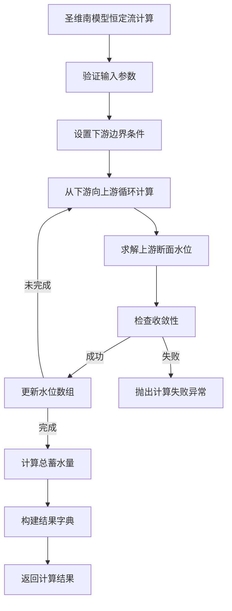
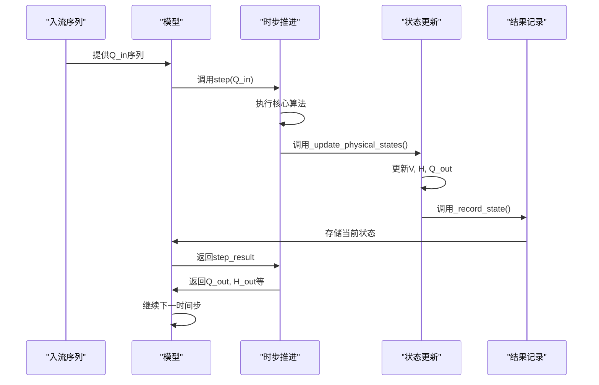

# 模型性能

<cite>
**本文档引用文件**   
- [benchmark_report.json](file://benchmark_results/benchmark_report.json)
- [benchmark.py](file://scripts/benchmark.py)
- [saint_venant.py](file://waternet/models/saint_venant.py)
- [lumped_models.py](file://waternet/models/lumped_models.py)
</cite>

## 目录
1. [恒定流模型性能对比](#恒定流模型性能对比)
2. [非恒定流模型性能对比](#非恒定流模型性能对比)
3. [测试逻辑与性能度量方法](#测试逻辑与性能度量方法)
4. [性能优化建议](#性能优化建议)

## 恒定流模型性能对比

根据 `benchmark_report.json` 中的性能数据，对圣维南简单模型（SaintVenant_Simple）和复杂模型（SaintVenant_Complex）在恒定流测试中的表现进行详细分析。

在恒定流测试中，共执行了50次计算任务。圣维南简单模型的平均计算时间为 **5.075e-05 秒**，而复杂模型的平均计算时间为 **5.991e-04 秒**。这表明简单模型的计算速度是复杂模型的约 **11.8 倍**。

从吞吐量指标来看，简单模型的吞吐量为 **19702.67 次/秒**，而复杂模型的吞吐量为 **1669.28 次/秒**。这进一步证实了简单模型在处理恒定流问题时具有显著的性能优势。

两个模型的成功率均为 **1.0**，表明它们在测试条件下都具有极高的计算稳定性。

性能差异的主要原因在于模型的复杂度：
- **简单模型**：使用了两个断面的简单渠道配置，计算量小。
- **复杂模型**：使用了十个断面的复杂渠道配置，需要进行更多的迭代计算和水力要素计算。



**图表来源**
- [saint_venant.py](file://waternet/models/saint_venant.py#L183-L245)

**本节来源**
- [benchmark_report.json](file://benchmark_results/benchmark_report.json#L10-L30)
- [benchmark.py](file://scripts/benchmark.py#L207-L235)
- [saint_venant.py](file://waternet/models/saint_venant.py#L183-L245)

## 非恒定流模型性能对比

在非恒定流仿真中，马斯京干快速模型（Muskingum_Fast）与蓄量演算标准模型（StorageRouting_Standard）的表现对比如下。

在100步的非恒定流仿真中，马斯京干快速模型的每步平均计算时间为 **3.711e-05 秒**，而蓄量演算标准模型的每步平均计算时间为 **1.039e-04 秒**。这表明马斯京干模型的单步计算效率是蓄量演算模型的约 **2.8 倍**。

从整体吞吐量来看，马斯京干模型的吞吐量为 **26947.02 次/秒**，而蓄量演算模型的吞吐量为 **9621.95 次/秒**。马斯京干模型在非恒定流仿真中表现出更高的计算效率。

两个模型的仿真均成功完成，表明它们在给定的测试条件下都具有良好的数值稳定性。

性能差异的原因在于算法复杂度：
- **马斯京干模型**：采用线性递推公式，计算简单高效。
- **蓄量演算模型**：需要进行迭代求解，计算过程更为复杂。



**图表来源**
- [lumped_models.py](file://waternet/models/lumped_models.py#L211-L234)
- [lumped_models.py](file://waternet/models/lumped_models.py#L300-L358)

**本节来源**
- [benchmark_report.json](file://benchmark_results/benchmark_report.json#L31-L45)
- [benchmark.py](file://scripts/benchmark.py#L237-L261)
- [lumped_models.py](file://waternet/models/lumped_models.py#L211-L234)

## 测试逻辑与性能度量方法

`benchmark.py` 文件中的 `PerformanceBenchmark` 类定义了完整的测试逻辑和性能度量方法。

测试流程如下：
1.  **模型创建**：根据预设配置创建四种测试模型。
2.  **性能测试**：分别对恒定流和非恒定流模型进行性能测试。
3.  **内存测试**：评估大规模模型的内存使用情况。
4.  **精度测试**：验证模型计算结果的物理合理性。
5.  **稳定性测试**：测试模型在极端输入条件下的鲁棒性。
6.  **报告生成**：汇总所有测试结果并生成JSON报告和可视化图表。

性能度量方法：
- **计算时间**：使用 `time.time()` 记录函数执行的起止时间。
- **吞吐量**：通过 `n_tests / total_time` 计算单位时间内的计算次数。
- **成功率**：统计成功完成的测试次数占总测试次数的比例。

```mermaid
classDiagram
class PerformanceBenchmark {
+output_dir Path
+results Dict
+simple_sections List
+complex_sections List
+V_to_H_func Callable
+H_to_Q_func Callable
+__init__(output_dir)
+_setup_test_models()
+benchmark_model_performance()
+_test_steady_performance(model, model_name)
+_test_unsteady_performance(model, model_name)
+generate_report()
+_print_summary(summary)
}
class SaintVenantModel {
+name str
+upstream_node str
+downstream_node str
+sections List[Dict]
+compute_steady_state(Q, downstream_H)
+get_equations(variables, dt, prev_states)
}
class MuskingumModel {
+dt float
+K float
+x float
+initial_V float
+step(Q_in)
+run_simulation(Q_in_series)
}
class StorageRoutingModel {
+dt float
+initial_V float
+step(Q_in)
+run_simulation(Q_in_series)
}
PerformanceBenchmark --> SaintVenantModel : "创建"
PerformanceBenchmark --> MuskingumModel : "创建"
PerformanceBenchmark --> StorageRoutingModel : "创建"
PerformanceBenchmark --> "JSON" : "保存报告"
PerformanceBenchmark --> "Matplotlib" : "生成图表"
```

**图表来源**
- [benchmark.py](file://scripts/benchmark.py#L44-L641)

**本节来源**
- [benchmark.py](file://scripts/benchmark.py#L44-L641)
- [benchmark_report.json](file://benchmark_results/benchmark_report.json)

## 性能优化建议

基于基准测试结果，为开发者提供以下性能优化建议：

1.  **根据应用场景选择模型**：
    *   对于**实时性要求高**的场景（如洪水预警），优先选择**马斯京干快速模型**或**圣维南简单模型**。
    *   对于**精度要求高**的场景（如详细水力学分析），可选择**圣维南复杂模型**，但需接受其较高的计算成本。

2.  **优化模型复杂度**：
    *   在满足精度要求的前提下，尽量减少圣维南模型的断面数量，以显著提升计算速度。

3.  **利用模型继承关系**：
    *   所有降阶模型（如 `MuskingumModel`, `StorageRoutingModel`）都继承自 `BaseLumpedModel`，共享统一的仿真循环和状态管理逻辑。开发者在实现新模型时应充分利用这一基类，避免重复造轮子。

4.  **关注数值稳定性**：
    *   测试结果显示所有模型的成功率均为1.0，但开发者在实际应用中仍需注意输入数据的合理性和边界条件的设置，以确保模型的长期稳定运行。

5.  **性能监控**：
    *   可以参考 `benchmark.py` 中的测试方法，为关键模型添加性能监控，持续跟踪其在生产环境中的表现。

**本节来源**
- [benchmark_report.json](file://benchmark_results/benchmark_report.json#L1-L50)
- [benchmark.py](file://scripts/benchmark.py#L44-L641)
- [saint_venant.py](file://waternet/models/saint_venant.py)
- [lumped_models.py](file://waternet/models/lumped_models.py)