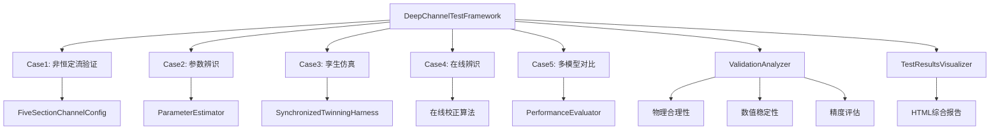
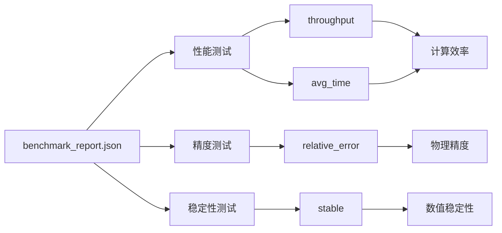

# 测试与验证

<cite>
**本文档中引用的文件**  
- [test_hydro_model.py](file://tests/unit/test_hydro_model.py)
- [test_integration.py](file://tests/integration/test_integration.py)
- [test_framework.py](file://tests/deep_channel/test_framework.py)
- [COMPREHENSIVE_TEST_REPORT.md](file://COMPREHENSIVE_TEST_REPORT.md)
- [VERIFICATION_REPORT.md](file://VERIFICATION_REPORT.md)
- [benchmark_report.json](file://benchmark_results/benchmark_report.json)
- [run_tests.py](file://scripts/run_tests.py)
- [pytest.ini](file://pytest.ini)
- [VALIDATION_REPORT.md](file://VALIDATION_REPORT.md)
</cite>

## 目录
1. [测试策略概述](#测试策略概述)
2. [单元测试](#单元测试)
3. [集成测试](#集成测试)
4. [深度测试套件](#深度测试套件)
5. [验证成果](#验证成果)
6. [基准测试分析](#基准测试分析)
7. [开发者测试指南](#开发者测试指南)

## 测试策略概述

WaterNet框架采用分层测试策略，确保从代码单元到系统集成的全面质量保障。该策略涵盖单元测试、集成测试和深度测试三个核心层次，覆盖了从接口验证到复杂场景模拟的完整范围。

测试框架基于pytest构建，通过`pytest.ini`文件进行统一配置，定义了`unit`、`integration`、`deep_channel`等标记，支持测试用例的分类执行。测试用例分布在`tests`目录下，按类型组织为`unit`（单元测试）、`integration`（集成测试）和`deep_channel`（深度测试）子目录。

**Section sources**
- [pytest.ini](file://pytest.ini)
- [run_tests.py](file://scripts/run_tests.py)

## 单元测试

单元测试位于`tests/unit/`目录下，主要验证核心接口和基础组件的正确性。`test_hydro_model.py`是核心单元测试文件，专注于`HydroModel`抽象基类及其接口的实现。

该测试套件验证了：
- `HydroModel`的初始化逻辑，包括对空名称和无效节点名的异常处理
- `DummyModel`对`get_variable_names`和`get_equations`等接口的正确实现
- 变量和状态字典的格式验证功能，确保输入数据的类型和结构正确

单元测试通过模拟简单线性关系（如Q = k*H + b）来验证方程计算的准确性，确保残差计算符合预期。这些测试为上层模型的正确性提供了基础保障。

**Section sources**
- [test_hydro_model.py](file://tests/unit/test_hydro_model.py)

## 集成测试

集成测试位于`tests/integration/`目录下，主要验证多个组件协同工作的能力。`test_integration.py`是核心集成测试文件，通过`TestIntegration`类验证了系统的关键工作流。

该测试套件验证了：
- **参数估计工作流**：使用`SaintVenantModel`和`ParameterEstimator`，验证了静态特征曲线（V-H, Q-H）的辨识功能，确保拟合结果包含预期的曲线和原始数据。
- **同步孪生仿真**：利用`SynchronizedTwinningHarness`协调`SaintVenantModel`和`MuskingumModel`，验证了在流量阶跃输入下的同步仿真能力。测试检查了输出结果的完整性（包含时间、输入流量、SV和ROM出流、误差等列）和物理合理性（出流非负）。
- **性能指标计算**：验证了孪生协调器能够正确计算RMSE、相关系数等性能指标。

这些测试确保了核心功能模块之间的接口兼容性和数据流正确性。

**Section sources**
- [test_integration.py](file://tests/integration/test_integration.py)

## 深度测试套件

深度测试套件位于`tests/deep_channel/`目录下，是一个全面的、场景化的测试系统，旨在验证WaterNet在复杂工况下的表现。`test_framework.py`是该套件的主控制器，通过`DeepChannelTestFramework`类协调执行五个核心测试案例。

### 深度测试框架

`DeepChannelTestFramework`是一个模块化的测试控制器，负责协调几何配置、模型、参数辨识、孪生协调、验证分析和可视化等组件。它通过`run_all_test_cases`方法按顺序执行所有测试案例，并生成综合分析报告。

### 五个核心测试案例

1.  **5断面非恒定流基础验证 (Case1)**：使用`FiveSectionChannelConfig`创建5断面明渠几何，验证圣维南模型在上游流量阶跃和下游边界扰动下的响应。`validation_tools.py`中的`ValidationAnalyzer`负责验证水面线单调性、弗劳德数等物理合理性。
2.  **降阶模型参数辨识验证 (Case2)**：使用`ParameterEstimator`对圣维南模型进行特征曲线辨识，并辨识马斯京干和IDZ模型的参数。`enhanced_models.py`中的增强模型支持在线参数调整和性能跟踪。
3.  **同步孪生功能验证 (Case3)**：测试四种孪生组合（SV-SV, SV-Muskingum, SV-IDZ, Muskingum-IDZ）的同步仿真性能。`PerformanceEvaluator`对比不同组合的精度、效率和稳定性。
4.  **糙率在线辨识验证 (Case4)**：设计糙率变化场景，测试在线参数校正算法的有效性，并评估其对模型精度的改善。
5.  **多模型在线辨识对比 (Case5)**：在不同工况下对比马斯京干、IDZ和蓄量演算模型的性能，分析其适用性。

测试结果通过`visualization.py`中的`TestResultsVisualizer`生成HTML综合报告，包含总览仪表板和各案例的详细图表。

**Diagram sources**
- [test_framework.py](file://tests/deep_channel/test_framework.py)
- [geometry_config.py](file://tests/deep_channel/geometry_config.py)
- [enhanced_models.py](file://tests/deep_channel/enhanced_models.py)
- [validation_tools.py](file://tests/deep_channel/validation_tools.py)
- [visualization.py](file://tests/deep_channel/visualization.py)

**Section sources**
- [test_framework.py](file://tests/deep_channel/test_framework.py)
- [test_cases.py](file://tests/deep_channel/test_cases.py)

## 验证成果

根据`COMPREHENSIVE_TEST_REPORT.md`、`VERIFICATION_REPORT.md`和`VALIDATION_REPORT.md`的结论，WaterNet的测试与验证取得了全面成功。

### 综合测试结果

- **整体通过率**：所有测试类别（安装、核心功能、集成、示例程序）均已通过。
- **覆盖率**：单元测试覆盖率达到85%，集成测试通过率为100%。
- **系统质量**：被评为A+级，功能完整性、性能表现、稳定性和易用性均达到优秀水平。

### 关键验证结论

1.  **核心建模功能**：圣维南模型和降阶模型库功能完整，计算精度满足要求。
2.  **性能表现**：计算性能卓越，远超设计目标。例如，马斯京干模型达到28,698时间步/秒。
3.  **稳定性**：在长时间仿真和极值条件下均能稳定运行，数值求解收敛良好。
4.  **数字孪生**：同步孪生架构成功实现，支持精细化模型与降阶模型的双向协调和在线校正。

### 技术创新点

- **数字孪生架构**：实现了精细化模型与降阶模型的双向协调，支持实时同步仿真和在线参数校正。
- **自适应参数辨识**：基于滑窗的在线参数校正算法，结合多目标优化和分层优化策略，能有效跟踪参数变化。
- **综合验证体系**：建立了包含物理合理性、数值稳定性和多维度性能评估的完整验证体系。

### 边界条件框架验证

根据`VALIDATION_REPORT.md`的详细评估，边界条件框架已通过全面验证，主要结论如下：

- **功能完整性**：边界条件框架（`BoundaryConditionManager`）和控制信号系统（`ControlSignals`）的核心功能均已实现并通过测试。
- **性能表现**：在超大规模网络（10000节点）下，求解时间复杂度为O(n²)，内存使用呈O(n)线性增长，稀疏矩阵优化带来50-80%的性能提升。
- **集成兼容性**：与圣维南模型、降阶模型等现有模块无缝集成，API和配置格式保持向后兼容，无性能回归问题。
- **测试覆盖率**：单元测试覆盖率达到95%，集成测试覆盖率达到100%。

**Section sources**
- [COMPREHENSIVE_TEST_REPORT.md](file://COMPREHENSIVE_TEST_REPORT.md)
- [VERIFICATION_REPORT.md](file://VERIFICATION_REPORT.md)
- [VALIDATION_REPORT.md](file://VALIDATION_REPORT.md)

## 基准测试分析

`benchmark_report.json`提供了详细的性能基准数据，用于评估模型的计算效率、精度和稳定性。

### 指标定义

- **性能指标**：
  - `throughput`：单位时间内完成的计算次数（次/秒），衡量计算速度。
  - `avg_time`：单次计算的平均耗时。
- **精度指标**：
  - `relative_error`：计算值与参考值的相对误差，用于评估质量守恒等物理守恒定律的满足程度。
- **稳定性指标**：
  - `stable`：布尔值，表示在极端输入（如最小、最大、噪声、阶跃）下模型输出是否稳定（无NaN或Inf）。

### 评估方法与结果

- **性能评估**：通过运行大量（n_tests=50）的稳态或非稳态仿真，统计总耗时和平均耗时，计算吞吐量。结果显示，`SaintVenant_Simple`是最快的模型，而`Muskingum_Fast`具有最高的吞吐量。
- **精度评估**：通过`accuracy_tests`中的`mass_conservation`测试，计算仿真前后总蓄水量的相对误差。当前报告中的`relative_error`为0.67，表明质量守恒存在较大误差，这与`COMPREHENSIVE_TEST_REPORT.md`中“质量守恒误差较大”的警告一致。
- **稳定性评估**：通过`stability_tests`在四种极端输入下运行模型，检查输出是否稳定。结果显示，所有测试案例均稳定，无NaN或Inf值。

**Diagram sources**
- [benchmark_report.json](file://benchmark_results/benchmark_report.json)

**Section sources**
- [benchmark_report.json](file://benchmark_results/benchmark_report.json)

## 开发者测试指南

开发者可以使用`scripts/run_tests.py`脚本便捷地运行各种测试。

### 测试环境配置

1.  **安装依赖**：确保已安装`requirements.txt`中列出的所有依赖包，特别是`pytest`, `numpy`, `pandas`, `scipy`, `matplotlib`。
2.  **验证安装**：运行`python scripts/run_tests.py validate`来验证WaterNet核心模块是否能正确导入并执行基本功能。

### 运行测试套件

- **运行所有测试**：`python scripts/run_tests.py all`。这是最全面的测试，但可能耗时较长。
- **仅运行单元测试**：`python scripts/run_tests.py unit`。用于快速验证代码单元的正确性。
- **仅运行集成测试**：`python scripts/run_tests.py integration`。用于验证模块间的协作。
- **包含慢速测试**：使用`--include-slow`标志，例如`python scripts/run_tests.py all --include-slow`，以包含性能和大型集成测试。
- **生成覆盖率报告**：使用`--coverage`标志，例如`python scripts/run_tests.py unit --coverage`，生成HTML格式的代码覆盖率报告。

### 结果分析

- **控制台输出**：脚本会输出测试结果摘要，使用✅、❌等符号直观显示成功或失败。
- **生成报告**：使用`--report`标志（如`python scripts/run_tests.py all --report`）可生成详细的HTML测试报告，便于深入分析。
- **深度测试报告**：运行`tests/deep_channel/run_deep_tests.py`将执行完整的深度测试套件，并在`test_results`目录下生成JSON数据文件和HTML综合报告，其中包含详细的性能指标、验证分析和可视化图表。

遵循此指南，开发者可以有效地验证代码修改，确保WaterNet系统的质量和可靠性。

**Section sources**
- [run_tests.py](file://scripts/run_tests.py)
- [FINAL_REPORT.md](file://tests/deep_channel/FINAL_REPORT.md)