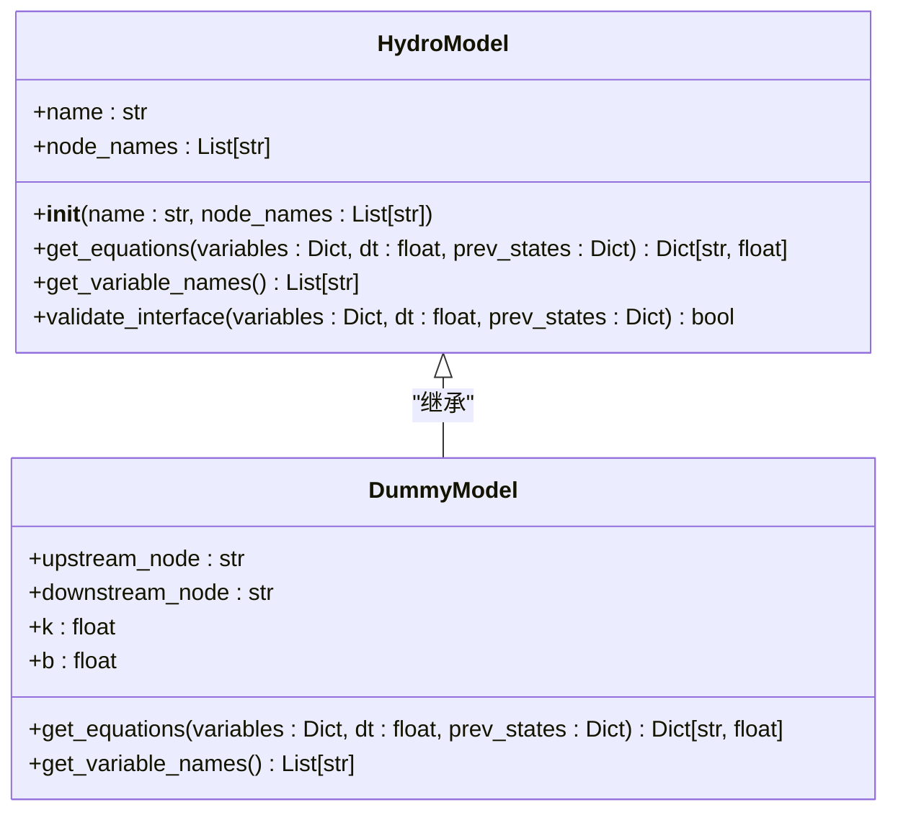
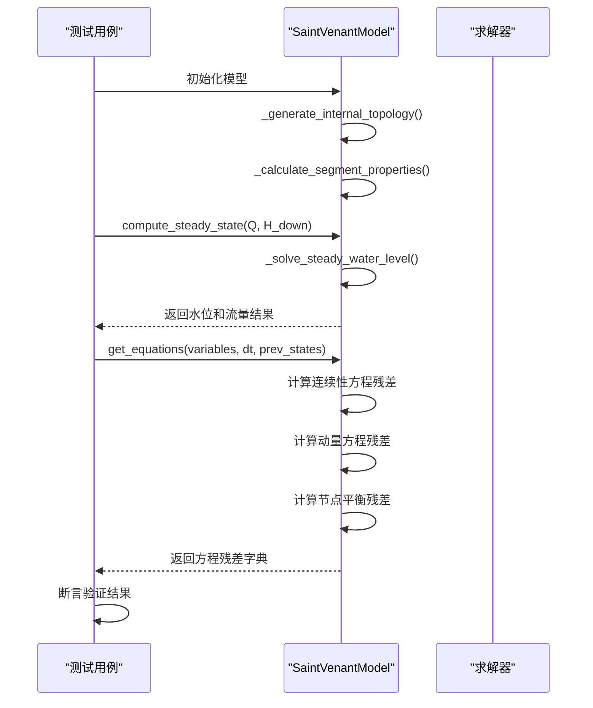
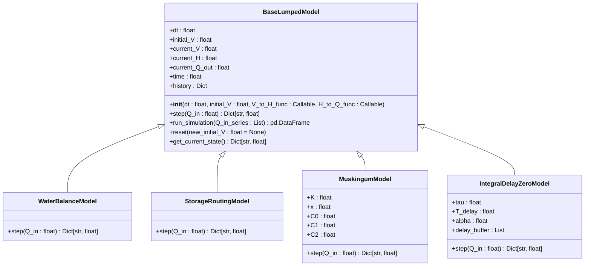

# 单元测试策略

<cite>
**Referenced Files in This Document**   
- [pytest.ini](file://pytest.ini)
- [test_hydro_model.py](file://tests/unit/test_hydro_model.py)
- [test_saint_venant.py](file://tests/unit/test_saint_venant.py)
- [test_lumped_models.py](file://tests/unit/test_lumped_models.py)
- [hydro_model.py](file://waternet/interfaces/hydro_model.py)
- [saint_venant.py](file://waternet/models/saint_venant.py)
- [lumped_models.py](file://waternet/models/lumped_models.py)
- [conftest.py](file://tests/conftest.py)
</cite>

## 目录
1. [引言](#引言)
2. [核心组件测试策略](#核心组件测试策略)
3. [测试用例设计原则](#测试用例设计原则)
4. [单元测试执行与最佳实践](#单元测试执行与最佳实践)
5. [测试性能优化与调试](#测试性能优化与调试)
6. [结论](#结论)

## 引言

WaterNet项目采用严格的单元测试策略，确保水力模型核心组件的正确性、稳定性和可靠性。本策略重点阐述了对`HydroModel`抽象基类、`SaintVenantModel`物理模型和`BaseLumpedModel`降阶模型等关键组件的隔离测试方案。通过`test_hydro_model.py`和`test_saint_venant.py`等文件，实现了对模型接口、物理方程和数值算法的全面覆盖。测试框架基于`pytest`构建，利用`pytest.ini`中的`unit`标记进行分类执行，确保了测试的自动化和可维护性。

**Section sources**
- [pytest.ini](file://pytest.ini#L1-L31)
- [test_hydro_model.py](file://tests/unit/test_hydro_model.py#L1-L86)
- [test_saint_venant.py](file://tests/unit/test_saint_venant.py#L1-L174)
- [test_lumped_models.py](file://tests/unit/test_lumped_models.py#L1-L200)

## 核心组件测试策略

### HydroModel抽象基类测试

`HydroModel`作为所有水力模型的抽象基类，其接口的正确性至关重要。`test_hydro_model.py`文件中的`TestHydroModel`测试类通过`DummyModel`（一个简单的线性关系模型）对基类接口进行了全面验证。

测试覆盖了以下关键方面：
- **初始化验证**：测试了正常和异常（如空名称）的初始化场景，确保了构造函数的健壮性。
- **接口实现**：通过`test_dummy_model_interface`验证了`get_equations`和`get_variable_names`方法的正确实现，确保了方程残差和变量名的计算符合预期。
- **格式验证**：`TestModelValidation`类中的测试方法验证了`variables`和`prev_states`字典的格式，确保了输入数据的合法性。



**Diagram sources**
- [hydro_model.py](file://waternet/interfaces/hydro_model.py#L25-L244)
- [test_hydro_model.py](file://tests/unit/test_hydro_model.py#L1-L86)

**Section sources**
- [hydro_model.py](file://waternet/interfaces/hydro_model.py#L25-L244)
- [test_hydro_model.py](file://tests/unit/test_hydro_model.py#L1-L86)

### SaintVenantModel物理模型测试

`SaintVenantModel`是基于圣维南方程组的一维非恒定流模型，其实现复杂度高，因此需要详尽的单元测试。`test_saint_venant.py`文件中的`TestSaintVenantModel`和`TestSaintVenantEquations`类提供了多层次的测试覆盖。

#### 初始化与基本属性测试
- **初始化验证**：`test_saint_venant_initialization`测试了模型的正常创建，验证了边界节点、断面和分段属性的正确生成。
- **异常处理**：`test_invalid_initialization`测试了在断面不足或字段缺失时的`ValueError`抛出，保证了输入数据的完整性检查。

#### 物理计算测试
- **恒定流计算**：`test_steady_state_computation`验证了`compute_steady_state`方法的输出格式和物理合理性，例如上游水位不低于下游水位。
- **分段属性**：`test_segment_properties`测试了分段长度、坡度和糙率的计算，确保了网格生成的准确性。

#### 方程系统测试
- **方程结构**：`test_equation_structure`是核心测试，它验证了方程残差字典的结构、数量和命名。测试确保了连续性方程、动量方程和内部节点平衡方程的数量与未知变量数量相匹配。
- **数值验证**：该测试还检查了所有残差值均为有限的数值，防止了`NaN`或`inf`的出现。



**Diagram sources**
- [saint_venant.py](file://waternet/models/saint_venant.py#L32-L646)
- [test_saint_venant.py](file://tests/unit/test_saint_venant.py#L1-L174)

**Section sources**
- [saint_venant.py](file://waternet/models/saint_venant.py#L32-L646)
- [test_saint_venant.py](file://tests/unit/test_saint_venant.py#L1-L174)

### BaseLumpedModel降阶模型测试

`BaseLumpedModel`是所有集总参数模型的基类，`test_lumped_models.py`文件通过测试其具体子类来验证其功能。

#### 基类功能测试
- **物理关系函数**：测试用例使用`simple_functions` fixture创建了简单的`V_to_H`和`H_to_Q`函数，用于隔离测试模型逻辑。
- **状态管理**：`test_model_reset`验证了`reset`方法能正确地将模型状态恢复到初始值，包括时间、蓄水量和历史记录。

#### 具体模型测试
- **水量平衡模型**：`test_water_balance_model`验证了其最核心的特性——出流等于入流。
- **蓄量演算模型**：`test_storage_routing_model`通过一个阶跃响应测试，验证了模型的动态响应和物理合理性（如蓄水量非负）。
- **马斯京干模型**：`test_muskingum_model`不仅测试了仿真结果，还直接验证了`C0`、`C1`、`C2`系数的计算正确性及其和为1的数值稳定性条件。
- **IDZ模型**：`test_idz_model`测试了延迟缓冲区的初始化和阶跃响应的动态特性。



**Diagram sources**
- [lumped_models.py](file://waternet/models/lumped_models.py#L30-L1097)
- [test_lumped_models.py](file://tests/unit/test_lumped_models.py#L1-L200)

**Section sources**
- [lumped_models.py](file://waternet/models/lumped_models.py#L30-L1097)
- [test_lumped_models.py](file://tests/unit/test_lumped_models.py#L1-L200)

## 测试用例设计原则

WaterNet的单元测试设计遵循了以下核心原则：

### 边界条件测试
测试用例充分考虑了各种边界条件。例如，在`test_invalid_initialization`中，测试了空断面列表和不完整断面数据等边界情况，确保了代码的健壮性。同样，`test_invalid_parameters`测试了`K`和`x`等参数的无效值，防止了模型在错误配置下运行。

### 异常处理测试
异常处理是测试的重要组成部分。通过`pytest.raises(ValueError)`上下文管理器，测试用例明确地验证了在非法输入时是否抛出了预期的`ValueError`。这确保了错误信息的清晰和可调试性。

### 数值稳定性验证
对于数值计算密集的模型，稳定性至关重要。`test_muskingum_model`中的`coeff_sum`测试验证了马斯京干系数的和为1，这是一个关键的数值稳定性条件。此外，`assert_valid_steady_result`等辅助函数在多个测试中被复用，用于验证结果的物理合理性（如水位为正、流量非负）。

## 单元测试执行与最佳实践

### 执行方式
单元测试的执行由`pytest.ini`文件中的配置驱动。该文件定义了`unit`标记，允许通过命令行精确地运行所有单元测试：
```bash
pytest -m unit
```
此命令会执行所有被`@pytest.mark.unit`装饰的测试，确保了测试的隔离性和快速执行。

### 最佳实践
- **Fixture复用**：`conftest.py`文件定义了`simple_channel_sections`、`physical_relations`等fixture，这些fixture在多个测试文件中被复用，避免了代码重复。
- **参数化测试**：虽然示例中未直接展示，但`pytest`的`@pytest.mark.parametrize`装饰器可用于对同一逻辑进行多组数据的测试，极大地提高了测试覆盖率。
- **测试隔离**：每个测试用例都是独立的，不依赖于其他测试的执行顺序或状态，保证了测试的可靠性和可重复性。

**Section sources**
- [pytest.ini](file://pytest.ini#L1-L31)
- [conftest.py](file://tests/conftest.py#L1-L228)

## 测试性能优化与调试

### 模拟依赖
为了实现隔离测试，避免了对真实外部依赖（如数据库、网络）的调用。测试中直接使用内存中的数据结构（如`dict`、`list`）和简单的lambda函数来模拟复杂的物理关系，这使得测试运行速度极快。

### 断言验证
测试使用了丰富的断言来验证结果。从简单的`assert`语句到`pytest`提供的`pytest.raises`，再到`conftest.py`中定义的`assert_valid_steady_result`等自定义断言函数，形成了一个多层次的验证体系。

### 常见失败与调试
- **数值误差**：当出现微小的数值误差时，应使用`pytest.approx()`或`abs(a - b) < tolerance`进行比较，而不是精确相等。
- **收敛失败**：如果`compute_steady_state`等迭代求解方法失败，应检查初始猜测值、边界条件是否合理，并在`_solve_steady_water_level`中增加调试日志。
- **测试失败定位**：利用`pytest`的详细错误报告，可以快速定位到失败的断言和具体的输入值，结合`pdb`调试器可以深入分析问题根源。

## 结论

WaterNet项目通过一套全面、严谨的单元测试策略，确保了其核心水力模型的高质量。通过对`HydroModel`、`SaintVenantModel`和`BaseLumpedModel`等关键组件的隔离测试，覆盖了从接口定义到复杂物理计算的各个层面。测试用例设计遵循了边界条件、异常处理和数值稳定性等原则，并通过`pytest`框架实现了高效的执行和维护。这一策略为WaterNet的可靠性和可扩展性奠定了坚实的基础。