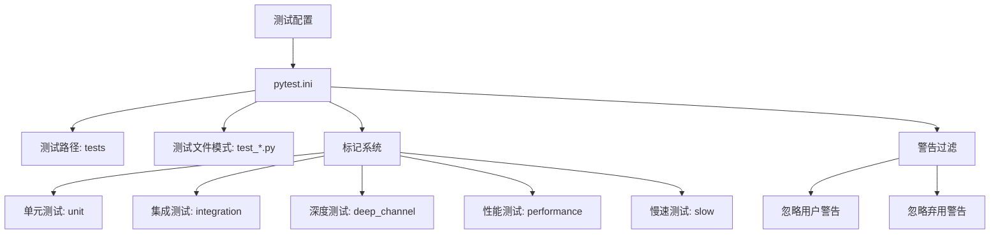
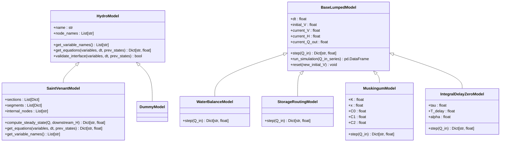
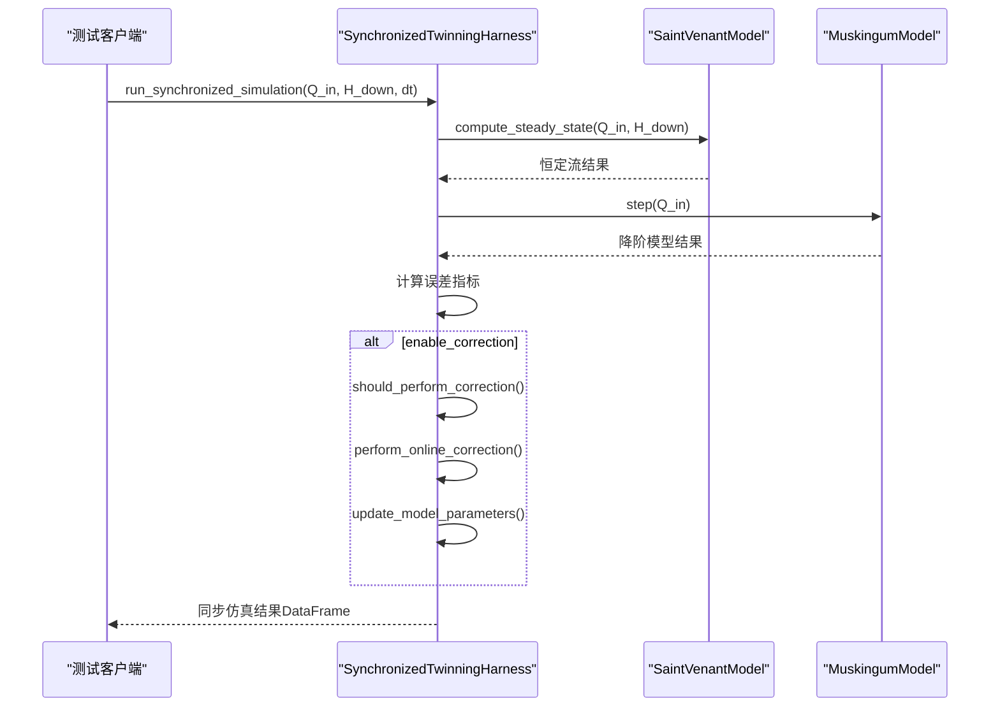
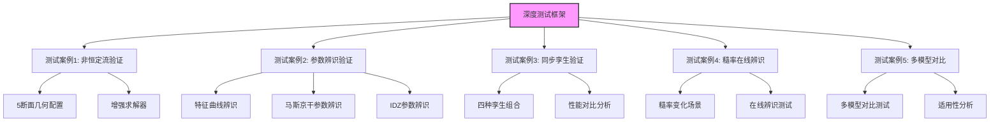
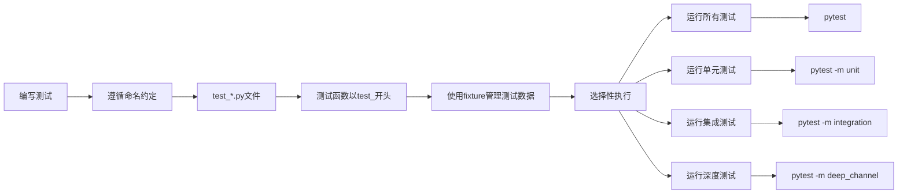
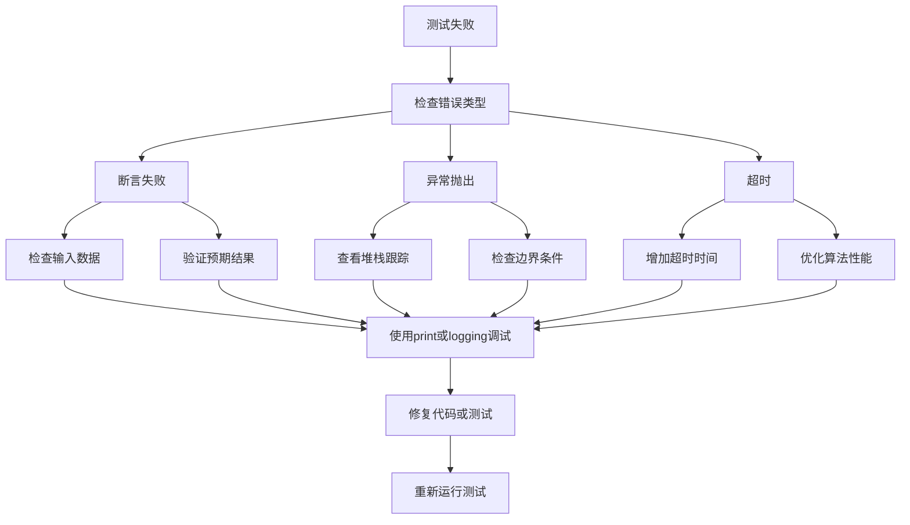

# 测试策略

<cite>
**本文档引用文件**   
- [pytest.ini](file://pytest.ini)
- [test_hydro_model.py](file://tests/unit/test_hydro_model.py)
- [test_saint_venant.py](file://tests/unit/test_saint_venant.py)
- [test_lumped_models.py](file://tests/unit/test_lumped_models.py)
- [test_integration.py](file://tests/integration/test_integration.py)
- [test_comprehensive.py](file://tests/integration/test_comprehensive.py)
- [test_workflows.py](file://tests/integration/test_workflows.py)
- [test_framework.py](file://tests/deep_channel/test_framework.py)
- [enhanced_solver.py](file://tests/deep_channel/enhanced_solver.py)
- [parameter_identification.py](file://tests/deep_channel/parameter_identification.py)
- [twin_coordinator.py](file://tests/deep_channel/twin_coordinator.py)
- [validation_tools.py](file://tests/deep_channel/validation_tools.py)
- [geometry_config.py](file://tests/deep_channel/geometry_config.py)
- [saint_venant.py](file://waternet/models/saint_venant.py)
- [lumped_models.py](file://waternet/models/lumped_models.py)
- [twinning_harness.py](file://waternet/coordination/twinning_harness.py)
</cite>

## 目录
1. [引言](#引言)
2. [测试环境配置](#测试环境配置)
3. [单元测试策略](#单元测试策略)
4. [集成测试策略](#集成测试策略)
5. [深度测试策略](#深度测试策略)
6. [测试执行与最佳实践](#测试执行与最佳实践)
7. [常见测试失败与调试建议](#常见测试失败与调试建议)
8. [结论](#结论)

## 引言
WaterNet项目采用多层次测试策略，确保水力模型的准确性、可靠性和性能。本测试策略文档全面阐述了项目的测试框架，涵盖单元测试、集成测试和深度测试三个层次。通过系统化的测试方法，验证核心水力组件的独立功能、模块间的协同工作以及复杂水力场景下的整体性能。测试框架基于pytest构建，利用标记系统对不同类型的测试进行分类管理，支持从快速冒烟测试到复杂的性能基准测试。本策略旨在为开发者提供清晰的测试指南，确保代码质量和模型可靠性。

## 测试环境配置

**图源**
- [pytest.ini](file://pytest.ini#L1-L30)

**测试环境配置**
- [pytest.ini](file://pytest.ini#L1-L30)

WaterNet项目的测试环境通过`pytest.ini`文件进行集中配置。该配置文件定义了测试发现规则、输出格式和标记系统。测试路径设置为`tests`目录，自动发现符合`test_*.py`模式的测试文件。通过丰富的标记系统（markers），测试用例被分类为单元测试、集成测试、深度测试等不同类型，便于选择性执行。例如，`@pytest.mark.integration`标记用于标识集成测试，而`@pytest.mark.deep_channel`则用于深度通道测试。此外，配置文件还设置了警告过滤规则，忽略非关键的用户警告和弃用警告，确保测试输出的清晰性。这种配置方式保证了测试环境的一致性和可维护性。

## 单元测试策略

**图源**
- [test_hydro_model.py](file://tests/unit/test_hydro_model.py#L1-L85)
- [test_saint_venant.py](file://tests/unit/test_saint_venant.py#L1-L173)
- [test_lumped_models.py](file://tests/unit/test_lumped_models.py#L1-L199)
- [saint_venant.py](file://waternet/models/saint_venant.py#L1-L646)
- [lumped_models.py](file://waternet/models/lumped_models.py#L1-L1098)

**单元测试策略**
- [test_hydro_model.py](file://tests/unit/test_hydro_model.py#L1-L85)
- [test_saint_venant.py](file://tests/unit/test_saint_venant.py#L1-L173)
- [test_lumped_models.py](file://tests/unit/test_lumped_models.py#L1-L199)

单元测试是WaterNet测试策略的基础，旨在验证核心类和方法的独立功能。测试集中在`tests/unit`目录下，覆盖了水力模型接口、圣维南模型和各类降阶模型。`test_hydro_model.py`验证了`HydroModel`抽象基类的接口实现，包括模型初始化、变量名获取和方程计算等基本功能。`test_saint_venant.py`对圣维南模型进行了全面测试，验证了其恒定流计算、变量命名和方程结构的正确性。`test_lumped_models.py`则测试了水量平衡、蓄量演算、马斯京干和IDZ等降阶模型，确保它们的仿真循环和参数处理符合预期。这些测试通过`@pytest.mark.unit`标记，可以快速执行，为代码重构和功能开发提供即时反馈。

## 集成测试策略

**图源**
- [test_integration.py](file://tests/integration/test_integration.py#L1-L116)
- [test_comprehensive.py](file://tests/integration/test_comprehensive.py#L1-L328)
- [test_workflows.py](file://tests/integration/test_workflows.py#L1-L296)
- [twinning_harness.py](file://waternet/coordination/twinning_harness.py#L1-L488)

**集成测试策略**
- [test_integration.py](file://tests/integration/test_integration.py#L1-L116)
- [test_comprehensive.py](file://tests/integration/test_comprehensive.py#L1-L328)
- [test_workflows.py](file://tests/integration/test_workflows.py#L1-L296)

集成测试验证了WaterNet系统中多个模块协同工作的能力。`test_integration.py`是核心集成测试文件，它验证了数字孪生协调器（`SynchronizedTwinningHarness`）与物理模型（`SaintVenantModel`）和降阶模型（如`MuskingumModel`）之间的交互。测试流程包括参数估计工作流、同步孪生仿真和性能指标计算。`test_comprehensive.py`提供了更全面的集成测试，涵盖了从模型创建到参数估计、求解器工厂和模型工作流的完整功能。`test_workflows.py`则专注于复杂工作流的测试，如参数估计和数字孪生工作流。这些测试通过`@pytest.mark.integration`标记，确保了系统各组件能够无缝协作，是验证系统整体功能的关键。

## 深度测试策略

**图源**
- [test_framework.py](file://tests/deep_channel/test_framework.py#L1-L462)
- [enhanced_solver.py](file://tests/deep_channel/enhanced_solver.py#L1-L312)
- [parameter_identification.py](file://tests/deep_channel/parameter_identification.py#L1-L563)
- [twin_coordinator.py](file://tests/deep_channel/twin_coordinator.py#L1-L365)
- [validation_tools.py](file://tests/deep_channel/validation_tools.py#L1-L799)
- [geometry_config.py](file://tests/deep_channel/geometry_config.py#L1-L369)

**深度测试策略**
- [test_framework.py](file://tests/deep_channel/test_framework.py#L1-L462)
- [enhanced_solver.py](file://tests/deep_channel/enhanced_solver.py#L1-L312)
- [parameter_identification.py](file://tests/deep_channel/parameter_identification.py#L1-L563)

深度测试套件（`deep_channel`）针对复杂水力场景进行仿真验证，是WaterNet测试策略中最全面和严格的测试层次。`test_framework.py`定义了深度测试框架控制器，协调执行五个核心测试案例：非恒定流基础验证、降阶模型参数辨识、同步孪生功能验证、糙率在线辨识和多模型在线辨识对比。`enhanced_solver.py`提供了增强的圣维南方程求解器，支持高精度数值格式和稳定性增强算法，为深度测试提供强大的计算能力。`parameter_identification.py`实现了多目标优化和分层优化等高级参数辨识算法，用于测试框架中的参数辨识功能。`validation_tools.py`和`twin_coordinator.py`则提供了验证分析和性能评估工具，确保测试结果的准确性和可靠性。这些测试通过`@pytest.mark.deep_channel`标记，构成了对WaterNet核心功能的终极验证。

## 测试执行与最佳实践

**测试执行与最佳实践**
- [pytest.ini](file://pytest.ini#L1-L30)

开发者在编写和运行WaterNet测试时应遵循以下最佳实践。首先，测试文件应放置在`tests`目录下的相应子目录中（`unit`、`integration`或`deep_channel`），并遵循`test_*.py`的命名约定。测试函数应以`test_`开头，以便pytest自动发现。利用`@pytest.fixture`装饰器来管理测试数据和设置，可以提高代码的可重用性和可读性。执行测试时，可以使用不同的命令：`pytest`运行所有测试，`pytest -m unit`运行所有单元测试，`pytest -v`以详细模式运行测试，`pytest --tb=short`显示简短的回溯信息。对于耗时较长的测试，可以使用`@pytest.mark.slow`标记，并通过`-m "not slow"`来排除它们。这些实践有助于提高测试效率和代码质量。

## 常见测试失败与调试建议

**常见测试失败与调试建议**
- [test_saint_venant.py](file://tests/unit/test_saint_venant.py#L1-L173)
- [test_lumped_models.py](file://tests/unit/test_lumped_models.py#L1-L199)
- [test_integration.py](file://tests/integration/test_integration.py#L1-L116)

当测试失败时，应首先仔细阅读错误信息和回溯（traceback）。对于断言失败，检查测试中的输入数据和预期结果是否正确。对于由异常抛出导致的失败，查看堆栈跟踪以定位问题根源，特别注意边界条件和无效输入的处理。对于超时失败，考虑是否需要增加超时时间或优化相关算法的性能。在调试过程中，可以使用`print`语句或Python的`logging`模块在关键位置输出变量值，帮助理解程序执行流程。修改代码或测试后，应重新运行相关测试以验证问题是否已解决。保持测试的独立性和可重复性是成功调试的关键。

## 结论
WaterNet的多层次测试策略为项目的质量和可靠性提供了坚实保障。通过单元测试、集成测试和深度测试的有机结合，项目能够从不同粒度和复杂度上验证其核心功能。`pytest`框架和详细的配置文件确保了测试环境的一致性和可管理性。开发者应充分利用这一测试框架，在开发新功能或修改现有代码时编写和运行相应的测试，以确保WaterNet水力模型的准确性和鲁棒性。遵循本文档中的最佳实践，将有助于维护一个健康、可靠的代码库。