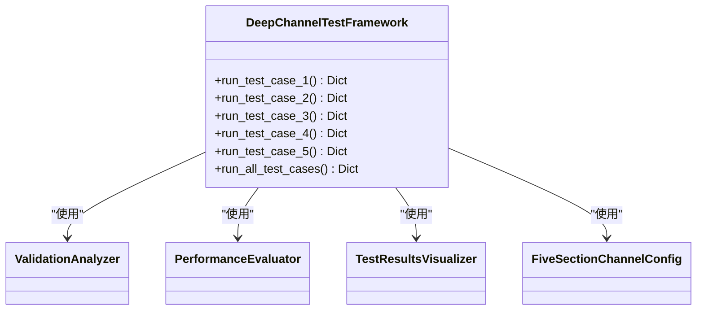
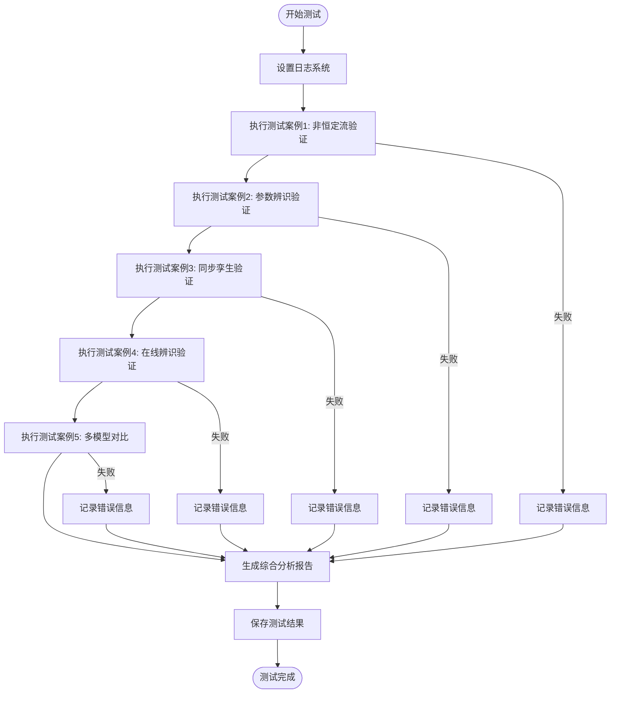
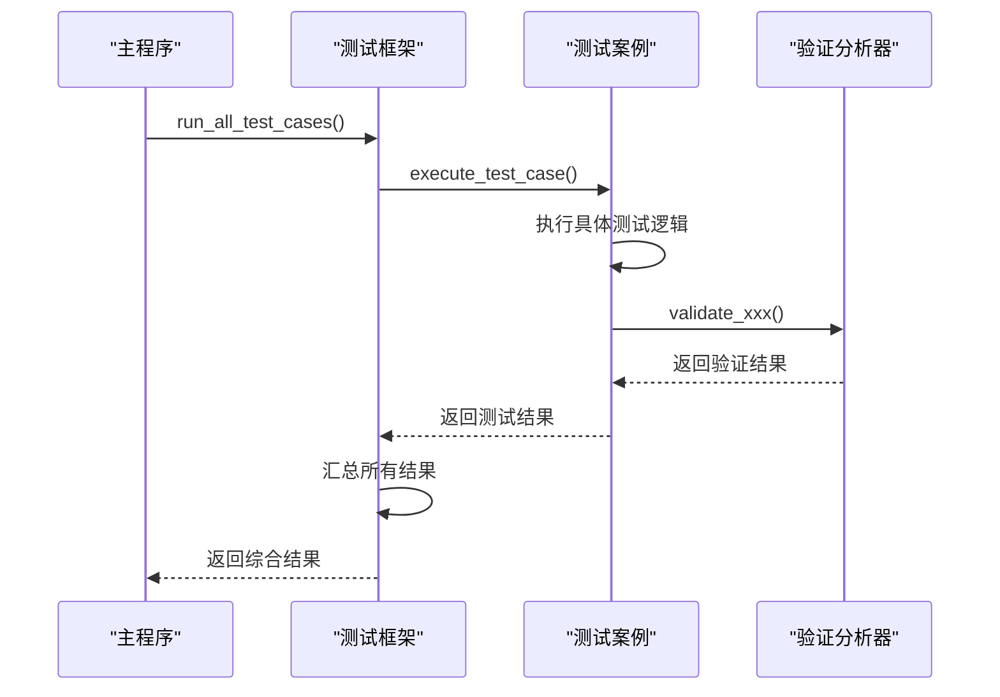
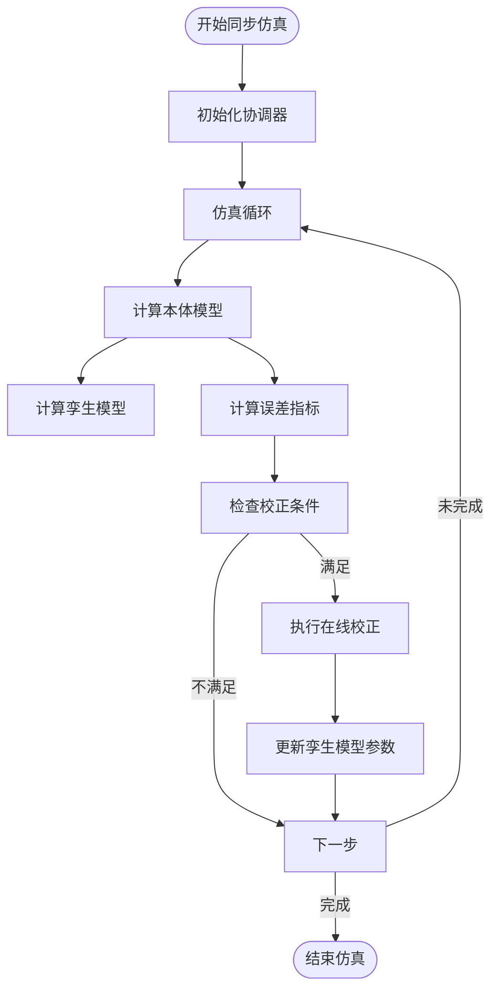
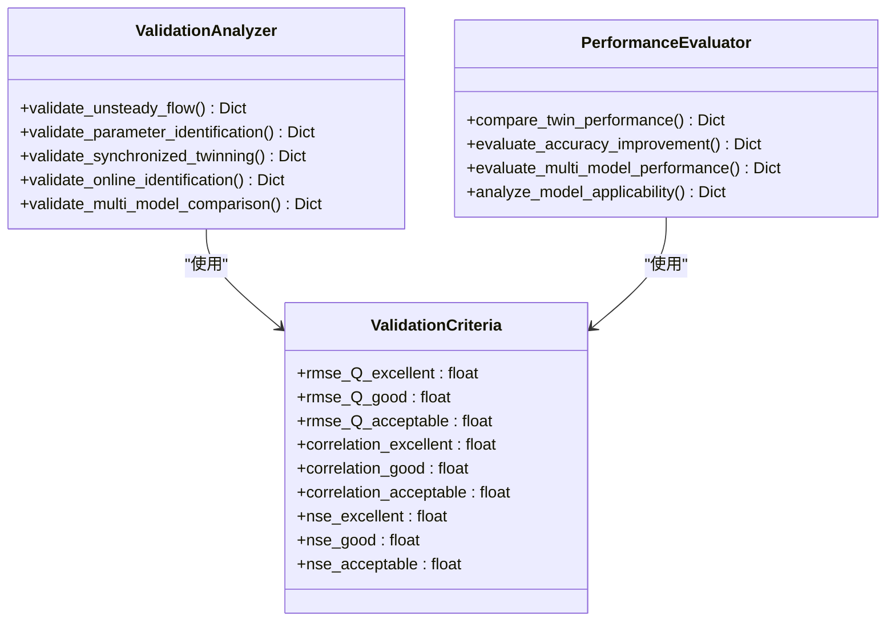
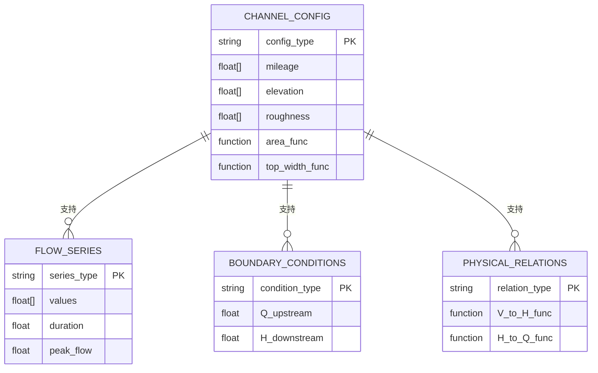

# 深度通道测试策略

<cite>
**本文档引用文件**   
- [test_framework.py](file://tests/deep_channel/test_framework.py)
- [run_deep_tests.py](file://tests/deep_channel/run_deep_tests.py)
- [test_cases.py](file://tests/deep_channel/test_cases.py)
- [test_case_1.py](file://tests/deep_channel/test_case_1.py)
- [twin_coordinator.py](file://tests/deep_channel/twin_coordinator.py)
- [validation_tools.py](file://tests/deep_channel/validation_tools.py)
- [channel_configs.py](file://tests/fixtures/channel_configs.py)
</cite>

## 目录
1. [引言](#引言)
2. [深度测试框架架构](#深度测试框架架构)
3. [测试执行逻辑](#测试执行逻辑)
4. [综合验证方法](#综合验证方法)
5. [同步精度验证](#同步精度验证)
6. [误差分析与稳定性评估](#误差分析与稳定性评估)
7. [测试数据构建指南](#测试数据构建指南)
8. [性能优化建议](#性能优化建议)
9. [结论](#结论)

## 引言
WaterNet系统通过深度通道测试策略，对复杂水力场景下的非恒定流、突变工况和长周期仿真进行高保真验证。该策略基于多层级测试框架，整合了增强求解器、参数辨识和在线校正功能，确保模型在各种工况下的精度和稳定性。测试体系覆盖从基础物理验证到高级数字孪生协调的完整流程，为水力模型的可靠性提供了系统性保障。

## 深度测试框架架构
深度测试框架采用模块化设计，由`DeepChannelTestFramework`类实现，提供统一的测试管理接口。框架通过`run_all_test_cases`方法协调执行五个核心测试案例，每个案例针对特定功能进行验证。

**图源**
- [test_framework.py](file://tests/deep_channel/test_framework.py#L1-L462)

**本节源**
- [test_framework.py](file://tests/deep_channel/test_framework.py#L1-L462)

## 测试执行逻辑
`run_deep_tests.py`文件定义了深度测试的主执行程序，通过`run_comprehensive_tests`函数协调所有测试案例的执行。程序采用顺序执行策略，确保测试结果的可重复性，并在每个测试案例执行后进行状态检查和结果记录。

**图源**
- [run_deep_tests.py](file://tests/deep_channel/run_deep_tests.py#L1-L310)

**本节源**
- [run_deep_tests.py](file://tests/deep_channel/run_deep_tests.py#L1-L310)

## 综合验证方法
测试案例通过`test_cases.py`中的具体实现，展示了增强求解器、参数辨识和在线校正功能的综合验证方法。每个测试案例都包含完整的执行逻辑和验证流程，确保测试结果的全面性和可靠性。

**图源**
- [test_cases.py](file://tests/deep_channel/test_cases.py#L1-L436)
- [test_case_1.py](file://tests/deep_channel/test_case_1.py#L1-L559)

**本节源**
- [test_cases.py](file://tests/deep_channel/test_cases.py#L1-L436)
- [test_case_1.py](file://tests/deep_channel/test_case_1.py#L1-L559)

## 同步精度验证
`twin_coordinator.py`文件中的`EnhancedTwinningCoordinator`类实现了精细化模型与降阶模型的同步精度验证。协调器通过实时比较两个模型的输出，评估其同步性能，并在必要时触发在线校正。

**图源**
- [twin_coordinator.py](file://tests/deep_channel/twin_coordinator.py#L1-L365)

**本节源**
- [twin_coordinator.py](file://tests/deep_channel/twin_coordinator.py#L1-L365)

## 误差分析与稳定性评估
`validation_tools.py`文件提供了全面的误差分析和稳定性评估功能。`ValidationAnalyzer`和`PerformanceEvaluator`类实现了多种验证标准和性能指标，确保测试结果的科学性和客观性。

**图源**
- [validation_tools.py](file://tests/deep_channel/validation_tools.py#L1-L799)

**本节源**
- [validation_tools.py](file://tests/deep_channel/validation_tools.py#L1-L799)

## 测试数据构建指南
`channel_configs.py`文件提供了基于实际渠道配置的测试数据构建指南。通过预定义的几何配置和物理关系函数，可以快速生成符合实际工况的测试数据。

**图源**
- [channel_configs.py](file://tests/fixtures/channel_configs.py#L1-L195)

**本节源**
- [channel_configs.py](file://tests/fixtures/channel_configs.py#L1-L195)

## 性能优化建议
针对大规模仿真中的性能瓶颈和数值发散问题，提出以下优化建议：

1. **自适应时间步长**：根据CFL条件动态调整时间步长，在保证稳定性的同时提高计算效率。
2. **并行计算**：将长周期仿真分解为多个独立时段，利用多核处理器并行执行。
3. **模型降阶**：在精度要求允许的情况下，使用降阶模型替代精细化模型。
4. **参数敏感性分析**：识别对结果影响最大的关键参数，减少不必要的参数调整。
5. **内存优化**：限制历史数据的存储长度，避免内存溢出。

**本节源**
- [test_framework.py](file://tests/deep_channel/test_framework.py#L1-L462)
- [run_deep_tests.py](file://tests/deep_channel/run_deep_tests.py#L1-L310)

## 结论
WaterNet的深度通道测试策略通过系统性的验证方法，确保了水力模型在复杂工况下的高保真度。测试框架整合了增强求解器、参数辨识和在线校正功能，为模型的可靠性提供了全面保障。未来工作将聚焦于扩展到变断面河道模拟、集成机器学习算法和开发云原生架构版本。