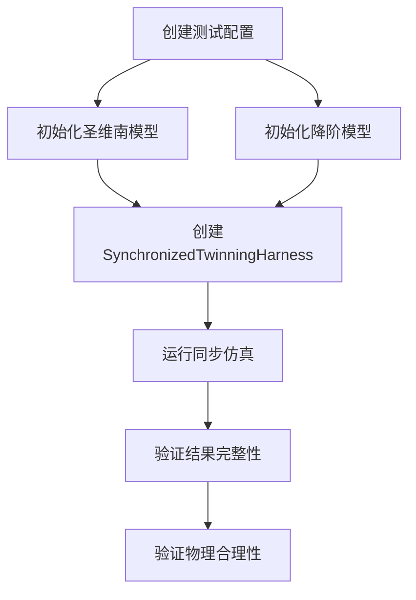
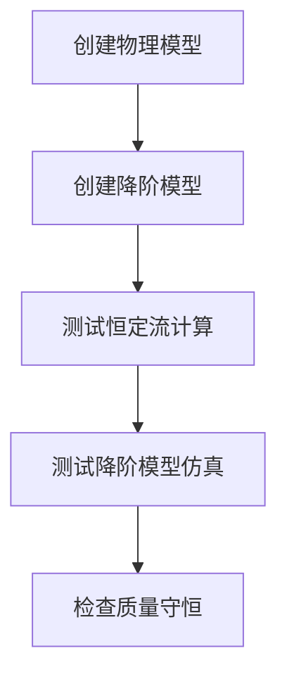
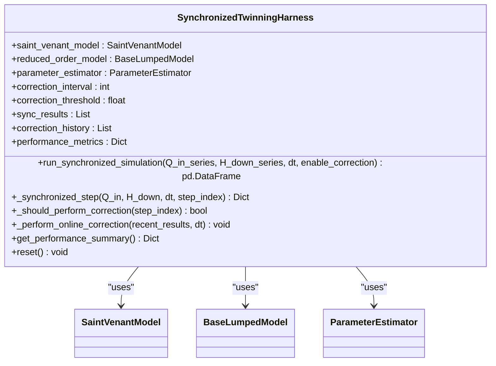
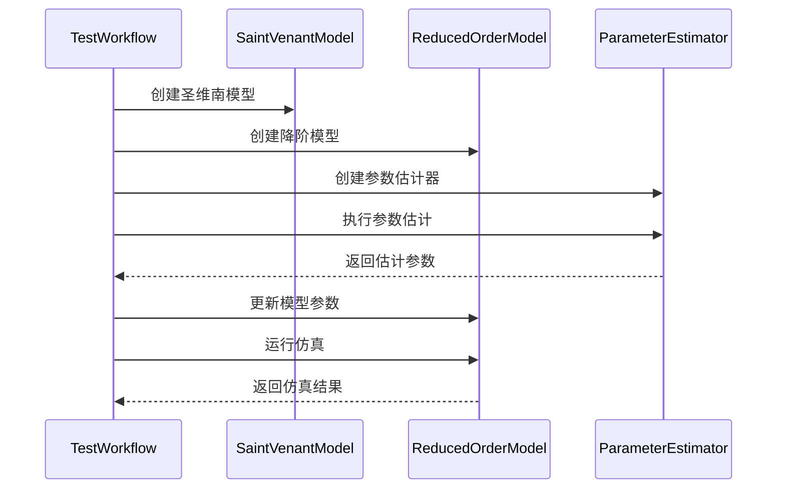
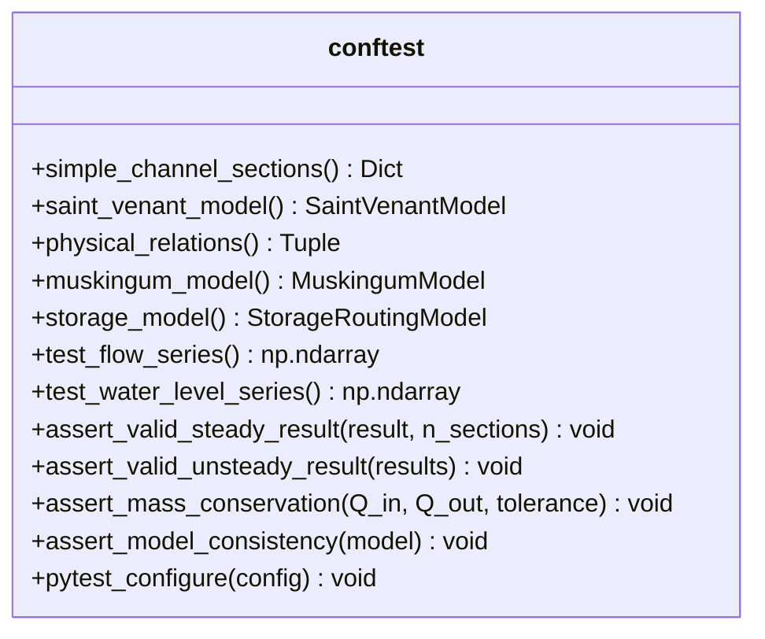

# 集成测试策略

<cite>
**Referenced Files in This Document**   
- [test_integration.py](file://tests/integration/test_integration.py)
- [test_comprehensive.py](file://tests/integration/test_comprehensive.py)
- [test_workflows.py](file://tests/integration/test_workflows.py)
- [conftest.py](file://tests/conftest.py)
- [pytest.ini](file://pytest.ini)
- [twinning_harness.py](file://waternet/coordination/twinning_harness.py)
</cite>

## 目录
1. [集成测试概述](#集成测试概述)
2. [核心测试文件分析](#核心测试文件分析)
3. [数字孪生协调器测试机制](#数字孪生协调器测试机制)
4. [多模型联合仿真测试](#多模型联合仿真测试)
5. [完整工作流端到端验证](#完整工作流端到端验证)
6. [测试夹具与环境配置](#测试夹具与环境配置)
7. [测试运行与扩展指南](#测试运行与扩展指南)
8. [集成问题诊断方法](#集成问题诊断方法)

## 集成测试概述

WaterNet的集成测试策略旨在验证系统各模块间的协同工作能力，确保精细化模型（如圣维南模型）与降阶模型（如马斯京干模型）在数字孪生框架下的正确交互。测试覆盖了从单个模块集成到完整工作流执行的多个层次，通过`test_integration.py`、`test_comprehensive.py`和`test_workflows.py`三个核心测试文件，全面验证系统的功能完整性、性能表现和稳定性。

集成测试重点关注模块间接口的兼容性、数据传递的准确性以及状态同步的可靠性。通过模拟真实场景下的水文过程，测试系统在不同工况下的响应能力，确保模型参数估计、在线校正和性能监控等关键功能的正确实现。

**Section sources**
- [test_integration.py](file://tests/integration/test_integration.py#L1-L116)
- [test_comprehensive.py](file://tests/integration/test_comprehensive.py#L1-L328)
- [test_workflows.py](file://tests/integration/test_workflows.py#L1-L296)

## 核心测试文件分析

### test_integration.py：模块协同验证

`test_integration.py`文件专注于验证数字孪生协调器（`SynchronizedTwinningHarness`）与圣维南模型、降阶模型之间的交互。测试用例`test_synchronized_twinning`创建了一个测试用的明渠配置，包括圣维南模型和马斯京干模型，并通过协调器运行同步仿真。测试验证了仿真结果的完整性，包括时间、入流、精细化模型出流、降阶模型出流和流量误差等关键列。



**Diagram sources**
- [test_integration.py](file://tests/integration/test_integration.py#L1-L116)

**Section sources**
- [test_integration.py](file://tests/integration/test_integration.py#L1-L116)

### test_comprehensive.py：多模型联合仿真

`test_comprehensive.py`文件实现了对WaterNet核心功能的全面集成测试。该文件通过`TestWaterNetComprehensiveIntegration`类，测试了圣维南模型、降阶模型库、参数估计和求解器工厂等多个组件的集成。测试用例`test_model_workflow_integration`验证了模型工作流的集成，包括圣维南模型、马斯京干模型和蓄量演算模型的串联工作。


**Diagram sources**
- [test_comprehensive.py](file://tests/integration/test_comprehensive.py#L1-L328)

**Section sources**
- [test_comprehensive.py](file://tests/integration/test_comprehensive.py#L1-L328)

### test_workflows.py：端到端工作流验证

`test_workflows.py`文件专注于验证完整的工作流，包括参数估计、数字孪生等复杂场景。该文件通过多个测试类，如`TestParameterEstimationWorkflow`、`TestDigitalTwinWorkflow`和`TestEndToEndWorkflow`，实现了对不同工作流的端到端验证。测试用例`test_complete_modeling_workflow`验证了从模型创建到仿真运行的完整流程。



**Diagram sources**
- [test_workflows.py](file://tests/integration/test_workflows.py#L1-L296)

**Section sources**
- [test_workflows.py](file://tests/integration/test_workflows.py#L1-L296)

## 数字孪生协调器测试机制

### SynchronizedTwinningHarness 类分析

`SynchronizedTwinningHarness`类是数字孪生系统的核心协调器，负责管理精细化模型与降阶模型的同步运行。该类通过`run_synchronized_simulation`方法实现双模型的同步仿真，并提供在线参数校正、性能监控和数据记录功能。



**Diagram sources**
- [twinning_harness.py](file://waternet/coordination/twinning_harness.py#L27-L488)

**Section sources**
- [twinning_harness.py](file://waternet/coordination/twinning_harness.py#L27-L488)

### 同步仿真流程

同步仿真流程通过`_synchronized_step`方法实现，该方法在每个时间步执行以下操作：
1. 调用圣维南模型计算精细化结果
2. 调用降阶模型计算简化结果
3. 计算两者之间的误差指标
4. 更新性能监控窗口
5. 构建包含所有结果的字典

测试通过`test_synchronized_simulation_short`用例验证了该流程的正确性，确保仿真结果的完整性和物理合理性。

### 在线校正机制

在线校正机制通过`_should_perform_correction`和`_perform_online_correction`方法实现。校正触发条件包括：
- 达到校正间隔
- 误差超过阈值
- 有足够的数据进行校正

测试通过`test_performance_analysis`用例验证了性能分析功能，确保校正历史和性能指标的正确记录。

## 多模型联合仿真测试

### 降阶模型库集成

`test_reduced_order_models_integration`测试用例验证了降阶模型库的集成，包括马斯京干模型、蓄量演算模型和IDZ模型。测试创建了测试用的物理关系函数和流量序列，并验证了各模型的仿真结果。



**Diagram sources**
- [test_comprehensive.py](file://tests/integration/test_comprehensive.py#L1-L328)

**Section sources**
- [test_comprehensive.py](file://tests/integration/test_comprehensive.py#L1-L328)

### 参数估计集成

`test_parameter_estimation_integration`测试用例验证了参数估计功能的集成。测试使用已知参数的降阶模型生成观测数据，然后通过参数估计器反演模型参数，验证估计结果的准确性。

## 完整工作流端到端验证

### 建模工作流测试

`test_complete_modeling_workflow`用例验证了完整的建模工作流，包括：
1. 物理模型创建
2. 降阶模型创建
3. 恒定流计算测试
4. 降阶模型仿真测试
5. 质量守恒检查

测试通过`assert_mass_conservation`辅助函数验证了流量守恒，允许一定的误差容忍度。

### 模型验证工作流

`test_model_validation_workflow`用例验证了模型验证工作流，通过生成参考数据和运行降阶模型，进行简单的模型验证。测试检查了仿真结果的长度、非负性和数值稳定性。

## 测试夹具与环境配置

### conftest.py 中的测试夹具

`conftest.py`文件定义了全局的测试夹具和辅助函数，为集成测试提供了共享资源和环境配置。



**Diagram sources**
- [conftest.py](file://tests/conftest.py#L1-L227)

**Section sources**
- [conftest.py](file://tests/conftest.py#L1-L227)

### 共享资源初始化

测试夹具通过`@pytest.fixture`装饰器定义，实现了共享资源的初始化。例如，`simple_channel_sections`夹具提供了标准的矩形明渠断面数据，`saint_venant_model`夹具创建了圣维南模型实例。

### 测试辅助函数

`conftest.py`还定义了多个测试辅助函数，如`assert_valid_steady_result`用于验证恒定流计算结果，`assert_mass_conservation`用于验证质量守恒。这些函数提高了测试代码的可重用性和可维护性。

## 测试运行与扩展指南

### pytest.ini 配置

`pytest.ini`文件定义了项目的测试配置，包括测试发现规则、输出配置和自定义标记。

```ini
[pytest]
minversion = 7.0
testpaths = tests
python_files = test_*.py *_test.py
python_classes = Test*
python_functions = test_*

markers =
    slow: 标记测试为慢速测试
    integration: 标记为集成测试
    unit: 标记为单元测试
    deep_channel: 标记为深度通道测试
    performance: 标记为性能测试
    smoke: 标记为冒烟测试
```

开发者可以使用`-m`选项运行特定标记的测试，例如`pytest -m integration`运行所有集成测试。

### 运行集成测试

要运行集成测试，可以使用以下命令：
```bash
pytest tests/integration/ -v
```

要运行特定的测试文件：
```bash
pytest tests/integration/test_integration.py -v
```

### 扩展集成测试

开发者可以通过以下方式扩展集成测试：
1. 添加新的测试用例到现有的测试文件
2. 创建新的测试文件在`tests/integration/`目录下
3. 定义新的测试夹具在`conftest.py`中
4. 使用自定义标记对测试进行分类

## 集成问题诊断方法

### 接口不匹配诊断

当出现接口不匹配问题时，应检查：
1. 模型输入输出参数的类型和单位
2. 时间步长和数据序列的长度匹配
3. 物理关系函数的定义一致性

测试通过`ValueError`异常处理和断言验证来捕获接口不匹配问题。

### 状态同步错误诊断

状态同步错误通常表现为仿真结果的不一致或发散。诊断方法包括：
1. 检查校正间隔和阈值的设置
2. 验证参数估计的收敛性
3. 分析性能监控窗口中的误差趋势

测试通过`_recent_errors`列表和`performance_metrics`字典提供了状态同步的诊断信息。

### 性能问题诊断

性能问题可以通过`test_performance_integration`用例进行诊断。该测试标记为`slow`，用于检测计算时间过长的问题。开发者应关注计算复杂度和算法效率，确保系统在大规模仿真中的性能表现。