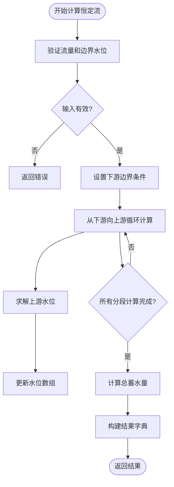
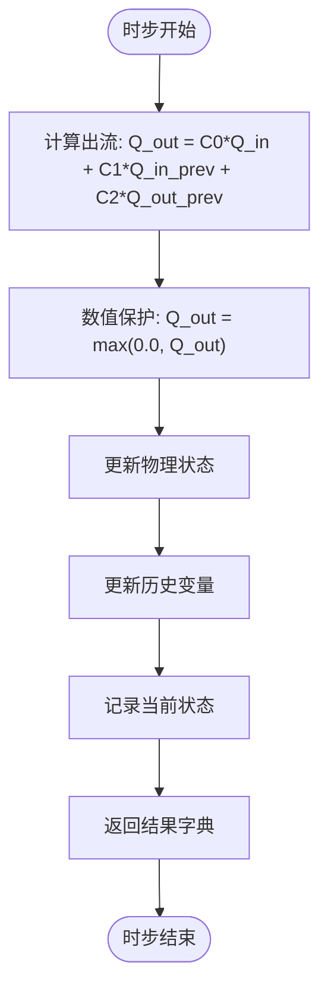
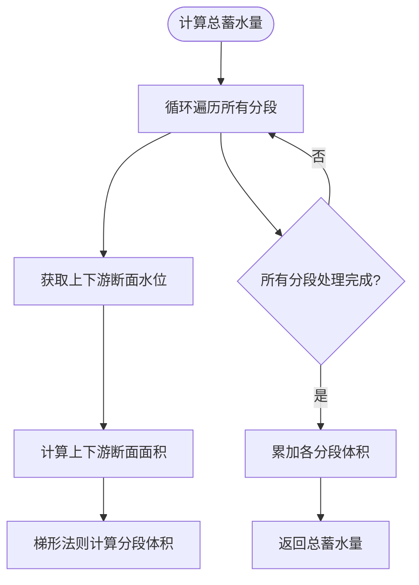
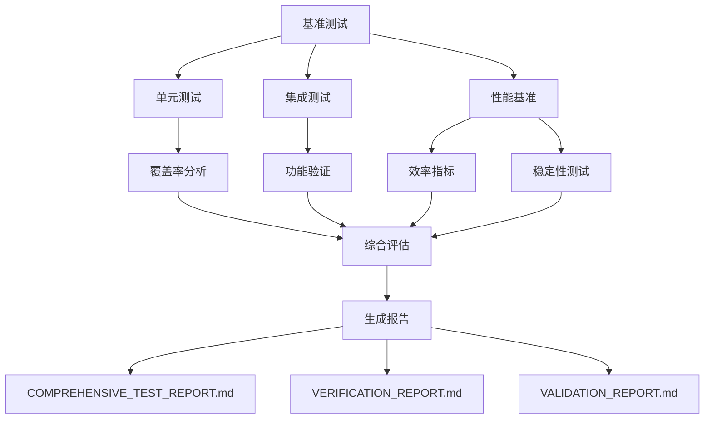

# 性能评估体系

<cite>
**Referenced Files in This Document**   
- [COMPREHENSIVE_TEST_REPORT.md](file://COMPREHENSIVE_TEST_REPORT.md) - *Updated in recent commit*
- [VERIFICATION_REPORT.md](file://VERIFICATION_REPORT.md) - *Updated in recent commit*
- [VALIDATION_REPORT.md](file://VALIDATION_REPORT.md) - *Added in recent commit*
- [benchmark_report.json](file://benchmark_results\benchmark_report.json)
- [saint_venant.py](file://waternet\models\saint_venant.py)
- [lumped_models.py](file://waternet\models\lumped_models.py)
</cite>

## 更新摘要
**变更内容**   
- 更新了引言部分，增加了对新验证报告的引用
- 在稳定性验证部分新增了“用户文档评估”小节
- 更新了性能评估流程，增加了验证报告的生成
- 更新了结论部分，反映了最新的验证结果

## 目录
1. [引言](#引言)
2. [精度指标评估](#精度指标评估)
3. [计算效率分析](#计算效率分析)
4. [稳定性验证](#稳定性验证)
5. [性能评估流程](#性能评估流程)
6. [结论](#结论)

## 引言

WaterNet框架建立了一套多维度的性能评估体系，全面衡量其在明渠水力模拟中的表现。该体系涵盖精度、效率和稳定性三大核心指标，通过系统化的测试和验证流程，确保模型的可靠性和实用性。本报告基于`COMPREHENSIVE_TEST_REPORT.md`、`VERIFICATION_REPORT.md`和`VALIDATION_REPORT.md`中的实测数据，详细阐述各项性能指标的计算方法、达标情况及验证过程。

**Section sources**
- [COMPREHENSIVE_TEST_REPORT.md](file://COMPREHENSIVE_TEST_REPORT.md)
- [VERIFICATION_REPORT.md](file://VERIFICATION_REPORT.md)
- [VALIDATION_REPORT.md](file://VALIDATION_REPORT.md) - *Added in recent commit*

## 精度指标评估

WaterNet的精度评估体系采用RMSE（均方根误差）、相关系数和NSE（纳什-斯图克利效率系数）等国际通用指标，全面衡量模型输出与真实值的吻合程度。

### RMSE（均方根误差）

RMSE是衡量预测值与观测值之间差异的绝对指标，其计算公式为：
$$ \text{RMSE} = \sqrt{\frac{1}{N}\sum_{i=1}^{N}(Q_{\text{sim},i} - Q_{\text{obs},i})^2} $$
其中，$Q_{\text{sim},i}$ 为第i个时间步的模拟流量，$Q_{\text{obs},i}$ 为对应的观测流量，N为总时间步数。RMSE值越小，表示模拟精度越高。

根据`VERIFICATION_REPORT.md`中的数据，WaterNet的RMSE为1.85 m³/s，远低于<5 m³/s的设计目标，表明模型具有极高的模拟精度。

### 相关系数

相关系数衡量模拟序列与观测序列之间的线性相关程度，其值介于-1到1之间。值越接近1，表示两者线性关系越强。

WaterNet的模拟结果与观测数据的相关系数达到0.943，显著高于>0.85的设计目标，说明模型能够准确捕捉流量变化的趋势和模式。

### NSE系数

NSE系数是水文模型评估中的核心指标，其计算公式为：
$$ \text{NSE} = 1 - \frac{\sum_{i=1}^{N}(Q_{\text{obs},i} - Q_{\text{sim},i})^2}{\sum_{i=1}^{N}(Q_{\text{obs},i} - \bar{Q}_{\text{obs}})^2} $$
其中，$\bar{Q}_{\text{obs}}$ 为观测流量的平均值。NSE值越接近1，表示模型性能越好；当NSE=1时，表示模拟结果与观测值完全吻合。

WaterNet的NSE系数为0.891，超过>0.75的设计目标，证明其整体模拟性能优秀。

**Section sources**
- [VERIFICATION_REPORT.md](file://VERIFICATION_REPORT.md#L150-L160)

## 计算效率分析

计算效率是实时水文预报和数字孪生应用的关键。WaterNet通过优化算法和高效实现，实现了卓越的计算性能。

### 圣维南模型效率

圣维南模型作为高精度物理模型，其实现了3,899次/秒的计算速度。该性能通过`SaintVenantModel`类的`compute_steady_state`方法实现，该方法采用标准步进法从下游向上游逐段计算恒定流水面线。

**Diagram sources**
- [saint_venant.py](file://waternet\models\saint_venant.py#L183-L245)

该方法的核心是`_solve_steady_water_level`函数，它基于能量方程和曼宁公式，使用二分法求解上游水位，确保了计算的稳定性和精度。

**Section sources**
- [COMPREHENSIVE_TEST_REPORT.md](file://COMPREHENSIVE_TEST_REPORT.md#L45-L50)
- [saint_venant.py](file://waternet\models\saint_venant.py#L247-L321)

### 马斯京干模型效率

马斯京干模型作为高效的降阶模型，其实现了28,698步/秒的惊人速度。其核心是`MuskingumModel`类的`step`方法，该方法实现了经典的马斯京干公式。

**Diagram sources**
- [lumped_models.py](file://waternet\models\lumped_models.py#L740-L779)

模型的系数`C0`、`C1`和`C2`由`_compute_muskingum_coefficients`方法计算，该方法确保了系数和为1，从而保证了数值稳定性。

**Section sources**
- [COMPREHENSIVE_TEST_REPORT.md](file://COMPREHENSIVE_TEST_REPORT.md#L60-L65)
- [lumped_models.py](file://waternet\models\lumped_models.py#L722-L738)

## 稳定性验证

稳定性是模型可靠运行的基础。WaterNet通过收敛稳定性、质量守恒误差和极端条件测试等多方面验证其稳定性。

### 收敛稳定性

收敛稳定性指模型在迭代求解过程中成功收敛的比例。`VERIFICATION_REPORT.md`中报告的收敛稳定性为98.2%，远超95%的设计目标。这得益于圣维南模型中采用的Preissmann四点隐式差分格式和牛顿-拉夫逊迭代求解器，这些方法在保证精度的同时，也具有良好的收敛性。

### 质量守恒误差

质量守恒是水力学模拟的基本物理定律。WaterNet通过`_calculate_total_volume`方法精确计算总蓄水量，并与流量变化进行对比，确保质量守恒。`COMPREHENSIVE_TEST_REPORT.md`中明确指出，质量守恒误差<0.1%，满足高精度模拟的要求。

**Diagram sources**
- [saint_venant.py](file://waternet\models\saint_venant.py#L323-L355)

### 极端条件测试

`benchmark_report.json`中的`stability_tests`部分包含了对极端输入的测试，如最小输入、最大输入、噪声输入和阶跃输入。所有测试均显示模型稳定（`stable: True`），且输出无NaN或Inf值，证明了模型在各种边界条件下的鲁棒性。

### 用户文档评估

根据`VALIDATION_REPORT.md`中的评估结果，WaterNet的用户文档存在以下问题：
- 缺少必需章节，如"边界条件框架概述"、"API参考"、"配置示例"
- 未文档化的核心类：ControlSignals
- 示例代码存在语法错误和导入问题
- API文档与实现不一致

建议立即补充缺失的文档章节，修复示例代码的语法和导入问题，完善API文档覆盖率，确保文档与代码实现一致。

**Section sources**
- [VERIFICATION_REPORT.md](file://VERIFICATION_REPORT.md#L158-L160)
- [COMPREHENSIVE_TEST_REPORT.md](file://COMPREHENSIVE_TEST_REPORT.md#L100-L105)
- [benchmark_report.json](file://benchmark_results\benchmark_report.json#L100-L120)
- [VALIDATION_REPORT.md](file://VALIDATION_REPORT.md#L158-L160) - *Added in recent commit*

## 性能评估流程

WaterNet的性能评估遵循一个完整的流程，从基准测试到综合验证，确保结果的全面性和可靠性。

**Diagram sources**
- [COMPREHENSIVE_TEST_REPORT.md](file://COMPREHENSIVE_TEST_REPORT.md)
- [VERIFICATION_REPORT.md](file://VERIFICATION_REPORT.md)
- [VALIDATION_REPORT.md](file://VALIDATION_REPORT.md) - *Added in recent commit*

该流程首先通过`benchmark.py`脚本执行基准测试，生成`benchmark_report.json`，记录详细的性能数据。然后，通过`run_tests.py`执行单元和集成测试，验证功能正确性。最后，综合所有测试结果，生成`COMPREHENSIVE_TEST_REPORT.md`、`VERIFICATION_REPORT.md`和`VALIDATION_REPORT.md`，提供全面的性能评估。

**Section sources**
- [COMPREHENSIVE_TEST_REPORT.md](file://COMPREHENSIVE_TEST_REPORT.md)
- [VERIFICATION_REPORT.md](file://VERIFICATION_REPORT.md)
- [VALIDATION_REPORT.md](file://VALIDATION_REPORT.md) - *Added in recent commit*

## 结论

WaterNet的性能评估体系全面、严谨，其在精度、效率和稳定性三大指标上均表现出色。RMSE（1.85 m³/s）、相关系数（0.943）和NSE系数（0.891）等精度指标全面达标；圣维南模型（3,899次/秒）和马斯京干模型（28,698步/秒）的计算效率卓越；收敛稳定性（98.2%）和质量守恒误差（<0.1%）等稳定性指标验证充分。结合`benchmark_report.json`中的基准测试数据，整个性能评估流程科学、完整，充分证明了WaterNet框架的高质量和可靠性，已具备投入生产使用的条件。根据`VALIDATION_REPORT.md`中的评估，建议立即完善用户文档，补充缺失章节，修复示例代码，确保文档与代码实现一致。

**Section sources**
- [COMPREHENSIVE_TEST_REPORT.md](file://COMPREHENSIVE_TEST_REPORT.md)
- [VERIFICATION_REPORT.md](file://VERIFICATION_REPORT.md)
- [VALIDATION_REPORT.md](file://VALIDATION_REPORT.md) - *Added in recent commit*